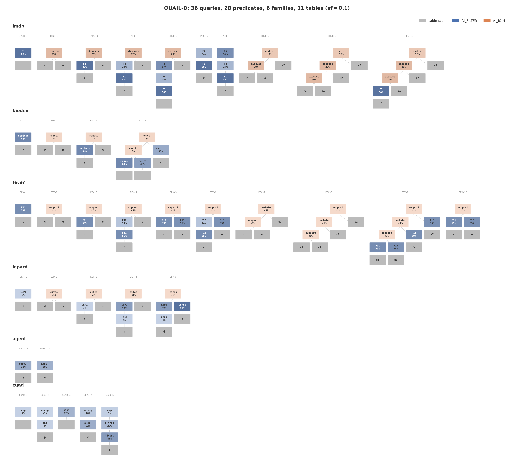

# quail-b

QUAIL-B is a benchmark of AI filter and AI join queries over document sets. Every predicate is one
exact TRUE or FALSE question, answered by a language model about one document or one document pair.
Reference labels are saved, so accuracy is scored exactly rather than judged.

## Document sets

Counts are at scale factor 0.1, the default. One seed (`DATA_SEED`) and one pinned revision per source (`SOURCE_REVISIONS`), both in `quail_b/data.py`, mean a scale factor names one exact corpus. `build_sets()` downloads the sf=0.1 corpus as Parquet from the public bucket, 13 MB, and checks its id; any other scale factor is built from the sources.

| Set | Source | Rows at sf=0.1 |
| --- | --- | --- |
| `reviews` | `stanfordnlp/imdb` | 5,000 |
| `aspects` | fixed movie-aspect list in `data.py` | 12 |
| `reports` | `BioDEX/BioDEX-Reactions` | 500 |
| `terms` | reaction terms of the sampled BioDEX reports | 1,127 |
| `claims` | `fever/fever` | 500 |
| `evidence` | Wikipedia pages cited by the sampled claims | 287 |
| `citation_contexts` | `rmahari/LePaRD` | 500 |
| `citation_passages` | `rmahari/LePaRD` | 433 |
| `agent_traces` | `TIGER-Lab/SWE-Next-SFT-Trajectories` | 1,772 |

## Load a table

```python
import quail_b as benchmark

reviews = benchmark.load_table("reviews", limit=100)
query = benchmark.get_query("IMDB-1")
```

The loader returns an Arrow table with the original review ids and columns.
It reads only the requested table from the published scale-factor 0.1 corpus.
Omit `limit` to load every row, or set `scale_factor=0.5` or `1.0` for another
published corpus. A row limit returns a prefix of the table, not a new benchmark
scale factor. The query definition is unchanged.

S3 paths and Parquet reads are handled inside the package. To read a local copy,
pass `root="/path/to/data"` with the same directory layout as the public bucket.
A missing file raises an error; the loader does not rebuild data from upstream
sources. `build_sets()` remains available for that workflow.

For a join, load every input table at the same scale factor. A repeated table
needs to be loaded only once, even if the query gives it several aliases.

```python
query = benchmark.get_query("IMDB-4")
tables = {}
for name in {alias.table for alias in query.aliases}:
    tables[name] = benchmark.load_table(name, scale_factor=0.5)
```

The review table has 5,000, 25,000, or 50,000 rows at scale factors 0.1, 0.5,
and 1.0. The aspect table has 12 rows at every scale. Join pair counts depend
on the input tables and filters, not a separate join scale factor.

## Queries

`QUERIES` in `quail_b/queries.py` holds 32 queries in five families. A query has a base document
set, filters on each set, joins that each add one more set, and a projection. Filters and joins apply
in the order written. Two more queries, PRIV-1 and PRIV-2, need `register_privacy_sets()` first.

| Family | Ids | Shapes |
| --- | --- | --- |
| IMDB | IMDB-1 to IMDB-10 | filter only, single join, filter chains into a join, star join, three-join chains |
| BIO | BIO-1 to BIO-3 | filter only, single join, filter into a join, on long medical reports |
| FEV | FEV-1 to FEV-9 | filter only, single join, filter chains into a join, two-sided filters, star join, three-join chains |
| LEP | LEP-1 to LEP-8 | filter only, single join, filter chains up to five deep into a join, two-sided filters |
| AGENT | AGENT-1, AGENT-2 | filter only |



The vector PDF is at [`figures/quailb_anatomy.pdf`](figures/quailb_anatomy.pdf).

## Metrics

- Query time: seconds to run the query, excluding model startup.
- Documents per second, filter-only query: input document rows / query seconds.
- Document pairs per second, join query: evaluated pairs across all join stages / query seconds.
- `$/query`: query hours x GPU count x the H100 hourly price.
- Answer accuracy: agreement with the labels on the predicate answers the engine evaluated.
- Final rows: precision, recall, and F1 against the rows derived from the labels.

## Reference labels

Labels come from Qwen3 32B fp8 answering the exact prompt text in `quail_b/rendering.py`, at
temperature 0 with the answer restricted to TRUE or FALSE. One label covers one predicate and one
document or document pair. A complete label set for every predicate over one corpus is a collection.
FEVER and LePaRD use source labels where the dataset gives the exact answer. `evaluate()` in
`quail_b/scoring.py` scores a run against a collection.

Corpus and labels are public in the `quail-bench` S3 bucket under
`s3://quail-bench/ground_truth/quailb/schema_v1/`, 145 MB, readable without an AWS account.
`load_ground_truth()` in `quail_b/labels.py` reads from there by default. Pass `root="/path/to/data"` to read a local directory with the same layout instead.
You can also pass an `s3://` root. The loaders use anonymous reads for S3.

## Running it

This repository defines the benchmark and runs no engine. An engine's runner turns each `QuerySpec`
into that engine's own query and hands the answers back as a `RunOutput` to score. Quail's runner
lives in `fsdatalab/quail-exploration`; on a machine with a GPU:

```bash
uv add "quail-b @ git+https://github.com/fsdatalab/quail-bench.git"
uv run python -m quail.bench.quailb --sf 0.1 --model qwen3-4b-fp8
```

Add `--only IMDB-4` to run one query. The same repository has a Modal runner, `quail.bench.quailb_parallel`, that runs one query family per H100 with the baselines.

## Adding a query or predicate

1. Add the query to `QUERIES` in `quail_b/queries.py`. A query that reuses existing predicates needs no new labels, so stop here.
2. Add the new prompt constant to `quail_b/prompts.py`.
3. Add one `PredicateSpec` to `PREDICATES` in `quail_b/predicates.py`: a stable key, the prompt, the input table and column, and the left and right roles.
4. Use a source label only when the dataset gives the exact answer the prompt asks for. Otherwise keep the default Qwen3 32B fp8 source.
5. Update the predicate count test; add a prompt-rendering test if the input shape is new.
6. Run the labeling pass from Quail's repository on a machine with one GPU of at least 80 GB:
   `uv run python -m quail.bench.labeling --root ~/quail-b-data`, or on Modal with
   `uv run modal run -m quail.bench.judge_pass`.

A changed prompt or input role makes a new predicate version and needs a new label set. The labeling run resumes, skipping finished parts, then writes a new collection and makes it active. Label-set and collection ids depend only on the corpus, the prompts, and the judge settings in `quail_b/predicates.py`, so a pass on any machine writes the same files; copy `~/quail-b-data/ground_truth` to the bucket to publish it.

## Layout

| Module | What it holds |
| --- | --- |
| `quail_b/data.py` | document sets, pinned sources, sampling, corpus identity |
| `quail_b/prompts.py` | the filter and join prompt templates |
| `quail_b/queries.py` | the 32 queries as data, with selectivity estimates |
| `quail_b/rendering.py` | the exact prompt text a predicate asks |
| `quail_b/labels.py` | saved label sets and collections |
| `quail_b/predicates.py` | the 21 predicates and the identity of their labels |
| `quail_b/scoring.py` | `RunOutput` and the scoring of one run |
