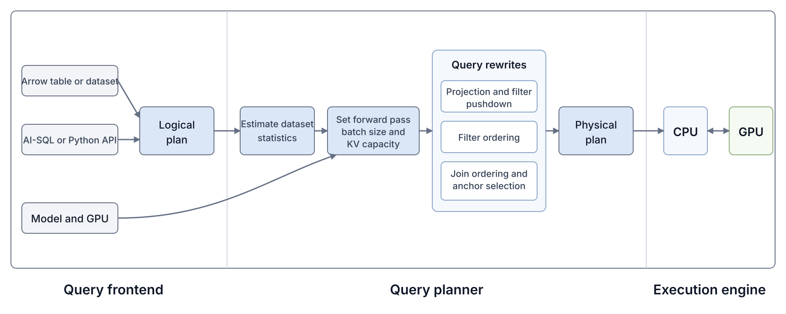

# 1. A new class of inference workloads is in town

For decades, database users have struggled to analyze unstructured text at scale.
SQL, our good old language, and corresponding relational database systems weren't really great for this.
But now, thanks to LLMs, database users can finally unlock insights from unstructured text columns.
Major database vendors now support AI-SQL, including [Snowflake Cortex AISQL](https://docs.snowflake.com/en/user-guide/snowflake-cortex/aisql), [BigQuery AI functions](https://cloud.google.com/blog/products/data-analytics/sql-reimagined-for-the-ai-era-with-bigquery-ai-functions), and [Databricks AI Functions](https://docs.databricks.com/aws/en/large-language-models/ai-functions).
AI-SQL extends SQL with AI-powered operators, such as filters, joins, and classifiers.

In an AI-powered operator, the user simply specifies what they want in natural language, and LLMs are used to evaluate that instruction over the relevant data.
For example, imagine that a database user has one table of medical reports, and another table of possible adverse reactions.[^biodex]
The user wants to identify which reactions each report attributes to the patient, but only for reports that describe female patients. They might run the following AI-SQL query, which we call BIO-3 in [quail-bench](https://github.com/fsdatalab/quail-bench).[^quail-bench]

```sql
SELECT r.id, m.id
FROM reports AS r
JOIN reaction_terms AS m
  ON AI.IF(PROMPT(
       'Does the medical report in {0} describe the reaction in {1} as something the patient experienced?',
       r.report,
       m.term
     ))
WHERE AI.IF(PROMPT(
        'Does {0} describe a case involving a female patient?',
        r.report
      ));
```

At a high level, the database compiles the aforementioned query into a plan that invokes an LLM on *each row* for the filter, then makes another LLM call on *each pair of rows* in the join.
Query execution can therefore be incredibly costly, because a filter over $N$ rows requires $N$ LLM calls, while a naive join between tables $A$ and $B$, with $n_A$ and $n_B$ rows, requires $n_A n_B$ LLM calls.

The database community has proposed a number of logical optimizations that reduce the number of LLM calls, for example, by pushing filters below joins, reordering predicates, choosing cheaper implementations, or pruning candidate pairs [[1]](https://arxiv.org/abs/2512.02289) [[2]](https://arxiv.org/abs/2505.14661) [[3]](https://arxiv.org/abs/2407.11418) [[4]](https://arxiv.org/abs/2512.05399) [[5]](https://cloud.google.com/blog/products/data-analytics/more-than-100x-faster-and-cheaper-llm-powered-sql-queries-with-proxy-models).
But still, the resulting query plans can end up needing hundreds of thousands, or even millions, of LLM calls.

[^biodex]: The example is based on the [BioDEX dataset](https://aclanthology.org/2023.findings-emnlp.896/).

[^quail-bench]: We are building quail-bench to evaluate AI-SQL query engines.

# 2. Challenges of executing AI-SQL queries


**Executing the query with vLLM.** A natural thought is to use an existing inference engine, such as vLLM, to execute the query plan. For now, we take the query plan as given, and use the following "expert" plan:

1. We first run the report filter, so rejected reports never enter the join.
2. We then join the reports that pass the filter with the reaction terms.

::: {.figure-block}
[{width=100%}](figures/vllm-query-plan.svg)

*Figure 1. The expert plan for BIO-3 runs the report filter before the join, and uses each surviving report as the join anchor.*
:::

To execute the plan with vLLM, we'd render one prompt for each report in the filter, and one prompt for each report and reaction pair in the join. We'd submit every prompt as a separate inference request. A simple rendering strategy is to place the document text at the beginning of each prompt, followed by the natural language instruction in the AI-SQL operator. For a filter, there is only one document. For a join, we need to choose which document comes first, which we call the *anchor*, and which document comes second, which we call the *partner*. For our query, we place the much longer medical report first, to maximize the number of prefix tokens whose key and value state, called KV, can be reused across join prompts.

Now, each request asks for only a `TRUE` or `FALSE` answer, so the model does not need a separate decode step after processing the prompt. So the engine should always have enough work to keep the GPU fully occupied (i.e., be compute-bound).
We set a very large max_num_batch_tokens (>25k) and max_num_seq (4096) such that the GPU will always be busy.
We'll run Qwen3 4B FP8, with BF16 KV, on one H100, and our query will cover 500 medical reports, averaging 4,066 tokens each, and 1,127 reaction terms, averaging 4.8 tokens each.
Surprisingly, we find two sources of inefficiency in the vLLM baseline.

## Issue #1: KV Regret

The filter has 55 percent selectivity, so it rejects 45 percent of the reports. KV for the rejected reports will never be used again in this query. However, vLLM does not use the filter results when managing KV. It stores KV from every filter request, and evicts the least recently used blocks when the cache fills. As a result, vLLM may keep KV for a rejected report, while evicting KV for a report that will be used in the join. The evicted report prefix must then be computed again during the join. We call this unnecessary recomputation _KV regret_. Our vLLM implementation incurs 1.08 million KV regret tokens on this query! Then, during the join, vLLM also stores KV for the entire prompt, even though later requests reuse only the report prefix. The additional waste is small here, because the reaction terms are short, but it could be much larger if both tables contained long documents.

## Issue #2: High Host Overhead

The join submits hundreds of thousands of report and reaction pairs to vLLM as separate requests. The profiler trace below shows five seconds of GPU and CPU activity during the BIO-3 join.

::: {.figure-block .wide-figure}
[{width=100%}](figures/bio3_join_window.pdf)

*Figure 2. Five seconds of the BIO-3 join with vLLM. The top panel shows when the GPU is active or idle. The lower panel shows recorded CPU operations on the same time axis. Each rectangle is one CPU operation, and its width is the operation's duration. Nested operations appear below the operation that called them. Orange rectangles are vLLM scheduler operations, and blue rectangles are PyTorch or CUDA API calls from the CPU. Gray intervals have no recorded CPU operation, but they do not necessarily mean that the CPU is idle.*
:::

More than 99 percent of the prompt tokens come from the prefix cache, so each batch contains very little model computation. The GPU finishes each batch quickly, but the CPU still has to process and schedule every request in the next batch. When the CPU does not prepare the next batch in time, the GPU sits idle, even though hundreds of thousands of pairs are waiting.[^host-overhead]

We compare vLLM's measured latency with a *speed of light estimate*, which is an optimistic lower bound on the latency of the same query plan. At a high level, we count the arithmetic work and HBM traffic required by the model, based on the model dimensions and token lengths. For each model operation, a [roofline model](https://modal.com/gpu-glossary/perf/roofline-model) takes the larger of its arithmetic time and HBM time. We then add the times for operations that run one after another. The estimate assumes that the GPU reaches peak arithmetic throughput,[^mfu] CPU and GPU work overlap, and all reusable KV remains available. No implementation can satisfy these assumptions exactly, so the speed of light estimate is not an achievable runtime. We do not describe the full calculation here, but the [implementation in Quail](https://github.com/fsdatalab/quail-exploration/blob/0d24478a82100b518d6110f5c1c8cec0c26c6487/quail/planner/sol.py) contains the details.

[^host-overhead]: Modal provides useful background on [GPU utilization](https://modal.com/blog/gpu-utilization-guide) and [host overhead](https://modal.com/blog/host-overhead-inference-efficiency) in inference engines.

[^mfu]: *Model FLOPs utilization (MFU)* is the fraction of the GPU's peak arithmetic throughput used during a model forward pass. Reaching the speed of light estimate would require 100 percent MFU. Quail does not optimize the GPU kernels themselves, so we leave that problem to the GPU kernel experts.

For BIO-3, vLLM computes 14 percent of its input tokens more than once, because it evicted their KV. The vLLM run takes almost 12 times the speed of light estimate. Surely, we can do better!

# 3. Introducing Quail

We are building Quail, an open source query engine for AI-SQL. Quail stands for Query Aware Inference Layer. In this post, we describe how Quail works at a high level, and explain how to get started.

Quail consists of a query frontend, a query planner, and an execution engine. Through the frontend, the user provides Arrow tables or datasets, an AI-SQL or Python query, and the model and GPU(s) to use. The frontend creates a logical plan from the query. The query planner orders the filters and joins, and chooses the anchor for each join. It also determines how many tokens each model forward pass should process. The planner then lowers the logical plan into a physical operator plan, which the execution engine runs.

Quail is extensible, and its design is inspired by [Apache DataFusion](https://datafusion.apache.org/), an open source, extensible analytical query engine. Users can add new query operators, planning rules, execution backends, models, or support for other hardware.

We'll walk through the components of Quail in the following paragraphs.

::: {.figure-block .wide-figure}
[{width=100%}](figures/quail-architecture.svg)

*Figure 3. The query frontend creates a logical plan from the registered Arrow data and query. The model and GPU settings also inform planning. The planner estimates dataset statistics, and uses them to set the forward pass batch size and KV capacity. The planner then applies the three query rewrites shown, and produces a physical plan. The execution engine runs the physical plan across the CPU and GPU.*
:::

## Query frontend

**Dataset registration.** Users begin by creating a `quail.Session` and registering each input under a table name. An input can be an Arrow table, which holds all rows in memory, or an Arrow dataset, which scans rows in batches.

**Query authoring.** Users can write AI-SQL, or construct the same query through Quail's Python query builder. The current release supports AI-powered filters and joins, along with relational limit and projection operations. The Python query builder provides the same operations through `.ai_filter(...)`, `.ai_join(...)`, `.limit(...)`, and `.select(...)`. Users can chain these calls in the same way they chain pandas operations.

**Operator interface.** For the remainder of this post, we use BigQuery's `AI.IF` syntax. The same `AI.IF` function can define a filter or a join. `AI.IF` accepts a prompt, followed by an optional dictionary that provides information to the planner. The filter and join signatures are:

```text
Filter:
AI.IF(
    PROMPT(instruction, document),
    {'selectivity': s}
)

Join:
AI.IF(
    PROMPT(instruction, left_document, right_document),
    {'selectivity': s, 'anchor': table_alias}
)
```

**Planning information.** `selectivity` is the expected fraction of documents or document pairs that will pass. When `selectivity` is omitted, Quail executes the predicates in the order they were written. For a join, the optional `anchor` field names the table whose document appears first in the prompt, so its KV can be reused across pairs. If the anchor field is not provided, Quail will select it in the query planner.

**Model and GPU.** Users choose the model and number of GPUs when they create the session. The current release supports Qwen3 4B FP8 and Qwen3 32B FP8 on H100 GPUs. Users can add another model or GPU through Quail's extension interface.

**Query parsing.** Quail uses SQLGlot to parse AI-SQL.[^sql-dialects] The parser returns a logical query plan, which becomes the input to the query planner.

[^sql-dialects]: Quail supports both Snowflake's `AI_FILTER` syntax and BigQuery's `AI.IF` syntax.

## Query planner

**Overview.** For BIO-3, we should run the filter before the join, to reduce the number of report and reaction pairs we evaluate. Planning a query with several filters and joins is more difficult. Given the logical query plan, we perform five steps:

1. We estimate the document lengths and basic statistics for each input dataset.
2. We choose how many tokens to process in each model forward pass, then calculate the total KV capacity and how much of that capacity may be retained between operators.
3. We push projections and filters down to the source datasets.
4. We order the filters on each dataset, using their selectivities and estimated execution costs.
5. We choose the join order and the anchor for each join.

**Estimating input sizes.** We need the row count, average document length, and maximum document length for each dataset. Tokenizing every document before planning would delay the planner, so we estimate the document lengths from a random sample.[^length-sampling] The planner uses the estimated lengths, while a background CPU thread tokenizes the full document columns.

[^length-sampling]: We tokenize up to 1,024 documents and calculate the average number of tokens per byte. We apply that ratio to the byte length of every document in the column.

**Choosing the forward pass size.** The planner chooses the maximum number of tokens to process in one model forward pass. The limit is the smaller of what fits in temporary activation memory, and what the GPU kernels can index. Processing more tokens per forward pass reduces the number of submissions from the CPU.

**Allocating HBM.** The model weights remain in HBM, and we reserve temporary activation memory for two forward passes. We allocate the remaining HBM to KV. Within the KV allocation, we leave enough pages for the KV written by two forward passes, because the GPU may run the current forward pass before the CPU has processed the answers from the previous one. Document KV retained for later operators can use the remaining pages.

**Pushing down projections and filters.** We first push each projection down to its source dataset, so a scan loads only the columns that appear in a prompt or in the final query result. We then push each filter down to its source dataset, so a document that fails a filter does not enter a later join. Figure 4 shows the filter pushdown for BIO-3.

::: {.figure-block .wide-figure}
[{width=100%}](figures/filter-pushdown.svg)

*Figure 4. The logical plan from the parser places the report filter above the join. Quail pushes the filter down to the reports dataset, so rejected reports do not enter the join.*
:::

### Ordering filters

**Filter rank.** In 1993, [Hellerstein and Stonebraker](https://dsf.berkeley.edu/jmh/miscpapers/sigmod93.pdf) showed that expensive predicates over one table can be ordered optimally with a simple rank formula. For each filter $i$, let $\sigma_i$ be its provided selectivity, or the fraction of documents expected to pass. Let $c_i$ be the estimated latency, in seconds, of evaluating the filter on one document. Their rule orders filters by increasing rank:

$$
\rho_i = \frac{c_i}{1 - \sigma_i}.
$$

A low rank favors a filter that is cheap, rejects many documents, or both, because running it early prevents more expensive filters from seeing those documents.

**Estimating filter cost.** For an LLM filter, $c_i$ depends on the document length, the filter prompt length, the selected model and GPU, the forward pass size, and whether the document KV is already in GPU HBM. We therefore calculate two versions of $c_i$. The first cost, $c_i^{\mathrm{first}}$, is the estimated time when filter $i$ runs first, so the model must process both the document and the filter prompt. The later cost, $c_i^{\mathrm{later}}$, is the estimated time when another filter has already computed the document KV, so the model processes only the new filter prompt and attends to the cached document.

We calculate both costs with the speed of light estimate introduced in Section 2. We provide a bit more detail here, because Quail uses the estimate to compare physical plans. For each filter, we count the fresh tokens, attention pairs, KV tokens written, and KV tokens read. A fresh token is a token that the model must process, rather than a token whose KV is already available. We translate these counts into arithmetic work and HBM traffic for each part of the model. Let $r$ index the model parts that run one after another. For either cost, the estimated latency is:

$$
\sum_r \max\left(
\frac{\mathrm{FLOPs}_{r}}{\mathrm{arithmetic\ throughput}_r},
\frac{\mathrm{bytes}_{r}}{\mathrm{HBM\ bandwidth}}
\right).
$$

The maximum accounts for whether each part of the model is limited by arithmetic or HBM bandwidth. The sum accounts for the parts that run one after another. For filter ordering, we also assume an "infinite" KV cache, so document KV is never evicted between filters. We will describe the full speed of light model, with worked examples for different models and GPUs, in a follow up post.

**Costing a filter order.** For an order $\pi$ over $m$ filters and $N$ input documents, the expected cost of the full filter sequence is:

$$
C_{\mathrm{filters}}(\pi)
= N\left[
c_{\pi_1}^{\mathrm{first}}
+ \sum_{k=2}^{m}
\left(\prod_{j=1}^{k-1}\sigma_{\pi_j}\right)
c_{\pi_k}^{\mathrm{later}}
\right].
$$

The product of the preceding selectivities is the expected fraction of documents that reach filter $\pi_k$.

**Choosing the filter order.** We try each filter in the first position, because only the first filter pays $c_i^{\mathrm{first}}$. For each possible first filter, we order the remaining filters by $c_i^{\mathrm{later}} / (1 - \sigma_i)$. We then use the expected cost equation above to choose the complete order with the lowest estimated time.

### Ordering joins and choosing anchors

**Planning decisions.** After ordering the filters, we choose the *join order*, or the order in which Quail executes the joins. Documents that do not appear in any passing pair do not reach later joins, so an earlier join can reduce the number of pairs that later joins evaluate. We also choose an *anchor* for each join, which is the input whose document appears first in each prompt. The anchor choice determines which document KV Quail can reuse across pairs.

**Estimating join cost.** For a join between inputs $A$ and $B$, let $n_A$ and $n_B$ be the estimated numbers of documents that reach the join. With $A$ as the anchor, we account for computing the anchor prefix once for each of the $n_A$ documents, then evaluating the predicate for all $n_A n_B$ document pairs. If the document KV for $A$ is already in HBM, we need to compute only the join prompt tokens that follow the document. Otherwise, we also include the cost of computing the document prefix. We use the same speed of light estimate to convert the total model computation and KV traffic into seconds. We also estimate the reverse direction, with $B$ as the anchor, because the anchor choice changes which work is paid once per document and which work is paid once per pair.

**Estimating the inputs to later joins.** Let $\sigma_{AB}$ be the provided selectivity of the join, or the expected fraction of document pairs that pass. Assuming that pair outcomes are independent, we estimate the surviving documents on each side as:

$$
n_A' = n_A\left(1 - (1 - \sigma_{AB})^{n_B}\right),
\qquad
n_B' = n_B\left(1 - (1 - \sigma_{AB})^{n_A}\right).
$$

A document in $A$ survives the join when it matches at least one of the $n_B$ documents in $B$. Under the independence assumption, its probability of matching none of them is $(1 - \sigma_{AB})^{n_B}$, so its probability of surviving is $1 - (1 - \sigma_{AB})^{n_B}$. We multiply the survival probability by $n_A$ to estimate $n_A'$, and estimate $n_B'$ in the same way.

We use $n_A'$ and $n_B'$ when estimating the costs of later joins. As with filters, we count the model computation and KV traffic for each candidate plan, and use the speed of light model to estimate its execution time. We will describe the full join cost model in a follow up post.

**Searching the join plans.** We adapt the System R join ordering algorithm, introduced by [Selinger et al.](https://doi.org/10.1145/582095.582099) in 1979, to search for the join order and anchor choices with the lowest estimated total execution time. System R searches left-deep join plans with bottom up dynamic programming. In a left-deep plan, each join adds one base dataset to the intermediate result built so far. A bushy plan can instead join two intermediate results.

::: {.figure-block .wide-figure}
[{width=100%}](figures/join-plan-shapes.svg)

*Figure 5. A left-deep plan adds one base dataset to the intermediate result at each join, while a bushy plan can join two intermediate results. Quail searches left-deep plans.*
:::

Starting with one dataset at a time, the System R algorithm builds plans over two datasets, then three, and so on. It normally keeps only the cheapest partial plan for each subset of datasets. Selinger et al. also retain a more expensive partial plan when it produces rows in an ["interesting order"](https://doi.org/10.1145/582095.582099), because that order may reduce the cost of a later join or sort.

We find that we have to adapt the System R algorithm slightly, for two reasons:

- **Available KV is part of the dynamic programming state.** The set of joined datasets is not enough to describe a partial plan, because the cost of the remaining joins also depends on which dataset's KV remains in HBM. For example, suppose two partial plans have both joined datasets `A` and `B`. One keeps `A`'s KV, while the other keeps `B`'s. If the next join compares `A` with `C`, only the first plan can reuse `A`'s KV. We could therefore miss the cheapest complete plan if we kept only the cheaper of the two partial plans. System R handles a related problem by retaining plans with different interesting orders. We apply the same idea to KV, and keep the cheapest partial plan for each combination of joined datasets and available anchor KV.

- **We retain plans with different kinds of work.** Recall that the speed of light model tracks arithmetic work and HBM traffic separately, and estimates the time for each model component as the larger of its arithmetic time and HBM time. One partial plan may require less arithmetic work but more HBM traffic than another, so we cannot discard either plan based only on its current estimated time. We therefore keep the Pareto frontier over fresh tokens, attention pairs, KV tokens written, and KV tokens read. We discard a plan only when another plan requires no more work in every category. Once the dynamic program has constructed complete plans that include every join in the query, we apply the speed of light model and choose the plan with the lowest estimated time.

The selected plan specifies the join order, the anchor for each join, and which KV the execution engine should retain. We will describe the full algorithm in an upcoming technical report.

## Execution engine

::: {.figure-block .wide-figure}
[{width=100%}](figures/execution-engine.svg)

*Figure 6. Quail lowers BIO-3 to the physical plan shown on the left. On the right, one CPU worker executes the physical plan and manages KV for one GPU. The GPU holds one model copy and its KV pages. The CPU prepares the next token chunk while the GPU processes the current chunk. With multiple GPUs, Quail assigns one CPU worker, one model copy, and one KV pool to each GPU. The numbered labels refer to the sections below.*
:::

### Physical operators, #1 in Figure 6

**Physical plan.** The planner lowers the logical plan into a graph of physical operators, which specifies how Quail will execute each part of the query. A `PackedFilter` can combine any number of AI filters on one dataset, and an `AnchoredJoin` can combine any number of consecutive AI joins that use the same anchor. The BIO-3 plan contains the following operators:

- **`DocumentInput`.** A `DocumentInput` accepts one registered dataset, and returns its document IDs. BIO-3 has two instances of this operator, one for the medical reports, and one for the reaction terms.
- **`PackedFilter`.** A `PackedFilter` accepts document IDs and an ordered list of AI filters, and returns the IDs of documents that pass every filter. It pipelines documents through the filters, so a later filter can reuse the document KV computed by an earlier filter. In BIO-3, the operator evaluates the female-patient filter over the medical reports.
- **`AnchoredJoin`.** An `AnchoredJoin` accepts document IDs from one anchor dataset and one or more partner datasets, along with consecutive AI joins that use the same anchor. It returns the tuple IDs that pass each join, and reuses the anchor KV across the joins. In BIO-3, the medical reports are the anchor, and the reaction terms are the partner dataset.
- **`Project`.** A `Project` accepts the surviving document or tuple IDs and the requested columns, and returns the final result table. In BIO-3, it returns the requested report and reaction IDs.

**Other physical operators.** A query with several joins may contain an `Exchange`, which updates the surviving document IDs between join groups,[^exchange] or a `Recombine`, which uses Arrow Acero to combine the tuple IDs returned by several joins. A query with a `LIMIT` also contains a separate `Limit` operator. BIO-3 needs none of these operators.

[^exchange]: The name `Exchange` comes from Volcano's [exchange operator](https://sigmodrecord.org/1990/06/06/encapsulation-of-parallelism-in-the-volcano-query-processing-system/), which repartitions data between parallel operators.

**Running one operator at a time.** Quail finishes each physical operator, and materializes its output, before starting the next. The design follows the operator-at-a-time model pioneered by columnar analytical database engines such as [MonetDB](https://ir.cwi.nl/pub/19929/19929B.pdf), rather than the tuple-at-a-time iterator model introduced by [Volcano](https://people.eecs.berkeley.edu/~prabal/teaching/resources/eecs582/graefe94volcano.pdf).

An iterator model can pipeline each output tuple, or batch of tuples, directly into the next AI operator, which makes it easier to reuse document KV. However, an AI-SQL plan may place ordinary relational operators between AI operators, so maintaining one pipeline would require the relational engine to participate as well. Quail therefore materializes results at physical operator boundaries, and groups consecutive AI operators into a `PackedFilter` or `AnchoredJoin` to reuse KV within each physical operator.

### Preparing the documents and model, #2 in Figure 6

**Tokenizing documents.** The model reads token IDs, rather than strings, so Quail tokenizes every document column used by a `PackedFilter` or `AnchoredJoin`. During planning, we estimate token lengths from a random sample, while a background CPU thread tokenizes the full columns. Since Quail currently supports Qwen models, we use the `bpe-qwen` tokenizer.[^tokenizer-speed] We store the tokens and requested result columns in memory-mapped Arrow files, so another query can reuse them without reading and tokenizing the documents again.

[^tokenizer-speed]: In our measurement over about four million tokens, `bpe-qwen` was about seven times faster than the Hugging Face tokenizer.

**Loading the model.** Quail calls vLLM's model loader, and uses the model implementation and kernels that vLLM provides. We load one complete model copy on each selected GPU, rather than splitting one model across several GPUs. Model loading and kernel warmup run while the CPU finishes tokenizing the documents. Operator execution begins after the model and tokenized documents are ready, and a later query in the same process can reuse the loaded model and compiled kernels.

### Managing KV, #3 in Figure 6

**Allocating pages.** Each GPU has its own KV manager and KV pool in HBM. When the model starts on a GPU, Quail allocates the KV capacity chosen by the planner as a fixed pool of pages, where each page stores KV for 16 token positions. The KV manager assigns pages to a document when it enters a filter or join, and returns the pages after its KV is no longer needed. Pages used by the current operator cannot be evicted, because the GPU may be reading or writing them.

**Rewinding KV.** A completed filter or join prompt contains KV for the document and the operator prompt that follows it. If the physical plan will use the document as an anchor later, we rewind its KV to the end of the document and release the pages used only by the operator prompt. If the document has no later use, we release all of its KV.

**Choosing which KV to retain.** The planner limits how many pages may hold document KV between operators, so retained KV cannot prevent the next model chunk from running. To decide which document prefixes to keep within this limit, we assign each prefix $d$ the following value:

$$
V(d) =
\frac{
P_{\mathrm{reuse}}(a_d)
\times C_{\mathrm{recompute}}(d)
}{
\mathrm{KVPages}(d)
}.
$$

**Eviction value.** $a_d$ is the input dataset that contains document $d$, and $P_{\mathrm{reuse}}(a_d)$ is the probability that the document reaches its next planned use as an anchor. We estimate this probability from the selectivities of the filters and joins that run before that use. $C_{\mathrm{recompute}}(d)$ is the speed of light estimate, in seconds, for computing the document prefix again. $\mathrm{KVPages}(d)$ is the number of pages needed to store its KV. Therefore, $V(d)$ is the expected recomputation time saved per KV page. We evict the prefix with the smallest value, and break ties by evicting the prefix used later. A document that fails a filter has no future use in the query, so we release its pages immediately.

### Executing filters and joins, #4 and #5 in Figure 6

**Overlapping CPU and GPU work.** `PackedFilter` and `AnchoredJoin` use the same execution loop. The CPU builds a token chunk up to the budget chosen by the planner, subject to the available KV pages, then launches one model forward pass on the GPU. While the GPU runs the current chunk, the CPU reads the `TRUE` or `FALSE` answers from the previous chunk, updates the scheduler and KV manager, and prepares the next chunk. The GPU can therefore begin the next forward pass without waiting for the CPU, as long as the CPU prepares the next chunk in time.

**Executing filters.** A `PackedFilter` evaluates all AI predicates on one dataset, in the order chosen by the planner. Instead of running one predicate over the entire dataset before starting the next, Quail evaluates the next predicate for a document while its KV remains in HBM. Quail stops after the first `FALSE` answer and releases the document's KV. If a document passes every predicate, Quail keeps its KV only when a later join uses the document as an anchor.

**Executing joins.** An `AnchoredJoin` evaluates one or more consecutive AI joins that use the same anchor dataset. Quail computes, or reuses, the KV for each anchor document, then evaluates the join predicate between that anchor and every candidate document in the other input. The pairs for one anchor may span several token chunks, and one token chunk may contain pairs for several anchors. Quail keeps each anchor's KV until every pair that uses it has been evaluated. If the operator contains another join with the same anchor, Quail keeps the KV for that join as well.

TODO: Revisit the join batching diagram.

**Producing the result.** Each `AnchoredJoin` returns the tuple IDs and Boolean answers for the candidate tuples it evaluated. For a query with one join, `Project` reads the requested columns for the tuples that returned `TRUE`. For a query with several joins, `Recombine` first uses Arrow Acero to combine the passing tuple IDs.

### Running the model forward pass, #6 in Figure 6

**Reusing existing kernels.** Quail reuses most of vLLM's model implementation. We load the model through vLLM, use DeepGEMM for the main matrix multiplications, and use [FlashAttention 3](https://arxiv.org/abs/2407.08608) for attention. Quail makes only three changes to the forward pass. First, when evaluating a join, we run attention over the new tokens separately from attention over the shared anchor KV, then merge the results. Second, we fuse several small operations around normalization, RoPE, activation, and quantization. Third, we compute output scores only for `TRUE` and `FALSE`, rather than for every token in the model's vocabulary.

**Computing attention for joins.** The new tokens for each tuple must attend to the KV for their anchor, but one chunk may contain several different anchors. We split attention into two parts at every model layer. One FlashAttention 3 call computes causal attention among the new tokens for each tuple, and another computes attention from those tokens into the corresponding anchor KV. We then merge the two outputs. Let $o_{\mathrm{new}}$ and $o_{\mathrm{anchor}}$ be the outputs of these two calls, and let $\ell_{\mathrm{new}}$ and $\ell_{\mathrm{anchor}}$ be their log sum exp values. The full attention output is:

$$
o =
\frac{e^{\ell_{\mathrm{new}}}o_{\mathrm{new}} + e^{\ell_{\mathrm{anchor}}}o_{\mathrm{anchor}}}
     {e^{\ell_{\mathrm{new}}} + e^{\ell_{\mathrm{anchor}}}}.
$$

**Merging the attention outputs.** The two calls attend to separate parts of the same prompt, so the weighted merge is exactly equal to one softmax attention operation over the full prompt. [Hydragen](https://arxiv.org/abs/2402.05099) and [FlashInfer's recursive attention](https://docs.flashinfer.ai/tutorials/recursive_attention.html) use the same decomposition and merge rule.

**Reducing kernel launches.** We fuse the attention merge with the FP8 quantization required by the following output projection. We also fuse several small operations around normalization, RoPE, activation, and quantization. The join attention path therefore adds one fused kernel around the two FlashAttention 3 calls.

**Computing the answer.** After the model processes a prompt, it produces a hidden state for the answer position. A standard output head multiplies this hidden state by the full vocabulary matrix, to score every possible next token. Quail needs only the scores for the token IDs that represent `TRUE` and `FALSE`. When we load the model, we keep only those rows of the vocabulary matrix. For each filter or join evaluation, we use the smaller matrix to compare the best `TRUE` score with the best `FALSE` score.

### Using multiple GPUs

**Data parallel execution.** Quail supports one, two, four, or eight H100s in one Modal container, with one model copy and one KV pool on each GPU. For filters, we divide documents across the GPUs based on their token lengths. For joins, we divide anchors across the GPUs and make the other inputs available to each GPU. The CPU combines the filter survivors and join results after each operator.

# 4. Evaluation

## Performance goals

We have three performance goals for Quail:

- First, we want to minimize KV regret, or input tokens recomputed because reusable KV was not available. KV regret cannot always be zero, because GPU HBM is finite.
- Second, we want the GPU to spend close to 100 percent of query execution running model operations. AI-SQL filters and joins spend almost all of their model time on prefill, and many evaluations are ready at once, so the GPU should not have to wait for the CPU to prepare more work.
- Third, while the GPU is active, we want high model FLOPs utilization, or MFU. MFU is the fraction of the GPU's peak arithmetic throughput used during a model forward pass.

Quail's current design focuses on the first two goals. The KV manager uses the query plan to retain the KV that is expected to avoid the most future computation. The executor sends large chunks of tokens through the model, which reduces the CPU overhead of preparing and scheduling separate requests. For MFU, we use DeepGEMM for the main matrix multiplications, and FlashAttention 3 for attention. We leave further kernel optimization to the experts, in spirit to others working on batch inference optimization.[^sail-mfu]

[^sail-mfu]: In ["Chasing Speed of Light on TPU v6e"](https://www.sailresearch.com/blog/tpu-v6e-gemma), Sail Research describes increasing Gemma 4 31B prefill MFU from about 32 percent to 63 percent through attention tuning, communication overlap, and custom kernel work.

## Experimental setup

**QUAIL-B.** We created [QUAIL-B](https://github.com/fsdatalab/quail-bench), a benchmark of 32 AI-SQL queries over IMDB reviews, medical reports, fact checking claims, legal documents, and software agent traces. The queries include filters, chains of filters, single joins, and multiple joins. QUAIL-B includes three sizes of each dataset, which we call scale factors 0.1, 0.5, and 1.0. A larger scale factor includes more rows, while the query definitions stay fixed. Each scale factor uses pinned source revisions and a fixed sampling seed, so it identifies one exact corpus. We do not go into the full benchmark in this post. Instead, we show two queries at scale factor 0.1, BIO-3 and AGENT-1.

**Hardware.** Every configuration uses Qwen3 4B FP8, with BF16 KV, on one H100. Within each query family, Quail and vLLM run sequentially on the same physical GPU.

**vLLM baseline.** We compare Quail with vLLM 0.26.0, using the same logical query plan and prompt layout. For a chain of filters, the baseline submits a document's next filter as soon as the previous filter returns `TRUE`. For a join, we manually choose the better anchor direction, and submit one inference request for each document pair in anchor order. We configure vLLM as follows:

- We enable automatic prefix caching.
- We set `max_num_batched_tokens` to 25,305, and `max_num_seqs` to 4,096.
- We set `gpu_memory_utilization` to 0.91.
- We capture one CUDA graph for batches of 8,192 tokens.

We chose the parameters above by running the benchmark queries. Increasing the batch or memory limits caused GPU OOM errors. Our roofline model predicts that the selected token budget is well above the point where model computation becomes compute bound.

vLLM and Quail reserve HBM differently. vLLM runs a profiling forward pass at startup, then uses the measured peak memory to decide how much HBM remains for KV. Quail instead calculates the memory needed for the model weights and two activation chunks at the maximum size, then assigns the remaining HBM to KV. Quail therefore reserves more temporary memory, and vLLM has more space for KV in this comparison.

**Metrics.** We report four metrics for each query:

- **Query latency.** We measure the time after model startup and kernel warmup, and exclude result collection. We also report latency relative to the speed of light estimate from Section 2, which assumes peak GPU throughput, full overlap between CPU and GPU work, and enough GPU HBM to retain all reusable prefix KV.
- **GPU cost.** We multiply the query latency in hours by Modal's H100 price of $3.9492 per hour.
- **Fresh input tokens.** We count every input token computed by the model, ignoring tokens read from KV. For example, if the model computes a report's tokens during the filter, then computes the same tokens again during the join, those tokens count twice.
- **KV regret.** We count prefix tokens that the model computes more than once, based on their token content, rather than which row contains them. For example, if two rows begin with the same tokens, and the model computes that shared prefix twice, the second computation is KV regret. KV regret is included in the fresh input token total.

Across the full benchmark, Quail is faster than the vLLM baseline on 30 of the 32 queries at sf=0.1. We show examples of a great query for Quail and a terrible query for Quail below. Note that the latency tables below use runs without profiling, while the profile figures come from separate diagnostic runs.

## BIO-3: Where Quail Wins

BIO-3 is the motivating query in this post. It filters 500 medical reports for female patients, then joins the surviving reports with 1,127 possible reaction terms.

::: {.metrics-table}
| Metric | Quail | vLLM baseline |
|---|---:|---:|
| Query latency, seconds | 89.92 | 510.91 |
| GPU cost per query | $0.09864 | $0.56047 |
| Fresh input tokens | 7,547,348 | 7,875,694 |
| KV regret tokens | 920,895 | 1,081,310 |
| Latency relative to the speed of light estimate, 43.09 seconds | 2.09× | 11.86× |
:::

Quail runs BIO-3 in 89.92 seconds, which is 5.68 times faster than the vLLM baseline. Quail also incurs less KV regret, but cannot eliminate it, because the KV for all surviving medical reports does not fit in GPU HBM.

As Figure 7 shows, vLLM finishes each model batch quickly, because most document KV is already cached. However, the CPU cannot process the individual requests fast enough to keep the GPU busy. Quail sends large token chunks directly through the model, so it does not pay vLLM's request processing cost for every document pair.

::: {.figure-block .wide-figure}
[{width=100%}](figures/bio3_profile_comparison.pdf)

*Figure 7. In these five-second windows, GPU operations cover 4.997 seconds with Quail and 1.892 seconds with vLLM. The CPU calls appear below the GPU timeline. Both runs use an H100 and the same Qwen3 4B FP8 model.*
:::

## AGENT-1: Where vLLM wins

AGENT-1 contains 1,772 cumulative snapshots from software agent runs. Each snapshot contains the complete trace up to one point in the run, so later snapshots from the same run begin with the full contents of earlier snapshots. For example, two rows might look like the following:

::: {.example-data-table}
| id | trajectory_id | turn_index | trace |
|---|---|---:|---|
| `trace_42_turn_5` | `trace_42` | 5 | `[USER] Fix the failing parser. [ASSISTANT] Tries approach A. [TOOL] The test fails.` |
| `trace_42_turn_10` | `trace_42` | 10 | `<complete trace from turn 5> [ASSISTANT] Finds the mistake, and tries approach B. [TOOL] The tests pass.` |
:::

Here is the AGENT-1 query, simplified for this post:

```sql
SELECT t.id
FROM agent_traces AS t
WHERE AI.IF(
  PROMPT(
    'Did the agent recover after trying an approach that did not work?\n\n{0}',
    t.trace
  )
);
```

::: {.metrics-table}
| Metric | Quail | vLLM baseline |
|---|---:|---:|
| Query latency, seconds | 240.49 | 99.15 |
| GPU cost per query | $0.26382 | $0.10877 |
| Fresh input tokens | 17,389,113 | 5,526,889 |
| KV regret tokens | 11,882,610 | 20,386 |
| Latency relative to the speed of light estimate, 47.47 seconds | 5.07× | 2.09× |
:::

vLLM runs AGENT-1 in 99.15 seconds, which is 2.43 times faster than Quail.

::: {.figure-block .wide-figure}
[{width=100%}](figures/agent1_profile_comparison.pdf)

*Figure 8. AGENT-1 has one filter and no join. GPU operations cover 4.998 seconds with Quail and 4.988 seconds with vLLM in these five-second windows. Both keep the GPU busy, but vLLM computes far fewer fresh tokens by reusing prefixes across snapshots.*
:::

vLLM wins because its automatic prefix caching feature can reuse KV across different rows when their token prefixes match. Quail currently reuses KV only when the same document appears again in the query. As a result, Quail incurs 11.88 million KV regret tokens, while the vLLM baseline incurs only 20,386.

We plan to add automatic prefix caching to Quail, but the lookup must remain cheap at the request volumes that AI-SQL queries can produce.

# 5. Getting started

We can use Quail to run two AI filters over all 100,000 movie reviews in the [Stanford IMDB dataset](https://huggingface.co/datasets/stanfordnlp/imdb). We first download the reviews from Hugging Face, and load them into an Arrow dataset.

```python
import pyarrow as pa
import pyarrow.dataset as ds
from datasets import concatenate_datasets, load_dataset
import quail

imdb = load_dataset(
    "stanfordnlp/imdb",
    revision="e6281661ce1c48d982bc483cf8a173c1bbeb5d31",
)
all_reviews = concatenate_datasets([
    imdb["train"],
    imdb["test"],
    imdb["unsupervised"],
])
reviews = ds.dataset(pa.table({
    "review_id": pa.array(f"review-{i}" for i in range(len(all_reviews))),
    "review": all_reviews.data.table.column("text"),
}))
```

The query keeps reviews that discuss the movie's ending, and recommend watching the movie.

```python
# This Python process has access to one H100.
with quail.Session(
    config=quail.EngineConfig(gpus=1, device="h100-sxm"),
) as session:
    session.register(
        "reviews",
        quail.DocumentProvider.from_dataset(reviews, id_col="review_id"),
    )

    query = session.sql("""
        SELECT r.review_id
        FROM reviews AS r
        WHERE AI.IF(
            PROMPT(
                'Does this review discuss the ending of the movie?\n\n{0}',
                r.review
            ),
            {'selectivity': 0.25}
        )
        AND AI.IF(
            PROMPT(
                'Does the reviewer recommend watching the movie?\n\n{0}',
                r.review
            ),
            {'selectivity': 0.5}
        )
    """, dialect="bq")

    print(query.explain())
    result = query.run()
    table = result.collect()
```

Before running the query, `query.explain()` prints the logical and physical plans. The output below keeps only the parts that describe the two filters and their execution settings.

```text
logical:
  Project [r.review_id]
    SemanticFilter (x2, sels=[0.25, 0.5])
      Scan reviews as r [review]

physical:
  workers=1 model_copies=1 backend=quail
  chunk_tokens=110376 admission_tokens=362250
  DocumentInput input:r alias=r n_docs=100000
  PackedFilter filter:r alias=r keep_kv=False
    stage {'selectivity': 0.25, 'expected_docs': 100000.0}
    stage {'selectivity': 0.5, 'expected_docs': 25000.0}
  Project sink columns=['r.review_id']
```

Quail combines the two predicates into one `PackedFilter`, and passes each surviving review's KV directly from the first predicate to the second. The plan also shows the token budget for each model forward pass, the total KV capacity, and that no later operator needs the review KV. `query.explain(verbose=True)` prints the remaining planning details.

The [complete demo](../../demos/imdb_ending_filter.py) prints the following results at the end of the run:

```text
matching reviews: 16057 of 100000
  stage evaluated 100000 reviews, 0.283 passed
  stage evaluated 28296 reviews, 0.568 passed
boot_s: 17.47 (cold)
token_wait_s: 0.0
wall_s: 269.57
total_s: 287.04 (boot + query)
fresh_tokens: 32499738
documents/second: 371.0
GPU cost: $0.3149
```

The first predicate passes 28,296 reviews, and 16,057 reviews pass both predicates. The query takes 269.57 seconds, processes 371 input documents per second, and computes 32,499,738 fresh input tokens with zero KV regret. The full run takes 287.04 seconds, including 17.47 seconds to load the model, and costs $0.3149 at [Modal's H100 price](https://modal.com/pricing). The IMDB dataset was already on disk, so the measurement excludes the time and cost of downloading it.

## Comparing the cost with GPT-5 nano

At current GPT-5 nano prices, the same two-filter workload would cost about $1.7470, or 5.5 times the measured Quail cost.[^gpt5-nano-cost] Of course, Qwen3 4B and GPT-5 nano may not return the same answers, so the cost of reaching the same answer quality could be different.

[^gpt5-nano-cost]: As of September 2026, [OpenAI lists GPT-5 nano](https://developers.openai.com/api/docs/models/gpt-5-nano) at $0.05 per million input tokens, $0.005 per million cached input tokens, and $0.40 per million output tokens. The estimate applies the regular rate to 32.50 million input tokens, the cached rate to 8.41 million document tokens reused by the second filter, and the output rate to 200,000 tokens. We assume an infinite cache, so every reusable document token receives the cached rate.

## Running from a local Python process

If you do not have a dedicated GPU, put the whole query inside a Modal GPU function. The function creates a normal Quail session and runs it in process:

```python
import modal
import quail

app = modal.App("quail-engine")
image = (
    modal.Image.from_registry(
        "nvidia/cuda:13.0.1-devel-ubuntu24.04", add_python="3.12")
    .entrypoint([])
    .pip_install("vllm==0.26.0", "pyarrow", "sqlglot>=27.0",
                 "bpe-qwen>=0.1.5", "datasets>=5.0.1")
    .add_local_python_source("quail")
)

@app.function(image=image, gpu="H100!", memory=98304, timeout=1200)
def run_query(sql, documents):
    with quail.Session() as session:
        session.register("docs", quail.DocumentProvider.from_table(
            documents, id_col="id",
        ))
        result = session.sql(sql).run()
        return result.collect(), result.report
```

Modal allocates the H100 and transfers the function arguments and return value. Quail reads the documents, plans, and runs the query inside that function. For a large dataset, pass its path and open it there instead of sending an Arrow table. The script can mount volumes at any path and set library cache directories through environment variables. Quail does not configure Modal or choose result storage. The complete submission example is in `demos/quickstart_modal.py`.

# 6. What comes next

We are actively working on Quail, and we are excited about many directions. Here are some of the ones we are thinking about now.

**Support more AI-SQL operators.** Quail currently supports filters and joins, both of which return only `TRUE` or `FALSE`, and are 100% prefill. As we add operators such as `AI_EXTRACT` and `AI_CLASSIFY`, which require decode, we'll need to adapt our cost models and execution strategies.

**Support more models and hardware.** Quail currently supports Qwen3 4B FP8 and Qwen3 32B FP8 on H100 GPUs. We want to add more models, including hybrid models such as Qwen3.5 and Liquid models. We also want to support more hardware, including Blackwell GPUs and Apple Silicon. We still need to determine how to serve mixture of experts models efficiently for AI-SQL.

**Improve KV and HBM management.** We want to support automatic prefix caching across rows, and use host CPU DRAM for KV that does not fit in GPU HBM. We also want to improve KV management across GPUs. Quail currently partitions input documents across model copies, but filters can leave each GPU with a different number of surviving documents. As a result, one GPU may evict useful KV while another has unused HBM, and the GPUs may receive different amounts of downstream join work.

**Improve model FLOPs utilization.** Quail currently relies on DeepGEMM and FlashAttention for its main GPU kernels. We have not optimized the kernels themselves, and we would love to work with inference experts who are interested in this workload.

**Train models for AI-SQL operators.** We want to fine tune small models for specific predicates, which [Google's work on lightweight proxy models for AI-SQL](https://arxiv.org/abs/2603.15970) suggests can reduce cost substantially. One systems question is how to run and train these models alongside a larger model on the same GPU. Moreover, for joins, we want to train models that return the same answer when the two documents swap positions, since Quail chooses their order based on execution cost.

More implementation posts, and a technical report, are coming soon. For now, please try Quail, tell us where it breaks, and reach out if you want to work on this research with us. We are hiring PhD students and postdocs.
