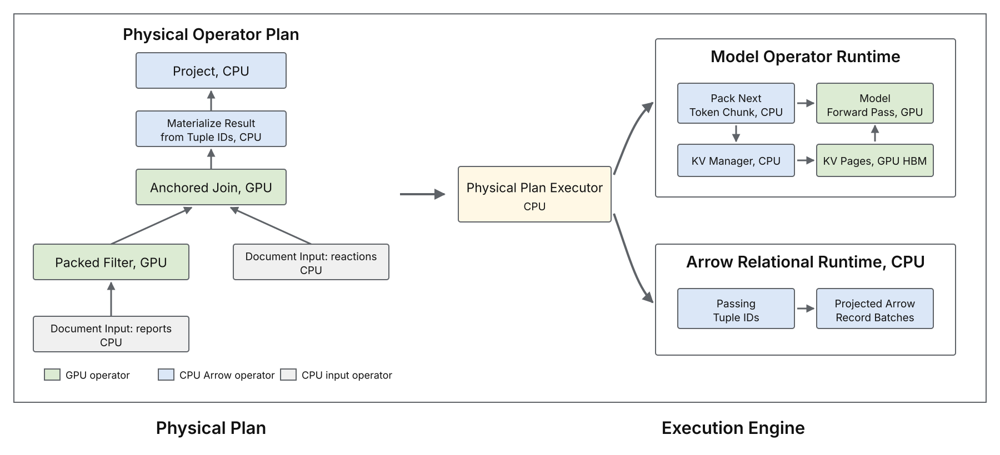

# 1. A new class of inference workloads is in town

For decades, database users have struggled to analyze unstructured text at scale.
SQL, our good old language, and corresponding relational database systems weren't really great for this.
But now, thanks to LLMs, database users can finally unlock insights from unstructured text columns.
Major database vendors now support AI-SQL, including [Snowflake Cortex AISQL](https://docs.snowflake.com/en/user-guide/snowflake-cortex/aisql), [BigQuery AI functions](https://cloud.google.com/blog/products/data-analytics/sql-reimagined-for-the-ai-era-with-bigquery-ai-functions), and [Databricks AI Functions](https://docs.databricks.com/aws/en/large-language-models/ai-functions).
AI-SQL extends SQL with AI-powered operators, such as filters, joins, and classifiers.

In an AI-powered operator, the user simply specifies what they want in natural language, and LLMs are used to evaluate that instruction over the relevant data.
For example, imagine that a database user has one table of medical reports, and another table of possible adverse reactions.[^biodex]
The user wants to identify which reactions each report attributes to the patient, but only for reports that describe female patients. They might run the following AI-SQL query (which we refer to as BIO-3 in the benchmark we are building):

```sql
SELECT r.id, m.id
FROM reports AS r
JOIN reaction_terms AS m
  ON AI.IF(PROMPT(
       'Does the medical report in {0} describe the reaction in {1} as something the patient experienced?',
       r.report,
       m.term
     ))
WHERE AI.IF(PROMPT(
        'Does {0} describe a case involving a female patient?',
        r.report
      ));
```

At a high level, the database compiles the aforementioned query into a plan that invokes an LLM on *each row* for the filter, then makes another LLM call on *each pair of rows* in the join.
Query execution can therefore be incredibly costly, because a filter over $N$ rows requires $N$ LLM calls, while a naive join between tables $A$ and $B$, with $n_A$ and $n_B$ rows, requires $n_A n_B$ LLM calls.

The database community has proposed a number of logical optimizations that reduce the number of LLM calls, for example, by pushing filters below joins, reordering predicates, choosing cheaper implementations, or pruning candidate pairs [[1]](https://arxiv.org/abs/2512.02289) [[2]](https://arxiv.org/abs/2505.14661) [[3]](https://arxiv.org/abs/2407.11418) [[4]](https://arxiv.org/abs/2512.05399) [[5]](https://cloud.google.com/blog/products/data-analytics/more-than-100x-faster-and-cheaper-llm-powered-sql-queries-with-proxy-models).
But still, the resulting query plans can end up needing hundreds of thousands, or even millions, of LLM calls.

[^biodex]: The example is based on the [BioDEX dataset](https://aclanthology.org/2023.findings-emnlp.896/).

# 2. Challenges of executing AI-SQL queries


**Executing the query with vLLM**. Let us use vLLM to execute the example query plan.

[{width=90%}](figures/vllm-query-plan.svg)

*Figure 1. To execute BIO-3, the vLLM baseline can run the report filter before the join, and uses each surviving report as the join anchor.*

To execute the plan with vLLM, we'd render one prompt for each report in the filter, and one prompt for each report and reaction pair in the join. We'd submit every prompt as a separate inference request. A simple rendering strategy is to place the document text at the beginning of each prompt, followed by the natural language instruction in the AI-SQL operator. For a filter, there is only one document. For a join, we need to choose which document comes first, which we call the *anchor*, and which document comes second, which we call the *partner*. For our query, we place the much longer medical report first, to maximize the number of prefix tokens whose key and value state, called KV, can be reused across join prompts.

Now, each request asks for only a `TRUE` or `FALSE` answer, so the model does not need a separate decode step after processing the prompt. So the engine should always have enough work to keep the GPU fully occupied (i.e., be compute-bound).
We set a very large max_num_batch_tokens (>25k) and max_num_seq (4096) such that the GPU will always be busy.
We'll run Qwen3 4B FP8, with BF16 KV, on one H100, and our query will cover 500 medical reports, averaging 4,066 tokens each, and 1,127 reaction terms, averaging 4.8 tokens each.
Surprisingly, we find two sources of inefficiency in the vLLM baseline.

## Issue #1: KV Regret

The filter has 55 percent selectivity, so it rejects 45 percent of the reports. KV for the rejected reports will never be used again in this query. However, vLLM does not use the filter results when managing KV. It stores KV from every filter request, and evicts the least recently used blocks when the cache fills. As a result, vLLM may keep KV for a rejected report, while evicting KV for a report that will be used in the join. The evicted report prefix must then be computed again during the join. We call any prefix token that the engine recomputes after the same token prefix was computed earlier in the query _KV regret_. Our vLLM implementation incurs 1.08 million KV regret tokens on this query! Then, during the join, vLLM also stores KV for the entire prompt, even though later requests reuse only the report prefix. The additional waste is small here, because the reaction terms are short, but it could be much larger if both tables contained long documents.

## Issue #2: High Host Overhead

The join submits hundreds of thousands of report and reaction pairs to vLLM as separate requests. The profiler trace below shows five seconds of GPU and CPU activity during the BIO-3 join.

[{width=100%}](figures/bio3_join_window.pdf)

*Figure 2. Five seconds of the BIO-3 join with vLLM. The top panel shows when the GPU is active or idle. The lower panel shows recorded CPU operations on the same time axis. Each rectangle is one CPU operation, and its width is the operation's duration. Nested operations appear below the operation that called them. Orange rectangles are vLLM scheduler operations, and blue rectangles are PyTorch or CUDA API calls from the CPU. Gray intervals have no recorded CPU operation, but they do not necessarily mean that the CPU is idle.*

More than 99 percent of the prompt tokens come from the prefix cache, so each batch contains very little model computation. The GPU finishes each batch quickly, but the CPU still has to process and schedule every request in the next batch. When the CPU does not prepare the next batch in time, the GPU sits idle, even though hundreds of thousands of pairs are waiting. The GPU may also use its arithmetic units poorly while a batch is running, which is known as low model FLOPs utilization, or MFU. We do not address low MFU here. Modal provides useful background on [GPU utilization](https://modal.com/blog/gpu-utilization-guide) and [host overhead](https://modal.com/blog/host-overhead-inference-efficiency).

We can compare vLLM's measured latency with a speed of light estimate for the same query plan. Although we don't go into the full calculation in this post, we use a [roofline model](https://modal.com/gpu-glossary/perf/roofline-model) to estimate the time for each model operation. The roofline model takes the larger of an operation's arithmetic time and the time required to move its data through GPU high bandwidth memory, or HBM. We then combine these operation level estimates according to the query plan. We assume that CPU and GPU work overlap, so the GPU never sits idle. We also assume that every model operation reaches the relevant peak hardware rate, and that the engine retains all reusable KV. Of course, no implementation can satisfy all of these assumptions in practice, so the estimate is an intentionally optimistic lower bound. The [implementation in Quail](https://github.com/fsdatalab/quail-exploration/blob/0d24478a82100b518d6110f5c1c8cec0c26c6487/quail/planner/sol.py) contains the full calculation.

For BIO-3, vLLM computes 14 percent of its input tokens more than once, because it evicted their KV. The vLLM run takes almost 12 times the speed of light estimate. Surely, we can do better!

# 3. Introducing Quail

We are building Quail, an open source query engine for AI-SQL. Quail stands for Query Aware Inference Layer. In this post, we describe how Quail works at a high level, and explain how to get started.

Quail consists of a query frontend, a query planner, and an execution engine. Through the frontend, the user provides Arrow tables or datasets, an AI-SQL or Python query, and the model and GPU(s) to use. The frontend creates a logical plan from the query. The query planner orders the filters and joins, and chooses the anchor for each join. It also determines how many tokens each model forward pass should process. The planner then lowers the logical plan into a physical operator plan, which the execution engine runs.

Quail is extensible, and its design is inspired by [Apache DataFusion](https://datafusion.apache.org/), an open source, extensible analytical query engine. Users can add new query operators, planning rules, execution backends, models, or support for other hardware.

We'll walk through the components of Quail in the following paragraphs.

{width=100%}

## Query frontend

**Dataset registration.** Users begin by creating a `quail.Session` and registering each input under a table name. An input can be an Arrow table, which holds all rows in memory, or an Arrow dataset, which scans rows in batches.

**Query authoring.** Users can write AI-SQL, or construct the same query through Quail's Python query builder. The current release supports AI-powered filters and joins, along with relational limit and projection operations. The Python query builder provides the same operations through `.ai_filter(...)`, `.ai_join(...)`, `.limit(...)`, and `.select(...)`. Users can chain these calls in the same way they chain pandas operations.

**Operator interface.** For the remainder of this post, we use BigQuery's `AI.IF` syntax. The same `AI.IF` function can define a filter or a join. `AI.IF` accepts a prompt, followed by an optional dictionary that provides information to the planner. The filter and join signatures are:

```text
Filter:
AI.IF(
    PROMPT(instruction, document),
    {'selectivity': s}
)

Join:
AI.IF(
    PROMPT(instruction, left_document, right_document),
    {'selectivity': s, 'anchor': table_alias}
)
```

**Planning information.** `selectivity` is the expected fraction of documents or document pairs that will pass. When `selectivity` is omitted, Quail executes the predicates in the order they were written. For a join, the optional `anchor` field names the table whose document appears first in the prompt, so its KV can be reused across pairs. If the anchor field is not provided, Quail will select it in the query planner.

**Model and GPU.** Users choose the model and number of GPUs when they create the session. The current release supports Qwen3 4B FP8 and Qwen3 32B FP8 on H100 GPUs. Users can add another model or GPU through Quail's extension interface.

**Query parsing.** Quail uses SQLGlot to parse both Snowflake's `AI_FILTER` syntax and BigQuery's `AI.IF` syntax. The parser returns a logical query plan, which becomes the input to the query planner.

## Query planner

**Overview.** For BIO-3, we should run the filter before the join, to reduce the number of report and reaction pairs we evaluate. Planning a query with several filters and joins is more difficult. Given the logical query plan, we perform five steps:

1. We estimate the document lengths and basic statistics for each input dataset.
2. We choose how many tokens to process in each model forward pass, then calculate the total KV capacity and how much of that capacity may be retained between operators.
3. We push projections and filters down to the source datasets.
4. We order the filters on each dataset, using their selectivities and estimated execution costs.
5. We choose the join order and the anchor for each join.

**Estimating input sizes.** We need the row count, average document length, and maximum document length for each dataset. Tokenizing every document before planning would delay the planner, so we tokenize up to 1,024 documents and calculate the average number of tokens per byte. We apply that ratio to the byte length of every document in the column. The planner uses the estimated lengths, while a background CPU thread tokenizes the full document columns.

**Choosing the forward pass size.** The planner chooses the maximum number of tokens to process in one model forward pass. The limit is the smaller of what fits in temporary activation memory, and what the GPU kernels can index. Processing more tokens per forward pass reduces the number of submissions from the CPU.

**Allocating HBM.** The model weights remain in HBM, and we reserve temporary activation memory for two forward passes. We allocate the remaining HBM to KV. Within the KV allocation, we leave enough pages for the KV written by two forward passes, because the GPU may run the current forward pass before the CPU has processed the answers from the previous one. Document KV retained for later operators can use the remaining pages.

**Pushing down projections and filters.** We first push each projection down to its source dataset, so a scan loads only the columns that appear in a prompt or in the final query result. We then push each filter down to its source dataset, so a document that fails a filter does not enter a later join. Figure 4 shows the filter pushdown for BIO-3.

[{width=100%}](figures/filter-pushdown.svg)

*Figure 4. The logical plan from the parser places the report filter above the join. Quail pushes the filter down to the reports dataset, so rejected reports do not enter the join.*

### Ordering filters

**Filter rank.** In 1993, [Hellerstein and Stonebraker](https://dsf.berkeley.edu/jmh/miscpapers/sigmod93.pdf) showed that expensive predicates over one table can be ordered optimally with a simple rank formula. For each filter $i$, let $\sigma_i$ be its provided selectivity, or the fraction of documents expected to pass. Let $c_i$ be the estimated latency, in seconds, of evaluating the filter on one document. Their rule orders filters by increasing rank:

$$
\rho_i = \frac{c_i}{1 - \sigma_i}.
$$

A low rank favors a filter that is cheap, rejects many documents, or both, because running it early prevents more expensive filters from seeing those documents.

**Estimating filter cost.** For an LLM filter, $c_i$ depends on the document length, the filter prompt length, the selected model and GPU, the forward pass size, and whether the document KV is already in GPU HBM. We therefore calculate two versions of $c_i$. The first cost, $c_i^{\mathrm{first}}$, is the estimated time when filter $i$ runs first, so the model must process both the document and the filter prompt. The later cost, $c_i^{\mathrm{later}}$, is the estimated time when another filter has already computed the document KV, so the model processes only the new filter prompt and attends to the cached document.

We calculate both costs with a speed of light estimate. At a high level, we count the fresh tokens, attention pairs, KV tokens written, and KV tokens read. A fresh token is a token that the model must process, rather than a token whose KV is already available. We translate these counts into arithmetic work and HBM traffic for each part of the model. Let $r$ index the model parts that run one after another. For either cost, the estimated latency is:

$$
\sum_r \max\left(
\frac{\mathrm{FLOPs}_{r}}{\mathrm{arithmetic\ throughput}_r},
\frac{\mathrm{bytes}_{r}}{\mathrm{HBM\ bandwidth}}
\right).
$$

The maximum accounts for whether each part of the model is limited by arithmetic or HBM bandwidth. The sum accounts for the parts that run one after another. The estimate assumes peak hardware throughput and excludes software overhead. For filter ordering, we also assume an "infinite" KV cache, so document KV is never evicted between filters. We will describe the full speed of light model in a follow up post.

**Costing a filter order.** For an order $\pi$ over $m$ filters and $N$ input documents, the expected cost of the full filter sequence is:

$$
C_{\mathrm{filters}}(\pi)
= N\left[
c_{\pi_1}^{\mathrm{first}}
+ \sum_{k=2}^{m}
\left(\prod_{j=1}^{k-1}\sigma_{\pi_j}\right)
c_{\pi_k}^{\mathrm{later}}
\right].
$$

The product of the preceding selectivities is the expected fraction of documents that reach filter $\pi_k$.

**Choosing the filter order.** We try each filter in the first position, because only the first filter pays $c_i^{\mathrm{first}}$. For each possible first filter, we order the remaining filters by $c_i^{\mathrm{later}} / (1 - \sigma_i)$. We then use the expected cost equation above to choose the complete order with the lowest estimated time.

### Ordering joins and choosing anchors

**Planning decisions.** After ordering the filters, we choose the order of the joins and the anchor for each join. The join order determines how many documents reach each later join. The anchor is the document placed first in the prompt, so the anchor choice determines which document KV can be reused across pairs.

**Estimating join cost.** For a join between inputs $A$ and $B$, let $n_A$ and $n_B$ be the estimated numbers of documents that reach the join. With $A$ as the anchor, we account for computing the anchor prefix once for each of the $n_A$ documents, then evaluating the predicate for all $n_A n_B$ document pairs. If the document KV for $A$ is already in HBM, we need to compute only the join prompt tokens that follow the document. Otherwise, we also include the cost of computing the document prefix. We use the same speed of light estimate to convert the total model computation and KV traffic into seconds. We also estimate the reverse direction, with $B$ as the anchor, because the anchor choice changes which work is paid once per document and which work is paid once per pair.

**Estimating the inputs to later joins.** Let $\sigma_{AB}$ be the provided selectivity of the join, or the expected fraction of document pairs that pass. Assuming that pair outcomes are independent, we estimate the surviving documents on each side as:

$$
n_A' = n_A\left(1 - (1 - \sigma_{AB})^{n_B}\right),
\qquad
n_B' = n_B\left(1 - (1 - \sigma_{AB})^{n_A}\right).
$$

We use $n_A'$ and $n_B'$ when estimating the costs of later joins. As with filters, we count the model computation and KV traffic for each candidate plan, and use the speed of light model to estimate its execution time. We will describe the full join cost model in a follow up post.

**Searching the join plans.** We search for the join order and anchor choices with the lowest estimated total execution time. In 1979, [Selinger et al.](https://doi.org/10.1145/582095.582099) introduced the System R query optimizer, which searches left deep join plans with bottom up dynamic programming. In a left deep plan, each join adds one base dataset to the intermediate result built so far. A bushy plan can instead join two intermediate results.

[{width=90%}](figures/join-plan-shapes.svg)

*Figure 5. A left deep plan adds one base dataset to the intermediate result at each join, while a bushy plan can join two intermediate results. Quail searches left deep plans.*

Starting with one dataset at a time, the System R algorithm builds plans over two datasets, then three, and so on. It normally keeps only the cheapest partial plan for each subset of datasets. Selinger et al. also retain a more expensive partial plan when it produces rows in an ["interesting order"](https://doi.org/10.1145/582095.582099), because that order may reduce the cost of a later join or sort.

**Adapting System R for KV.** We cannot keep only the cheapest partial plan for each set of datasets, because two plans over the same datasets may retain KV for different anchors. For example, after joining $A$ and $B$, one plan may retain $A$'s KV, while another retains $B$'s. If the next join compares $A$ with $C$, only the first plan can reuse $A$'s KV. Fortunately, we can adapt System R's rule for interesting orders, and retain separate partial plans for each anchor whose KV remains available. The chosen plan specifies the join order, the anchor for each join, and which dataset KV the execution engine should retain for a later join. We will describe the full algorithm in an upcoming technical report.

## Execution engine

### Physical operators, #1 in Figure 6

**Physical plan.** The planner lowers the logical plan into a graph of physical operators, which specifies how Quail will execute each part of the query. `Packed Filter` and `Anchored Join` each represent a complete stage of model calls, rather than one physical operator for every call. The BIO-3 plan contains the following operators:

- **`Document Input`.** The two document input operators provide the tokenized medical reports and reaction terms.
- **`Packed Filter`.** The packed filter evaluates the report filter, and returns the IDs of reports that pass.
- **`Anchored Join`.** The anchored join evaluates the surviving reports against the reaction terms, using each report as the anchor.
- **`Project`.** The project reads the requested report and reaction columns for the pairs that returned `TRUE`.

**Other physical operators.** A query with several joins may contain an `Exchange`, which updates the surviving document IDs between join groups, or a `Recombine`, which uses Arrow Acero to combine the tuple IDs returned by several joins. A query with a `LIMIT` also contains a separate `Limit` operator. BIO-3 needs none of these operators.

[{width=100%}](figures/execution-engine.svg)

*Figure 6. The BIO-3 physical plan appears on the left. On the right, one CPU worker executes the plan, schedules each `Packed Filter` or `Anchored Join`, and manages KV for one GPU. The GPU holds one model copy, loaded through vLLM, and one KV pool. While the GPU runs the current token chunk, the CPU reads the previous answers and prepares the next chunk. The numbered labels refer to the corresponding sections in the text. Quail runs one copy of this CPU and GPU execution path for each GPU.*

**Running the plan.** The physical plan executor runs each operator after its inputs are available. `Packed Filter` and `Anchored Join` use the scheduling and model execution loop described below. Relational operators, such as `Project`, run on the CPU.

### Preparing the documents and model, #2 in Figure 6

**Tokenizing documents.** The model reads token IDs, rather than strings, so Quail tokenizes every document column used by a `Packed Filter` or `Anchored Join`. During planning, we estimate token lengths from a random sample, while a background CPU thread tokenizes the full columns. For Qwen models, we use `bpe-qwen`. In our measurement over about four million tokens, it was about seven times faster than the Hugging Face tokenizer. We store the tokens and requested result columns in memory mapped Arrow files, so another query can reuse them without reading and tokenizing the documents again.

**Loading the model.** Quail calls vLLM's model loader, and uses the model implementation and kernels that vLLM provides. We load one complete model copy on each selected GPU, rather than splitting one model across several GPUs. Model loading and kernel warmup run while the CPU finishes tokenizing the documents. Operator execution begins after the model and tokenized documents are ready, and a later query in the same process can reuse the loaded model and compiled kernels.

### Managing KV, #3 in Figure 6

**Allocating pages.** Each GPU has its own KV manager and KV pool in HBM. When the model starts on a GPU, Quail allocates the KV capacity chosen by the planner as a fixed pool of pages, where each page stores KV for 16 token positions. The KV manager assigns pages to a document when it enters a filter or join, and returns the pages after its KV is no longer needed. Pages used by the current operator cannot be evicted, because the GPU may be reading or writing them.

**Rewinding KV.** A completed filter or join prompt contains KV for the document and the operator prompt that follows it. If the physical plan will use the document as an anchor later, we rewind its KV to the end of the document and release the pages used only by the operator prompt. If the document has no later use, we release all of its KV.

**Choosing which KV to retain.** The planner limits how many pages may hold document KV between operators, so retained KV cannot prevent the next model chunk from running. To decide which document prefixes to keep within this limit, we assign each prefix $d$ the following value:

$$
V(d) =
\frac{
P_{\mathrm{reuse}}(a_d)
\times C_{\mathrm{recompute}}(d)
}{
\mathrm{KVPages}(d)
}.
$$

**Eviction value.** $a_d$ is the input dataset that contains document $d$, and $P_{\mathrm{reuse}}(a_d)$ is the probability that the document reaches its next planned use as an anchor. We estimate this probability from the selectivities of the filters and joins that run before that use. $C_{\mathrm{recompute}}(d)$ is the speed of light estimate, in seconds, for computing the document prefix again. $\mathrm{KVPages}(d)$ is the number of pages needed to store its KV. Therefore, $V(d)$ is the expected recomputation time saved per KV page. We evict the prefix with the smallest value, and break ties by evicting the prefix used later. A document that fails a filter has no future use in the query, so we release its pages immediately.

### Executing filters and joins, #4 and #5 in Figure 6

**Overlapping CPU and GPU work.** `Packed Filter` and `Anchored Join` use the same execution loop. The CPU builds a token chunk up to the budget chosen by the planner, subject to the available KV pages, then launches one model forward pass on the GPU. While the GPU runs the current chunk, the CPU reads the `TRUE` or `FALSE` answers from the previous chunk, updates the scheduler and KV manager, and prepares the next chunk. The GPU can therefore begin the next forward pass without waiting for the CPU, as long as the CPU prepares the next chunk in time.

**Executing filters.** A `Packed Filter` evaluates all AI predicates on one dataset, in the order chosen by the planner. The scheduler first adds documents that passed an earlier predicate, because their KV is already in HBM, then uses the remaining token budget for documents that have not started. When a document returns `TRUE`, the scheduler adds its next predicate to a later chunk, if another predicate remains. When a document returns `FALSE`, the scheduler stops evaluating it and releases its KV pages. A document that passes the final predicate keeps its KV only when a later join uses the document as an anchor.

**Executing joins.** An `Anchored Join` evaluates one or more consecutive joins that use the same anchor dataset. For each anchor document, the scheduler adds as many candidate pairs as the token budget allows, and keeps the anchor KV in HBM as its pairs continue across chunks. One chunk can contain candidate pairs for several anchors, and each pair reads the KV for its own anchor. If another join uses the same anchor, the scheduler can begin that join once every pair in the current join has been submitted, and at least one pair has returned `TRUE`. If every pair returns `FALSE`, the scheduler releases the anchor KV. Otherwise, the KV remains in HBM until the anchor's final join has finished.

TODO: Revisit the join batching diagram.

**Producing the result.** Each `Anchored Join` returns the tuple IDs and Boolean answers for the candidate tuples it evaluated. For a query with one join, `Project` reads the requested columns for the tuples that returned `TRUE`. For a query with several joins, `Recombine` first uses Arrow Acero to combine the passing tuple IDs.

### Running the model forward pass, #6 in Figure 6

**Reusing existing kernels.** Most of Quail's model forward pass is the same as vLLM's, and we load the model through vLLM. We use DeepGEMM for the main matrix multiplications, and [FlashAttention 3](https://arxiv.org/abs/2407.08608) for attention. Quail changes how join attention is represented. It also fuses several small operations, and computes only the output scores needed for a Boolean answer.

**Computing join attention.** The new tokens for each tuple must attend to the KV for their anchor, but one chunk may contain several different anchors. We split attention into two parts at every model layer. One FlashAttention 3 call computes causal attention among the new tokens for each tuple, and another computes attention from those tokens into the corresponding anchor KV. We then merge the two outputs. Let $o_{\mathrm{new}}$ and $o_{\mathrm{anchor}}$ be the outputs of these two calls, and let $\ell_{\mathrm{new}}$ and $\ell_{\mathrm{anchor}}$ be their log sum exp values. The full attention output is:

$$
o =
\frac{e^{\ell_{\mathrm{new}}}o_{\mathrm{new}} + e^{\ell_{\mathrm{anchor}}}o_{\mathrm{anchor}}}
     {e^{\ell_{\mathrm{new}}} + e^{\ell_{\mathrm{anchor}}}}.
$$

**Merging the attention outputs.** The two calls attend to separate parts of the same prompt, so the weighted merge is exactly equal to one softmax attention operation over the full prompt. [Hydragen](https://arxiv.org/abs/2402.05099) and [FlashInfer's recursive attention](https://docs.flashinfer.ai/tutorials/recursive_attention.html) use the same decomposition and merge rule.

**Reducing kernel launches.** We fuse the attention merge with the FP8 quantization required by the following output projection. We also fuse several small operations around normalization, RoPE, activation, and quantization. The join attention path therefore adds one fused kernel around the two FlashAttention 3 calls.

**Computing the answer.** A standard language model output head computes one score for every token in the vocabulary. Filters and joins need only a `TRUE` or `FALSE` answer, so we select the corresponding rows of the output matrix and compute only those scores.

### Using multiple GPUs

**Data parallel execution.** Quail supports one, two, four, or eight H100s in one Modal container, with one model copy and one KV pool on each GPU. For filters, we divide documents across the GPUs based on their token lengths. For joins, we divide anchors across the GPUs and make the other inputs available to each GPU. The CPU combines the filter survivors and join results after each operator.

# 4. Evaluation

## Performance goals

We have three performance goals for Quail. First, we want to minimize KV regret, which counts prefix tokens that the model recomputes after it has already computed the same token prefix earlier in the query. KV regret cannot always be zero, because GPU HBM is finite. Second, we want the GPU to spend close to 100 percent of query execution running model operations. AI-SQL filters and joins spend almost all of their model time on prefill, and many evaluations are ready at once, so the GPU should not have to wait for the CPU to prepare more work. Third, while the GPU is active, we want high model FLOPs utilization, or MFU. MFU is the fraction of the GPU's peak arithmetic throughput used during a model forward pass.

Quail's current design focuses on the first two goals. The KV manager uses the query plan to retain the KV that is expected to avoid the most future computation. The executor sends large chunks of tokens through the model, which reduces the CPU overhead of preparing and scheduling separate requests. For MFU, we use DeepGEMM for the main matrix multiplications, and FlashAttention 3 for attention. We leave further kernel optimization to the experts, who have shown that large improvements are possible.[^sail-mfu]

[^sail-mfu]: In ["Chasing Speed of Light on TPU v6e"](https://www.sailresearch.com/blog/tpu-v6e-gemma), Sail Research describes increasing Gemma 4 31B prefill MFU from about 32 percent to 63 percent through attention tuning, communication overlap, and custom kernel work.

## Experimental setup

**Benchmark and hardware.** We evaluate Quail on QUAIL-B, which contains 32 AI-SQL queries over five datasets. The benchmark includes AI filters, AI joins, and queries with both. Every configuration uses Qwen3 4B FP8, with BF16 KV, on one H100. Within each query family, Quail and vLLM run sequentially on the same physical GPU. We will describe the full benchmark in an upcoming blog post and technical report. Here, we focus on BIO-3, which is the BioDEX query from the beginning of the post, and AGENT-1, where Quail is slower.

**vLLM baseline.** We compare Quail with vLLM 0.26.0, using the same logical query plan and prompt layout. For a chain of filters, the baseline submits a document's next filter as soon as the previous filter returns `TRUE`. For a join, we manually choose the better anchor direction, and submit one inference request for each document pair in anchor order. We enable automatic prefix caching, allow up to 25,305 tokens and 4,096 requests in each batch, and capture one CUDA graph for 8,192 tokens. The token limit is large enough to saturate the H100 when the CPU prepares work in time. Larger batch or memory limits caused GPU OOM errors. We also give the baseline more space for KV than Quail. We set vLLM's GPU memory utilization to 0.91, which gives it space for 479,616 KV tokens. Quail has space for 362,250 KV tokens, because it reserves HBM for two larger activation chunks. The baseline therefore has about 32 percent more KV capacity than Quail.

**Metrics.** For each query, we report query latency, GPU cost, fresh input tokens, KV regret tokens, and latency relative to the speed of light estimate from Section 2. Query latency begins after model startup and kernel warmup, and excludes result collection. We convert the query latency into GPU cost using Modal's H100 price of $3.9492 per hour. Fresh input tokens count every input token processed by a model forward pass, including repeated computation. KV regret uses the distinct prefix definition, so it includes recomputing the same document prefix and recomputing a token prefix that an earlier document already computed. KV regret tokens are already included in the fresh input token count. The speed of light estimate assumes peak GPU throughput, no CPU overhead, and enough GPU HBM to retain all reusable prefix KV.

Across the full benchmark, Quail is faster than the vLLM baseline on 30 of the 32 queries. The latency tables below use runs without profiling, while the profile figures come from separate diagnostic runs.

## BioDEX results

- BIO-3 filters 500 medical reports for female patients, then joins the surviving reports with 1,127 possible reaction terms.

| Metric | Quail | vLLM baseline |
|---|---:|---:|
| Query latency, seconds | 89.92 | 510.91 |
| GPU cost per query | $0.09864 | $0.56047 |
| Fresh input tokens | 7,547,348 | 7,875,694 |
| KV regret tokens | 920,895 | 1,081,310 |
| Latency relative to the speed of light estimate, 43.09 seconds | 2.09× | 11.86× |

- Quail is 5.68 times faster than the vLLM baseline.
- Quail reduces KV regret, but does not eliminate it, because the KV for all surviving medical reports does not fit in GPU HBM.
- As the profile in Section 2 shows, vLLM finishes each model batch quickly, because most document KV is already cached, but the CPU cannot process the individual requests fast enough to keep the GPU busy.
- Quail sends large token chunks directly through the model, so it does not pay vLLM's request processing cost for every document pair.

[{width=100%}](figures/bio3_profile_comparison.pdf)

*Figure 7. In these five-second windows, GPU operations cover 4.997 seconds with Quail and 1.892 seconds with vLLM. The CPU calls appear below the GPU timeline. Both runs use an H100 and the same Qwen3 4B FP8 model.*

## Agent trace results

- AGENT-1 contains 1,772 cumulative snapshots from software agent runs. Each snapshot contains the complete trace up to one point in the run, so later snapshots from the same run begin with the full contents of earlier snapshots.
- A simplified pair of rows looks like the following:

| id | trajectory_id | turn_index | trace |
|---|---|---:|---|
| `trace_42_turn_5` | `trace_42` | 5 | `[USER] Fix the failing parser. [ASSISTANT] Tries approach A. [TOOL] The test fails.` |
| `trace_42_turn_10` | `trace_42` | 10 | `<complete trace from turn 5> [ASSISTANT] Finds the mistake, and tries approach B. [TOOL] The tests pass.` |

- Here is the AGENT-1 query, simplified for this post:

```sql
SELECT t.id
FROM agent_traces AS t
WHERE AI.IF(
  PROMPT(
    'Did the agent recover after trying an approach that did not work?\n\n{0}',
    t.trace
  ),
  {'selectivity': 0.32}
);
```

| Metric | Quail | vLLM baseline |
|---|---:|---:|
| Query latency, seconds | 240.49 | 99.15 |
| GPU cost per query | $0.26382 | $0.10877 |
| Fresh input tokens | 17,389,113 | 5,526,889 |
| KV regret tokens | 11,882,610 | 20,386 |
| Latency relative to the speed of light estimate, 47.47 seconds | 5.07× | 2.09× |

- The vLLM baseline is 2.43 times faster than Quail on AGENT-1.

[{width=100%}](figures/agent1_profile_comparison.pdf)

*Figure 8. AGENT-1 has one filter and no join. GPU operations cover 4.998 seconds with Quail and 4.988 seconds with vLLM in these five-second windows. Both keep the GPU busy, but vLLM computes far fewer fresh tokens by reusing prefixes across snapshots.*

- vLLM's automatic prefix caching feature reuses KV across different rows when their token prefixes match, while Quail currently reuses KV only when the same document appears again in the query.
- Quail therefore incurs 11.88 million KV regret tokens, while the vLLM baseline incurs only 20,386.
- We plan to add automatic prefix caching to Quail, but the lookup must remain cheap at the request volumes that AI-SQL queries can produce.

# 5. Getting started

- Here is how you can get started with Quail.
- In this demo, we use all 100,000 movie reviews from the [Stanford IMDB dataset](https://huggingface.co/datasets/stanfordnlp/imdb).
- The following code downloads the reviews from Hugging Face, and loads them into an Arrow dataset.
- We assume that the Python process has access to an H100.

```python
import pyarrow as pa
import pyarrow.dataset as ds
from datasets import concatenate_datasets, load_dataset
import quail

imdb = load_dataset(
    "stanfordnlp/imdb",
    revision="e6281661ce1c48d982bc483cf8a173c1bbeb5d31",
)
all_reviews = concatenate_datasets([
    imdb["train"],
    imdb["test"],
    imdb["unsupervised"],
])
reviews = ds.dataset(pa.table({
    "review_id": pa.array(
        f"review-{i}" for i in range(len(all_reviews))
    ),
    "review": all_reviews.data.table.column("text"),
}))

# Assuming there is an H100 attached to this Python process.
with quail.Session(
    config=quail.EngineConfig(gpus=1, device="h100-sxm"),
    compute_provider=quail.InProcessComputeProvider(),
) as session:
    session.register(
        "reviews",
        quail.DocumentProvider.from_dataset(reviews, id_col="review_id"),
    )

    query = session.sql("""
        SELECT r.review_id
        FROM reviews AS r
        WHERE AI.IF(
            PROMPT(
                'Does this review discuss the ending of the movie?\n\n{0}',
                r.review
            ),
            {'selectivity': 0.25}
        )
        AND AI.IF(
            PROMPT(
                'Does the reviewer recommend watching the movie?\n\n{0}',
                r.review
            ),
            {'selectivity': 0.5}
        )
    """, dialect="bq")

    print(query.explain())
    result = query.run()
    table = result.collect()
```

- `query.explain()` prints the logical and physical plans. The following output keeps only the parts that describe the two filters and their execution settings.

```text
logical:
  Project [r.review_id]
    SemanticFilter (x2, sels=[0.25, 0.5])
      Scan reviews as r [review]

physical:
  workers=1 model_copies=1
  backend=quail
  KV dtype=bf16
  chunk_tokens=110376 admission_tokens=362250
  order=by_cost
  DocumentInput input:r alias=r n_docs=100000 total_tokens=29926924
  PackedFilter filter:r alias=r arena_writes=True keep_kv=False
    stage {'written_pos': 0, 'question_tokens': 23,
           'selectivity': 0.25, 'expected_docs': 100000.0}
    stage {'written_pos': 1, 'question_tokens': 21,
           'selectivity': 0.5, 'expected_docs': 25000.0}
  Project sink columns=['r.review_id']

  note: token counts for 'r' are estimated from a 1024 document sample
```

- The physical plan uses one `PackedFilter` for both predicates, and estimates that 25,000 of the 100,000 reviews will reach the second predicate.
- While the query is running, Quail passes the KV for each surviving review directly from the first predicate to the second predicate, rather than finishing the first predicate over the entire dataset and then starting the second.
- The chunk budget allows up to 110,376 tokens in each model forward pass on the selected H100.
- The admission budget allows up to 362,250 tokens of document KV to reside in GPU HBM at once, and is separate from the number of tokens processed in one forward pass.
- `keep_kv=False` means that Quail releases the document KV after the second predicate, because no later operator needs it.
- For longer queries, the physical plan also shows KV rewind between filters, survivor KV retention for joins, and each join's anchor and expected KV reuse.
- Use `query.explain(verbose=True)` to inspect internal node IDs, port connections, and all planning settings.
- The session keeps the model loaded until the `with` block ends, so several queries can reuse it.

- The [complete demo](../../demos/imdb_ending_filter.py) prints the following results at the end of the run:

```text
matching reviews: 16057 of 100000
  stage evaluated 100000 reviews, 0.283 passed
  stage evaluated 28296 reviews, 0.568 passed
boot_s: 17.47 (cold)
token_wait_s: 0.0
wall_s: 269.57
total_s: 287.04 (boot + query)
fresh_tokens: 32499738
documents/second: 371.0
GPU cost: $0.3149
```

- The first predicate passes 28,296 reviews, and 16,057 reviews pass both predicates.
- The query takes 269.57 seconds, processes 371 input documents per second, and computes 32,499,738 fresh input tokens with zero KV regret.
- The full run takes 287.04 seconds, including 17.47 seconds to load the model, and costs $0.3149 at [Modal's H100 price](https://modal.com/pricing) of $3.9492 per hour.
- The IMDB dataset was already downloaded to disk, so the run does not include the time or cost to download it.

## Comparing the cost with GPT-5 nano

- As of September 2026, [OpenAI lists GPT-5 nano](https://developers.openai.com/api/docs/models/gpt-5-nano) at $0.05 per million input tokens, $0.005 per million cached input tokens, and $0.40 per million output tokens.
- The Quail run computes 32,499,738 new input tokens across the two filters.
- The second filter evaluates 28,296 reviews. Based on the average review length in this run, it reads about 8.41 million document tokens that the first filter already processed.
- For the infinite cache estimate, we charge the 32.50 million new input tokens at the regular input price, and only the 8.41 million reused document tokens at the cached input price.
- We use a conservative output estimate of 200,000 tokens, one output token per predicate for each of the 100,000 documents.

| Execution | Cost calculation | Estimated cost |
| --- | ---: | ---: |
| Quail | 287.04 H100 seconds at $3.9492 per hour | $0.3149 |
| GPT-5 nano, infinite cache | 32.500M new input × $0.05/M + 8.409M cached input × $0.005/M + 0.2M output × $0.40/M | $1.7470 |

- With an infinite cache for the reused document tokens, the GPT-5 nano estimate is $1.7470, or 5.5 times the measured Quail cost.
- The comparison uses the same token counts, but does not assume that Qwen3 4B and GPT-5 nano return the same answers.

## Running from a local Python process

- If you do not have a dedicated GPU, you can keep the Python process and source Arrow dataset on your laptop, or in a notebook, and let `ModalComputeProvider` start an H100 function on Modal:

```python
session = quail.Session(
    compute_provider=quail.ModalComputeProvider(),
)
```

- The Python process and source Arrow dataset remain on your laptop, or in your notebook.
- Quail sends the logical plan and required Arrow columns to Modal, where it plans and executes the query.
- The result comes back to the local process as an Arrow table.
- `InProcessComputeProvider` is the default, so the Modal path must be selected explicitly.
- The published version will link the repository, installation instructions, and complete examples for both paths.

# 6. What comes next

1. **Support more AI-SQL operators.**

   - Quail currently supports AI filters and joins, where the model returns `TRUE` or `FALSE` after processing the prompt.
   - Operators such as `AI_EXTRACT` and `AI_CLASSIFY` may generate several output tokens, so we will need to support decode.
   - The planner will also need to account for the generated tokens when it estimates cost and chooses a batch size.

2. **Support more models and hardware.**

   - Quail currently supports Qwen3 4B FP8 and Qwen3 32B FP8 on H100 GPUs.
   - We want to support hybrid model architectures, including Qwen3.5 and Liquid models.
   - We also want to support Blackwell GPUs, and add an Apple Silicon backend for machines such as an M5 MacBook.
   - The Apple Silicon backend would let coding agents run AI-SQL queries over private data without provisioning a server GPU.
   - Mixture of experts (MoE) models introduce another problem, because each token uses only a subset of the model's experts.
   - We do not yet know the best way to serve MoE models for AI-SQL, or whether predicting which experts each batch will use can improve throughput.

3. **Improve KV and HBM management.**

   - We want to add automatic prefix caching across rows, since cumulative agent traces and other datasets can contain many long, shared token prefixes.
   - We need to find the shared prefixes without spending more CPU time managing the cache than we save in GPU computation.
   - Quail currently keeps KV only in GPU HBM, and we also want to use host DRAM for KV that does not fit in HBM.
   - Copying KV from host DRAM may take longer than recomputing a short document, so the planner should compare the transfer and recomputation costs before deciding where to keep the KV.
   - Quail currently has naive support for up to eight data parallel H100 model copies in one container, where each GPU holds a complete copy of the model.
   - We divide the input documents across the GPUs, but filters and joins can leave one GPU with much more useful KV and work than another.
   - Some GPUs can then have unused HBM, or finish their work while another GPU is still running.
   - We want to rebalance the surviving documents, their KV, or the downstream join work, and extend execution across multiple containers and larger GPU counts.

4. **Improve model FLOPs utilization.**

   - AI-SQL workloads combine large prefills and shared document prefixes, while producing only one Boolean token for each evaluation.
   - Quail currently uses DeepGEMM for its main matrix multiplications, and FlashAttention 3 for attention.
   - We have not tried to optimize the matrix multiplication or attention kernels themselves.
   - If you work on GPU kernels, and this workload sounds interesting, we would like to work with you.

5. **Train models for AI-SQL operators.**

   - One direction is to fine tune small models for a particular AI predicate and dataset.
   - AI filters and joins are prefill oriented, because they process a long input and generate only a Boolean answer.
   - A custom model for these operators can therefore be optimized for prefill, rather than long decode.
   - Google's [work on lightweight proxy models](https://arxiv.org/abs/2603.15970) uses lightweight classifiers over embeddings, rather than small language models.
   - The proxy models reduced the cost and latency of simple semantic filters by more than 100 times, which suggests that models specialized to one query and dataset can be promising.
   - The planner could choose between a custom model and the larger model for each predicate, based on their expected cost and accuracy.
   - We do not yet know how to run the small model while the larger model processes other prefills on the same GPU, without reducing the throughput of either model.
   - Another direction is to train models for AI joins that are insensitive to the order of the documents in the prompt.
   - Quail chooses which document is the anchor, and therefore which document appears first, based on the execution cost of each choice.
   - Small models may return different answers when the two documents swap positions, so we cannot assume that both anchor choices have the same accuracy.
   - Perhaps removing RoPE could work, but, we want to study order invariant join models, e.g., training on both prompt orders.

- More implementation posts, and a technical report, are coming soon.
- For now, please try Quail, tell us where it breaks, and reach out if you want to work on this research with us.
- We are hiring PhD students and postdocs.

# Notes before publication

- The SQL example should use the exact syntax accepted by the public Quail release.
- The query plan figure should show the filter below the join, the materialized survivor relation, and the long medical report as the join anchor.
- A KV figure should show vLLM retaining blocks from the full filter prompt, while Quail releases failed rows and keeps only useful survivor prefixes.
- The profiling figure should use the current BIO-3 CPU and GPU trace.
- A results figure should compare BIO-3 latency and token work, with the speed of light estimate labeled as an estimate.
- A second results figure should compare AGENT-1 latency and fresh tokens, and label the shared row prefix reuse that vLLM captures and Quail misses.
- The benchmark pass should pin the public commit, model revision, vLLM and SGLang versions, Modal GPU type, memory settings, prompt templates, anchor choices, and startup policy.
- The benchmark pass should report exact request counts and observed selectivities from each backend, because different model answers can change downstream work.
- The final version should link the repository, installation page, API reference, QUAIL B reproduction commands, and one issue or discussion page for feedback.
