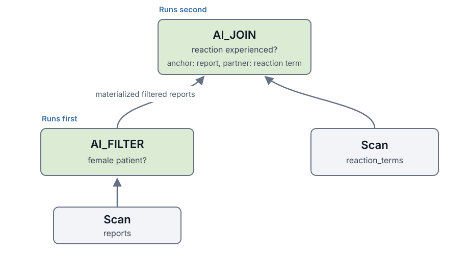
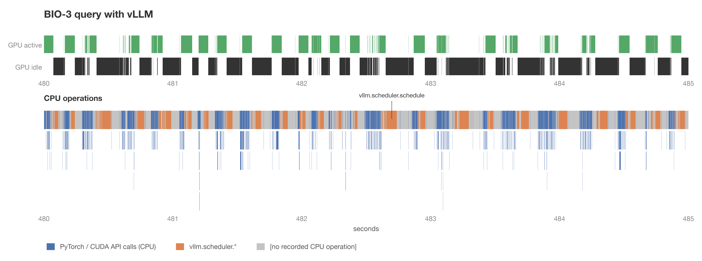
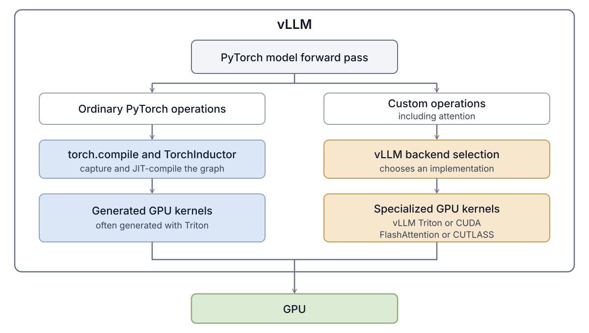
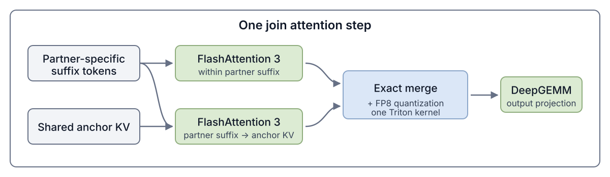
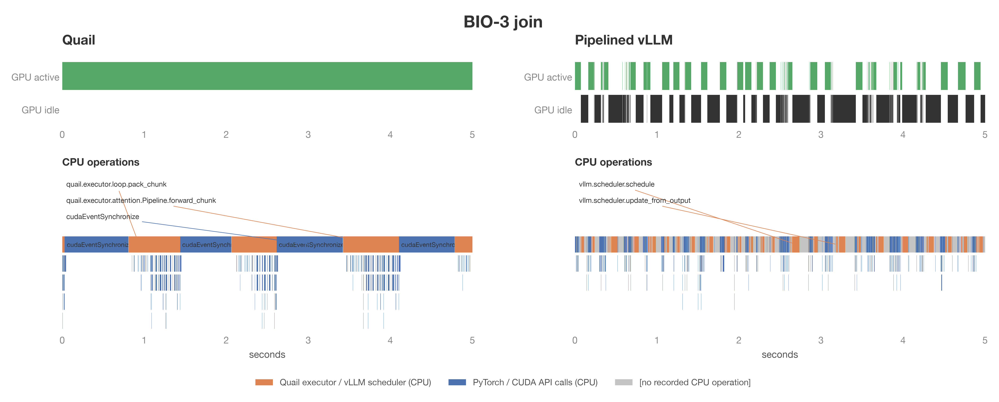
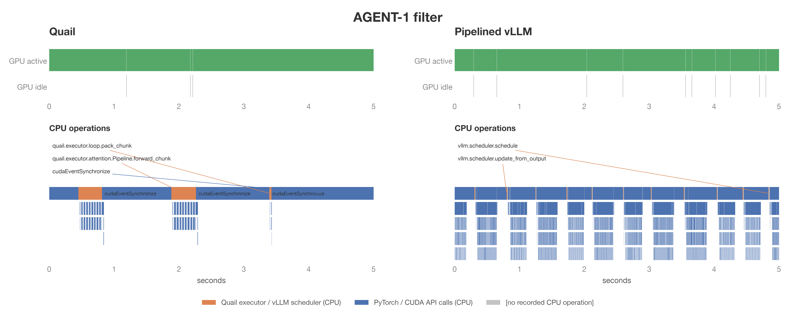

# 1. The growth of AI-powered data processing

For decades, database users have struggled to analyze unstructured text at scale.
SQL, our good old language, and corresponding relational database systems weren't really great for this.
But now, thanks to LLMs, database users can finally unlock insights from unstructured text columns.
Major database vendors now support AI-SQL, including [Snowflake Cortex AISQL](https://docs.snowflake.com/en/user-guide/snowflake-cortex/aisql), [BigQuery AI functions](https://cloud.google.com/blog/products/data-analytics/sql-reimagined-for-the-ai-era-with-bigquery-ai-functions), and [Databricks AI Functions](https://docs.databricks.com/aws/en/large-language-models/ai-functions).
AI-SQL extends SQL with AI-powered operators, such as filters, joins, and classifiers.

In an AI-powered operator, the user simply specifies what they want in natural language, and LLMs are used to evaluate that instruction over the relevant data.
For example, imagine that a database user has one table of medical reports, and another table of possible adverse reactions.[^biodex]
The user wants to identify which reactions each report attributes to the patient, but only for reports that describe female patients. They might run the following AI-SQL query, which we call BIO-3 in [quail-bench](https://github.com/fsdatalab/quail-bench).[^quail-bench]

```sql
SELECT r.id, m.id
FROM reports AS r
JOIN reaction_terms AS m
  ON AI.IF(PROMPT(
       'Does the medical report in {0} describe the reaction in {1} as something the patient experienced?',
       r.report,
       m.term
     ))
WHERE AI.IF(PROMPT(
        'Does {0} describe a case involving a female patient?',
        r.report
      ));
```

At a high level, the database compiles the aforementioned query into a plan that invokes an LLM on *each row* for the filter, then makes another LLM call on *each pair of rows* in the join.
Query execution can therefore be incredibly costly, because a filter over $N$ rows requires $N$ LLM calls, while a naive join between tables $A$ and $B$, with $n_A$ and $n_B$ rows, requires $n_A n_B$ LLM calls.

The database community has proposed a number of logical optimizations that reduce the number of LLM calls, for example, by pushing filters below joins, reordering predicates, choosing cheaper implementations, or pruning candidate pairs [[1]](https://arxiv.org/abs/2512.02289) [[2]](https://arxiv.org/abs/2505.14661) [[3]](https://arxiv.org/abs/2407.11418) [[4]](https://arxiv.org/abs/2512.05399) [[5]](https://cloud.google.com/blog/products/data-analytics/more-than-100x-faster-and-cheaper-llm-powered-sql-queries-with-proxy-models).
But still, the resulting query plans can end up needing hundreds of thousands, or even millions, of LLM calls.

[^biodex]: The example is based on the [BioDEX dataset](https://aclanthology.org/2023.findings-emnlp.896/).

[^quail-bench]: We are building quail-bench to evaluate AI-SQL query engines.

# 2. Key idea: let's jointly optimize query plans and inference


A natural thought is to use a general-purpose inference engine such as vLLM to execute the query plan. But sending the plan's hundreds of thousands of related model calls to vLLM as separate requests is far from optimal, as we'll show. Let's start with the "expert" plan for BIO-3 shown in Figure 1:

1. We first run the report filter, so rejected reports never enter the join.
2. We then join the reports that pass the filter with the reaction terms.

::: {.figure-block}
[{width=100%}](figures/vllm-query-plan.svg)

*Figure 1. The expert plan for BIO-3 runs the report filter before the join, and uses each surviving report as the join anchor.*
:::

To execute the plan with vLLM, we'd render one prompt for each report in the filter, and one prompt for each report and reaction pair in the join. We'd submit every prompt as a separate inference request. A simple rendering strategy is to place the document text at the beginning of each prompt, followed by the natural language instruction in the AI-SQL operator. For a filter, there is only one document. For a join, we need to choose which document comes first, which we call the *anchor*, and which document comes second, which we call the *partner*. For our query, we place the much longer medical report first, to maximize the number of prefix tokens whose key and value state, called KV, can be reused across join prompts.

**A cost estimate for the query plan.** Before measuring a vLLM baseline, we estimate the lowest possible runtime for the same plan. At a high level, we can count the model's arithmetic work and HBM (GPU DRAM) traffic from the token lengths, then use a [roofline model](https://modal.com/gpu-glossary/perf/roofline-model) to estimate the time. The estimate assumes peak GPU throughput, full overlap between CPU and GPU work, and enough HBM to retain all reusable KV. No implementation can meet all three assumptions, so we use the estimate only as a lower bound. We call this lower bound the *speed of light estimate*. For BIO-3, the estimate is 43.09 seconds.[^mfu] The [implementation in Quail](https://github.com/fsdatalab/quail-exploration/blob/0d24478a82100b518d6110f5c1c8cec0c26c6487/quail/planner/sol.py) contains the full calculation.

**How vLLM should perform.** BIO-3 has 311,552 requests ready to run, and each request produces one token constrained to `TRUE` or `FALSE`. Almost all of the model work is prefill. With a large enough batch, vLLM should keep the H100 busy, and the workload should be fully compute-bound.

**How vLLM actually performs.** We run vLLM 0.26.0 with Qwen3 4B FP8 on one H100. With the default settings, BIO-3 takes 605.68 seconds, far longer than the 43.09-second estimate! This is truly far from what we expected. We then tune two important parameters, `max_num_batched_tokens` and `max_num_seqs`, to give vLLM enough batch capacity to saturate the GPU. Even after tuning, the run takes 510.91 seconds, or 11.86 times the speed of light estimate!

We find two sources of inefficiency:

- **KV regret.** A fresh input token is an input token that the model processes in a forward pass instead of reusing its KV. KV regret counts fresh input tokens that repeat earlier work because reusable KV was evicted. vLLM's KV manager does not know which reports pass the filter and will be needed by the join. It may retain KV for rejected reports while evicting surviving reports, so the join must compute those report prefixes again. On BIO-3, 14 percent of the tuned baseline's fresh input tokens are KV regret.

- **Host overhead.** Host overhead is the CPU time spent preparing and scheduling model work while the GPU is idle. In the five-second window shown in Figure 2, the GPU is idle for 62 percent of the time! Why? BIO-3 submits each of its 311,052 join pairs as a separate request. More than 99 percent of the prompt tokens come from the prefix cache, so the GPU finishes each batch before the CPU can prepare the next one.[^host-overhead]

::: {.figure-block .wide-figure}
[{width=100%}](figures/bio3_join_window.pdf)

*Figure 2. GPU and CPU activity during five seconds of the BIO-3 join with vLLM.*
:::

[^host-overhead]: Modal provides useful background on [GPU utilization](https://modal.com/blog/gpu-utilization-guide) and [host overhead](https://modal.com/blog/host-overhead-inference-efficiency) in inference engines.

[^mfu]: *Model FLOP/s utilization (MFU)* is the fraction of the GPU's peak arithmetic throughput used during a model forward pass. The speed of light estimate assumes 100 percent MFU. That is not realistic, but we should still try to get as close as possible. We do not yet measure Quail's MFU.

We can, and we should, reduce both sources of waste by optimizing inference for AI-SQL.

# 3. Introducing Quail

We are building Quail, an open source query engine for AI-SQL. Quail stands for Query Aware Inference Layer.

We will first show you how you can get started. To read about how Quail works, skip to [Section 3.2: Design details](#design-details).

## 3.1 Getting started with Quail

We can use Quail to run two AI filters over all 100,000 movie reviews in the [Stanford IMDB dataset](https://huggingface.co/datasets/stanfordnlp/imdb). We first download the reviews from Hugging Face, and load them into an Arrow dataset.

```python
import pyarrow as pa
import pyarrow.dataset as ds
from datasets import concatenate_datasets, load_dataset
import quail

imdb = load_dataset(
    "stanfordnlp/imdb",
    revision="e6281661ce1c48d982bc483cf8a173c1bbeb5d31",
)
all_reviews = concatenate_datasets([
    imdb["train"],
    imdb["test"],
    imdb["unsupervised"],
])
reviews = ds.dataset(pa.table({
    "review_id": pa.array(f"review-{i}" for i in range(len(all_reviews))),
    "review": all_reviews.data.table.column("text"),
}))
```

The query keeps reviews that discuss the movie's ending, and recommend watching the movie.

```python
# This Python process has access to one H100.
with quail.Session(
    config=quail.EngineConfig(gpus=1, device="h100-sxm"),
) as session:
    session.register(
        "reviews",
        quail.DocumentProvider.from_dataset(reviews, id_col="review_id"),
    )

    query = session.sql("""
        SELECT r.review_id
        FROM reviews AS r
        WHERE AI.IF(
            PROMPT(
                'Does this review discuss the ending of the movie?\n\n{0}',
                r.review
            ),
            -- Optional, but helps Quail reorder filters.
            {'selectivity': 0.25}
        )
        AND AI.IF(
            PROMPT(
                'Does the reviewer recommend watching the movie?\n\n{0}',
                r.review
            ),
            {'selectivity': 0.5}
        )
    """, dialect="bq")

    print(query.explain())
    result = query.run()
    table = result.collect()
```

Before running the query, `query.explain()` prints the logical and physical plans. The output below keeps only the parts that describe the two filters and their execution settings.

```text
logical:
  Project: r.review_id
    SemanticFilter
      predicate 1: discusses the ending (selectivity=25%)
      predicate 2: recommends the movie (selectivity=50%)
      Scan reviews as r [review, review_id]

physical: backend=quail, model=qwen3-4b-fp8, workers=1
  KV=bf16
  chunk budget=110,376 tokens
  admission budget=362,250 tokens
  Project: r.review_id (est. rows=12,500)
    AiFilter: r (est. rows=12,500; est. time=124 s)
      KV rewind=on
      predicate 1 (input rows=100,000; est. pass=25%)
      predicate 2 (input rows=25,000; est. pass=50%)
      Scan reviews as r (rows=100,000)
        tokens=29,926,924, mean_doc_tokens=299.3
```

The complete example in [`demos/imdb_ending_filter.py`](../../demos/imdb_ending_filter.py) prints the following results at the end of the run:

```text
matching reviews: 16057 of 100000
  stage evaluated 100000 reviews, 0.283 passed
  stage evaluated 28296 reviews, 0.568 passed
boot_s: 57.65 (cold)
token_wait_s: 0.0
wall_s: 277.41
total_s: 335.06 (boot + query)
fresh_tokens: 32499738
documents/second: 360.5
GPU price: $3.9492/GPU-hour (Modal)
GPU cost, including startup: $0.3675
```

The full run costs $0.3675 at [Modal's H100 price](https://modal.com/pricing), including model startup.[^imdb-disk]

[^imdb-disk]: The IMDB dataset was already on disk, so the measurement excludes the time and cost of downloading it.

**Comparing with GPT-5 nano.** At current GPT-5 nano prices, the same two-filter workload would cost about $1.7470, or **4.8 times the measured Quail cost!**[^gpt5-nano-cost] Qwen3 4B and GPT-5 nano may not return the same answers, so the cost of reaching the same answer quality could be different.

[^gpt5-nano-cost]: As of September 2026, [OpenAI lists GPT-5 nano](https://developers.openai.com/api/docs/models/gpt-5-nano) at $0.05 per million input tokens, $0.005 per million cached input tokens, and $0.40 per million output tokens. The estimate applies the regular rate to 32.50 million input tokens, the cached rate to 8.41 million document tokens reused by the second filter, and the output rate to 200,000 tokens. We assume an infinite cache, so every reusable document token receives the cached rate.

**Running on Modal.** If you don't have a dedicated GPU, you can put the whole query inside a Modal GPU function. The function creates a normal Quail session and runs it:

```python
import modal
import quail

app = modal.App("quail-engine")
IMAGE_REQUIREMENTS = (
    "sqlglot==30.17.0",
    "transformers==5.15.0",
    "huggingface-hub==1.27.0",
    "pyarrow==25.0.1",
    "numpy==2.3.5",
    "gigatoken==0.10.0",
    "datasets==5.0.1",
    "vllm==0.26.0",
)

image = (
    modal.Image.from_registry(
        "nvidia/cuda:13.0.1-devel-ubuntu24.04", add_python="3.12")
    .entrypoint([])
    .pip_install(*IMAGE_REQUIREMENTS)
    .add_local_python_source("quail")
)

@app.function(image=image, gpu="H100!", timeout=1200)
def run_query(sql, documents):
    with quail.Session() as session:
        session.register("docs", quail.DocumentProvider.from_table(
            documents, id_col="id",
        ))
        result = session.sql(sql).run()
        return result.collect(), result.report
```

Modal allocates the H100, and Quail plans and runs the query inside the function. A complete example is in [`demos/quickstart_modal.py`](../../demos/quickstart_modal.py).

Check out the [Quail documentation](https://fsdatalab.github.io/quail) to learn more.

## 3.2 Design details

This section describes Quail's main design ideas at a high level. We are still actively building Quail, and we will provide the full technical details in a future report.

We have three performance goals for Quail:

1. Minimize KV regret by retaining reusable KV.
2. Keep the GPU busy by reducing CPU scheduling overhead.
3. Reach high model FLOP/s utilization (MFU) while the GPU is active.

Our current evaluation focuses on the first two goals. Quail uses DeepGEMM, FlashAttention 3, and fused Triton kernels, but we do not yet measure MFU or tune the core matrix multiplication and attention kernels. We defer a full MFU study to future work.

As shown in Figure 3, Quail consists of a query frontend, a query planner, and an execution engine. Through the frontend, the user provides Arrow tables or datasets, an AI-SQL or Python query, and the model and GPU(s) to use. The frontend creates a logical plan from the query. The query planner orders the filters and joins, chooses the anchor for each join, and determines how many tokens each model forward pass should process. The planner then lowers the logical plan into a physical operator plan, which the execution engine runs.

Quail is extensible, and its design is inspired by [Apache DataFusion](https://datafusion.apache.org/), an open source, extensible analytical query engine. ~~Users~~ We, and you, can add new query operators, planning rules, execution backends, models, or support for other hardware.

::: {.figure-block .wide-figure}
[{width=100%}](figures/quail-architecture.svg?v=4)

*Figure 3. Quail turns Arrow data and an AI-SQL query into a logical plan. The planner applies SQL rewrites, lowers the AI operations into physical operators, and plans operator pipelines for KV reuse. The execution engine runs the physical plan and executes its AI operations on the GPU.*
:::

### 3.2.1 Query frontend

Users register data as an in-memory Arrow table or an Arrow dataset. Users can write queries in AI-SQL (we support Snowflake's `AI_FILTER` and BigQuery's `AI.IF`), or use a Python query builder similar to pandas. The current release of Quail supports AI filters and joins, along with relational projections and `LIMIT`.

Users define each [AI operator](https://fsdatalab.github.io/quail/docs/user-guide/sql#ai-operators) with a prompt and can provide optional planning information. For example, `selectivity` is the expected fraction of documents or document pairs that will pass. If it is omitted, the predicates are kept in their written order. For a join, `anchor` is the input placed first in the prompt for KV reuse across pairs. If it is omitted, the anchor is chosen during planning.

Users can specify the model and GPU count. Quail currently supports Qwen3 4B FP8 and Qwen3 32B FP8 on H100 GPUs, but other models and hardware can be added through the extension interface.

Each AI-SQL query is parsed with SQLGlot into a logical plan and passed to the query planner.

### 3.2.2 Query planner

**Goal.** Our query planner has two goals: minimize KV regret and choose the lowest-cost operator order.

**Overview.** Given the logical query plan, we do the following:

1. **Dataset statistics.** We estimate the document lengths and basic statistics for each input dataset.
2. **Forward pass and KV limits.** From the selected model and GPU, we choose how many tokens to process in each model forward pass and calculate the fixed KV capacity.
3. **SQL query rewrites.** We push down projections and filters, order the filters, and choose the join order and anchor for each join.
4. **Inference-specific query rewrites.** We lower AI operations into physical operators and plan pipelines that preserve reusable KV.

We describe these steps at a high level, in turn.

**Dataset statistics.** We estimate the row count, average document length, and maximum document length for each input dataset.

**Forward pass and KV limits.** From the selected model and GPU, we set the maximum number of tokens for each model forward pass and calculate the fixed KV capacity. We reserve HBM for the model weights and two forward passes. This is more conservative than vLLM, which profiles one forward pass to determine how much activation memory to reserve. We use the remaining HBM for the KV cache, which is analogous to a database buffer pool.

**SQL query rewrites.** We push projections and filters down to the source datasets. We order filters using their estimated cost and selectivity, following extremely well-known prior work ([Hellerstein and Stonebraker](https://dsf.berkeley.edu/jmh/miscpapers/sigmod93.pdf) et al.). For joins, we use a [Selinger-style](https://doi.org/10.1145/582095.582099) search (i.e., System R) to choose the join order and anchor for each join. Our cost model is the speed-of-light estimate that we briefly referred to in Section 2. We will explain the calculation in a future post. For now, you can check out the [cost model code](https://github.com/fsdatalab/quail/tree/main/quail/cost).

**Inference-specific query rewrites.** After the SQL rewrites, we translate the logical plan into a DAG of physical operators. For example, the `AiFilter` physical operator evaluates AI predicates over documents, while `AiJoin` evaluates AI predicates over document pairs that share an anchor. Each AI physical operator also specifies its prompts, forward pass token budget, and KV settings.

We then place physical operators into pipelines. Within a pipeline, Quail sends each output batch directly to the next operator instead of materializing the complete intermediate relation. For example, for BIO-3, Quail sends each batch of reports that passes `AiFilter` directly to `AiJoin`. Quail keeps the KV for those reports pinned until `AiJoin` has compared them with the reaction terms. You can find the physical operators that Quail currently supports in our [physical plan documentation](https://fsdatalab.github.io/quail/docs/architecture/physical-plans).

### 3.2.3 Execution engine

**Overview.** The execution engine has three main components:

1. **Physical plan executor.** On the CPU, Quail pulls document batches through the physical operator DAG and prepares work for the GPU.
2. **KV manager.** Quail allocates, pins, rewinds, and releases KV pages according to the physical plan.
3. **Inference program.** On the GPU, Quail runs a model forward pass for each input batch. We describe the inference program in [Section 3.2.4](#inference-program).

Figure 4 shows how these components work together.

::: {.figure-block .wide-figure}
[{width=100%}](figures/execution-engine.svg?v=9)

*Figure 4. Quail lowers BIO-3 to the physical plan on the left. On the right, one CPU worker runs its physical operators and manages KV. Each AI physical operator invokes Quail's inference program on the GPU.*
:::

**Physical plan executor.** Quail uses a pull-based executor, as in [Volcano](https://doi.org/10.1109/69.273032), but processes a batch at a time, as in [MonetDB](https://www.cidrdb.org/cidr2005/papers/P19.pdf). Before execution, Quail tokenizes every document column referenced by an AI filter or join with [Gigatoken](https://github.com/marcelroed/gigatoken)[^gigatoken], then loads one model copy per GPU. Below, we explain how Quail reuses parts of vLLM without running vLLM's request scheduler or KV manager. During execution, the CPU prepares one input batch while the GPU processes another.

[^gigatoken]: [Gigatoken](https://github.com/marcelroed/gigatoken) is a fast tokenizer by Marcel Rød.

**KV manager.** Each GPU has a fixed pool of KV pages in HBM. After each model evaluation, Quail retains only the KV that a later evaluation can reuse. For a filter, Quail places the document before the predicate-specific question. After the predicate returns `TRUE` or `FALSE`, Quail discards the question KV and rewinds to the end of the document KV. If the predicate returns `TRUE` and another AI operator uses the document, Quail retains the document KV. Otherwise, Quail releases it. For a join, Quail retains the KV for the anchor document and the shared join prompt while it evaluates the partner documents. After evaluating the join predicate for one partner, Quail discards the partner-specific KV and reuses the anchor KV for the next partner. After the last partner, Quail releases the anchor KV unless a later join can reuse it.

**Using multiple GPUs.** Our current multi-GPU support is simple. Quail supports models that fit on one H100, so we place one complete model copy and one KV pool on each GPU. We partition filter documents and join anchors across the GPUs, run them independently, and combine the results on the CPU.

### 3.2.4 Inference program

During planning, Quail chooses which documents or document pairs require model evaluation. During execution, Quail follows an inference program for each model evaluation on the GPU. We use *inference program* to mean the ordered GPU operations for one model forward pass: embedding lookup, transformer layers, attention, matrix multiplication, and output scoring. Given token IDs and positions, plus KV page locations when reusable KV exists, Quail uses the program to produce `TRUE` or `FALSE` scores. Here, we first describe the interface between physical operators and the inference program, then how vLLM represents an inference program, and finally the changes we make to Quail's inference program.

**Physical operator interface.** `AiFilter` and `AiJoin` may each invoke the model hundreds or thousands of times. For one such request, Quail passes token IDs and positions, plus KV page locations when reusable KV exists, to the inference program. Quail receives `TRUE` and `FALSE` scores in return.

**vLLM's inference program.** vLLM is a general-purpose inference library designed to support many model architectures and hardware backends. As Figure 5 shows, vLLM can combine several sources of GPU code in one forward pass. vLLM JIT-compiles ordinary PyTorch operations with [`torch.compile`](https://docs.vllm.ai/en/stable/design/torch_compile/) and TorchInductor, and calls specialized kernels for operations such as attention and matrix multiplication. Before each forward pass, vLLM uses its scheduler to form a batch and its KV manager to assign cache pages.

::: {.figure-block}
[{width=100%}](figures/vllm-inference-program.svg)

*Figure 5. vLLM combines compiled PyTorch operations with specialized GPU kernels. vLLM chooses the kernels according to the model, data type, and hardware.*
:::

**Quail's inference program.** Quail runs its own scheduler and KV manager, but reuses selected vLLM components inside the model forward pass. For Qwen3, Quail uses vLLM to load the same checkpoint and reuses its FP8 matrix multiplication and FlashAttention 3 kernels. Quail makes three small changes for AI-SQL.

**First, fuse small operations.** We write [Triton](https://triton-lang.org/) kernels that fuse normalization with FP8 quantization, Q/K normalization with RoPE, and activation with FP8 quantization. By fusing these operations, Quail reduces kernel launches and intermediate HBM traffic.[^sail-mfu]

[^sail-mfu]: Kernel fusion can substantially improve prefill MFU. In ["Chasing Speed of Light on TPU v6e"](https://www.sailresearch.com/blog/tpu-v6e-gemma), Sail Research reports increasing Gemma 4 31B prefill MFU from about 32 percent to 63 percent through several optimizations, including folding activation, normalization, and RoPE work into surrounding kernels.

**Second, specialize attention for joins.** An AI join evaluates the sequences `(anchor, partner 1)`, `(anchor, partner 2)`, and so on. Quail computes the anchor keys and values (KV) once and keeps them in GPU memory. Without specialized attention, Quail would still process every `anchor + partner` pair as a separate attention sequence and reread the *same* anchor KV for every partner. Quail instead splits attention into two calls. First, Quail calls [FlashAttention 3](https://arxiv.org/abs/2407.08608) once across the batch to compute causal attention separately within every partner suffix. Second, Quail groups all suffix queries for one anchor and calls FlashAttention 3 once against that anchor's cached KV. By grouping the suffix queries, Quail reduces repeated reads of the anchor KV. Quail uses the two calls' log-sum-exp values and the [online softmax formula](https://arxiv.org/abs/1805.02867) to combine their outputs into the same result as one attention call over the full `anchor + partner` sequence.[^hydragen] Note that Quail runs attention in BF16, while the downstream output projection expects FP8 input. Quail therefore uses one Triton kernel to merge the two attention outputs and quantize the merged output to FP8.

[^hydragen]: Quail uses one level of tree attention: it computes attention over the shared prefix and each unique suffix separately, then combines the results using their log-sum-exp values. The [Hydragen](https://arxiv.org/abs/2402.05099) authors use the same decomposition and extend it to tree-based prompt sharing. They focus mainly on decode, while Quail applies the decomposition during prefill.

::: {.figure-block}
[{width=100%}](figures/join-attention-step.svg)

*Figure 6. One attention step for a join. Quail first computes causal attention within each partner suffix, then computes attention from the same suffix queries into the shared anchor KV. Quail uses the log-sum-exp values from both calls to recover the result of attention over the full `anchor + partner` sequence.*
:::

**Third, restrict the output head to `TRUE` and `FALSE`.** Normally, a model would use its final output head to compute a score for every token in its vocabulary. For AI filters and joins, Quail needs only the scores for token IDs that represent `TRUE` or `FALSE`.[^answer-token-ids] Quail therefore multiplies the final hidden state by only the corresponding rows of the output-head matrix. By using the smaller matrix, Quail reduces computation and GPU memory use.

[^answer-token-ids]: One might expect two token IDs, one for each answer. In Qwen, Quail accepts eight token IDs: four for `TRUE` and four for `FALSE`.

# 4. Evaluation

## 4.1 Experimental setup

**QUAIL-B.** We created [QUAIL-B](https://github.com/fsdatalab/quail-bench), a benchmark of 33 AI-SQL queries over IMDB reviews, medical reports, fact checking claims, legal documents, and traces from software agents. It includes single filters, sequences of filters, and queries with one or more joins. Each dataset comes in three sizes: 0.1, 0.5, and 1.0. We evaluate all 33 queries at size 0.1, then examine BIO-3 and AGENT-1 in detail.

**Hardware.** Every configuration uses Qwen3 4B FP8, with BF16 KV, on one H100. For each query, we run Quail and vLLM one after the other on the same physical GPU.

**vLLM baseline.** We compare Quail with vLLM 0.26.0, using the same logical query plan and prompt layout. For a sequence of filters, the baseline submits a document's next filter as soon as the previous filter returns `TRUE`. For a join, we manually choose the better anchor direction, and submit one inference request for each document pair in anchor order. We configure vLLM as follows:

- We enable automatic prefix caching.
- We set `max_num_batched_tokens` to 25,305, and `max_num_seqs` to 4,096.
- We set `gpu_memory_utilization` to 0.91.
- We capture one CUDA graph for batches of 8,192 tokens.

We chose the parameters above by running the benchmark queries. Increasing the batch or memory limits caused GPU OOM errors. Our roofline model predicts that the selected token budget is well above the point where model computation becomes compute bound.

**Metrics.** We report four metrics for each query:

- **Query latency.** We measure the time after model startup and kernel warmup, and exclude result collection. We also report latency relative to the speed of light estimate from Section 2, which assumes peak GPU throughput, full overlap between CPU and GPU work, and enough GPU HBM to retain all reusable prefix KV.
- **GPU cost.** We multiply the query latency in hours by Modal's H100 price of $3.9492 per hour.
- **Fresh input tokens.** We count every input token computed by the model, ignoring tokens read from KV. For example, if the model computes a report's tokens during the filter, then computes the same tokens again during the join, those tokens count twice.
- **KV regret.** KV regret is the number of fresh input tokens beyond the minimum required when every distinct reusable token prefix is computed once. We identify prefixes by their tokens, even when they occur in different rows. For example, if two rows begin with the same 100 tokens and both prefixes are computed, the second 100 tokens are KV regret. KV regret is included in the fresh input token total.

## 4.2 Full benchmark results

Across all 33 queries at size 0.1, Quail is faster than the pipelined vLLM baseline on 31. **Quail's mean speedup is 1.92×, its median speedup is 1.43×, and its largest speedup is 10.04× on BIO-2.**

Quail's total runtime across the 33 queries is 1,549.92 seconds, compared with 443.51 seconds for the combined speed of light estimates. **Quail is 3.49× the estimate in aggregate, and the median query is 2.59× the estimate.** The ratio ranges from 1.84× on BIO-3 to 53.03× on LEP-5!

Quail has less KV regret on 27 queries and ties on FEV-1. Quail has slightly more KV regret on BIO-1, LEP-1, and IMDB-1, where the difference is at most 288 tokens. The two large exceptions are AGENT-1 and AGENT-2. For each, Quail has 11.86 million more KV regret tokens because it does not yet reuse matching prefixes across different rows. Section 4.4 examines AGENT-1 in detail.

## 4.3 BIO-3: Where Quail Wins

BIO-3 is the motivating query in this post. It filters 500 medical reports for female patients, then joins the surviving reports with 1,127 possible reaction terms.

::: {.metrics-table}
| Metric | Quail | vLLM baseline |
|---|---:|---:|
| Query latency, seconds | 79.34 | 639.70 |
| GPU cost per query | $0.08704 | $0.70175 |
| Fresh input tokens | 6,627,939 | 7,875,694 |
| KV regret tokens | 2,751 | 1,217,146 |
| Latency relative to the speed of light estimate, 43.09 seconds | 1.84× | 14.85× |
:::

Quail runs BIO-3 in 79.34 seconds, which is 8.06 times faster than the vLLM baseline. Quail also reduces KV regret from 1.22 million tokens to 2,751.

As Figure 7 shows, vLLM finishes each model batch quickly, because most document KV is already cached. However, the CPU cannot process the individual requests fast enough to keep the GPU busy. Quail sends large token batches directly through the model, so it does not pay vLLM's request processing cost for every document pair.

::: {.figure-block .wide-figure}
[{width=100%}](figures/bio3_profile_comparison.pdf)

*Figure 7. In these five-second windows, GPU operations cover 4.997 seconds with Quail and 1.892 seconds with vLLM. The lower row shows only top-level CPU operations. Both runs use an H100 and the same Qwen3 4B FP8 model.*
:::

## 4.4 AGENT-1: Where vLLM wins

AGENT-1 contains 1,772 cumulative snapshots from software agent runs. Each snapshot contains the complete trace up to one point in the run, so later snapshots from the same run begin with the full contents of earlier snapshots. For example, two rows might look like the following:

::: {.example-data-table}
| id | trajectory_id | turn_index | trace |
|---|---|---:|---|
| `trace_42_turn_5` | `trace_42` | 5 | `[USER] Fix the failing parser. [ASSISTANT] Tries approach A. [TOOL] The test fails.` |
| `trace_42_turn_10` | `trace_42` | 10 | `<complete trace from turn 5> [ASSISTANT] Finds the mistake, and tries approach B. [TOOL] The tests pass.` |
:::

Here is the AGENT-1 query, simplified for this post:

```sql
SELECT t.id
FROM agent_traces AS t
WHERE AI.IF(
  PROMPT(
    'Did the agent recover after trying an approach that did not work?\n\n{0}',
    t.trace
  )
);
```

::: {.metrics-table}
| Metric | Quail | vLLM baseline |
|---|---:|---:|
| Query latency, seconds | 237.80 | 98.45 |
| GPU cost per query | $0.26087 | $0.10800 |
| Fresh input tokens | 17,389,113 | 5,526,889 |
| KV regret tokens | 11,886,152 | 23,928 |
| Latency relative to the speed of light estimate, 47.47 seconds | 5.01× | 2.07× |
:::

vLLM runs AGENT-1 in 98.45 seconds, which is 2.42 times faster than Quail.

::: {.figure-block .wide-figure}
[{width=100%}](figures/agent1_profile_comparison.pdf)

*Figure 8. AGENT-1 has one filter and no join. GPU operations cover 4.998 seconds with Quail and 4.988 seconds with vLLM in these five-second windows. The lower row shows only top-level CPU operations. Both keep the GPU busy, but vLLM computes far fewer fresh tokens by reusing prefixes across snapshots.*
:::

vLLM wins because its automatic prefix caching feature can reuse KV across different rows when their token prefixes match. Quail currently reuses KV only when the same document appears again in the query. As a result, Quail incurs 11.89 million KV regret tokens, while the vLLM baseline incurs only 23,928.

We plan to add automatic prefix caching to Quail, but the lookup must remain cheap at the request volumes that AI-SQL queries can produce.

# 5. What comes next

We are actively working on Quail, and we are excited about many directions. Here are some of the ones we are thinking about now.

**Support more AI-SQL operators.** Quail currently supports filters and joins, both of which return only `TRUE` or `FALSE`, and are 100% prefill. As we add operators such as `AI_EXTRACT` and `AI_CLASSIFY`, which require decode, we'll need to adapt our cost models and execution strategies.

**Explore more physical plans for existing operators.** For example, for filter operators, Quail currently evaluates predicates sequentially. Sequential execution is likely cheaper when an early filter is selective. With many low-selectivity filters, meaning most documents pass, treating the prompts as the other side of a join may be cheaper and could benefit from Quail's join-specific attention. It would be interesting to formalize the tradeoff in the cost model.

**Support more models and hardware.** Quail currently supports Qwen3 4B FP8 and Qwen3 32B FP8 on H100 GPUs. We want to add more models, including hybrid models such as Qwen3.5 and Liquid models. We also want to support more hardware, including Blackwell GPUs and Apple Silicon.

**Use the full memory hierarchy for KV.** Quail currently keeps reusable KV in GPU HBM or recomputes it. When the KV does not fit in HBM, we want to move it to host DRAM or local SSD and bring it back before reuse. We also want automatic prefix caching across rows, so Quail can reuse KV for matching token prefixes from different documents.

**Improve model FLOP/S utilization.** Quail currently relies on DeepGEMM and FlashAttention for its main GPU kernels. We have not optimized the kernels themselves, and we are stoked to be working with Modal and Doubleword, inference experts, on kernel optimization.

**Train models for AI-SQL operators.** It would also be good to train specialized models for filters and joins. [Google's work on lightweight proxy models for AI-SQL](https://arxiv.org/abs/2603.15970) suggests small filter models can reduce cost substantially. For joins, Quail currently runs a *KV-aware nested loop join*: Quail reuses each anchor's KV, but recomputes every partner for each new anchor, so every document pair still requires new model work. It would be nice if the join algorithm could function more like a hash join. Can we train a model to encode each document independently, so Quail can index one relation and find matches from the other without a full model forward pass for every pair? A big systems question is how to run and train many specialized models alongside a larger model on the same GPU.

**Use proxy models for query planner hints.** A small proxy model could predict which documents are likely to pass later filters. Quail could use the predictions to choose the filter order and retain KV for likely survivors. The main model would still evaluate every predicate, so mistakes would affect runtime rather than query results.

More blog posts, and eventually a technical report, are coming soon. For now, please try Quail out! And if any of the ideas above sound interesting, apply to a Computer Science PhD program at Carnegie Mellon! If you are an undergraduate or master's student, or are looking for a postdoc, please reach out.
