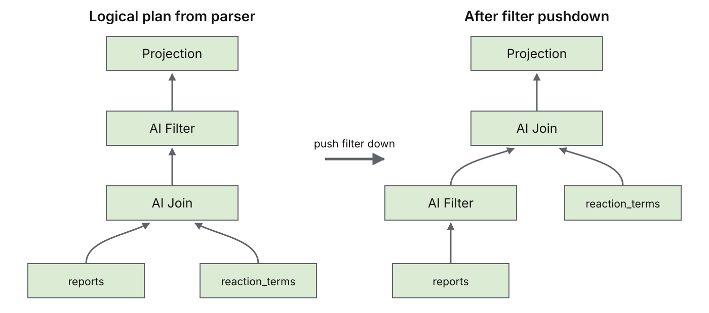
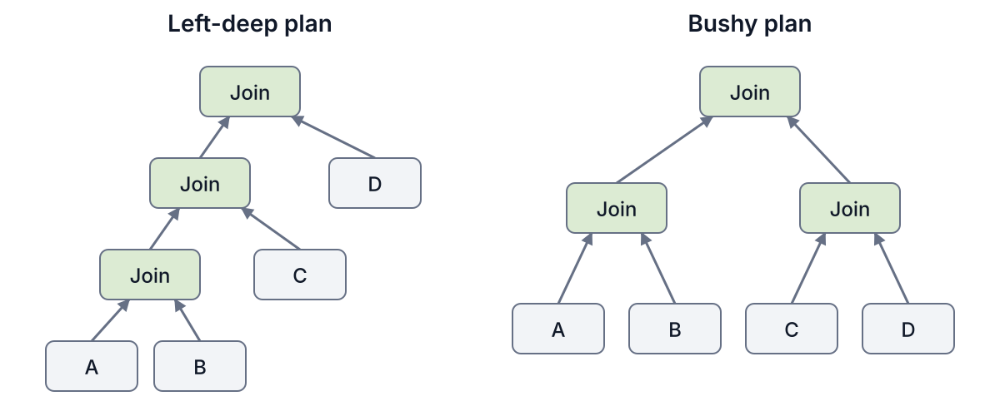

# Working title and thesis

- The working title is, "Quail, a Query Aware Inference Layer for AI-SQL."
- The main point is that, after an AI-SQL optimizer has removed every model call it can, executing the calls that remain is still a database systems problem.
- We will make that point through one BioDEX query, first by running it with vLLM, then by looking at what the query knows that vLLM does not.

# 1. A new class of inference workloads

- For decades, database users have struggled to analyze unstructured text at scale. SQL is primarily good for structured, relational data.
- Now, thanks to LLMs, database users can finally unlock insights from unstructured text columns.
- Major database vendors now support AI-SQL, including [Snowflake Cortex AISQL](https://docs.snowflake.com/en/user-guide/snowflake-cortex/aisql), [BigQuery AI functions](https://cloud.google.com/blog/products/data-analytics/sql-reimagined-for-the-ai-era-with-bigquery-ai-functions), and [Databricks AI Functions](https://docs.databricks.com/aws/en/large-language-models/ai-functions).
- AI-SQL extends SQL with AI-powered operators, such as filters, joins, and classifiers.
- In an AI-powered operator, the user simply specifies what they want in natural language, and LLMs are used to evaluate that instruction over the relevant data.
- For example, imagine that a user has one table of medical reports, and another table of possible adverse reactions.[^biodex]
- The user wants to identify which reactions each report attributes to the patient, but only for reports that describe female patients. They might run the following AI-SQL query:

```sql
SELECT r.id, m.id
FROM reports AS r
JOIN reaction_terms AS m
  ON AI_FILTER(PROMPT(
       'Does the medical report in {0} describe the reaction in {1} as something the patient experienced?',
       r.report,
       m.term
     ))
WHERE AI_FILTER(PROMPT(
        'Does {0} describe a case involving a female patient?',
        r.report
      ));
```

- At a high level, the database compiles this query into a plan that invokes an LLM on *each row* for the filter, then makes another LLM call on *each pair of rows* in the join.
- Query execution can therefore be incredibly costly, because a filter over $n$ rows requires $n$ LLM calls, while a naive join between tables with $n$ and $m$ rows requires $n \times m$ LLM calls.
- The database community has proposed a number of logical optimizations that reduce the number of LLM calls, for example, by pushing filters below joins, reordering predicates, choosing cheaper implementations, or pruning candidate pairs [[1]](https://arxiv.org/abs/2512.02289) [[2]](https://arxiv.org/abs/2505.14661) [[3]](https://arxiv.org/abs/2407.11418) [[4]](https://arxiv.org/abs/2512.05399) [[5]](https://cloud.google.com/blog/products/data-analytics/more-than-100x-faster-and-cheaper-llm-powered-sql-queries-with-proxy-models).
- All of these optimizations operate at the logical layer, where the goal is to choose a query plan that makes as few LLM calls as possible.
- But still, the resulting query plans can end up needing hundreds of thousands, or even millions, of LLM calls.

[^biodex]: The example is based on the [BioDEX dataset](https://aclanthology.org/2023.findings-emnlp.896/).

# 2. Challenges of executing AI-SQL queries

## Executing the query with vLLM

- Once the database has a logical query plan, an obvious way to execute the remaining LLM calls is to send them to vLLM.
- For each report in the filter, and each report and reaction pair in the join, the database renders a prompt and submits it as a separate vLLM request.
- vLLM uses continuous batching, which combines tokens from many requests into one model forward pass on the GPU.
- While processing a prompt, the model produces key and value state, called KV, which can be reused when a later prompt begins with the same tokens.
- vLLM automatically keeps completed KV blocks in GPU DRAM, and evicts them in least recently used order when the cache becomes full.
- Both optimizations should help with the query above, because it provides hundreds of thousands of ready requests, and many join prompts begin with the same medical report.

- Let's try to use vLLM to execute the query plan below, where the filter finishes before the join begins.

{width=90%}

- We place the long medical report first in every join prompt, and call this first document the anchor.
- The anchor KV can be reused across many pairs, because every prompt for that report begins with the same tokens.
- We run Qwen3 4B FP8, with BF16 KV, on one H100, over 500 medical reports, averaging 4,066 tokens each, and 1,127 reaction terms, averaging 4.8 tokens each.
- With this setup, there are two big inefficiencies.

## Issue #1: KV Regret

- Let us first look at what happens during the filter.
- The filter has 55 percent selectivity, which means 45 percent of the reports are rejected, and their KV will never be used again in this query.
- Unfortunately, vLLM stores KV from every filter request, and, once the cache fills, evicts the least recently used blocks.
- As a result, vLLM can evict KV for reports that will clearly be used in the downstream join, and the evicted reports' KV must then be computed again during the join.
- We call this extra work _KV regret_, which counts the fresh tokens spent recomputing a document prefix that the same query computed earlier.
- Our vLLM implementation incurs 1.08 million KV regret tokens on this query.
- Moreover, vLLM stores KV for every token in each prompt, even when future requests will reuse only the document prefix.
- The waste is small in our query, because the reaction terms are short, but it could be much larger if both tables contained long documents.

## Issue #2: High Host Overhead

- Now, consider the join, which submits hundreds of thousands of report and reaction pairs to vLLM as separate requests.
- The profiler trace below shows the resulting GPU bubbles during the BIO-3 join.

[{width=100%}](figures/bio3_join_window.pdf)

*The BIO-3 trace shows short bursts of GPU work, followed by longer idle intervals. The lower panel shows vLLM scheduler and PyTorch or CUDA operations on the CPU, aligned to the same timeline.*

- More than 99 percent of the prompt tokens are served from the prefix cache, so very little model computation remains for most requests.
- The GPU therefore finishes each batch quickly, while the CPU still has to process and schedule every request in the next batch.
- When the next batch is not ready, the GPU sits idle, even though hundreds of thousands of pairs are waiting.
- The GPU may also use its arithmetic units poorly while a batch is running (low MFU), but that is a separate problem, and we do not address it here.
- Modal's discussions of [GPU kernel utilization](https://modal.com/blog/gpu-utilization-guide) and [host overhead](https://modal.com/blog/host-overhead-inference-efficiency) provide useful background here.

TODO: ention speed of light estimate and how far off we are??

# 3. Introducing Quail

- To address these problems, we built Quail, which stands for Query Aware Inference Layer.
- Quail is an open source query engine for AI-SQL.
- In this post, we describe the design of Quail at a high level, and explain how you can get started using it.

# 4. How Quail works

- At a high level, Quail consists of a query frontend, a query planner, and an execution engine.
- Each part is extensible, so another package can add data sources and query operators, planning rules, execution backends, models, or hardware specifications.
- Through the frontend, the user provides the input Arrow tables or datasets and an AI-SQL or Python query, and selects the model and GPU.
- The frontend creates a logical plan from the query.
- The query planner uses the logical plan, model, and GPU to order filters and joins, and choose the token budget for each model forward pass.
- The planner then lowers the logical plan into a physical operator plan, which specifies the packed filters, anchored joins, and ordinary relational operators that the execution engine will run.

{width=100%}

## Query frontend

- Users begin by creating a `quail.Session`, and registering one or more datasets under table names.
- Quail accepts both Arrow tables, which hold the input in memory, and Arrow datasets, which scan the input in batches.
- Users can then write the query in AI-SQL, or construct the same query through Quail's Python query builder.
- Quail uses SQLGlot to parse AI-SQL, and supports both Snowflake's `AI_FILTER` syntax and BigQuery's `AI.IF` syntax.
- For the remainder of this post, we refer to both forms as `AI.IF`.
- The current release supports AI-powered filters and joins, as well as relational limits and projections.
- The same `AI.IF` operator is used for filters and joins, with the following signatures.
- `AI.IF` accepts a prompt, and an optional second argument with information that Quail uses for planning.

```text
Filter:
AI.IF(
    PROMPT(instruction, document),
    {'selectivity': s}
)

Join:
AI.IF(
    PROMPT(instruction, left_document, right_document),
    {'selectivity': s, 'anchor': table_alias}
)
```

- `selectivity` is the expected fraction of documents or document pairs that will pass, and, when it is not provided, Quail executes the predicates in the order they were written.
- For a join, `anchor` optionally names the table whose document appears first in the prompt, and whose KV is reused across pairs.
- The Python interface exposes the same operators through `.ai_filter(...)`, `.ai_join(...)`, `.limit(...)`, and `.select(...)`, which can be chained much like pandas operations.
- When creating the `quail.Session`, users also choose the model and number of GPUs.
- Quail currently supports Qwen3 4B FP8 and Qwen3 32B FP8 on H100 GPUs, and its extension interface makes it straightforward to add another model or device.

## Query planner

- In the example query earlier in this post, we took a good plan for granted. It is pretty straightforward to realize that we should run the filter before the join, to reduce the overall work that needs to be done.
- However, planning a query with multiple filters and joins is not as straightforward.
- Given the logical plan produced by the parser, we do the following:
  1. We assemble some basic statistics: we read the row count for each input dataset, and draw a random sample, to estimate the average document length in tokens.
  2. We use these statistics, along with the selected model and GPU, to choose how many tokens to process in each model forward pass. We reserve enough GPU HBM (i.e., DRAM) for temporary activations, and assign the remaining space to a KV cache.
  3. We push all filters down to their source datasets, so documents that fail a filter do not enter a later join.
  4. We order the filters on each dataset, based on their selectivities and estimated execution costs.
  5. We choose the join order and the anchor for each join.

{width=100%}

- We will go into a bit more detail on Steps 2, 4, and 5.

### Choosing the forward pass size

- A model forward pass is one run of the model over a batch of tokens on the GPU.
- We want to process as many tokens as possible in each forward pass, because a larger batch means the CPU prepares and submits fewer batches.
- We increase the batch size until either its temporary activations would no longer fit in GPU HBM, or a GPU kernel could no longer index the resulting tensor.
- We reserve enough GPU HBM for the temporary activations of two batches, so the CPU can prepare the next batch while the current batch is in flight on the GPU, and assign the remaining HBM to serve as the KV cache.

### Ordering filters

- In 1993, [Hellerstein and Stonebraker](https://dsf.berkeley.edu/jmh/miscpapers/sigmod93.pdf) showed that expensive predicates over one table can be ordered optimally with a simple rank formula.
- For each filter $i$, let $\sigma_i$ be its provided selectivity, or the fraction of documents expected to pass, and let $c_i$ be the cost of evaluating the filter on one document.
- Their rule orders filters by increasing rank:

$$
\rho_i = \frac{c_i}{1 - \sigma_i}.
$$

- A low rank favors a filter that is cheap, rejects many documents, or both, because running it early prevents more expensive filters from seeing those documents.
- For an LLM filter, $c_i$ depends on the document length, the filter prompt length, the selected model and GPU, the chosen forward pass size, and whether the document KV is already in GPU HBM.
- Let $d$ be the average number of tokens in the document prefix, and let $p_i$ be the number of tokens that filter $i$ adds after the document.
- We call a token fresh when we have to run the model on that token and write its KV, rather than reuse KV that is already in HBM.

$$
c_i^{\mathrm{fresh}}
= \operatorname{SOL}(d + p_i\text{ fresh tokens}),
\qquad
c_i^{\mathrm{cached}}
= \operatorname{SOL}(p_i\text{ fresh tokens attending to }d\text{ cached tokens}).
$$

- For an order $\pi$ over $m$ filters and $N$ input documents, the expected cost of the full filter sequence is:

$$
C_{\mathrm{filters}}(\pi)
= N\left[
c_{\pi_1}^{\mathrm{fresh}}
+ \sum_{k=2}^{m}
\left(\prod_{j=1}^{k-1}\sigma_{\pi_j}\right)
c_{\pi_k}^{\mathrm{cached}}
\right].
$$

- The product of the preceding selectivities is the expected fraction of documents that reach filter $\pi_k$.

- To calculate $\operatorname{SOL}$, we first count four kinds of work: fresh tokens, attention pairs, KV tokens written, and KV tokens read.
- We translate the counts in a work vector $w$ into FLOPs and HBM traffic for each model component, and calculate its time as:

$$
\operatorname{SOL}(w) = \sum_k \max\left(
\frac{\mathrm{FLOPs}_{k}(w)}{\mathrm{arithmetic\ throughput}_k},
\frac{\mathrm{bytes}_{k}(w)}{\mathrm{HBM\ bandwidth}}
\right).
$$

- The maximum accounts for whether each model component is limited by arithmetic or memory, and the sum accounts for the components that run one after another.
- The speed of light estimate assumes peak hardware throughput and excludes software overhead. For filter ordering, we also assume an "infinite" KV cache, so document KV is never evicted between filters. We do not get into the full model in this post, and we will cover it in a follow up post.
- Only the first filter has to compute the document KV, so we try each filter in the first position and charge it $c_i^{\mathrm{fresh}}$.
- For each choice of first filter, we order the remaining filters by the cost of computing their prompt against the cached document KV, divided by $1 - \sigma_i$. We choose the filter order with the lowest expected cost over the full sequence.

### Ordering joins and choosing anchors

- After ordering the filters, we still have to choose the join order, and, for each join, which input should be the anchor, and which should be the partner.
- The join order determines how many documents reach each later join. The anchor is the document placed first in the prompt, so the anchor choice determines which document KV can be reused across many pairs.
- For a join between inputs $A$ and $B$, with $A$ as the anchor, we estimate the following cost:

$$
c(A \rightarrow B) = \operatorname{SOL}\left(
n_A w_{\mathrm{anchor}}(A)
+ n_A n_B w_{\mathrm{partner}}(B \mid A)
\right).
$$

- Here, $n_A$ and $n_B$ are the estimated numbers of documents that reach the join.
- The anchor work, $w_{\mathrm{anchor}}(A)$, prepares the prefix once for each document in $A$, while the partner work, $w_{\mathrm{partner}}(B \mid A)$, appends one document from $B$ to that prefix, and produces an answer for the pair.
- If the document KV for $A$ is already in HBM, the anchor work only computes the join prompt tokens that follow the document. Otherwise, it also computes the document prefix.
- As with filters, we count fresh tokens, attention pairs, KV tokens written, and KV tokens read, and use the speed of light model to convert the total work into an ideal execution time for the selected model and GPU.
- We do not get into the full cost model here, and will explain it in a follow up blog post.
- We estimate the reverse direction, $c(B \rightarrow A)$, as well, because changing the anchor changes which work is paid once per document, and which work is paid once per pair.
- Let $\sigma_{AB}$ be the provided selectivity of the join, or the expected fraction of document pairs that pass.
- Assuming that pair outcomes are independent, we estimate the surviving documents on each side as:

$$
n_A' = n_A\left(1 - (1 - \sigma_{AB})^{n_B}\right),
\qquad
n_B' = n_B\left(1 - (1 - \sigma_{AB})^{n_A}\right).
$$

- We use $n_A'$ and $n_B'$ when costing the joins that follow.

- Given these costs, we search for the join order, and the anchor choices, with the lowest estimated total execution time.
- In 1979, [Selinger et al.](https://doi.org/10.1145/582095.582099) introduced the System R query optimizer, which searches left deep join plans with bottom up dynamic programming.
- In a left deep plan, each join adds one base dataset to the intermediate result built so far. A bushy plan can instead join two intermediate results.

{width=90%}

- Starting with one dataset at a time, the System R algorithm builds plans over two datasets, then three, and so on.
- System R usually keeps only the cheapest partial plan for each subset of datasets.
- Selinger et al. also keep a more expensive partial plan when it produces rows in an ["interesting order"](https://doi.org/10.1145/582095.582099), because a later join or sort may be able to use that order.
- We adapt the same idea to cached KV, and treat the KV left in HBM as an "interesting property" of a partial plan.
- At a high level, we consider each possible anchor as we build a larger plan, and keep separate partial plans when they leave different useful KV in HBM.
- The chosen plan specifies the join order, the anchor for each join, and which dataset KV the execution engine should retain for a later join.
- We will describe the exact algorithm, the dynamic programming state, and the pruning rules in an upcoming technical report.

## Execution engine

- The planner lowers the logical plan into a graph of physical operators, which specifies how each part of the query will run.
- Every dataset begins with a `Document Input` operator, and, if the dataset has AI filters, the planner places one `Packed Filter` operator above it.
- A `Packed Filter` represents the conjunction of all AI predicates on one dataset, and evaluates them as an ordered chain, stopping for a document after the first `FALSE` answer.
- Each group of consecutive AI joins that uses the same anchor becomes one `Anchored Join` operator, which evaluates the joins while reusing that anchor's KV.
- An `Anchored Join` evaluates an AI predicate, and returns the tuple IDs for the pairs that passed.
- The operator does not copy the input columns, or construct the result rows on the GPU.
- After the model operators finish, we use the tuple IDs to materialize the requested columns on the CPU, as a stream of Arrow record batches.

{width=100%}

- The physical plan executor visits an operator after its inputs are available, and calls the runtime registered for that operator type.
- For a `Packed Filter` or `Anchored Join`, the runtime repeatedly packs the next chunk of tokens, manages its KV pages, and runs a model forward pass, until the operator has finished.
- For ordinary relational operators, the runtime performs the corresponding Arrow work on the CPU.
- This is the scheduler's job inside a model operator: it decides which documents or pairs enter the next packed chunk, rather than scheduling hundreds of thousands of independent inference requests.

### Executing filters

- For a dataset with several filters, we keep one queue of documents that have not started, and another queue of documents that passed one filter and are ready for the next.
- For each forward pass, we first pack documents that are ready for their next filter, then use the remaining token budget for documents that have not started.
- The CPU packs the next chunk while the current chunk runs on the GPU, and reads the previous answers without stopping the current forward pass.
- When a document fails, we stop evaluating its remaining filters, release its KV pages, and omit its identifier from the filter operator's output.
- When a document passes the final filter, we retain its document KV only if the physical plan uses the document as an anchor later.

### Managing the KV cache

- We store KV in a preallocated set of fixed size pages in GPU HBM, using the amount of memory assigned by the planner.
- While an operator is using a document prefix, its pages cannot be evicted.
- At each operator boundary, we use the physical plan and the provided selectivities to estimate whether each document prefix will reach another join, and when that join will run.
- When we retain a prefix, we rewind its KV to the end of the document, so filter instructions and completed join prompt tokens do not remain in HBM.
- For each retained document prefix $d$, we calculate the following retention value:

$$
V(d) =
\frac{
P(d\text{ reaches its next use})
\times \operatorname{SOL}(\text{recompute }d)
}{
\operatorname{KVPages}(d)
}.
$$

- The numerator is the expected time saved if the prefix remains in HBM, and the denominator is the number of KV pages that it occupies.
- When the KV cache needs more pages, we evict the prefix with the smallest $V(d)$. If two prefixes have the same value, we evict the one whose next use is later.
- A document that fails a filter has no next use, so we release its pages immediately.

### Executing joins

- For each join, the physical plan specifies the anchor, the other input, and the token budget for each forward pass.
- We group consecutive joins that use the same anchor, so the anchor KV remains available across the joins.
- We divide the anchors into groups that fit in the KV cache.
- Within each group, we compute or read each anchor once, then pack as many documents from the other input as fit in the forward pass.
- vLLM represents every document pair as a separate sequence in the batch, so its block table contains one row for each pair.
- Automatic prefix caching stores one copy of an anchor's KV, but several block table rows can refer to the same KV pages.
- Before we pack a batch, we group all document pairs that share an anchor. Our block table contains one row for each anchor, and all query tokens for that anchor belong to the same row.

{width=100%}

THIS DIAGRAM ABOVE IS NOT GOOD. I PLAN TO FIX

- If the pairs for one anchor do not fit in one forward pass, we keep its KV pages, and continue with the remaining pairs in the next forward pass.
- After each join, we release anchors that produced no matches, and keep an anchor only when a later join will use it.
- Each join returns the tuple IDs that pass the predicate, which we use to materialize the query result on the CPU.

### Running the model

- Most of the model forward pass is the same as in vLLM, because we load the model through vLLM and use its DeepGEMM kernels for the main matrix multiplications.
- vLLM can use [cascade attention](https://github.com/vllm-project/vllm/blob/v0.26.0/vllm/v1/attention/backends/flash_attn.py#L1397) when every sequence in a batch begins with the same prefix. A join batch can contain several anchors, so no anchor is shared by the entire batch.
- To process several anchors in one batch, we run the following operations at every transformer layer:
  1. We use [FlashAttention 3](https://arxiv.org/abs/2407.08608) to compute causal attention over the part of each prompt after the anchor.
  2. We use the paged form of the same FlashAttention 3 kernel to compute attention from those tokens into the anchor KV.
  3. We merge the two partial attention outputs, using the log sum exp value returned by each call.
- If attention over the rest of the prompt returns $o_r$ and log sum exp $\ell_r$, and attention into the anchor returns $o_a$ and $\ell_a$, the full attention output is:

$$
o =
\frac{e^{\ell_r}o_r + e^{\ell_a}o_a}
     {e^{\ell_r} + e^{\ell_a}}.
$$

- The anchor and the rest of the prompt contain disjoint sets of keys and values, so this weighted merge is exactly the result of applying softmax attention to the full prompt.
- [Hydragen](https://arxiv.org/abs/2402.05099) uses the same shared prefix decomposition, and [FlashInfer's recursive attention](https://docs.flashinfer.ai/tutorials/recursive_attention.html) describes the attention state and merge rule directly.
- We fuse the merge with the FP8 quantization for the following output projection, so the new path adds one fused kernel around the two FlashAttention 3 calls.
- We also fuse several small operations around normalization, activation, RoPE, and quantization, which reduces the number of GPU kernel launches.
- After the final model layer, a standard language model output head would compute one score for every token in the vocabulary.
- Filters and joins only need to choose between `TRUE` and `FALSE`, so we select the corresponding rows of the output matrix, and compute only those scores.

### Using multiple GPUs

- Quail supports one, two, four, or eight H100s in one Modal container, with one model copy and one KV cache per GPU.
- For filters, we divide documents across GPUs, based on their token lengths.
- For joins, we divide anchors across GPUs, and make the documents from the other input available to each GPU.
- The CPU combines the filter survivors and join results after each stage.

# 5. Where Quail wins, and where it does not

TODO: This section and section 6. don't read the rest here ... wehave a lot more to unpack.

## How close can we get to the required model work

- We evaluate each engine by asking a simple question, after fixing the logical plan and prompt layout, how close does execution get to the model work that the query requires.
- We call the lower bound the speed of light estimate, and it counts ideal model computation and KV memory traffic, with unlimited space for reusable prefix KV.
- The estimate uses the reference survivors and an ideal supported join plan, so it is a lower bound, not an executable system.
- Different engines can produce different Boolean answers, which changes downstream cardinalities, so some measured distance from the estimate comes from different work, rather than systems overhead.
- Every configuration uses Qwen3 4B FP8 and one H100, and we compare Quail with stock vLLM, pipelined vLLM, and pipelined SGLang.
- Across the current 32 query QUAIL B suite, Quail is faster than stock vLLM on 30 comparable queries.

## BioDEX, where query aware execution helps

- On the BioDEX query from the opening, Quail takes 89.92 seconds, stock vLLM takes 515.30 seconds, and pipelined vLLM takes 510.91 seconds.
- Quail is 5.73 times faster than stock vLLM, even though vLLM has 32.4 percent more KV capacity in this configuration.
- The speed of light estimate is 43.09 seconds, so Quail is 2.09 times the estimate, while stock vLLM is 11.96 times the estimate.
- Quail processes 7.55 million fresh input tokens, compared with 7.88 million for stock vLLM, and recomputes 0.92 million reusable prefix tokens, compared with 1.08 million for stock vLLM.
- A 5.73 times latency gap is not explained by a 4 percent difference in fresh tokens, which brings us back to packed execution and the bubbles between GPU bursts.

## Agent traces, where content based reuse wins

- Quail does not win every time, and the SWE Next agent traces show exactly what it is missing.
- Each row in this workload is a cumulative snapshot from a software agent trajectory, so many different rows begin with the same long token sequence.
- vLLM's content addressed prefix cache recognizes that shared content, even though the rows have different identities.
- Quail currently keys retained KV by document identity, so it misses reuse when the content of one row is a prefix of another row.
- On AGENT 1, Quail takes 240.49 seconds, stock vLLM takes 102.35 seconds, and pipelined vLLM takes 99.15 seconds.
- Quail processes 17.39 million fresh input tokens, while stock vLLM processes 5.53 million, so the loss has a concrete mechanism, and is not mysterious benchmark noise.
- A content addressed KV cache is therefore important future work, but its lookup and bookkeeping cannot restore the per request overhead that Quail removed.

# 6. Getting started

- A Quail query can start from an Arrow table in memory, or from Parquet data on S3 or GCS.
- The example below registers an S3 dataset, runs an `AI_FILTER`, and returns an Arrow result.

```python
import modal
import quail

compute = quail.ModalComputeProvider(
    secrets=(modal.Secret.from_name("quail-s3"),),
)
session = quail.Session(compute_provider=compute)
session.register(
    "documents",
    quail.DocumentProvider.from_parquet(
        "s3://my-bucket/documents.parquet",
        id_col="document_id",
    ),
)

result = session.sql("""
    SELECT d.document_id
    FROM documents AS d
    WHERE AI_FILTER(
        PROMPT('Does {0} describe an adverse event?', d.text)
    )
""").run()

result.explain_analyze()
```

- Quail parses the query locally, sends the logical plan and source description to Modal, reads only the required columns on the worker, and returns Arrow results.
- The published version will link the repository, installation instructions, API reference, and QUAIL B reproduction commands.

# 7. What comes next

- The immediate language work is to add operators such as `AI_EXTRACT` and `AI_CLASSIFY`, which need outputs richer than the current Boolean path.
- Qwen3 4B FP8 and Qwen3 32B FP8 already run today, and the next model work is to support more architectures, especially hybrid models such as Qwen3.5 and Liquid models.
- The next hardware work includes Blackwell GPUs, and an Apple Silicon backend, including M5 MacBooks.
- A local backend could let Claude Code and other coding agents write AI-SQL over private data, then execute the query without provisioning a server GPU.
- Quail already supports up to eight data parallel H100 model copies in one container, so the remaining distributed work includes multiple containers, larger GPU counts, and model sharding when one copy no longer fits on one GPU.
- We want content addressed KV caching across rows, especially for cumulative agent traces, without adding expensive bookkeeping at hundreds of thousands of evaluations.
- We want to study fine tuning as part of query planning, so the engine can choose a model whose cost and accuracy fit a particular operator and data distribution.
- We want better model FLOPs utilization for the unusual mix of large prefills, shared prefixes, and one token Boolean outputs, which is another reason we would like to meet those kernel gods.
- We also want models whose answers remain stable when the two join inputs swap positions, because anchor choice should ideally change performance, not query semantics.
- More implementation posts, and a technical report, are coming soon.
- For now, please try Quail, tell us where it breaks, and reach out if you want to work on this research with us.
- We are hiring PhD students and postdocs.

# Notes before publication

- The SQL example should use the exact syntax accepted by the public Quail release.
- Figure 1 should turn the query plan sketch into a proper diagram, and show the filter below the join, the materialized survivor relation, and the long medical report as the join anchor.
- Figure 2 should show vLLM retaining blocks from the full filter prompt, while Quail releases failed rows and keeps only useful survivor prefixes.
- Figure 3 should show the current FEV 9 CPU and GPU trace, unless we collect an equivalent BioDEX trace.
- Figure 5 should compare BioDEX latency and token work, with the speed of light estimate labeled as an estimate.
- Figure 6 should compare AGENT 1 latency and fresh tokens, and label the shared row prefix reuse that vLLM captures and Quail misses.
- The benchmark pass should pin the public commit, model revision, vLLM and SGLang versions, Modal GPU type, memory settings, prompt templates, anchor choices, and startup policy.
- The benchmark pass should report exact request counts and observed selectivities from each backend, because different model answers can change downstream work.
- The final version should link the repository, installation page, API reference, QUAIL B reproduction commands, and one issue or discussion page for feedback.
