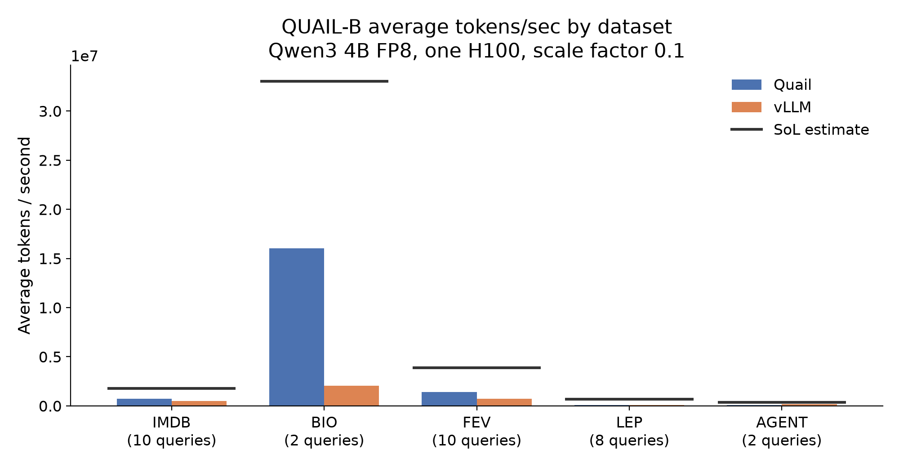
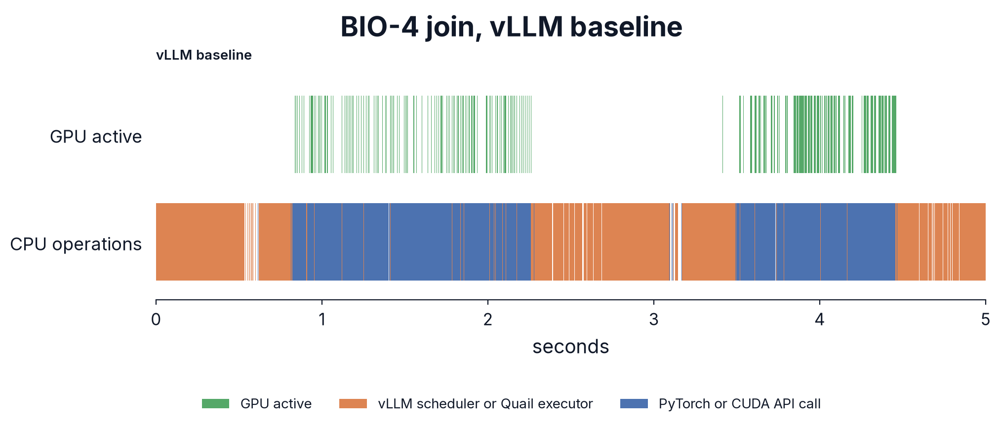
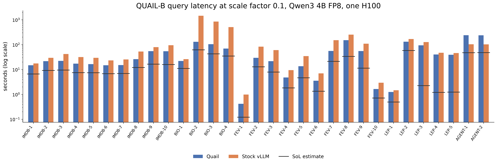
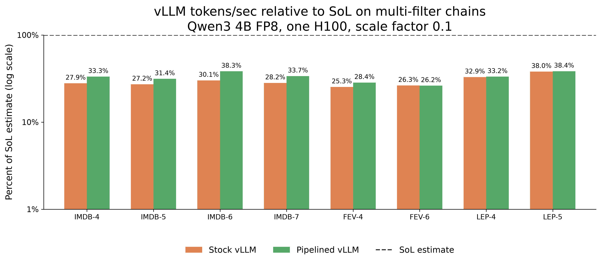
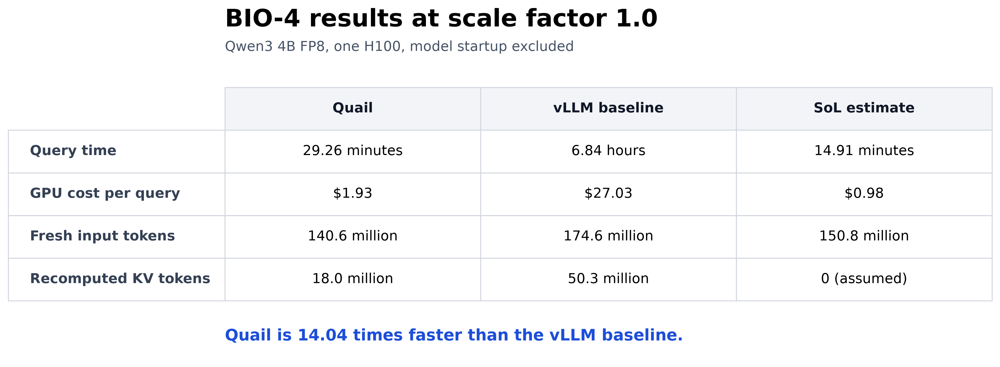
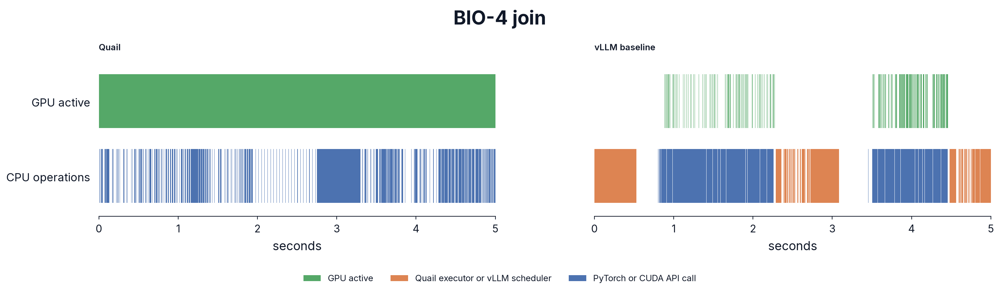

::: {.tldr}
**TL;DR.** Much of today's AI-SQL work (i.e., AI functions in SQL databases) uses closed, frontier LLMs served through APIs. But open weight models now provide sufficient quality for many AI functions --- and, in turn, unlock new optimizations that make query execution 10× faster. The database community should absolutely move more of these workloads to open weight models, and optimize inference together with query execution. Quail is a system we are building to jointly optimize query planning and inference.
:::

::: {.figure-block .wide-figure}
[{width=100%}](figures/quailb_tok_per_sec.pdf)

*Figure 1. Average requested input tokens per second on QUAIL-B at scale factor 0.1, using Qwen3 4B FP8 on one H100, as a percent of each dataset's SoL estimate. The top of the axis is 100% of SoL. The vertical axis uses a log scale. SoL is the optimistic lower bound on runtime from GPU arithmetic and memory traffic. Each bar is the dataset's mean tokens per second divided by its mean SoL tokens per second. The label above each Quail percent is that bar's mean tokens per second. The averages use all 31 current queries.*
:::

# 1. The growth of AI-powered data processing

For decades, database users have struggled to analyze unstructured text at scale.
SQL, our good old language, and corresponding relational database systems weren't really great for this.
But now, thanks to LLMs, database users can finally unlock insights from unstructured text columns.
Major database vendors now support AI-SQL, including [Snowflake Cortex AISQL](https://docs.snowflake.com/en/user-guide/snowflake-cortex/aisql), [BigQuery AI functions](https://cloud.google.com/blog/products/data-analytics/sql-reimagined-for-the-ai-era-with-bigquery-ai-functions), and [Databricks AI Functions](https://docs.databricks.com/aws/en/large-language-models/ai-functions).
AI-SQL extends SQL with AI-powered operators, such as filters, joins, and classifiers.

In an AI-powered operator, the user simply specifies what they want in natural language, and LLMs are used to evaluate that instruction over the relevant data.
Query execution can be costly. A filter over $N$ rows requires $N$ LLM calls, while a naive join between tables $A$ and $B$, with $n_A$ and $n_B$ rows, requires $n_A n_B$ LLM calls.

The database community has proposed a number of logical optimizations that reduce the number of LLM calls, for example, by pushing filters below joins, reordering predicates, choosing cheaper implementations, or pruning candidate pairs [[1]](https://arxiv.org/abs/2512.02289) [[2]](https://arxiv.org/abs/2505.14661) [[3]](https://arxiv.org/abs/2407.11418) [[4]](https://arxiv.org/abs/2512.05399) [[5]](https://cloud.google.com/blog/products/data-analytics/more-than-100x-faster-and-cheaper-llm-powered-sql-queries-with-proxy-models).
But still, the resulting query plans can end up needing hundreds of thousands, or even millions, of LLM calls.

# 2. Key idea: let's jointly optimize query plans and inference


A natural thought is to use a general-purpose inference engine such as vLLM to execute the query plan. However, sending millions of related model calls to vLLM as separate requests has a large cost. Consider the following query.

*Given a dataset of medical reports and a dataset of possible adverse reactions, find serious adverse event reports that mention both a cardiovascular reaction and a neurological reaction.*[^biodex][^bio4-sql]

We call this query BIO-4 in [QUAIL-B](https://github.com/fsdatalab/quail-bench), a benchmark we are building to evaluate AI-SQL query engines. At scale factor 1.0, its inputs contain 5,000 reports and 4,144 reaction terms, with the terms used through two aliases. The plan in Figure 2 works as follows:

1. It filters the reports for serious adverse events.
2. It filters the two reaction term inputs for cardiovascular and neurological reactions.
3. It joins the surviving reports with the cardiovascular terms, then with the neurological terms.

::: {.figure-block}
[{width=100%}](figures/vllm-query-plan.svg)

*Figure 2. The BIO-4 plan filters all three inputs before the joins. Both joins use the medical report as the anchor.*
:::

To execute the plan with vLLM, we render one prompt for each filter input and one prompt for each candidate report and reaction pair. We submit every prompt as a separate inference request. We place the document text at the beginning of each prompt, followed by the instruction from the AI-SQL operator. For each join, we place the much longer medical report first as the *anchor* and the reaction term second as the *partner*. This order maximizes reuse of the prefix's key and value state (KV) across join prompts.

**A cost estimate for the query plan.** Before measuring pipelined vLLM, we estimate the lowest possible runtime for the same plan. We count the model's arithmetic work and HBM traffic from the token lengths, then use a [roofline model](https://modal.com/gpu-glossary/perf/roofline-model) to estimate the time. The estimate uses the saved reference answers to determine which rows survive each stage. It assumes peak GPU throughput, full overlap between CPU and GPU work, and unlimited space for retained KV. No implementation can meet all of these assumptions, so this optimistic lower bound is our *speed of light estimate*, or SoL. For BIO-4 at scale factor 1.0, the SoL estimate is 894.37 seconds, or 14.91 minutes.[^mfu] The [implementation in Quail](https://github.com/fsdatalab/quail-exploration/blob/0d24478a82100b518d6110f5c1c8cec0c26c6487/quail/planner/sol.py) contains the full calculation.

**How we hoped vLLM would perform.** Each request produces one token constrained to `TRUE` or `FALSE`, so almost all model work is prefill. BIO-4 compiles to millions of requests, so there should always be a large batch ready for the H100. With a large enough batch, vLLM should keep the H100 busy.

**How vLLM actually performs.** We run vLLM 0.26.0 with Qwen3 4B FP8 on one H100. We give it enough batch capacity to use the GPU. The query takes 6.84 hours, or 27.55 times the SoL estimate!

During a join, the GPU-active row in Figure 3 shows long white gaps between short green bursts. After each batch finishes, the GPU sits idle while the host prepares the next wave of requests. Those idle gaps are the bubbles.

BIO-4 turns its joins into separate requests for every candidate report and reaction pair. Each request must be scheduled, admitted into a batch, and tracked, even when most of its document prefix comes from the prefix cache. While the CPU does that bookkeeping, the H100 often has nothing ready to run. That host overhead appears as white space in Figure 3.[^host-overhead]

::: {.figure-block .wide-figure}
[{width=100%}](figures/bio4_vllm_bubbles.pdf)

*Figure 3. Five-second midpoint of a BIO-4 join at scale factor 0.1 with pipelined vLLM. Green in the top row marks busy GPU kernels. The middle row shows scheduler and `execute_context` work. The bottom row shows PyTorch and CUDA API calls. White gaps on the GPU row are idle bubbles.*
:::

The corresponding Quail timeline appears with the BIO-4 experiments in Section 4.3.

The second problem is *KV regret*: the model processes tokens again after their reusable KV has been evicted. On BIO-4, pipelined vLLM recomputes 50.3 million KV tokens (out of 174.6 million fresh input tokens).

We can, and we should, reduce both sources of waste by optimizing inference for AI-SQL.

Quail addresses both problems together. Its query plan tells the execution engine which KV will be reused, and its larger planned batches avoid per-request scheduling on the critical path.

# 3. Introducing Quail

We are building Quail, an open source query engine for AI-SQL. Quail stands for Query Aware Inference Layer.

We will first show you how you can get started. To read about how Quail works, skip to [Section 3.2: Design details](#design-details).

## 3.1 Getting started with Quail

We can use Quail to run two AI filters over all 100,000 movie reviews in the [Stanford IMDB dataset](https://huggingface.co/datasets/stanfordnlp/imdb). We first download the reviews from Hugging Face, and load them into an Arrow dataset.

```python
import pyarrow as pa
import pyarrow.dataset as ds
from datasets import concatenate_datasets, load_dataset
import quail

imdb = load_dataset(
    "stanfordnlp/imdb",
    revision="e6281661ce1c48d982bc483cf8a173c1bbeb5d31",
)
all_reviews = concatenate_datasets([
    imdb["train"],
    imdb["test"],
    imdb["unsupervised"],
])
reviews = ds.dataset(pa.table({
    "review_id": pa.array(f"review-{i}" for i in range(len(all_reviews))),
    "review": all_reviews.data.table.column("text"),
}))
```

The query keeps reviews that discuss the movie's ending, and recommend watching the movie.

```python
# This Python process has access to one H100.
with quail.Session(
    config=quail.EngineConfig(gpus=1, device="h100-sxm"),
) as session:
    session.register(
        "reviews",
        quail.DocumentProvider.from_dataset(reviews, id_col="review_id"),
    )

    query = session.sql("""
        SELECT r.review_id
        FROM reviews AS r
        WHERE AI.IF(
            PROMPT(
                'Does this review discuss the ending of the movie?\n\n{0}',
                r.review
            ),
            -- Optional, but helps Quail reorder filters.
            {'selectivity': 0.25}
        )
        AND AI.IF(
            PROMPT(
                'Does the reviewer recommend watching the movie?\n\n{0}',
                r.review
            ),
            {'selectivity': 0.5}
        )
    """, dialect="bq")

    print(query.explain())
    result = query.run()
    table = result.collect()
```

Before running the query, `query.explain()` prints the logical and physical plans. The output below keeps only the parts that describe the two filters and their execution settings.

```text
logical:
  Project: r.review_id
    SemanticFilter
      predicate 1: discusses the ending (selectivity=25%)
      predicate 2: recommends the movie (selectivity=50%)
      Scan reviews as r [review, review_id]

physical: backend=quail, model=qwen3-4b-fp8, workers=1
  KV=bf16
  chunk budget=110,376 tokens
  admission budget=362,250 tokens
  Project: r.review_id (est. rows=12,500)
    AiFilter: r (est. rows=12,500; est. time=124 s)
      KV rewind=on
      predicate 1 (input rows=100,000; est. pass=25%)
      predicate 2 (input rows=25,000; est. pass=50%)
      Scan reviews as r (rows=100,000)
        tokens=29,926,924, mean_doc_tokens=299.3
```

The complete example in [`demos/imdb_ending_filter.py`](../../demos/imdb_ending_filter.py) prints the following results at the end of the run:

```text
matching reviews: 16057 of 100000
  stage evaluated 100000 reviews, 0.283 passed
  stage evaluated 28296 reviews, 0.568 passed
boot_s: 57.65 (cold)
token_wait_s: 0.0
wall_s: 277.41
total_s: 335.06 (boot + query)
fresh_tokens: 32499738
documents/second: 360.5
GPU price: $3.9492/GPU-hour (Modal)
GPU cost, including startup: $0.3675
```

The full run costs $0.3675 at [Modal's H100 price](https://modal.com/pricing), including model startup.[^imdb-disk]

**Comparing with GPT-5 nano.** At current GPT-5 nano prices, the same two-filter workload would cost about $1.7470, or **4.8 times the measured Quail cost!**[^gpt5-nano-cost] Qwen3 4B and GPT-5 nano may not return the same answers, so the cost of reaching the same answer quality could be different.

**Running on Modal.** If you don't have a dedicated GPU, you can put the whole query inside a Modal GPU function. The function creates a normal Quail session and runs it:

```python
import modal
import quail

app = modal.App("quail-engine")
IMAGE_REQUIREMENTS = (
    "sqlglot==30.17.0",
    "transformers==5.15.0",
    "huggingface-hub==1.27.0",
    "pyarrow==25.0.1",
    "numpy==2.3.5",
    "gigatoken==0.10.0",
    "datasets==5.0.1",
    "vllm==0.26.0",
)

image = (
    modal.Image.from_registry(
        "nvidia/cuda:13.0.1-devel-ubuntu24.04", add_python="3.12")
    .entrypoint([])
    .pip_install(*IMAGE_REQUIREMENTS)
    .add_local_python_source("quail")
)

@app.function(image=image, gpu="H100!", timeout=1200)
def run_query(sql, documents):
    with quail.Session() as session:
        session.register("docs", quail.DocumentProvider.from_table(
            documents, id_col="id",
        ))
        result = session.sql(sql).run()
        return result.collect(), result.report
```

Modal allocates the H100, and Quail plans and runs the query inside the function. A complete example is in [`demos/quickstart_modal.py`](../../demos/quickstart_modal.py).

Check out the [Quail documentation](https://fsdatalab.github.io/quail) to learn more.

## 3.2 Design details

This section describes Quail's main design ideas at a high level. We are still actively building Quail, and we will provide the full technical details in a future report.

We have three performance goals for Quail:

1. Minimize KV regret by retaining reusable KV.
2. Keep the GPU busy by reducing CPU scheduling overhead.
3. Reach high model FLOP/s utilization (MFU) while the GPU is active.

Our current evaluation focuses on the first two goals. Quail uses DeepGEMM, FlashAttention 3, and fused Triton kernels, but we do not yet measure MFU or tune the core matrix multiplication and attention kernels. We defer a full MFU study to future work.

As shown in Figure 4, Quail consists of a query frontend, a query planner, and an execution engine. Through the frontend, the user provides Arrow tables or datasets, an AI-SQL or Python query, and the model and GPU or GPUs to use. The frontend creates a logical plan from the query. The query planner orders the filters and joins, chooses the anchor for each join, and determines how many tokens each model forward pass should process. The planner then lowers the logical plan into a physical operator plan, which the execution engine runs.

Quail is extensible, and its design is inspired by [Apache DataFusion](https://datafusion.apache.org/), an open source, extensible analytical query engine. ~~Users~~ We, and you, can add new query operators, planning rules, execution backends, models, or support for other hardware.

::: {.figure-block .wide-figure}
[{width=100%}](figures/quail-architecture.svg?v=4)

*Figure 4. Quail turns Arrow data and an AI-SQL query into a logical plan. The planner applies SQL rewrites, lowers the AI operations into physical operators, and plans operator pipelines for KV reuse. The execution engine runs the physical plan and executes its AI operations on the GPU.*
:::

### 3.2.1 Query frontend

Users register data as an in-memory Arrow table or an Arrow dataset. Users can write queries in AI-SQL (we support Snowflake's `AI_FILTER` and BigQuery's `AI.IF`), or use a Python query builder similar to pandas. The current release of Quail supports AI filters and joins, along with relational projections and `LIMIT`.

Users define each [AI operator](https://fsdatalab.github.io/quail/docs/user-guide/sql#ai-operators) with a prompt and can provide optional planning information. The optional `selectivity` gives the expected fraction of documents or document pairs that will pass; without it, Quail keeps predicates in their written order. For a join, the optional `anchor` chooses which input comes first in the prompt for KV reuse; without it, the planner chooses the anchor.

Users can specify the model and GPU count. Quail currently supports Qwen3 4B FP8 and Qwen3 32B FP8 on H100 GPUs, but other models and hardware can be added through the extension interface.

Each AI-SQL query is parsed with SQLGlot into a logical plan and passed to the query planner.

### 3.2.2 Query planner

**Goal.** Our query planner has two goals: minimize KV regret and choose the lowest-cost operator order.

**Overview.** Given the logical query plan, we do the following:

1. **Dataset statistics.** We estimate the document lengths and basic statistics for each input dataset.
2. **Forward pass and KV limits.** From the selected model and GPU, we choose how many tokens to process in each model forward pass and calculate the fixed KV capacity.
3. **SQL query rewrites.** We push down projections and filters, order the filters, and choose the join order and anchor for each join.
4. **Inference-specific query rewrites.** We lower AI operations into physical operators and plan pipelines that preserve reusable KV.

We describe these steps at a high level, in turn.

**Dataset statistics.** We estimate the row count, average document length, and maximum document length for each input dataset.

**Forward pass and KV limits.** From the selected model and GPU, we set the maximum number of tokens for each model forward pass and calculate the fixed KV capacity. We reserve HBM for the model weights and two forward passes. This is more conservative than vLLM, which profiles one forward pass to determine how much activation memory to reserve. We use the remaining HBM for the KV cache, which is analogous to a database buffer pool.

**SQL query rewrites.** We push projections and filters down to the source datasets. We order filters using their estimated cost and selectivity, following extremely well-known prior work ([Hellerstein and Stonebraker](https://dsf.berkeley.edu/jmh/miscpapers/sigmod93.pdf) et al.). For joins, we use a [Selinger-style](https://doi.org/10.1145/582095.582099) search (i.e., System R) to choose the join order and anchor for each join. The cost model uses the speed-of-light estimate from Section 2. We will explain the calculation in a future post. For now, you can check out the [cost model code](https://github.com/fsdatalab/quail/tree/main/quail/cost).

**Inference-specific query rewrites.** After the SQL rewrites, we translate the logical plan into a DAG of physical operators. For example, the `AiFilter` physical operator evaluates AI predicates over documents, while `AiJoin` evaluates AI predicates over document pairs that share an anchor. Each AI physical operator also specifies its prompts, forward pass token budget, and KV settings.

We then place physical operators into pipelines. Within a pipeline, Quail sends each output batch directly to the next operator instead of materializing the complete intermediate relation. For BIO-4, Quail sends each batch of reports that passes its filter directly to the first join. It keeps the report KV available while both joins compare those reports with the filtered reaction terms. You can find the physical operators that Quail currently supports in our [physical plan documentation](https://fsdatalab.github.io/quail/docs/architecture/physical-plans).

### 3.2.3 Execution engine

**Overview.** The execution engine has three main components:

1. **Physical plan executor.** On the CPU, Quail pulls document batches through the physical operator DAG and prepares work for the GPU.
2. **KV manager.** Quail allocates, pins, rewinds, and releases KV pages according to the physical plan.
3. **Inference program.** On the GPU, Quail runs a model forward pass for each input batch. We describe the inference program in [Section 3.2.4](#inference-program).

Figure 5 shows how these components work together.

::: {.figure-block .wide-figure}
[{width=100%}](figures/execution-engine.svg?v=10)

*Figure 5. Quail lowers BIO-4 to the physical plan on the left. On the right, one CPU worker runs its physical operators and manages KV. Each AI physical operator invokes Quail's inference program on the GPU.*
:::

**Physical plan executor.** Quail uses a pull-based executor, as in [Volcano](https://doi.org/10.1109/69.273032), but processes a batch at a time, as in [MonetDB](https://www.cidrdb.org/cidr2005/papers/P19.pdf). Before execution, Quail tokenizes every document column referenced by an AI filter or join with [Gigatoken](https://github.com/marcelroed/gigatoken)[^gigatoken], then loads one model copy per GPU. Below, we explain how Quail reuses parts of vLLM without running vLLM's request scheduler or KV manager. During execution, the CPU prepares one input batch while the GPU processes another.

**KV manager.** Each GPU has a fixed pool of KV pages in HBM. After each model evaluation, Quail retains only the KV that a later evaluation can reuse. For a filter, Quail places the document before the predicate-specific question. After the predicate returns `TRUE` or `FALSE`, Quail discards the question KV and rewinds to the end of the document KV. If the predicate returns `TRUE` and another AI operator uses the document, Quail retains the document KV. Otherwise, Quail releases it. For a join, Quail retains the KV for the anchor document and the shared join prompt while it evaluates the partner documents. After evaluating the join predicate for one partner, Quail discards the partner-specific KV and reuses the anchor KV for the next partner. After the last partner, Quail releases the anchor KV unless a later join can reuse it.

**Using multiple GPUs.** Our current multi-GPU support is simple. Quail supports models that fit on one H100, so we place one complete model copy and one KV pool on each GPU. We partition filter documents and join anchors across the GPUs, run them independently, and combine the results on the CPU.

### 3.2.4 Inference program

During planning, Quail chooses which documents or document pairs require model evaluation. During execution, each evaluation follows an *inference program*: embedding lookup, transformer layers, attention, matrix multiplication, and output scoring, in that order. Given token IDs and positions, plus KV page locations when reusable KV exists, Quail uses the program to produce `TRUE` or `FALSE` scores. Here, we first describe the interface between physical operators and the inference program, then how vLLM represents an inference program, and finally the changes we make to Quail's inference program.

**Physical operator interface.** `AiFilter` and `AiJoin` may each invoke the model hundreds or thousands of times. For one such request, Quail passes token IDs and positions, plus KV page locations when reusable KV exists, to the inference program. Quail receives `TRUE` and `FALSE` scores in return.

**vLLM's inference program.** vLLM supports many model architectures and hardware backends. As Figure 6 shows, it can combine several sources of GPU code in one forward pass. vLLM JIT-compiles ordinary PyTorch operations with [`torch.compile`](https://docs.vllm.ai/en/stable/design/torch_compile/) and TorchInductor, and calls specialized kernels for operations such as attention and matrix multiplication. Before each forward pass, vLLM uses its scheduler to form a batch and its KV manager to assign cache pages.

::: {.figure-block}
[{width=100%}](figures/vllm-inference-program.svg)

*Figure 6. vLLM combines compiled PyTorch operations with specialized GPU kernels. vLLM chooses the kernels according to the model, data type, and hardware.*
:::

**Quail's inference program.** Quail runs its own scheduler and KV manager, but reuses selected vLLM components inside the model forward pass. For Qwen3, Quail uses vLLM to load the same checkpoint and reuses its FP8 matrix multiplication and FlashAttention 3 kernels. Quail makes three small changes for AI-SQL.

**First, fuse small operations.** We write [Triton](https://triton-lang.org/) kernels that fuse normalization with FP8 quantization, Q/K normalization with RoPE, and activation with FP8 quantization. By fusing these operations, Quail reduces kernel launches and intermediate HBM traffic.[^sail-mfu]

**Second, specialize attention for joins.** An AI join evaluates the sequences `(anchor, partner 1)`, `(anchor, partner 2)`, and so on. Quail computes the anchor keys and values (KV) once and keeps them in GPU memory. Without specialized attention, Quail would still process every `anchor + partner` pair as a separate attention sequence and reread the *same* anchor KV for every partner. Quail instead splits attention into two calls. First, Quail calls [FlashAttention 3](https://arxiv.org/abs/2407.08608) once across the batch to compute causal attention separately within every partner suffix. Second, Quail groups all suffix queries for one anchor and calls FlashAttention 3 once against that anchor's cached KV. By grouping the suffix queries, Quail reduces repeated reads of the anchor KV. Quail uses the two calls' log-sum-exp values and the [online softmax formula](https://arxiv.org/abs/1805.02867) to combine their outputs into the same result as one attention call over the full `anchor + partner` sequence.[^hydragen] Note that Quail runs attention in BF16, while the downstream output projection expects FP8 input. Quail therefore uses one Triton kernel to merge the two attention outputs and quantize the merged output to FP8.

::: {.figure-block}
[{width=100%}](figures/join-attention-step.svg)

*Figure 7. One attention step for a join. Quail first computes causal attention within each partner suffix, then computes attention from the same suffix queries into the shared anchor KV. Quail uses the log-sum-exp values from both calls to recover the result of attention over the full `anchor + partner` sequence.*
:::

**Third, restrict the output head to `TRUE` and `FALSE`.** Normally, a model would use its final output head to compute a score for every token in its vocabulary. For AI filters and joins, Quail needs only the scores for token IDs that represent `TRUE` or `FALSE`.[^answer-token-ids] Quail therefore multiplies the final hidden state by only the corresponding rows of the output-head matrix. By using the smaller matrix, Quail reduces computation and GPU memory use.

# 4. Evaluation

## 4.1 Experimental setup

**QUAIL-B.** We created [QUAIL-B](https://github.com/fsdatalab/quail-bench), a benchmark with 31 default AI-SQL queries and two privacy queries. The default queries cover IMDB reviews, medical reports, fact checking claims, legal documents, and traces from software agents. They include single filters, sequences of filters, and queries with one or more joins. Each dataset comes in three sizes, with scale factors 0.1, 0.5, and 1.0.

We compare current measurements for all 31 default queries at scale factor 0.1. We examine BIO-4 at scale factor 1.0 and AGENT-1 in more detail.

**Hardware.** Every configuration uses Qwen3 4B FP8, with BF16 KV, on one H100. For each query, we run Quail and vLLM one after the other on the same physical GPU.

**vLLM baselines.** We compare Quail with stock vLLM 0.26.0, using the same logical query plan and prompt layout. Stock vLLM runs one complete filter stage before submitting the next stage. For the eight queries with multiple filters on one document stream, we also measure pipelined vLLM. It submits a document's next filter as soon as the previous filter returns `TRUE`. Both vLLM configurations use Gigatoken inside vLLM to tokenize complete prompt strings. For joins, both choose the better anchor direction and submit one inference request for each document pair in anchor order. We configure vLLM as follows:

- We enable automatic prefix caching.
- We set `max_num_batched_tokens` to 25,305, and `max_num_seqs` to 4,096.
- We set `gpu_memory_utilization` to 0.91.
- We capture one CUDA graph for batches of 8,192 tokens.

We chose the parameters above by running the benchmark queries. Increasing the batch or memory limits caused GPU out of memory errors. Our roofline model predicts that the selected token budget is well above the point where model computation becomes compute bound.

**Scope.** We measure query engine performance. We do not evaluate whether Qwen3 4B FP8 is the best model for each query. Quail and both vLLM configurations use the same model, prompts, and logical query plan. The engines do not always return the same answers. Weighted predicate agreement with the saved Qwen3 32B FP8 references is 70.72% for Quail and 77.36% for stock vLLM. The latency comparison is therefore not normalized to equal answer quality.

**Metrics.** We report five metrics for each query:

- **Query latency.** We measure the time after model startup and kernel warmup, and exclude result collection. Quail's timer starts from raw tables and query submission, including its frontend planning and input preparation. The vLLM timer starts when prompt text is submitted, and includes tokenization inside vLLM. It excludes the Quail CPU planning pass used to compile the vLLM requests. We also report latency relative to the speed of light estimate from Section 2, which assumes peak GPU throughput, full overlap between CPU and GPU work, and enough GPU HBM to retain all reusable prefix KV.
- **GPU cost.** We multiply the query latency in hours by Modal's H100 price of $3.9492 per hour.
- **Input tokens per second.** We sum the full input lengths of all evaluated prompts, including tokens served from KV, and divide by query latency. Each evaluated prompt counts its full input once, regardless of how often its KV was recomputed. Generated tokens are excluded.
- **Fresh input tokens.** We count every input token computed by the model, ignoring tokens read from KV. For example, if the model computes a report's tokens during the filter, then computes the same tokens again during the join, those tokens count twice.
- **KV regret.** We count fresh input tokens beyond the minimum needed to compute each distinct reusable prefix once. Token-identical prefixes match across rows, and this repeated work is already included in fresh input tokens. The current vLLM runs tokenize complete strings, so they do not expose compatible prompt pieces for this calculation. Their KV regret is not measured.

## 4.2 Full benchmark results

Across all 31 queries at scale factor 0.1, Quail is faster than stock vLLM on 29. The mean speedup is 2.39 times, the median speedup is 1.78 times, and the largest speedup is 11.22 times on BIO-2.

### Per-query metrics table

The table below reports the 31 current QUAIL-B queries at scale factor 0.1. SoL assumes zero KV regret. Costs use $3.9492 per H100-hour. All measured rows come from run `20260922T190951Z-efa30103`. Pipelined vLLM appears only where a query has multiple filters on one document stream. BIO-4 scale factor 1.0 results are in Section 4.3.

::: {.metrics-table .benchmark-metrics}
| query | method | tok_per_sec | kv_regret | cost_usd |
| --- | --- | ---: | ---: | ---: |
| IMDB-1 | Quail | 118947.31 | 20350 | 0.0162 |
| IMDB-1 | Stock vLLM | 100330.54 | not measured | 0.0192 |
| IMDB-1 | SoL | 264443.38 | 0 | 0.0073 |
| IMDB-2 | Quail | 969277.94 | 20350 | 0.0237 |
| IMDB-2 | Stock vLLM | 706839.11 | not measured | 0.0324 |
| IMDB-2 | SoL | 2273975.42 | 0 | 0.0101 |
| IMDB-3 | Quail | 924372.55 | 24730 | 0.0244 |
| IMDB-3 | Stock vLLM | 489183.96 | not measured | 0.0462 |
| IMDB-3 | SoL | 2003008.14 | 0 | 0.0104 |
| IMDB-4 | Quail | 527338.41 | 21607 | 0.0189 |
| IMDB-4 | Stock vLLM | 286563.00 | not measured | 0.0347 |
| IMDB-4 | Pipelined vLLM | 341464.59 | not measured | 0.0291 |
| IMDB-4 | SoL | 1026113.86 | 0 | 0.0083 |
| IMDB-5 | Quail | 429888.89 | 21840 | 0.0181 |
| IMDB-5 | Stock vLLM | 239369.27 | not measured | 0.0323 |
| IMDB-5 | Pipelined vLLM | 275997.60 | not measured | 0.0280 |
| IMDB-5 | SoL | 879626.62 | 0 | 0.0081 |
| IMDB-6 | Quail | 156978.05 | 20350 | 0.0163 |
| IMDB-6 | Stock vLLM | 100561.55 | not measured | 0.0254 |
| IMDB-6 | Pipelined vLLM | 127811.63 | not measured | 0.0200 |
| IMDB-6 | SoL | 333850.55 | 0 | 0.0074 |
| IMDB-7 | Quail | 179735.25 | 21113 | 0.0165 |
| IMDB-7 | Stock vLLM | 106871.87 | not measured | 0.0278 |
| IMDB-7 | Pipelined vLLM | 128034.26 | not measured | 0.0232 |
| IMDB-7 | SoL | 379526.20 | 0 | 0.0076 |
| IMDB-8 | Quail | 1242265.24 | 91873 | 0.0285 |
| IMDB-8 | Stock vLLM | 593922.12 | not measured | 0.0578 |
| IMDB-8 | SoL | 3174099.85 | 0 | 0.0132 |
| IMDB-9 | Quail | 976197.73 | 2144350 | 0.0598 |
| IMDB-9 | Stock vLLM | 656719.28 | not measured | 0.0871 |
| IMDB-9 | SoL | 3738700.60 | 0 | 0.0180 |
| IMDB-10 | Quail | 973640.65 | 2132610 | 0.0595 |
| IMDB-10 | Stock vLLM | 547818.90 | not measured | 0.1039 |
| IMDB-10 | SoL | 3606897.01 | 0 | 0.0174 |
| BIO-1 | Quail | 93337.99 | 2484 | 0.0242 |
| BIO-1 | Stock vLLM | 79164.04 | not measured | 0.0285 |
| BIO-1 | SoL | 186194.32 | 0 | 0.0121 |
| BIO-2 | Quail | 17932736.74 | 2484 | 0.1422 |
| BIO-2 | Stock vLLM | 1596919.92 | not measured | 1.5958 |
| BIO-2 | SoL | 37485021.13 | 0 | 0.0680 |
| BIO-3 | Quail | 16808496.63 | 2869 | 0.1142 |
| BIO-3 | Stock vLLM | 2046908.70 | not measured | 0.9263 |
| BIO-3 | SoL | 32399507.32 | 0 | 0.0469 |
| BIO-4 | Quail | 14351070.48 | 624144 | 0.0761 |
| BIO-4 | Stock vLLM | 1958692.02 | not measured | 0.5578 |
| BIO-4 | SoL | 28579085.47 | 0 | 0.0382 |
| FEV-1 | Quail | 79902.33 | 1359 | 0.0005 |
| FEV-1 | Stock vLLM | 33314.28 | not measured | 0.0011 |
| FEV-1 | SoL | 275929.00 | 0 | 0.0001 |
| FEV-2 | Quail | 2423773.73 | 678 | 0.0324 |
| FEV-2 | Stock vLLM | 858897.88 | not measured | 0.0909 |
| FEV-2 | SoL | 5565379.99 | 0 | 0.0141 |
| FEV-3 | Quail | 2389325.39 | 2605 | 0.0237 |
| FEV-3 | Stock vLLM | 913532.98 | not measured | 0.0664 |
| FEV-3 | SoL | 5326652.62 | 0 | 0.0087 |
| FEV-4 | Quail | 1427079.47 | 2605 | 0.0052 |
| FEV-4 | Stock vLLM | 751447.42 | not measured | 0.0103 |
| FEV-4 | Pipelined vLLM | 843696.47 | not measured | 0.0092 |
| FEV-4 | SoL | 2967229.86 | 0 | 0.0020 |
| FEV-5 | Quail | 2228421.82 | 2776 | 0.0149 |
| FEV-5 | Stock vLLM | 939644.32 | not measured | 0.0380 |
| FEV-5 | SoL | 5018814.70 | 0 | 0.0051 |
| FEV-6 | Quail | 1164602.60 | 2776 | 0.0039 |
| FEV-6 | Stock vLLM | 617766.49 | not measured | 0.0077 |
| FEV-6 | Pipelined vLLM | 614566.61 | not measured | 0.0077 |
| FEV-6 | SoL | 2347116.17 | 0 | 0.0015 |
| FEV-7 | Quail | 2420578.31 | 135139 | 0.0608 |
| FEV-7 | Stock vLLM | 865944.90 | not measured | 0.1661 |
| FEV-7 | SoL | 5691842.82 | 0 | 0.0233 |
| FEV-8 | Quail | 1404525.02 | 3120800 | 0.1652 |
| FEV-8 | Stock vLLM | 816044.45 | not measured | 0.2759 |
| FEV-8 | SoL | 5725697.73 | 0 | 0.0369 |
| FEV-9 | Quail | 1610695.95 | 1461116 | 0.0607 |
| FEV-9 | Stock vLLM | 854404.66 | not measured | 0.1194 |
| FEV-9 | SoL | 5452523.60 | 0 | 0.0125 |
| FEV-10 | Quail | 164604.91 | 2773 | 0.0018 |
| FEV-10 | Stock vLLM | 92349.36 | not measured | 0.0032 |
| FEV-10 | SoL | 371434.56 | 0 | 0.0008 |
| LEP-1 | Quail | 106103.47 | 1702 | 0.0014 |
| LEP-1 | Stock vLLM | 90514.78 | not measured | 0.0016 |
| LEP-1 | SoL | 267221.28 | 0 | 0.0005 |
| LEP-2 | Quail | 522136.87 | 1702 | 0.1438 |
| LEP-2 | Stock vLLM | 405102.72 | not measured | 0.1846 |
| LEP-2 | SoL | 1178044.06 | 0 | 0.0637 |
| LEP-3 | Quail | 507950.08 | 2058 | 0.1027 |
| LEP-3 | Stock vLLM | 398800.02 | not measured | 0.1384 |
| LEP-3 | SoL | 1348878.62 | 0 | 0.0025 |
| LEP-4 | Quail | 405571.50 | 1852 | 0.0439 |
| LEP-4 | Stock vLLM | 346528.82 | not measured | 0.0514 |
| LEP-4 | Pipelined vLLM | 350482.13 | not measured | 0.0509 |
| LEP-4 | SoL | 1054502.31 | 0 | 0.0013 |
| LEP-5 | Quail | 402751.49 | 3420 | 0.0431 |
| LEP-5 | Stock vLLM | 342140.98 | not measured | 0.0504 |
| LEP-5 | Pipelined vLLM | 345756.89 | not measured | 0.0498 |
| LEP-5 | SoL | 900460.88 | 0 | 0.0014 |
| AGENT-1 | Quail | 72720.76 | 11886152 | 0.2623 |
| AGENT-1 | Stock vLLM | 168701.80 | not measured | 0.1131 |
| AGENT-1 | SoL | 366357.25 | 0 | 0.0521 |
| AGENT-2 | Quail | 73292.18 | 11886152 | 0.2609 |
| AGENT-2 | Stock vLLM | 169700.75 | not measured | 0.1127 |
| AGENT-2 | SoL | 364144.27 | 0 | 0.0525 |
:::

Figure 1 shows average tokens per second as a percent of each dataset's SoL estimate. Each measured method uses the full input lengths of the prompts it evaluated. SoL runtime uses exact reference survivors. The saved BIO-4 SoL result uses Quail's requested-token count because it does not store its own full prompt total. Each bar divides the dataset's mean rate by that dataset's mean SoL rate. The top of the axis is 100% of SoL. The vertical axis uses a log scale. On BIO, Quail averages 12.3 million tokens per second, which is 49.9% of SoL, compared with 5.8% for stock vLLM. Stock vLLM is ahead on AGENT, at 46.3% of SoL compared with 20.0% for Quail. The latency figure below keeps the per-query detail.

::: {.figure-block .wide-figure}
[{width=100%}](figures/quailb_latency.pdf)

*Figure 8. Query latency at scale factor 0.1. Bars show measured query time, and horizontal lines show SoL estimates. The vertical axis uses a log scale because the query times span more than three orders of magnitude.*
:::

The 31 Quail runs take 1,700.68 seconds in total, compared with 4,563.75 seconds for stock vLLM. That is a 2.68 times aggregate speedup. The combined SoL estimate is 503.27 seconds. Quail takes 3.38 times the estimate in aggregate, compared with 9.07 times for stock vLLM.

The two vLLM submission strategies differ only when multiple filters apply to the same document stream. Figure 9 therefore shows those eight queries instead of repeating two equivalent vLLM bars on all 31 queries.

::: {.figure-block .wide-figure}
[{width=100%}](figures/quailb_filter_submission.pdf)

*Figure 9. Requested input tokens per second as a percent of each query's SoL estimate. Stock vLLM finishes one complete filter stage before submitting the next. Pipelined vLLM advances each passing document immediately. The dashed line marks 100% of SoL.*
:::

Pipelining reduces latency on seven of the eight queries. The mean stock-to-pipelined ratio is 1.12 times. The largest change is IMDB-6, where pipelined vLLM is 1.27 times faster. FEV-6 differs by less than 1%, and the two LePaRD queries differ by about 1%.

The main exceptions are AGENT-1 and AGENT-2. Quail does not yet reuse matching prefixes across different rows, so it recomputes 11.89 million KV tokens on each query. Section 4.4 examines AGENT-1.

## 4.3 BIO-4 at scale factor 1.0

This post uses BIO-4 as its motivating query. At scale factor 1.0, it filters 5,000 medical reports and two aliases of 4,144 reaction terms. It then runs two joins over the surviving inputs.

::: {.figure-block .wide-figure}
[{width=100%}](figures/bio4_results.pdf)

*Figure 10. BIO-4 results at scale factor 1.0. Query time and GPU cost exclude model startup. Fresh input tokens count every token processed by a model forward pass. Recomputed KV tokens are included in the fresh input token total.*
:::

::: {.figure-block .wide-figure}
[{width=100%}](figures/bio4_profile_comparison.pdf)

*Figure 11. The same BIO-4 join window for Quail on the left and pipelined vLLM on the right. This profile comes from a scale factor 0.1 run, even though this section reports scale factor 1.0 results. Quail keeps the GPU busy, while vLLM shows idle gaps.*
:::

Quail takes 29.26 minutes, compared with 6.84 hours for pipelined vLLM. Quail is 14.04 times faster. It is 1.96 times the SoL estimate, while pipelined vLLM is 27.55 times the estimate.

The GPU cost follows the same ratio because each run uses one H100. Quail costs $1.93 per query, compared with $27.03 for pipelined vLLM. The SoL cost estimate is $0.98 per query.

Quail also recomputes less KV. It recomputes 18.0 million tokens, compared with 50.3 million for pipelined vLLM. The two engines can make slightly different predicate decisions, which changes how many document pairs reach later joins. Each number above reports the work and time from that method's measured run.

## 4.4 AGENT-1, where stock vLLM wins

AGENT-1 contains 1,772 cumulative snapshots from software agent runs. Each snapshot contains the complete trace up to one point in the run, so later snapshots from the same run begin with the full contents of earlier snapshots. For example, two rows might look like the following:

::: {.example-data-table}
| id | trajectory_id | turn_index | trace |
|---|---|---:|---|
| `trace_42_turn_5` | `trace_42` | 5 | `[USER] Fix the failing parser. [ASSISTANT] Tries approach A. [TOOL] The test fails.` |
| `trace_42_turn_10` | `trace_42` | 10 | `<complete trace from turn 5> [ASSISTANT] Finds the mistake, and tries approach B. [TOOL] The tests pass.` |
:::

Here is the AGENT-1 query, simplified for this post:

```sql
SELECT t.id
FROM agent_traces AS t
WHERE AI.IF(
  PROMPT(
    'Did the agent recover after trying an approach that did not work?\n\n{0}',
    t.trace
  )
);
```

::: {.metrics-table}
| Metric | Quail | Stock vLLM |
|---|---:|---:|
| Query latency, seconds | 239.12 | 103.07 |
| GPU cost per query | $0.26232 | $0.11307 |
| Fresh input tokens | 17,389,113 | 5,524,100 |
| KV regret tokens | 11,886,152 | Not measured |
| Latency relative to the speed of light estimate, 47.47 seconds | 5.04× | 2.17× |
:::

Stock vLLM runs AGENT-1 in 103.07 seconds, which is 2.32 times faster than Quail.

::: {.figure-block .wide-figure}
[{width=100%}](figures/agent1_profile_comparison.pdf)

*Figure 12. AGENT-1 has one filter and no join. GPU operations cover 4.998 seconds with Quail and 4.988 seconds with vLLM in these five-second windows. The lower row shows only top-level CPU operations. Both keep the GPU busy, but vLLM computes far fewer fresh tokens by reusing prefixes across snapshots.*
:::

Stock vLLM wins because its automatic prefix caching feature can reuse KV across different rows when their token prefixes match. Quail currently reuses KV only when the same document appears again in the query. Quail computes 17.39 million fresh input tokens, compared with 5.52 million for stock vLLM. The current vLLM run does not expose compatible prompt pieces, so its KV regret is not measured.

We plan to add automatic prefix caching to Quail, but the lookup must remain cheap at the request volumes that AI-SQL queries can produce.

# 5. What comes next

We are actively working on Quail, and we are excited about many directions. Here are some of the ones we are thinking about now.

**Support more AI-SQL operators.** Quail currently supports filters and joins, both of which return only `TRUE` or `FALSE`, and are 100% prefill. As we add operators such as `AI_EXTRACT` and `AI_CLASSIFY`, which require decode, we'll need to adapt our cost models and execution strategies.

**Explore more physical plans for existing operators.** For example, for filter operators, Quail currently evaluates predicates sequentially. Sequential execution is likely cheaper when an early filter is selective. When most documents pass many filters, treating the prompts as the other side of a join may be cheaper and could benefit from Quail's join-specific attention. It would be interesting to formalize the tradeoff in the cost model.

**Support more models and hardware.** Quail currently supports Qwen3 4B FP8 and Qwen3 32B FP8 on H100 GPUs. We want to add more models, including hybrid models such as Qwen3.5 and Liquid models. We also want to support more hardware, including Blackwell GPUs and Apple Silicon.

**Use the full memory hierarchy for KV.** Quail currently keeps reusable KV in GPU HBM or recomputes it. When the KV does not fit in HBM, we want to move it to host DRAM or local SSD and bring it back before reuse. We also want automatic prefix caching across rows, so Quail can reuse KV for matching token prefixes from different documents.

**Improve model FLOP/S utilization.** Quail currently relies on DeepGEMM and FlashAttention for its main GPU kernels. We have not optimized the kernels themselves, and we are stoked to be working with Modal and Doubleword, inference experts, on kernel optimization.

**Train models for AI-SQL operators.** It would also be good to train specialized models for filters and joins. [Google's work on lightweight proxy models for AI-SQL](https://arxiv.org/abs/2603.15970) suggests small filter models can reduce cost substantially. For joins, Quail currently runs a *KV-aware nested loop join*: Quail reuses each anchor's KV, but recomputes every partner for each new anchor, so every document pair still requires new model work. It would be nice if the join algorithm could function more like a hash join. Can we train a model to encode each document independently, so Quail can index one relation and find matches from the other without a full model forward pass for every pair? A big systems question is how to run and train many specialized models alongside a larger model on the same GPU.

**Use proxy models for query planner hints.** Proxy models need not be limited to evaluating predicates during execution. They could also provide planner hints. For example, a proxy model could predict which documents will pass filters, helping with filter ordering and KV retention. Errors in the proxy model would not affect query accuracy, which is nice.

More blog posts, and eventually a technical report, are coming soon. For now, please try Quail out! And if any of the ideas above sound interesting, apply to a Computer Science PhD program at Carnegie Mellon! If you are an undergraduate or master's student, or are looking for a postdoc, please reach out.

[^biodex]: The query is based on the [BioDEX dataset](https://aclanthology.org/2023.findings-emnlp.896/).

[^bio4-sql]: The SQL form of BIO-4 is shown below.

    ```sql
    SELECT r.id,
           n.id AS neurological_reaction_id,
           c.id AS cardiovascular_reaction_id
    FROM reports AS r
    JOIN reaction_terms AS n
      ON AI.IF(PROMPT(
           'Does the medical report in {0} describe the reaction in {1} as something the patient experienced?',
           r.report,
           n.term
         ))
    JOIN reaction_terms AS c
      ON AI.IF(PROMPT(
           'Does the medical report in {0} describe the reaction in {1} as something the patient experienced?',
           r.report,
           c.term
         ))
    WHERE AI.IF(PROMPT(
            'Does {0} describe a serious or life-threatening adverse event?',
            r.report
          ))
      AND AI.IF(PROMPT(
            'Is this reaction neurological, affecting the nervous system? {0}',
            n.term
          ))
      AND AI.IF(PROMPT(
            'Is this reaction cardiovascular, affecting the heart or blood vessels? {0}',
            c.term
          ));
    ```

[^mfu]: The speed of light estimate assumes 100 percent model FLOP/s utilization (MFU), so every forward pass sustains peak GPU arithmetic throughput. Real systems cannot reach that rate, but higher MFU still helps. We do not yet measure Quail's MFU.

[^host-overhead]: Modal provides useful background on [GPU utilization](https://modal.com/blog/gpu-utilization-guide) and [host overhead](https://modal.com/blog/host-overhead-inference-efficiency) in inference engines.

[^imdb-disk]: The IMDB dataset was already on disk, so the measurement excludes the time and cost of downloading it.

[^gpt5-nano-cost]: As of September 2026, [OpenAI lists GPT-5 nano](https://developers.openai.com/api/docs/models/gpt-5-nano) at $0.05 per million input tokens, $0.005 per million cached input tokens, and $0.40 per million output tokens. The estimate applies the regular rate to 32.50 million input tokens, the cached rate to 8.41 million document tokens reused by the second filter, and the output rate to 200,000 tokens. We assume an infinite cache, so every reusable document token receives the cached rate.

[^gigatoken]: Marcel Rød built the fast [Gigatoken](https://github.com/marcelroed/gigatoken) tokenizer.

[^sail-mfu]: Kernel fusion can substantially improve prefill MFU. In ["Chasing Speed of Light on TPU v6e"](https://www.sailresearch.com/blog/tpu-v6e-gemma), Sail Research reports increasing Gemma 4 31B prefill MFU from about 32 percent to 63 percent through several optimizations, including folding activation, normalization, and RoPE work into surrounding kernels.

[^hydragen]: Quail uses one level of tree attention: it computes attention over the shared prefix and each unique suffix separately, then combines the results using their log-sum-exp values. The [Hydragen](https://arxiv.org/abs/2402.05099) authors use the same decomposition and extend it to tree-based prompt sharing. They focus mainly on decode, while Quail applies the decomposition during prefill.

[^answer-token-ids]: One might expect two token IDs, one for each answer. In Qwen, Quail accepts eight token IDs: four for `TRUE` and four for `FALSE`.
