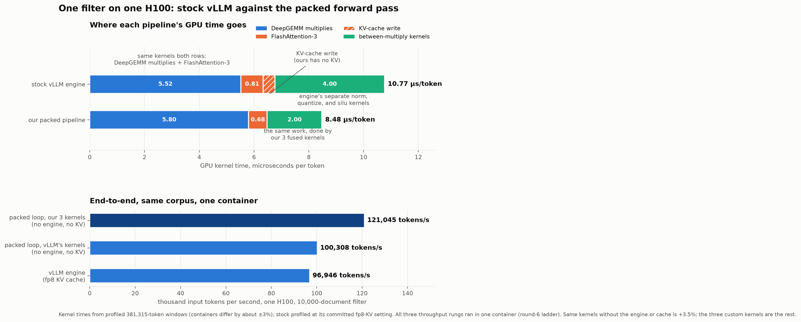
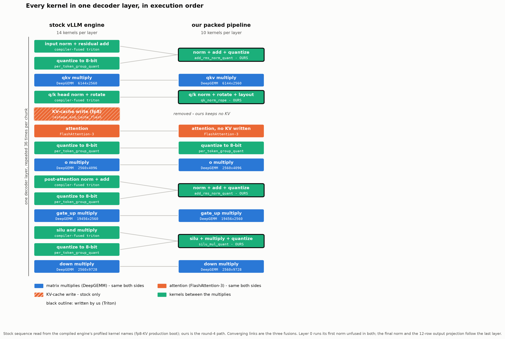

# The packed forward pass: one filter without the engine

Setting: a single filter question over 10,000 documents (3.66 million
input tokens), Qwen3 4B FP8, one H100. Every document gets one
constrained YES or NO token; no text is ever generated. This document
records the experiments that turned a Slack-thread idea — "just run
big forward passes, skip the engine" — into a measured pipeline, and
what each step was worth.

The headline: the packed pipeline runs at **121,045 input tokens per
second against stock vLLM's 96,946** — and almost none of that comes
from removing the engine. It comes from three custom kernels.



## The three experiments

All three process the same corpus with the same weights, the same
DeepGEMM matrix multiplies, and the same FlashAttention-3. The token
budget is 25,305 everywhere: in experiment 1 it is the engine
scheduler's per-step limit; in experiments 2 and 3 it is the chunk
size of a plain packing loop (whole documents laid end to end until
the next would not fit — 147 chunks). The value came from the batch
sweep: throughput is flat above ~4,096 tokens per step, and 25,305
was the measured best point.

### Experiment 1 — stock vLLM engine (fp8 KV cache): 96,946 tok/s

The committed production setting. The engine schedules requests,
compiles the model, and stores every token's attention state (KV) in
an 8-bit paged cache that attention then reads back.

```
engine = vllm.Engine(model, max_num_batched_tokens=25305, kv_cache="fp8")
submit all 10,000 prompts
inside the engine, until done:
    step = scheduler picks whole prompts, up to 25,305 tokens total
    for each of 36 layers:            # compiled, replayed as a CUDA graph
        norm -> quantize -> qkv multiply
        qk-norm + rotate
        write K,V into the paged fp8 cache
        attention  (reads K,V back out of the cache)
        quantize -> o multiply
        norm -> quantize -> gate_up multiply
        silu -> quantize -> down multiply
    sampler: full-vocabulary logits -> pick YES or NO per finished prompt
```

### Experiment 2 — packed loop, vLLM's kernels, no engine, no KV: 100,308 tok/s

The engine's exact compiled kernels, driven from a plain loop. No
scheduler, no sampler, no cache: with every prompt processed start to
finish inside one chunk, nothing needs to be stored between steps, so
the KV write is skipped and attention reads the just-computed values.
(The write cannot be skipped inside the engine: its attention reads
from the very cache pages the write fills.)

```
model  = vllm.load_model(compiled=True)      # the engine's exact kernels
chunks = pack whole prompts, <= 25,305 tokens each      # 147 chunks
for chunk in chunks:                          # plain python loop
    metadata = document boundaries and lengths for this chunk
    hidden = model.forward(chunk.tokens, chunk.positions, metadata)
        # same per-layer sequence as experiment 1, except: no cache
        # exists, so the K,V write is skipped and attention reads the
        # just-computed values directly
    rows    = hidden[last token of each document]
    scores  = rows @ the 12 YES/NO rows of the output matrix
    answer per document: YES if best yes-score beats best no-score
```

### Experiment 3 — packed loop, our three kernels: 121,045 tok/s

Same loop, with the work between the matrix multiplies rewritten as
three Triton kernels: norm+add+quantize in one pass,
silu+multiply+quantize in one pass, and the per-head query/key
norm-and-rotate region in one pass per token. Fourteen kernels per
layer become ten.

```
model  = vllm.load_model(eager=True)          # weights only; we call kernels
chunks = pack whole prompts, <= 25,305 tokens each
for chunk in chunks:
    h = embed(chunk.tokens); residual = none
    for each of 36 layers:
        q8, s = OURS_norm_add_quantize(h, residual)        # 1 kernel
        qkv   = deepgemm(q8, s, W_qkv)
        q, k  = OURS_qknorm_rotate(qkv, positions)         # 1 kernel
        attn  = flash_attention_3(q, k, v_from(qkv), boundaries)   # no KV
        q8, s = quantize(attn)                             # vLLM's kernel
        h     = deepgemm(q8, s, W_o)
        q8, s = OURS_norm_add_quantize(h, residual)        # 1 kernel
        gate_up = deepgemm(q8, s, W_gate_up)
        q8, s = OURS_silu_multiply_quantize(gate_up)       # 1 kernel
        h     = deepgemm(q8, s, W_down)
    rows   = final_norm(h, residual)[last token of each document]
    scores = rows @ the 12 YES/NO rows
    answer per document as above
```



## What each step was worth

All three experiments ran in one container (the round 6 ladder in
`results/engine/single_filter_forward_vllm_kernels.json`).

| change | worth |
|---|---|
| remove the engine, the sampler, and the cache (1 → 2) | +3.5 percent |
| replace four kernel calls per layer with our three (2 → 3) | +20.7 percent |

The engine's software was measured close to free four independent
ways across this branch; the GPU sits 99.5 percent busy under it, and
eager per-kernel launches cost nothing measurable at 25,000-token
chunks. Everything the thread hoped to win by deleting machinery was
actually won by kernel work.

The three kernels, each against the sequence it replaces, per call at
25,305 tokens (probe microbenchmarks):

| kernel | replaces | before | after |
|---|---|---|---|
| silu+multiply+quantize | silu kernel + quantize kernel | 1,078 us | 464 us |
| norm+add+quantize | fused-add norm + quantize | 329 us | 160 us |
| qk-norm+rotate | per-head norms + rotate + 2 copies | 1,257 us | 185 us |

## What did not work, also measured

- **vLLM's compiler fusion**: its norm+quant and silu+quant passes can
  never fire for this checkpoint — the quantize step lives inside the
  compiled linear operation, so there is no graph node to fuse
  (`results/engine/fusion_graphdump.json`).
- **vLLM's shipped fused kernels**: slower than its own separate
  kernels at these shapes (silu+quant fused 1,370 us against the
  1,078 us pair).
- **CUDA graphs on the packed loop**: recovered nothing (the loop is
  already GPU-bound) and paid a 1.5 percent padding tax.
- **A fused multiply epilogue**: our from-scratch Triton multiply ran
  2.26x behind DeepGEMM, so folding silu+quantize into the multiply's
  closing phase lost to the separate-kernel champion. DeepGEMM's real
  kernels measure 84 to 91 percent of the compute ceiling in isolation
  (`results/engine/ncu_deepgemm_details.txt`) — that headroom is
  thoroughly defended.

## Number formats, in one paragraph

Weights and every multiply input are fp8 in all three experiments —
that is where 8-bit numbers buy speed, because the H100 multiplies
them twice as fast. The KV cache is different: 8-bit storage there
buys only capacity (irrelevant here, since nothing is re-read across
steps) and costs conversion work on every write and read. Inside the
engine, switching the cache from fp8 to bf16 is worth +5.9 percent by
itself (96,946 to 102,820, banked in the same ladder run); having no
cache at all, as in experiments 2 and 3, is the endpoint of that
direction. A side effect worth recording even though speed was the
goal: attention reading exact bf16 values instead of the rounded fp8
cache fixes about 765 of the engine's 2,990 wrong answers per 10,000;
our pipeline answers 2,213 wrong. (Experiment 2's own accuracy column
in the ladder run is unvalidated pending a document-isolation check
and should not be cited.)

## Where everything lives

- `experiments/modal_single_filter_forward.py` — the three
  experiments, the three kernels, the probe with its correctness
  checks and microbenchmarks. Every round's prediction and result is
  in the module docstring, in order, including the failed ones.
- `experiments/modal_fusion.py`, `experiments/modal_fusion_fix.py` —
  the compiler-fusion investigation that established why config-level
  fusion is dead for this checkpoint.
- `results/engine/single_filter_forward_vllm_kernels.json` — the
  ladder and profiles. `results/plots/` — the two figures and their
  generator scripts.
