# The measured cost model

This document walks through the step cost model of the FPS draft
(`plans/fps_draft.tex`; Section 4, Eq. 3 and Eq. 6), component by
component: how each term was measured, what the fitted constant is,
and how accurate the fit is. Every number comes from committed result
files in `results/engine/`, produced this week on one H100 SXM
(Qwen3 4B, fp8 weights and fp8 KV, vllm 0.26.0, CUDA 13 image). The
draft's Remark 1 says its constants are analytical placeholders until
calibrated values replace them; these are the calibrated values, and
the draft text has been updated with them.

Scope, fixed on purpose: filter queries only, one GPU, contexts to
16,384 tokens, calibration family C3 skipped (Section 5 below says
what that forbids). The draft's sharding-invariance claims are
untested here; nothing below contradicts them, but nothing measures
them either.

## 0. Measurement discipline

Vocabulary, used throughout. A **cell** is one measurement
configuration: a chosen set of requests that the engine must execute
as exactly one step. A **family** is a group of cells that vary one
factor; the families here are the draft's Table 4 (C1, C2, C4, C5,
C6) plus the alpha family. For every cell the engine runs seven
repetitions: two warmups, which are discarded, then five that are
recorded. The cell's reported time is the **median** of the five
recorded repetitions, read from the engine's own step timer. A cell
is **valid** if every repetition executed as exactly one step of
exactly the requested shape and every request reported exactly the
intended cached-token count. A cell is **stable** if its five
recorded times spread less than 10 percent. A cell that fails either
check is retried once and kept with its flags.

- The fits read one file, `calibrate_all.json`: 100 cells plus the
  transfer probes, all from a single container. Rows from different
  containers are never mixed, because host speed varies up to 45
  percent across containers (Section 10 measures this directly).
- The landing run came back with zero invalid and zero unstable
  cells. The machine's speed was also checked for drift over the
  sweep: a reference cell (one 4,096-token prefill) runs once before
  the first cell and once again after the last, about fifty minutes
  apart, and the two agreed within 1.05 percent.
- Two engine-boot defaults had to be overridden before any measurement
  was honest, and both are recorded in every run's boot row:
  `async_scheduling=False` (the vllm 0.26 default moves the GPU wait
  outside the window the step trace times; the first run "measured" a
  16K prefill at 19.5 ms, five times below the hardware floor) and
  `enforce_eager=True` (the boot's single 8,192-token CUDA graph
  padded every smaller step up to 8,192 tokens, so h=512, 1,024, and
  2,048 all cost the same 84 ms). The consequence of the eager boot for
  the fixed step cost is stated in Section 3.

The workload behind the corpus-level numbers: 10,000 IMDB reviews
(3,203,917 tokens; mean 320, max 2,947), five yes/no filters with
planted answers, selectivities (0.9, 0.9, 0.9, 0.8, 0.8). One cached
token costs kappa = 73,728 bytes at fp8 (the draft's m = 72 KiB).

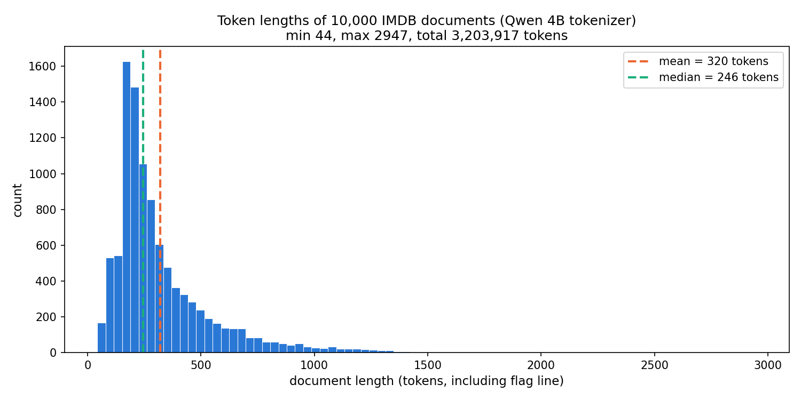

## 1. Prefill: T_pre(h) = a1·h + a2·h²  (draft Eq. 6)

**How measured.** Each cell of this family is one request of h fresh
tokens with nothing cached, so the step is a single document prefill.
Eleven lengths are measured: h = 512, 1,024, 2,048, 3,072, 4,096,
6,144, 8,192, 10,240, 12,288, 14,336, 16,384. Every repetition uses
freshly generated token content, so no repetition is served from the
prefix cache. The model T_pre(h) = intercept + a1·h + a2·h² is then
fitted to the eleven medians by least squares with all three
coefficients constrained to be nonnegative, because each coefficient
is a physical time and measurement noise must not hand one a
negative sign.

**Constants.**

| constant | value | prediction before the run | verdict |
|---|---|---|---|
| a1 | 9.20 µs/token | 10.4, accept 8.5–12.5 | in range |
| a2 | 4.93e-10 s/token² | ~4.2e-10 | +17 percent |
| bend a1/a2 | 18,640 tokens | — | — |
| T_pre(16,384) | 290.8 ms | ~286 ms (173 if linear) | in range |

**Accuracy.** Quadratic fit error 4.9 percent over the alpha cells;
forcing a linear-only model gives 18.1 percent. The h² term is real
and is attention: Section 8 confirms it with an independent
instrument.

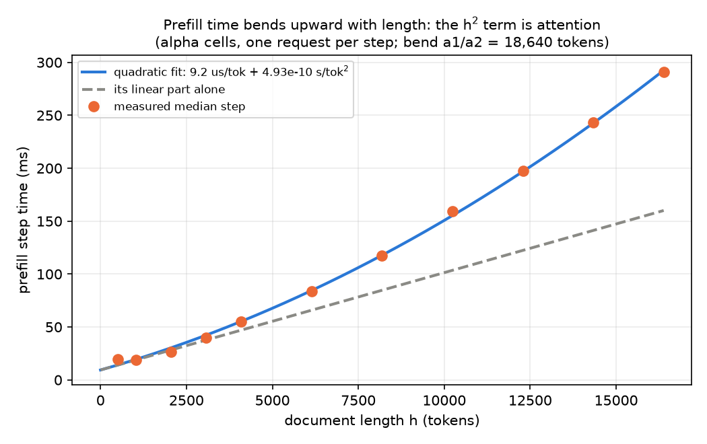

## 2. Step composition: f_B(B) and beta_N  (draft Eq. 3)

**How measured.** Each cell of this family is N identical requests
of c fresh tokens each, nothing cached, executed as one step. Three
sizes are measured, c = 64, 256, and 512, with N doubling from 1
until the step's token total B = N·c reaches 32,768 — 25 cells, all
valid. Two things come out of this design. First, cells with the
same B but different N (B = 8,192 exists as 128 requests of 64
tokens, 32 of 256, and 16 of 512) separate the per-request cost
beta_N from the per-token cost. Second, f_B is fitted as a
piecewise-linear curve: the B axis is divided at fixed breakpoints,
each segment's slope is fitted with a nonnegativity constraint, so
the curve may bend but never decreases.

**Constants.** beta_N = 50.3 µs per request. Above B = 4,096 the
series is linear at ~10.7 µs/token; below B = 2,048 every cell sits
on a flat floor (18.6–19.5 ms in the landing container) that the
next section explains.

**Gate.** The B=64 and B=8,192 cells separate by 4.7x. Equal times
were the CUDA-graph padding signature; the eager boot removed it.

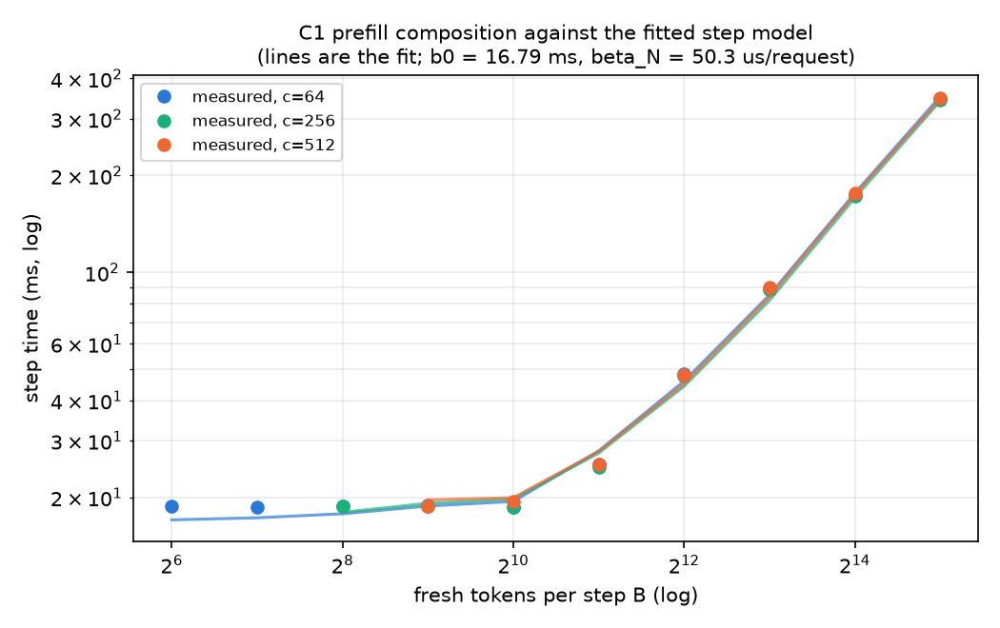

## 3. The fixed step cost b0, and which engine it describes

b0 fitted 16.79 ms. The band predicted before the run was 1.5–3.5 ms,
so this is a miss, and the mechanism is known exactly: the prediction
described the production boot, where CUDA graphs replay the forward
pass as one pre-recorded program, while calibration must run eager
(Section 0), so the host launches each of the ~600 kernels itself,
every step, at a cost of ~17–19 ms regardless of step size. The floor
is host-bound, not GPU-bound: a slower container floored at 26–29 ms
while its GPU-bound large cells matched this container within 2
percent.

Consequence for use: the size-dependent terms (a1, a2, f_B, f_P,
beta_N) transfer to the production engine; the intercept does not.
The production fixed step cost remains the separately measured
STEP_FIXED_S = 2.94 ms (batch-size sweep, graphs on), with the knee
near 283 tokens.

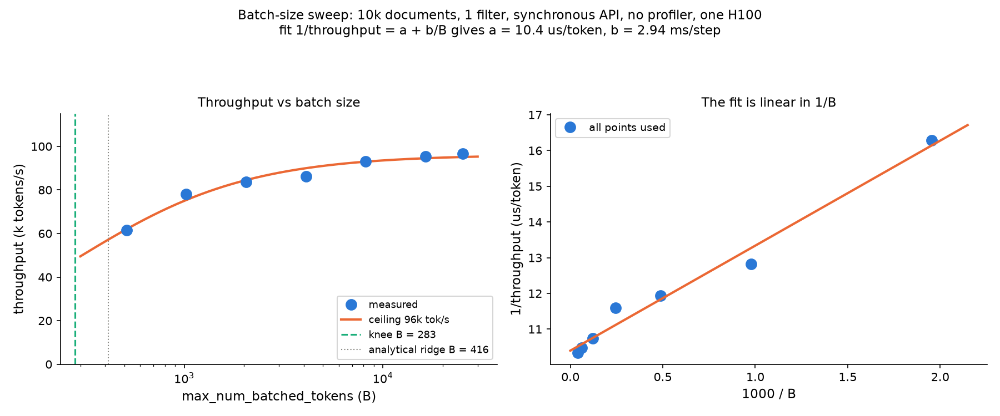

## 4. Cached reads: f_P(P), t_read, and epsilon

**How measured.** Each cell of this family evaluates cached
documents. First the cell's N documents of h tokens each are
prefilled once; this warm-up is not measured. Then each measured
repetition submits N requests, where request i is document i plus a
fresh c-token suffix. The document is served from the cache and the
suffix is new content, so the step computes exactly N·c fresh tokens
against N·h cached tokens — and the engine must report exactly h
cached tokens for every request, or the cell is invalid. The grid:
c = 16, 32, 64; h = 2,048, 4,096, 8,192, 16,384; N = 1, 4, 16, 32,
and 64 where memory allows — 54 cells, all valid. f_P is fitted over
the attention-pair count P the same piecewise-linear way as f_B.
The per-cached-token price t_read is derived two ways, and both are
reported. The raw way: take the two reference cells c = 32, N = 32
at h = 8,192 and h = 16,384, subtract their step times, and divide
by the 262,144 additional cached tokens the larger cell reads. The
fitted way: evaluate the fitted f_P curve at those two cells' pair
counts and convert its slope to a per-token price. The two disagree
(101 versus 57 ns per token) because the fitted curve is shared
across all suffix widths; the disagreement is itself informative and
is discussed below.

**Constants and the draft's largest correction.**

| quantity | measured | draft assumed | ratio |
|---|---|---|---|
| t_read at c=32 | 56.8 ns/token fitted; 101 ns raw slope | ~22 ns (m / HBM bandwidth) | 2.6–4.6x |
| epsilon = t_read/a1 | 6.2e-3 | ~1.5e-3 (Prop. 2 discussion) | 4x |
| effective read bandwidth | ~0.7 TB/s at c=32 | 3.35 TB/s | 21 percent of peak |

If reading cached context were a plain memory copy, the price per
cached token would be one number: the token's 73,728 bytes divided
by the 3.35 TB/s memory bandwidth, which is 22 ns. Measured, the
price depends on how many suffix tokens are doing the reading.
Repeating the raw subtraction at each suffix width gives 82 ns per
cached token when the suffix is 16 tokens, 104 ns at 32, and 141 ns
at 64. The reason is that attention is not a copy: every suffix
token computes against every cached token, so each additional suffix
token adds work per cached token. The kernel also fetches KV in
16-token pages, and with only 16 to 64 suffix tokens per request it
has little computation to overlap against each fetch, which is why
even the cheapest width runs at roughly a quarter of the memory
bandwidth.

This width dependence is also why the two derivations of t_read
disagree. The model has one shared curve f_P for all widths, so the
slope the fit learns is a compromise across the c = 16, 32, and 64
cells, and it lands at 57 ns — below the 101 ns the c = 32 cells
alone show. The fitting code computes exactly this comparison as a
self-check and flags any disagreement beyond 20 percent; here the
ratio is 0.56, so the flag fired. The practical reading: 57 ns is
the right value inside the fitted model, whose other terms were
fitted jointly with it, but it is not a physical constant of the
hardware, and any quoted read price should carry the suffix width it
belongs to.

The consequence for the draft's Proposition 2. Its guarantee has
slack 1 + z·epsilon, where z is the number of filters and epsilon is
the read price divided by the prefill price, t_read/a1. The draft
assumed epsilon ≈ 1.5e-3 from datasheet arithmetic; the measured
value at the c = 32 reference is 6.2e-3, four times larger. At z = 5
the slack becomes 1.031 instead of 1.008 — the guarantee weakens
from "within about 1 percent of optimal" to "within about 3
percent," which changes no conclusion. The draft's worked example
also moves: one cached pass over a 4,096-token document costs about
0.41 ms, not 0.12. What does not change: reading a cached token is
still about 160 times cheaper than recomputing it (1/epsilon), which
is the fact the whole design rests on.

**Accuracy, shown on one concrete cell.** The cell with 32 requests,
each a 32-token suffix over a 16,384-token cached document, was
predicted at about 30 ms before the sweep: a few milliseconds of
per-step overhead, plus 524,288 cached tokens read at the assumed
22 ns, plus the suffix compute. It measured 67.2 ms. The two
corrections above account for the difference in full: the per-step
overhead is really the ~18 ms eager launch floor of Section 3, and
the cached read really costs about 100 ns per token, which is
~52 ms for those tokens; 18 + 52 = 70 ms, against 67.2 measured.
Three checks say the read price is real and not an artifact:
doubling the cached length at a fixed request count moves the step
time by that same per-token price; growing the request count from 1
to 32 at fixed length moves it linearly, with increments of 86 to
106 ns per token; and a separate run in a different container
measured 104 ns against this container's 101.

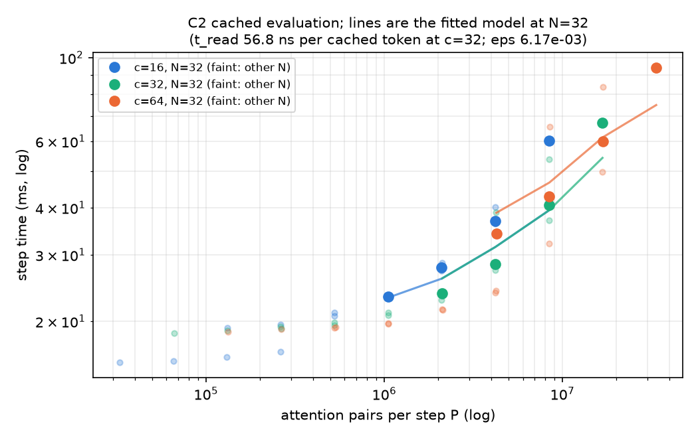

## 5. Why the model has no memory-traffic term  (draft Prop. 4)

This section answers a question any reader of Eq. 3 will ask: the
model has a term for attention pairs, so where is the term for the
bytes of KV a step holds resident? The answer is that such a term
cannot be fitted from filter-shaped measurements, the draft proves
it as Proposition 4, and the sweep was designed around that proof.

In words: whenever every request in a cell has the same suffix
length c — which is what filter steps look like by construction,
since suffixes span only 16 to 64 tokens — the pair count P and the
resident bytes R are exact linear functions of each other. Two
quantities that always move in lockstep cannot be told apart by any
fit: every split of the measured time between "pair work" and "byte
work" predicts identical times for every such cell, so the data
contains no answer to which it is. Identifying a byte term would
need cells built to break the lockstep — long suffixes over short
contexts against short suffixes over long contexts, at matched pair
counts. Those cells are the draft's calibration family C3, and they
were skipped on purpose.

Two consequences worth recording. First, the fitting code enforces
the proposition instead of silently producing a meaningless split:
asked for a byte term without C3 cells present, it refuses, quoting
the linear dependence in its error message. Second, the model
carries all attention-related cost in the single term f_P — and that
is exactly why the read price of Section 4 varies with suffix width
instead of being one clean number. The width dependence is the
information the missing term would have carried.

## 6. Host time: the draft's form fails, one term fixes it

**How measured.** The engine's step loop is timed in three
separately recorded phases: GPU execution, the scheduler's step
preparation (`sched_ms`), and the bookkeeping after the step
(`update_ms`). Host time here means the sum of the last two. It is
recorded for every cell, so the host model is fitted on the same
cells as the GPU model (90 of them carry both host phases) but from
different clocks — a failure of this model cannot contaminate any
GPU constant.

The draft's form T_host = h0 + hN·N + hA·A fits at **528 percent**
mean relative error. The failure is structural: at fixed N=32 and
fixed A=64 fresh blocks, host time still rises 5.4 → 38.4 ms as
cached length grows 2,048 → 16,384. The scheduler rebuilds per-step
block tables spanning each request's whole context, and neither N nor
A can see that. Adding a resident-blocks term R (the whole context in
16-token blocks):

| constant | value |
|---|---|
| h0 | 0 |
| hN | 24.3 µs/request |
| hA | 0.49 µs/allocated block |
| hR | 1.12 µs/resident block |
| fit error | 14.9 percent (was 528) |

The draft's T_host equation should gain the hR·R term. Note this R is
identifiable for the *host* model from the existing C2 grid (h varies
at fixed N and A); the GPU-side R of Section 5 is the one that needs
C3. The two statements are consistent.

## 7. Additivity and imbalance: C4 and C5  (draft Remark 1)

The draft's near-optimality proof assumes step cost is additive
across requests. C4 measures it directly: mixed steps (fresh 512-token
prefills plus cached c=32 suffixes over 8K documents), entirely held
out of the fit, are predicted with **7.1 percent** error — inside the
10 percent the design allows. C5 holds B, P, N fixed and varies only
the per-request cached-length spread (uniform / mild / extreme /
one-hot over 131,072 total tokens): the four cells agree within
**1.3 percent**, against a 5 percent gate. No systematic residual;
no correction terms enter; the envelope of Proposition 2 stands.

## 8. Whole-model validation

Fit on 74 cells; validate on 22 held-out cells (all of C4 plus every
fifth C1/C2 cell by name). Held-out error **5.9 percent**; pairwise
ranking accuracy — the property the scheduler actually consumes —
**96.5 percent**. By regime: pure prefill 6.4, cached 5.1, mixed 7.1
percent.

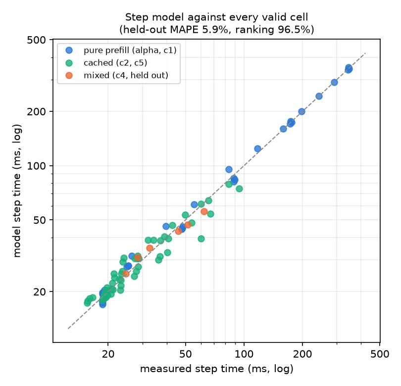

An independent instrument confirms the model's attention story: a
torch profiler sweep over single-document prefills classifies GPU
kernel time by class, and the measured attention and GEMM shares land
on the curves the fitted a1/a2 predict, crossing near **9,800
tokens** — inside the 16K ceiling. The profiler's own per-kernel
slope for the FlashAttention forward is 4.4e-10 s/token² against the
engine-fitted 4.93e-10. (This sweep also exposed a classification
bug: on Hopper the FlashAttention mainloop is a
`cutlass::device_kernel`, so every earlier profile had filed it under
GEMMs; both instruments now match attention patterns first, and the
corrected mix at B = 25,305 is GEMMs 50.9, quantize 18.3, norm 12.2,
attention 11.8, elementwise 6.7 percent of kernel time, GPU 99.5
percent busy.)

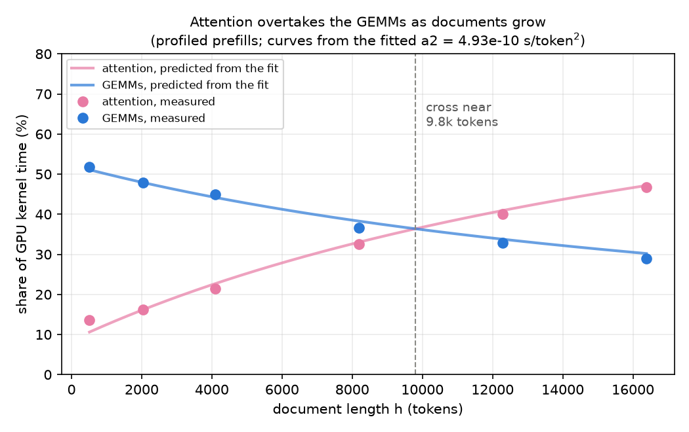

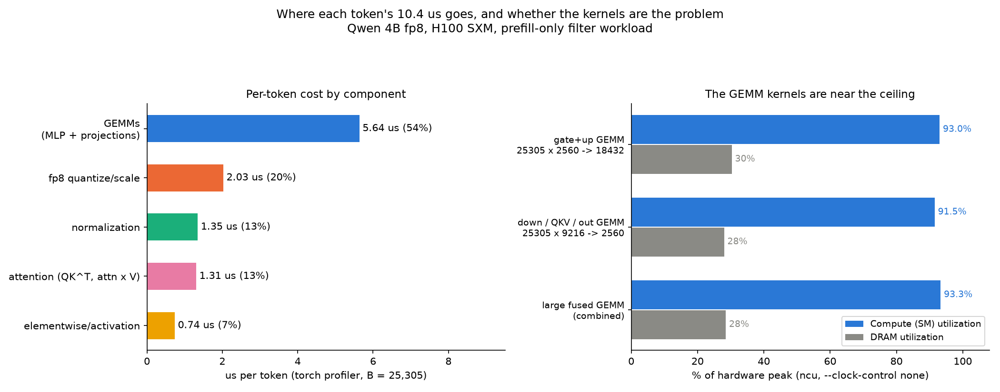

Where the speed-of-light goes, per component: dense per-token work
runs at 40 percent of the 275k tokens/s ceiling (the GEMM kernels
themselves at 92–93 percent of peak while resident — the gap is the
mix, not the kernels); attention compute at ~30 percent; cached
reads at 16–27 percent of memory bandwidth; pinned PCIe at 87
percent of spec.

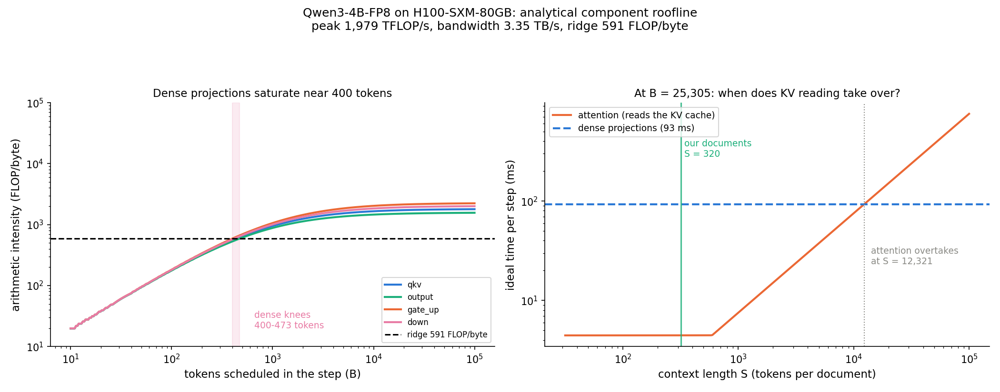

## 9. Transfers and the offload crossover  (draft Eq. 8, Prop. 5)

**How measured.** These are direct copy measurements with no
inference engine involved: 4 GiB GPU-to-host and host-to-GPU copies,
with the host buffer pinned and unpinned (five repetitions, median);
a 16 GiB write and read on the container's disk, with the operating
system's page cache dropped between them so the read is a real disk
read; and a 4 GiB write and read on the network-backed results
volume.

| tier | rate | per-token m/beta | crossover h* |
|---|---|---|---|
| PCIe pinned (h2d / d2h) | 55.5 / 55.3 GB/s | 1.33 µs | 0 — transfer dominates every length |
| PCIe unpinned | 10.9 / 11.9 GB/s | 6.8 µs | 0 — still under a1 |
| container disk read | 3.88 GB/s | 19.0 µs | 19,900 tokens — past the 16K ceiling, recompute wins in scope |
| volume read | 3.24 GB/s | 22.7 µs | 27,500 tokens |

This is Proposition 5 operating on measured constants: a1 = 9.2 µs
exceeds m/beta for both PCIe tiers, so its first branch (offload
weakly dominates at every length) holds on real numbers; the disk
tiers fall to the second branch with h* beyond the measured envelope.
Pinned rates reproduced a months-old probe within 0.1 percent;
unpinned within 12.7 percent. Disk write rate varied 2.6–4.9 GB/s
across containers; only the read side prices a restore.

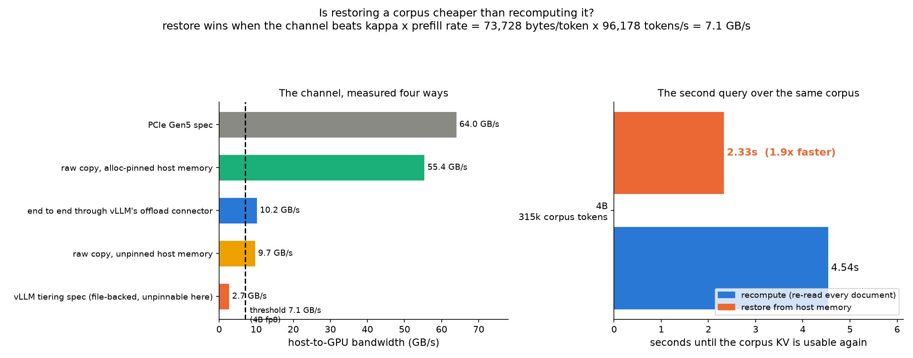

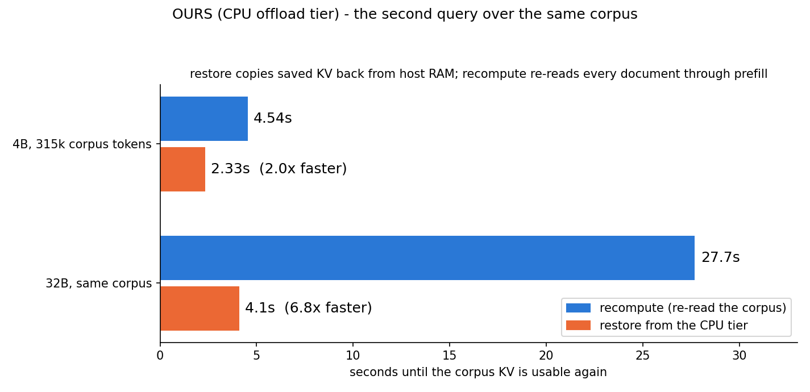

## 10. The per-query residue, measured host-controlled

The draft's T_ser and the estimator's c0 absorb per-query software
cost. The shipped value was 3.2 s, derived by subtracting predicted
token work from measured walls across containers — and walls spread
up to 45 percent across containers, so that derivation booked host
variance as overhead. The anchor protocol removes the confound. In one container: first
measure that container's own serving rate — submit every document
once with its first question attached, through the same client code,
the same concurrency limit, and the same engine configuration the
stock query uses, and divide the fresh tokens processed by the wall
time (96,804 tokens per second here; the fleet-wide anchor is
97,000). Then run the query in the same container. Then compute, per
repetition, c0 = wall − (tokens read) / (the rate this container
just measured). Host speed appears in both terms and cancels.

| arm | c0 reps | median |
|---|---|---|
| planned (rewind) | 0.244, 0.026, 0.013 s | **0.026 s** |
| stock pipelining | 0.659, 0.354, 0.694 s | 0.659 s |

The planned executor's query-level residue is 26 milliseconds. The
constant is corrected accordingly.

## 11. End to end: predicted against measured walls

The estimator prices the full query (T_in + T_quest + T_reread + c0)
from the constants above. Measured walls exist from two separate
runs of the same query, in two different containers:

- **This week's run** — the c0 anchor of Section 10. Its container's
  own serving rate is known, because the probe measured it (96,804
  tokens per second).
- **The earlier run** — the filter comparison stored in the
  repository from a previous session. Its container's speed was
  never measured.

Each run measured both arms three times. The predictions below use
the fleet constants only (the 97,000 tokens-per-second anchor rate
and the measured c0), with no knowledge of either container. The
stock arm's read multiplier is an input taken from the measurement,
because the estimator does not predict prefix-cache eviction; the
rewind arm's token count is the model's own.

| run | arm | measured mean | predicted | error |
|---|---|---|---|---|
| this week's | rewind | 39.71 s | 41.87 s | +5.4 percent |
| this week's | stock | 41.22 s | 40.62 s | −1.5 percent |
| earlier | rewind | 39.84 s | 41.87 s | +5.1 percent |
| earlier | stock | 42.92 s | 40.62 s | −5.4 percent |

Two things to read off. First, the stock error flips sign between
the runs (−1.5 against −5.4 percent) because the earlier container
was slower and the fleet constants cannot know that; this is the
cross-container host spread the estimator cannot remove. Second, the
rewind error does not move between runs, and it also does not move
when the prediction is recomputed with this week's container's own
measured rate and c0 (41.93 s, +5.6 percent) — so it is not host
speed and not overhead. It is one specific accounting error: the
model charges 852,889 question tokens (a 46-token stage-1 question,
then 13-token survival-thinned tails over a 33-token shared
preamble), while the engine's step trace counted 631,171 question
tokens actually prefilled. The executor keeps more of each question
resident across rewinds than the 33-token preamble accounting
assumes. That single over-charge is the entire rewind error.

For reference, the measured comparison itself:

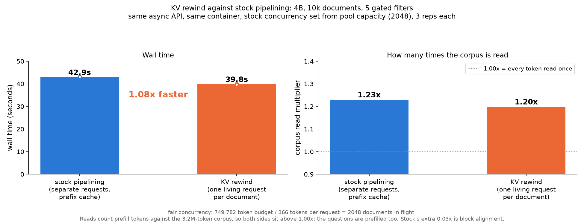

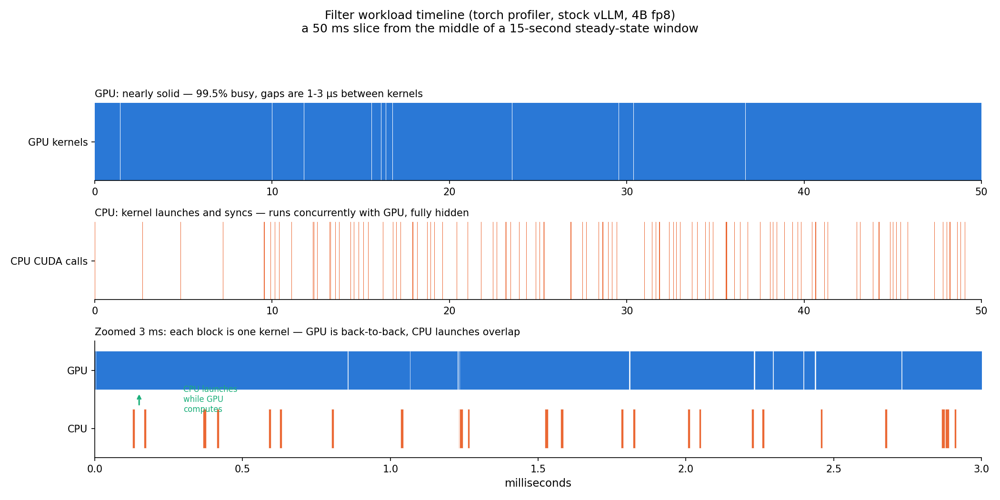

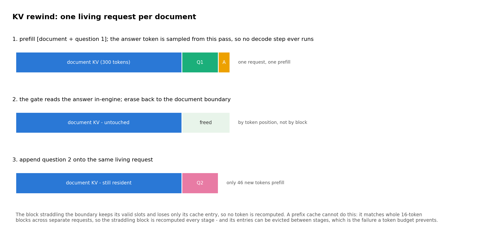

## Reproduction

| artifact | command |
|---|---|
| calibration rows | `modal run experiments/modal_calibrate.py --families all` |
| fits | `python -m quail.plan.fit --rows results/engine/calibrate_all.json --out results/engine/cost_model_fit.json` |
| figures | `python plots/make_figures.py calib attnshare_profile phi_budget` |
| attention share sweep | `modal run experiments/modal_profiling.py::attnshare_main` |
| c0 anchor | `modal run experiments/modal_filters.py::c0_anchor` |
| end-to-end check | `python -m quail.plan.validate --anchor results/engine/c0_anchor.json --banked results/engine/filter_cells.json --out results/engine/makespan_check.json` |

Constants live in `quail/plan/cost.py`; every result file's provenance
is in `results/engine/README.md`.
