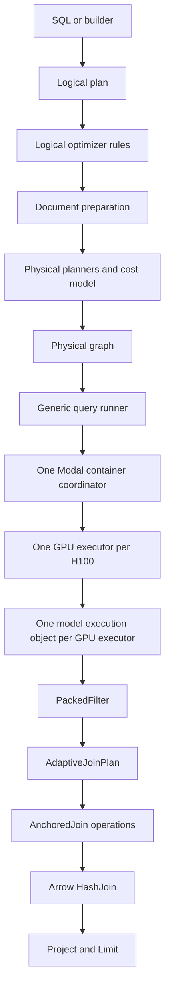

# Plan for an extensible Quail engine

Status: implemented and confirmed on Modal on the `extensible-engine` branch.
The measured result is in
`reports/2026-08-31-extensible-engine-confirmation.md`.

## Goal

Quail should have the same clear boundaries that make database engines such as
DataFusion and PostgreSQL extensible. A new planner, physical model
implementation, runtime, or table provider should not require another type
switch in the session, Modal container runtime, result code, benchmarks, and
reports.

The redesign must preserve the current query language. Quail continues to
support model filters and joins. The redesign does not add maps, open ended
generation, classification, speculation, or forking.

The first version must support these extensions:

* A new physical implementation of an existing model filter or join.
* A model backend with its own scheduler and KV implementation.
* A logical or physical optimizer rule.
* A physical node and its runtime.
* A table provider that returns Arrow batches.

Built in Quail code must use the same interfaces as extension code.

## Main decisions

The redesign uses these boundaries:

* Logical nodes describe what the query means.
* Logical optimizer rules rewrite a logical plan without changing its meaning.
* Physical planners produce possible ways to execute a logical node or a
  connected set of model operations.
* The cost model chooses one physical candidate.
* Physical optimizer rules add required data movement and ordinary result
  operations.
* A generic query runner executes the selected physical graph.
* A model backend plans model work and creates one model execution object for
  each GPU executor.
* A table provider supplies schemas, statistics, and bounded Arrow batches.

The model backend is the public extension boundary for model execution. Quail
will not define a public KV interface. The scheduler, KV layout, allocation,
retention, eviction, KV rewind, and model calls need to change together in some
backends.

One model execution object owns all model work for one query in one GPU
executor.
`PackedFilter`, `AdaptiveJoinPlan`, and any executed `AnchoredJoin` operations
use that same object. The generic query runner never reads or changes KV.

`AdaptiveJoinPlan` is a physical node. It owns runtime join planning and can
select `AnchoredJoin` steps after filter results are known. Planning work is a
valid purpose for a physical node.

The runtime for `AdaptiveJoinPlan` is supplied by the selected model backend.
It creates a typed child graph and asks the generic runner to execute that graph
with the existing execution context. The child graph therefore uses the same
model execution object and the same KV as the completed filter nodes.

Physical node names do not use an `Exec` suffix. Logical and physical nodes
live in separate modules and implement different interfaces, so the suffix is
not needed.

## Configuration and GPU layout

The public engine configuration has these fields:

```python
@dataclass(frozen=True)
class EngineConfig:
    backend: str = "quail"
    model: str = "qwen3-4b-fp8"
    gpus: int = 1
```

`backend` selects the model backend. The first design must cover Quail, stock
vLLM, and pipelined SGLang. The existing vLLM and SGLang implementations are
baseline runners today. They do not become engine backends until they implement
the new backend interface.

`model` selects a registered `ModelSpec`. The supported models are Qwen3 4B fp8
and Qwen3 32B fp8. A model backend declares whether it supports the requested
model and device. Different model sizes use the same physical node interfaces.
Their model specifications produce different memory budgets, chunk limits, KV
capacity, and work estimates.

`gpus` is the number of H100s allocated to the query. In the first version it
must be 1, 2, 4, or 8. All allocated GPUs are in one Modal container. The
container has one parent coordinator process and one GPU executor for each
H100. Each GPU executor owns one model copy and one model execution object.

For example, `gpus=4` produces this layout:

```text
One Modal container with four H100s
    One container coordinator
    GPU executor 0 with one model copy
    GPU executor 1 with one model copy
    GPU executor 2 with one model copy
    GPU executor 3 with one model copy
```

Quail does not split one model copy across several GPUs. Both supported models
fit on one H100, so four GPUs mean four independent model copies. The container
coordinator partitions documents and join anchors among the GPU executors. It
also redistributes survivor sets when the next join uses a different anchor.

A GPU executor is one backend execution unit bound to one H100. The Quail
backend implements it as one child process. A backend such as SGLang may use
more than one operating system process for its driver and scheduler. The
generic runtime does not require a particular process layout inside a GPU
executor.

The planner validates the backend, model, device, and GPU count before it calls
Modal. An unsupported combination returns a refusal with the failed capability.
Query cost uses the number of allocated H100s.

More than eight GPUs requires several Modal containers and another coordinator
above the container coordinators. Support for more than eight GPUs is outside
the first version.

## One query from start to finish

The implementation must support this exact path:

1. The SQL or builder front end creates one logical plan with `Scan`,
   `SemanticFilter`, `SemanticJoin`, and `Project` nodes.
2. Logical optimizer rules validate and rewrite the logical plan.
3. Document preparation reads the required columns in Arrow batches. It creates
   token manifests and token sources.
4. The physical planner finds each connected set of model operations. It asks
   the selected model backend to plan that set.
5. The selected backend returns physical candidates. The existing work and
   device cost model chooses one candidate without a fitted runtime predictor.
6. The generic planner adds ordinary nodes such as `DocumentScan`, `Exchange`,
   `HashJoin`, `Project`, and `Limit`.
7. The Modal container coordinator starts one GPU executor for each H100. Each
   GPU executor creates or reuses one model execution object.
8. The runner executes ready physical nodes. Every model node in one GPU
   executor uses the same model execution object.
9. When the runner reaches `AdaptiveJoinPlan`, the selected backend uses actual
   survivor counts and its private runtime state to choose `AnchoredJoin`
   operations.
10. Arrow `HashJoin` nodes combine model answer relations using exact document
    ids. `Project` and `Limit` produce the final result.



## Ownership

Each part has one owner:

| Part | Owner |
| --- | --- |
| Logical plan shape and schemas | Generic engine |
| Logical and physical rule order | Session state |
| Model physical candidates | Selected model backend |
| Model and device cost comparison | Generic planner using current Quail cost code |
| Loaded model and model scheduler | Model execution object |
| KV and token based admission | Model execution object |
| Runtime join planning | Runtime for `AdaptiveJoinPlan` supplied by the model backend |
| Graph scheduling and runtime dispatch | Generic query runner |
| Work split across GPUs in one container | Container coordinator |
| One model copy and its CUDA context | GPU executor |
| Data movement required by a physical plan | `Exchange` runtime |
| Exact result relation joins | Arrow `HashJoin` runtime |
| Source schema and Arrow batches | Table provider |
| Plan encoding at the Modal boundary | Registered node codecs |

The generic engine must not inspect a concrete model node. A model backend must
not read a table provider directly. Both sides communicate through typed plan
inputs, outputs, and runtime values.

## Logical plan interface

Replace the closed `Operator` union with a `LogicalNode` interface. Each logical
node provides:

* A stable type name.
* Its children.
* Its expressions.
* Its output schema.
* Validation specific to the node.
* Methods that return the same node with replacement children or expressions.
* Fields for one line of explain output.

The built in logical nodes remain `Scan`, `SemanticFilter`, `SemanticJoin`, and
`Project`. The SQL and builder front ends must create the same logical tree
through one `LogicalPlanBuilder`. Delete `QueryDesc` after both front ends use
the builder.

A generic plan walk must support visiting, rewriting, validating, and
explaining any registered logical node. A new logical node must not require a
change to the generic plan walk.

The first version does not add SQL syntax hooks. An extension can construct a
registered logical node through the builder API. SQL syntax extensions can be
designed later if a concrete extension needs them.

## Document preparation

Physical planning needs exact document token lengths for work estimates,
memory checks, retention planning, and balanced GPU partitions. A table schema
does not contain those lengths.

Document preparation runs after logical optimization and before physical
planning. For each requested document column, it produces a
`DocumentManifest` with:

* Provider and content identity.
* Row identities.
* Tokenizer identity.
* Per document token lengths and summary statistics.
* A `TokenSource` that returns bounded Arrow token batches.

Preparation checks the token cache first. On a cache miss, it reads the
requested document column once and writes token batches to the cache. Physical
planning reads the manifest and statistics. Planning rules never read document
text.

The current Arrow dataset and token cache can implement the first version.
Snowflake and BigQuery providers must be able to use the same interface without
creating one Python list for every document or reading unused columns.

## Planning interfaces

Planning has three phases with different jobs.

### Logical optimizer rules

A logical optimizer rule receives a logical node and a `PlanningContext`. It
returns a replacement node or reports no change. The rule runner records which
rules changed the plan.

The default rules preserve the current semantics. Filters remain below joins.

### Physical planners

A physical planner receives a logical node or connected logical model section,
already planned inputs, and the `PlanningContext`. It returns zero or more
`PhysicalCandidate` values.

Each candidate contains:

* A typed physical graph fragment.
* Counted work, including fresh tokens, attention pairs, KV reads, and KV
  writes.
* Required model, device, memory, and partition properties.
* Its estimated cost.
* A reason when the candidate cannot run.

The built in Quail backend plans connected filter and join work because its KV
decisions can cross logical operator boundaries. Another backend can use a
different physical plan.

The `PlanningContext` contains the catalog, document manifests, selected
backend, `ModelSpec`, `DeviceSpec`, allocated GPU count, chunk limit, order
rule, and registered extensions. A planner cannot start model execution or
read document text.

### Physical optimizer rules

Physical optimizer rules inspect or rewrite the selected physical graph. The
generic rules perform these tasks:

* Insert `Exchange` when location or partitioning changes.
* Add `HashJoin` nodes that combine answer relations.
* Add `Project` and `Limit`.
* Validate that each node can run at its selected location.

The selected model backend owns filter order, join order, anchor choice,
retention planning, packed filter formation, anchored join formation, candidate
set pruning, and GPU partition choices for its nodes.

Explain output names the planner or rule that made each choice.

## Physical plan interface

The physical plan is an immutable typed graph. It is a graph because one model
answer relation can feed candidate set updates and a final hash join.

Each `PhysicalNode` provides:

* A node id and stable type name.
* Typed input and output ports.
* Its output schema and partitioning.
* Its execution location.
* Its runtime registration key.
* Its backend name when it is a model node.
* Resource requirements.
* A method that returns the same node with replacement inputs.
* Fields for explain output.

The first version has three execution locations. They are the client, the
Modal container coordinator, and a GPU executor. A physical node uses one of
those locations. `Exchange` is required when an input crosses a location or
changes its partitioning among GPU executors.

The graph validator checks:

* Node ids are unique.
* Every input refers to an existing output port.
* Port types and schemas match.
* The graph has no cycle.
* Exactly one root output has the query result schema.
* Every node has a registered runtime and codec at its execution location.
* All model nodes use one selected model backend in the first version.

## Built in physical nodes

The generic engine provides these nodes:

* `DocumentScan` reads token batches and row identities from a prepared token
  source.
* `Exchange` moves data between execution locations or changes its GPU
  partitioning.
* `HashJoin` combines Arrow answer relations using exact document ids.
* `Project` selects the requested output columns.
* `Limit` stops after the requested number of rows.

The Quail backend provides these nodes:

* `PackedFilter` evaluates one or more model filter predicates on one document
  input with the Quail scheduler.
* `AdaptiveJoinPlan` plans and runs the remaining model joins after filter
  results are available.
* `AnchoredJoin` evaluates one or more model join predicates that share an
  anchor. It appears in the executed child plan of `AdaptiveJoinPlan`.

The current records map to the new nodes as follows:

| Current record | New node |
| --- | --- |
| `DocScan` | `DocumentScan` |
| `FilterChain` | `PackedFilter` |
| `JoinGroup` | `AnchoredJoin` |
| `Recombine` | One or more `HashJoin` nodes |
| `Sink` | `Project` and optional `Limit` |
| `Barrier` | No replacement |

An anchor change is an input dependency or an `Exchange` when data must move.
The current `Barrier` records do not execute, so the typed graph does not need
a barrier node.

## Adaptive join planning

`AdaptiveJoinPlan` is present in the selected physical graph before execution.
It contains:

* The remaining model join predicates.
* The expected join order and anchors from planning estimates.
* The registered runtime planning rule.
* One answer relation output for each full join predicate.
* One final survivor set output for each document alias.

The logical query fixes the output ports and schemas. Runtime planning can
change join order, anchor choice, grouping, and GPU partitioning without
changing the outer graph.

When `AdaptiveJoinPlan` runs, it performs these steps:

1. Read actual survivor counts from completed filters.
2. Let the backend runtime inspect its own model execution state. The state
   remains private to that backend.
3. Select the next `AnchoredJoin` with the backend's runtime planning rule.
4. Build a typed child graph with the selected `AnchoredJoin` and any required
   `Exchange`.
5. Ask the generic runner to execute the child graph with the existing
   execution context.
6. Use the same model execution object for every model node in the child graph.
7. Update candidate document sets.
8. Repeat until all model join predicates have run.
9. Return the answer relations, final survivor sets, metrics, and executed child
   plan.

The query report stores the expected child plan and the executed child plan.
The executed plan includes each `AnchoredJoin`, anchor choice, input counts,
output counts, and any `Exchange` used during the operation.

`AdaptiveJoinPlan` does not expose KV to the generic runner. Stock vLLM or
SGLang can implement the same logical model operations without using
`AnchoredJoin` or Quail KV.

## Model backend interface

A model backend plans connected model work and creates the shared execution
object used in each GPU executor. The interface has this shape:

```python
class ModelBackend(Protocol):
    name: str

    def supports(
        self,
        model: ModelSpec,
        device: DeviceSpec,
        gpu_count: int,
    ) -> SupportResult: ...

    def plan(
        self,
        region: ModelRegion,
        context: PlanningContext,
    ) -> Sequence[PhysicalCandidate]: ...

    def start(self, context: GpuContext) -> ModelExecution: ...
```

`SupportResult` either accepts the configuration or contains a refusal that
names the unsupported backend, model, device, or GPU count. `GpuContext`
contains the GPU index, total GPU count, `ModelSpec`, `DeviceSpec`, and the
query settings shared by model nodes. It represents one GPU executor bound to
one H100. It does not require a particular process layout and does not
represent the Modal container.

The model execution object owns all model runtime state:

```python
class ModelExecution(Protocol):
    def execute(
        self,
        node: PhysicalNode,
        inputs: Mapping[str, RuntimeValue],
    ) -> NodeResult: ...
```

The built in `QuailBackend` returns Quail physical nodes. Its
`QuailModelExecution` owns the loaded model, packed forward loop, token based
admission, KV rewind, page arena, and retention policy.

A stock vLLM backend can return different physical nodes and use vLLM's own
scheduler and KV. The generic engine does not require a backend to support
Quail node types.

A pipelined SGLang backend can use SGLang's scheduler and radix cache. The
current SGLang baseline proves the submission strategy on Qwen3 4B fp8 and one
H100. A future backend must declare support separately for Qwen3 32B fp8 and
several GPU executors rather than inheriting that support from the baseline.

The backend interface is approved only after it can describe these cases:

* Quail on Qwen3 4B fp8 and Qwen3 32B fp8.
* Quail with 1, 2, 4, or 8 model copies in one Modal container.
* Stock vLLM with its own scheduler and KV.
* Pipelined SGLang with its own scheduler and radix cache.
* A Quail configuration with a different retention policy.

An experiment that changes one Quail cache policy can use Quail backend
configuration or a private Quail component interface. The general engine does
not promise that every KV component can be replaced independently.

## Runtime interface

Every physical node type has a registered runtime. Ordinary node runtimes use
this interface:

```python
class NodeRuntime(Protocol):
    def execute(
        self,
        node: PhysicalNode,
        inputs: Mapping[str, RuntimeValue],
        context: ExecutionContext,
    ) -> NodeResult: ...
```

The `ExecutionContext` contains the registered runtimes, container and GPU
executor information, and the selected model execution object. A runtime for
a model node delegates to that shared model execution object. The context can
also execute a typed child graph. `AdaptiveJoinPlan` uses that operation after
it selects the next join step.

The first version does not require every runtime to implement separate
partition, execute partition, and merge methods. A node declares its input and
output partitioning. `Exchange` and the model backend perform the required
partition work.

The generic runner performs these tasks:

* Validate the complete graph before the first model call.
* Execute a node when all its inputs are ready.
* Send a remote section to the existing `quail-engine` Modal app.
* Run one container coordinator and one GPU executor per H100.
* Resolve each node runtime by its registration key.
* Keep one active model execution object in each GPU executor.
* Collect standard metrics from every node.
* Return the value produced by the root node.

A `NodeResult` contains typed output values and standard metrics. The standard
metrics include:

* Query time.
* Input and output rows.
* Evaluated documents or document pairs.
* Fresh and cached tokens.
* KV hits, misses, removals, recomputations, and regret.
* Peak GPU memory.
* OOM or another structured error.

Node specific metrics use a field named for the extension. Reports aggregate
standard fields without checking the concrete node type.

## Session state and registration

Each session owns an `ExtensionRegistry`. Global registration is not allowed
because tests and concurrent sessions must not change one another.

The registry contains:

* Logical optimizer rules.
* Physical planners.
* Physical optimizer rules.
* Model backends.
* Physical node codecs.
* Physical node runtimes.
* Table provider factories.

Quail registers its built in implementations when it creates a session. A
caller can then register another implementation on that session. Duplicate
names are errors, and registration order is deterministic.

The first version loads Python extension packages in both the client and Modal
container environments through the existing deployment setup. Each child GPU
process inherits that environment. Automatic package installation is outside
this plan.

## Plan encoding

The client and Modal container coordinator exchange serialized values with the
GPU executors. The physical plan therefore needs an explicit wire format.

Use one versioned JSON plan envelope and Arrow IPC for document data and result
relations. Do not use Python pickle.

The JSON envelope contains:

* The plan format version.
* Model and device settings.
* The typed physical graph.
* The selected model backend name.
* The physical node type names required by the graph.
* The expected child plan inside each `AdaptiveJoinPlan`.

Each physical node type registers an encoder and decoder under a stable type
name such as `quail.packed_filter.v1`. The container coordinator checks that it
knows every required type before it starts the GPU executors. Each GPU executor
checks the model node types it receives before the first model call.

The first version does not download extensions or negotiate package versions.
An unknown plan version, backend, node type, or codec produces a clear error
before execution.

## Table provider interface

Replace the `DocumentProvider.kind` switch with a `TableProvider` interface:

```python
class TableProvider(Protocol):
    def schema(self) -> Schema: ...

    def content_identity(self) -> str: ...

    def statistics(self) -> TableStatistics: ...

    def scan(self, request: ScanRequest) -> RecordBatchReader: ...
```

`ScanRequest` contains the required columns, supported ordinary filters, and an
optional limit. A provider reads data only when `scan` runs. Schema and planning
must not load a full table.

The built in Arrow dataset, Parquet, and Hugging Face providers implement the
same interface. A future Snowflake or BigQuery provider can return Arrow batches
from its native client and apply column or limit pushdown.

Model filters still run in Quail unless a provider explicitly declares an
equivalent supported operation. Provider filter pushdown is not required in
the first version.

## Implementation sequence

The numbered sections are implementation stages in one PR. Each stage should
leave the CPU tests passing. The final PR should contain the complete change,
the compatibility removal, the Modal checks, and the documentation.

### 1. Preserve current behavior

Add tests for the current logical plans, physical plans, payloads, result
schemas, and reports.

The tests must cover:

* One filter.
* Several filters on one document input.
* One full join.
* Exists and anti joins.
* Several joins that change anchors.
* Qwen3 4B fp8 and Qwen3 32B fp8 planning.
* GPU counts 1, 2, 4, and 8.
* OOM results.

Record planned order, anchors, retention choices, fresh tokens, cached tokens,
KV regret, and result schemas. No production behavior changes in this stage.

### 2. Add the core interfaces

Add `LogicalNode`, `PhysicalNode`, `PhysicalGraph`, `PhysicalCandidate`,
`PlanningContext`, `ModelBackend`, `ModelExecution`, `NodeRuntime`, and
`ExtensionRegistry`.

Add generic graph validation, traversal, rewriting, and explain output. Register
the built in names, but keep current execution unchanged.

This stage is complete when a unit test can define and traverse a custom physical
node without changing generic graph code.

### 3. Add typed physical nodes

Convert `plan_query` to return typed built in nodes.

Perform these replacements:

* `DocScan` becomes `DocumentScan`.
* `FilterChain` becomes `PackedFilter`.
* Expected `JoinGroup` records become the expected child plan of
  `AdaptiveJoinPlan`.
* `Recombine` becomes explicit `HashJoin` nodes.
* `Sink` becomes `Project` and optional `Limit`.
* `Barrier` is deleted.

Add JSON codecs and round trip tests for every node. Keep execution running
through a temporary adapter that produces the current dictionary payload sent
to the Modal functions.

This stage is complete when all planners, tests, benchmarks, and explain code read
typed nodes instead of operation strings.

### 4. Add the Quail model backend

Implement `QuailBackend.plan` by wrapping the current physical planning logic.
Implement `QuailModelExecution` by wrapping the current model, scheduler, and
KV state.

Create one active `QuailModelExecution` in each Quail GPU executor. Quail
implements each executor as one child process. A warm executor can reuse its
loaded model between queries, but it resets query KV state before each query.
Make `PackedFilter` use that object without changing the packed forward loop,
token based admission, KV rewind, or retention behavior.

This stage is complete when the existing GPU executor path runs through the backend
and all measured work counts remain unchanged.

### 5. Add the generic query runner

Add the runtime registry, typed runtime values, `ExecutionContext`,
`NodeResult`, and generic ready node scheduling.

Implement runtimes for `DocumentScan`, `Exchange`, `HashJoin`, `Project`, and
`Limit`. Make model node runtimes delegate to the shared model execution
object.

Keep the current Modal app names and the current one container layout for 1, 2,
4, or 8 GPUs. Keep one parent coordinator and one GPU executor per H100. The
Quail backend continues to use one child process for each executor. Remove the
session switches that build and assemble separate filter and join payloads
after the generic runner handles those paths.

### 6. Move runtime join planning into `AdaptiveJoinPlan`

Move the current survivor based join search behind the registered runtime
planning rule. Represent every selected step as a typed `AnchoredJoin` in the
executed child plan.

Use the same model execution object before and after every anchor change. Remove
the current barrier records, `runtime_nodes`, `derive_plan_nodes`, and the
duplicated join control loops for one GPU and several GPUs.

This stage is complete when reports contain both the expected and executed child
plans and all join answers remain unchanged.

### 7. Make logical planning extensible

Replace the `Operator` union with the `LogicalNode` interface. Add the generic
logical plan walk and rule runner.

Move the SQL and builder front ends to one `LogicalPlanBuilder`. Delete
`QueryDesc`, `assemble_plan`, and fixed logical type switches after all callers
use the new path.

Register the built in logical nodes and planning rules through the session
registry.

### 8. Add table providers

Replace `DocumentProvider.kind` with `TableProvider`. Convert the Arrow dataset,
Parquet, and Hugging Face providers.

Make document preparation request only required columns and consume bounded
Arrow batches. Add a memory provider for unit tests.

This stage is complete when the session and planner have no source kind checks.

### 9. Remove adapters and prove extension support

Delete the temporary payload adapter and all dictionary physical plan support.
Delete parallel `filters`, `joins`, and `plan_nodes` payload fields.

Add a test extension that supplies:

* A physical planner for the existing `SemanticFilter` logical node.
* A custom physical filter node.
* A CPU runtime that returns fixed filter answers.
* A table provider.

The test must plan and run without changing built in node lists or generic
dispatch code. Add a failure test that omits a physical node runtime needed in
the GPU executor. Quail must report the missing runtime before it calls Modal.

## Validation

Run the full CPU test suite after every stage. Add round trip tests for every plan
codec and graph rewrite tests for shared inputs and port validation.

Add CPU planning tests for both registered models at GPU counts 1, 2, 4, and 8.
The tests must check the number of GPU executors, one model copy per GPU,
partition properties, and GPU cost inputs. Unsupported GPU counts and backend
capabilities must return refusals before a Modal call.

Add one small Modal smoke cell on the existing `quail-milestone1` app. Run a
planted query with Qwen3 4B fp8 on two H100s in one container and Qwen3 32B fp8
on one H100. The cell confirms process placement and answer equality. It is not
a performance sweep.

The implementation PR needs one confirming Modal cell on the existing
`quail-milestone1` app. Run BIO-2 and AGENT-1 in the same cell. BIO-2 covers the
join path where Quail performs well. AGENT-1 covers Quail's current worst case,
where stock vLLM and pipelined vLLM reuse common prefixes across different
trace rows and Quail does not.

State this prediction before the run:

* Answers, plan choices, evaluated documents or document pairs, fresh tokens,
  cached tokens, KV hits, KV misses, and KV regret will match current main.
* Query time, throughput, and GPU cost will remain within 5 percent of current
  main. A larger change means execution changed and must be investigated before
  merge.

Tee the Modal output to a file and keep the function call id in that file. Store
the result under `/results/ablations/` on the `quail-results` volume. Add the
required report and plot when a PR includes the confirming experiment.

## Documentation and removal work

Update `reports/engine-wiki.md` as the implementation changes the current
engine. Add a file under `reports/shipped_features/` for the merged feature.

Delete these current structures when their replacements are complete:

* The `Operator` union.
* `QueryDesc` and `assemble_plan`.
* Dictionary physical nodes and operation string checks.
* Parallel `filters`, `joins`, and `plan_nodes` payloads.
* `Barrier` plan records.
* `runtime_nodes` and `derive_plan_nodes`.
* Session result assembly by operation type.
* `DocumentProvider.kind`.
* Separate join control loops for one GPU and several GPUs.

Temporary adapters must be named as temporary, tested, and deleted before the
PR is ready to merge.

## Work outside this plan

The redesign does not include:

* New query operations or new SQL syntax.
* A public KV component interface.
* Changes to the KV retention algorithm.
* Changes to model kernels or attention implementations.
* Mixing model backends inside one query.
* Splitting one model copy across several GPUs.
* Using more than eight GPUs or more than one Modal container for one query.
* Automatic extension installation on Modal.
* A replacement for Arrow result processing.
