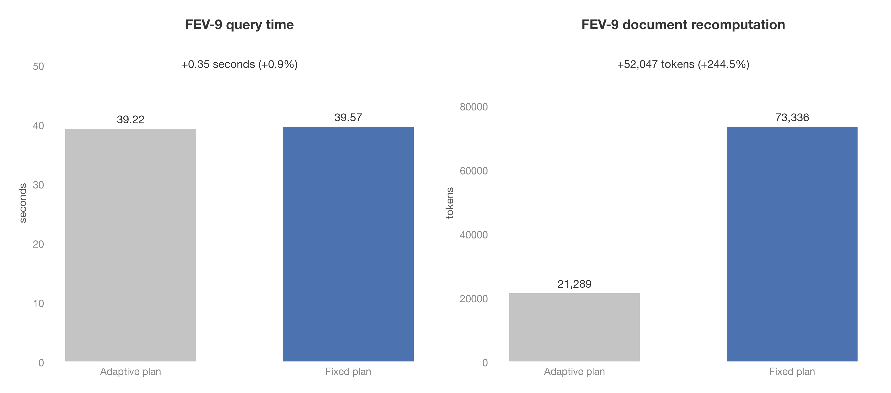

# Fixed join plans on FEV-9

- Quail now chooses the complete join order and anchors before inference.
  The existing Selinger-style search compares partial plans and extends the
  cheapest candidates. Execution follows the saved nodes using actual survivors.
- The first anchor's filters run last and retain passing document KV within
  capacity. Other filter chains release their KV when they finish.
- FEV-9 returned identical answers in this comparison. The fixed plan took
  39.57 seconds, compared with 39.22 seconds for the adaptive baseline.
  The increase was 0.35 seconds, or 0.9%. This run does not show a speed improvement.

Figure: plots/fixed_join_plan.png

| Configuration | Query time, seconds | Document pairs/second | $/query |
|---|---:|---:|---:|
| Adaptive baseline | 39.22 | 4,643.42 | 0.04302 |
| Fixed plan | 39.57 | 4,602.35 | 0.04341 |

- Both configurations evaluated 182,115 document pairs across three join stages.
  Both returned 149,783,486 rows. All four filter answer tables and all three join
  answer tables match exactly, including false answers.
- Query time uses the worker's `wall_s`. Throughput is the sum of evaluated pairs
  across join stages divided by that time. Cost is time in hours times $3.9492,
  from `quail.bench.evaluate.H100_USD_PER_HOUR`. Model startup and result collection
  are excluded. The result was counted without collecting its full text columns.

| KV measurement | Adaptive baseline | Fixed plan |
|---|---:|---:|
| Retained documents after filters | 992 | 171 |
| Retained prefix tokens after filters | 135,181 | 73,336 |
| Anchor documents with reusable KV across join groups | 270 | 171 |
| Anchor documents missing KV across join groups | 72 | 171 |
| Document prefix tokens recomputed | 21,289 | 73,336 |
| Total fresh tokens | 4,328,199 | 4,380,246 |

- The fixed plan reused all 171 first-anchor document prefixes. It recomputed all
  171 prefixes for the later anchor because that collection's filter KV had been
  released. Total fresh tokens increased by 52,047, or 1.2%.
- Keeping only the first anchor reduced retained KV after filters, but sacrificed
  reuse at the later anchor. Removing runtime planning is a separate benefit from
  reducing inference work. The baseline ran the join search twice during execution.
  The fixed executor contains no join search call.

- The setup was FEV-9 at `sf=0.1`, `lf=1`, with Qwen3 4B FP8 on one Modal H100.
  The inputs contained 500 claims and 287 evidence documents. F11 filtered both
  claim aliases, and F13 filtered both evidence aliases before the three joins.
- Each configuration ran in a fresh subprocess on the same physical GPU.
  Each received one full, unmeasured FEV-9 warmup before one measured run.
  The adaptive baseline ran first. Its source commit was `b873066`.
- Both used the same model constants, selectivity estimates, 110,376-token chunk
  budget, and 362,250-token KV arena. Reserving two chunks left 141,498 tokens
  for expected retained KV. No setting was tuned from the measured result.
- Before inference, both planners estimated 8.53 seconds and selected predicates
  0 and 1 anchored on `e1`, followed by predicate 2 anchored on `e2`.
  The adaptive baseline executed that order too. The fixed filter order was
  `c1, c2, e2, e1`, compared with `c1, e1, c2, e2` for the baseline.
- The prediction was that runtime search would disappear and the first anchor's
  filter KV would be reused within capacity. Little runtime change was expected
  if the baseline already retained useful KV. The measured result confirms first
  anchor reuse and shows the cost of discarding the later anchor's KV.
- The 8.53-second estimate substantially underestimated execution time for both
  configurations. The supplied join selectivities were much lower than the
  observed selectivities. Answer equality does not establish that those estimates
  are accurate. One measured run per configuration does not establish a stable
  0.9% performance difference.

- The successful Modal function call was `fc-01M1TG6S9YMR84Z6DX4600MXY2`.
  Data is on `quail-results` at
  `/results/ablations/fixed-join-plan-20260906T043918Z/`.
  `setup.json` records the prediction and GPU identity. Each configuration's
  directory contains `summary.json` with a source hash and the seven answer tables.
- Earlier attempts failed in the comparison script, first during subprocess
  import setup and then while collecting and sorting the large result.
  The measurements above come only from the successful call.
- `reports/make_fixed_join_plan_plots.py` contains the exact volume download
  command. It checks answer equality, prints the measurements, derives changes,
  and generates the figure from the saved volume data.
- All 228 CPU tests pass. They cover incorrect estimates, empty results, partial
  retention, both Quail execution paths, and planning for all four backends.
  Execution tests reject any call to the join optimizer. Ruff, Vulture, and the
  documentation build also pass.
