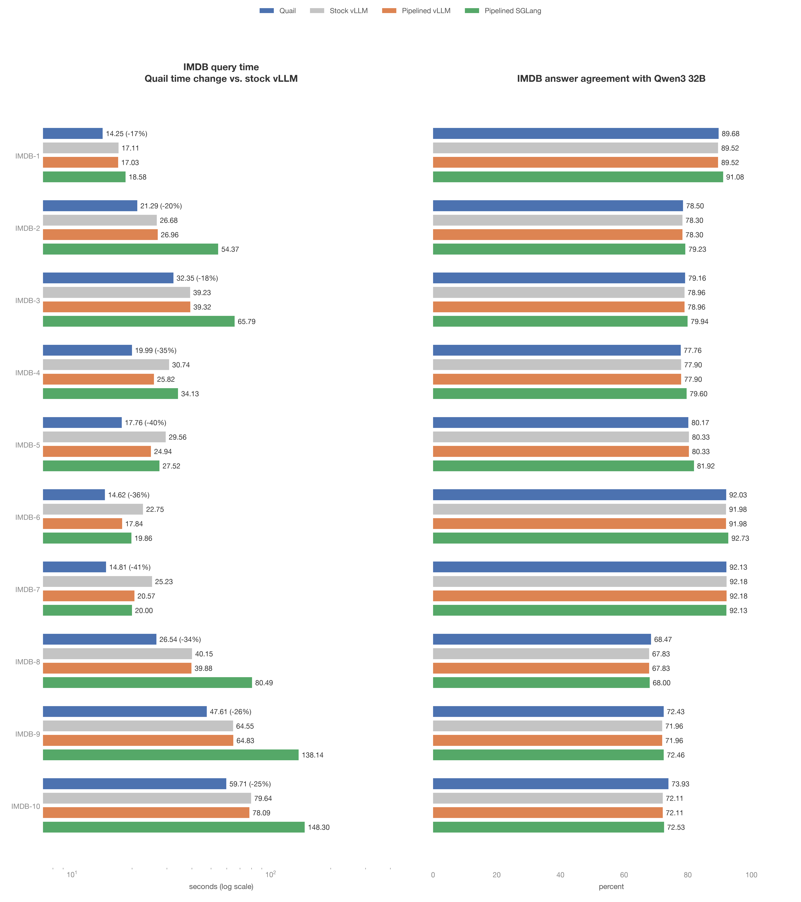
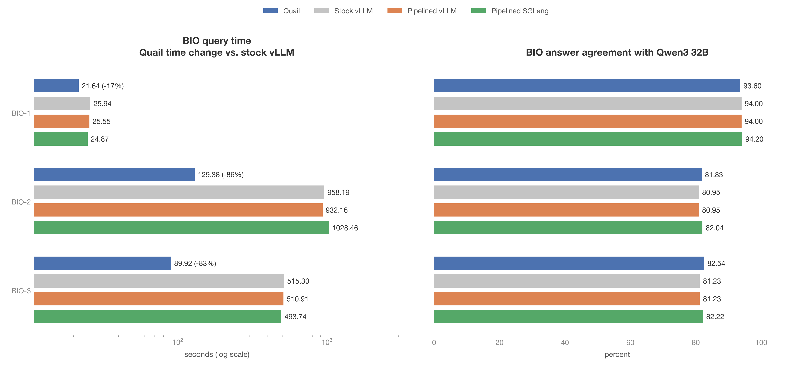
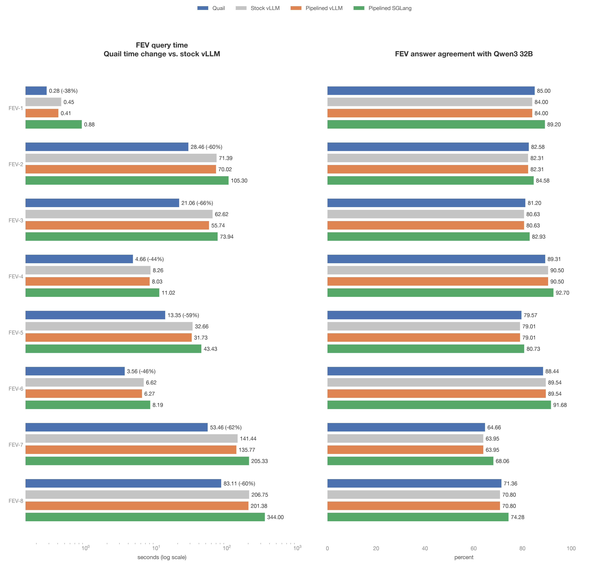
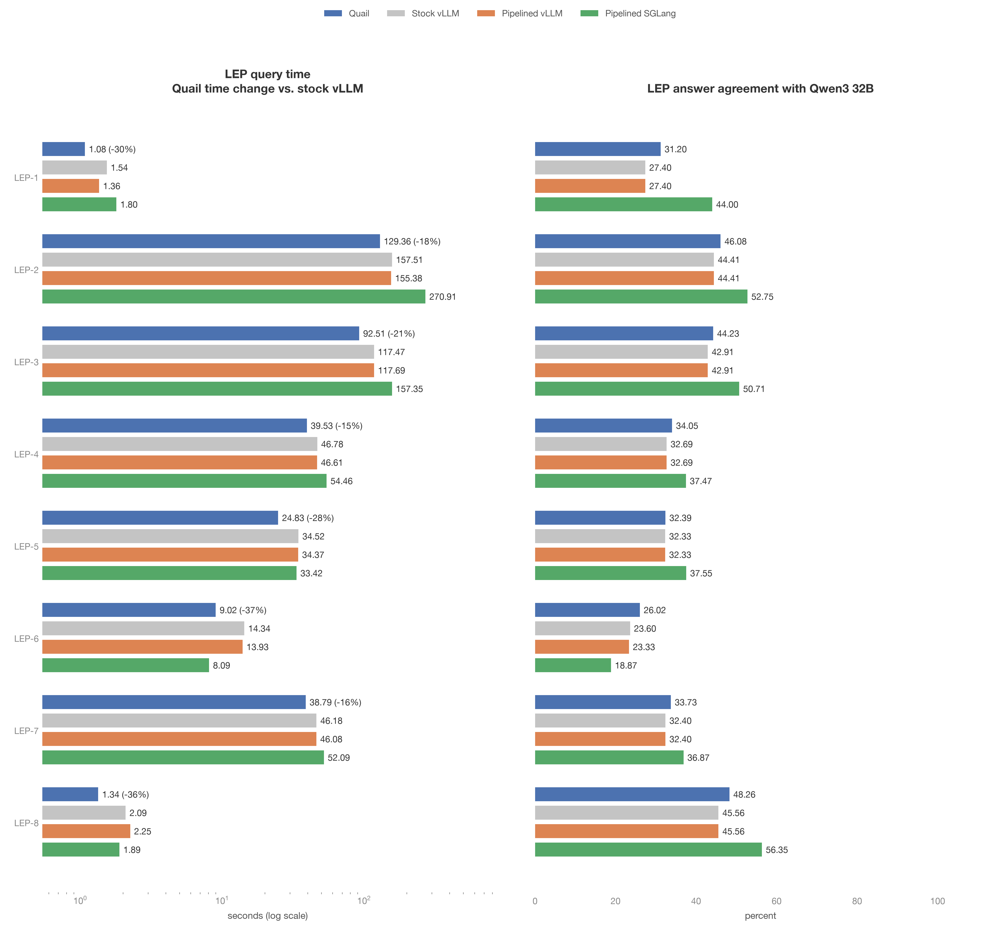
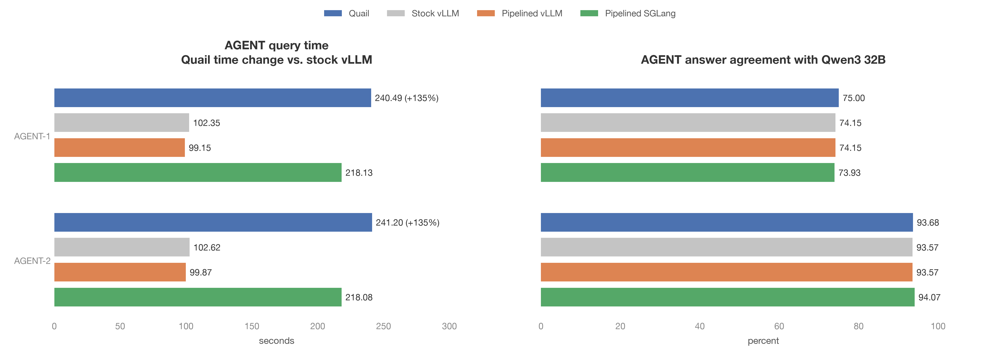

# QUAIL-B comparison from saved results

- The 31 queries below reuse the original measurements from September 5, 2026.
  No inference was rerun for this report. These are historical measurements,
  not a measurement of shared retention on every query.
- The setup was Qwen3 4B FP8, sf=0.1, lf=1, and one H100 per configuration.
  Quail and the vLLM configurations shared a physical GPU within each family.
  SGLang used a separate GPU. Stock vLLM used operator-at-a-time submission.
- FEV-9 now has four filters. The old suite had only one filter for FEV-9,
  so its old measurements are excluded. The current query is reported in
  [the shared retention comparison](2026-09-05-shared-kv-retention.md).
- The prediction for this update was that scoring and plotting would need no
  inference. We reused all 124 saved configurations for the other 31 queries.
- In these saved measurements, Quail was faster than stock vLLM on 29
  of 31 queries. The figures annotate Quail's change in time
  relative to stock vLLM. Positive percentages mean Quail took longer.
- Answer agreement measures evaluated calls against saved Qwen3 32B labels.
  Each method can evaluate different calls after its filters and joins.
  Output precision is the fraction of returned rows matching the reference.
  Output recall is the fraction of reference rows returned. High answer
  agreement can coexist with poor final output precision.
- Query time excludes startup. Throughput counts input documents for filters
  and evaluated document pairs across all stages for joins. GPU cost is query
  seconds divided by 3,600 and multiplied by $3.9492.
- All figures show runtime and answer agreement. The tables also show
  throughput, cost, and final output precision and recall.

Source manifest on `quail-results`: `/results/benchmarks/quailb/family-runs/20260905T021527Z-quailb-sf0.1-lf1-qwen3-4b-fp8-families/manifest.json`.

The manifest lists all four source suite paths. The download commands are
in `reports/make_saved_quailb_plots.py`.

## IMDB

Figure: plots/saved_quailb_imdb.png

| Query | Method | Seconds | Throughput | Unit | $/query | Answer agreement (%) | Output precision (%) | Output recall (%) |
|---|---|---:|---:|---|---:|---:|---:|---:|
| IMDB-1 | Quail | 14.25 | 350.88 | docs/s | 0.01563 | 89.68 | 89.817 | 98.252 |
| IMDB-1 | Stock vLLM | 17.11 | 292.23 | docs/s | 0.01877 | 89.52 | 89.781 | 98.077 |
| IMDB-1 | Pipelined vLLM | 17.03 | 293.60 | docs/s | 0.01868 | 89.52 | 89.781 | 98.077 |
| IMDB-1 | Pipelined SGLang | 18.58 | 269.11 | docs/s | 0.02038 | 91.08 | 92.057 | 97.253 |
| IMDB-2 | Quail | 21.29 | 2,818.22 | pairs/s | 0.02336 | 78.50 | 72.543 | 43.494 |
| IMDB-2 | Stock vLLM | 26.68 | 2,248.88 | pairs/s | 0.02927 | 78.30 | 69.563 | 46.864 |
| IMDB-2 | Pipelined vLLM | 26.96 | 2,225.52 | pairs/s | 0.02958 | 78.30 | 69.563 | 46.864 |
| IMDB-2 | Pipelined SGLang | 54.37 | 1,103.55 | pairs/s | 0.05964 | 79.23 | 70.467 | 50.857 |
| IMDB-3 | Quail | 32.35 | 1,624.73 | pairs/s | 0.03549 | 79.16 | 66.549 | 44.329 |
| IMDB-3 | Stock vLLM | 39.23 | 1,337.96 | pairs/s | 0.04304 | 78.96 | 63.436 | 47.125 |
| IMDB-3 | Pipelined vLLM | 39.32 | 1,334.89 | pairs/s | 0.04313 | 78.96 | 63.436 | 47.125 |
| IMDB-3 | Pipelined SGLang | 65.79 | 771.55 | pairs/s | 0.07217 | 79.94 | 65.386 | 51.218 |
| IMDB-4 | Quail | 19.99 | 754.58 | pairs/s | 0.02193 | 77.76 | 59.54 | 37.707 |
| IMDB-4 | Stock vLLM | 30.74 | 496.94 | pairs/s | 0.03372 | 77.90 | 57.771 | 41.655 |
| IMDB-4 | Pipelined vLLM | 25.82 | 591.63 | pairs/s | 0.02832 | 77.90 | 57.771 | 41.655 |
| IMDB-4 | Pipelined SGLang | 34.13 | 403.63 | pairs/s | 0.03744 | 79.60 | 62.222 | 44.108 |
| IMDB-5 | Quail | 17.76 | 491.22 | pairs/s | 0.01948 | 80.17 | 60.501 | 35.794 |
| IMDB-5 | Stock vLLM | 29.56 | 302.44 | pairs/s | 0.03243 | 80.33 | 58.53 | 40.382 |
| IMDB-5 | Pipelined vLLM | 24.94 | 358.46 | pairs/s | 0.02736 | 80.33 | 58.522 | 40.41 |
| IMDB-5 | Pipelined SGLang | 27.52 | 279.07 | pairs/s | 0.03019 | 81.92 | 62.467 | 40.98 |
| IMDB-6 | Quail | 14.62 | 342.00 | docs/s | 0.01604 | 92.03 | 73.27 | 89.591 |
| IMDB-6 | Stock vLLM | 22.75 | 219.78 | docs/s | 0.02496 | 91.98 | 72.506 | 89.786 |
| IMDB-6 | Pipelined vLLM | 17.84 | 280.27 | docs/s | 0.01957 | 91.98 | 72.506 | 89.786 |
| IMDB-6 | Pipelined SGLang | 19.86 | 251.76 | docs/s | 0.02179 | 92.73 | 77.787 | 86.868 |
| IMDB-7 | Quail | 14.81 | 337.61 | docs/s | 0.01625 | 92.13 | 72.352 | 78.743 |
| IMDB-7 | Stock vLLM | 25.23 | 198.18 | docs/s | 0.02768 | 92.18 | 71.812 | 80.09 |
| IMDB-7 | Pipelined vLLM | 20.57 | 243.07 | docs/s | 0.02257 | 92.18 | 71.812 | 80.09 |
| IMDB-7 | Pipelined SGLang | 20.00 | 250.00 | docs/s | 0.02194 | 92.13 | 76.719 | 73.503 |
| IMDB-8 | Quail | 26.54 | 3,458.48 | pairs/s | 0.02911 | 68.47 | 20.407 | 27.098 |
| IMDB-8 | Stock vLLM | 40.15 | 2,293.60 | pairs/s | 0.04404 | 67.83 | 19.224 | 28.623 |
| IMDB-8 | Pipelined vLLM | 39.88 | 2,309.13 | pairs/s | 0.04375 | 67.83 | 19.224 | 28.623 |
| IMDB-8 | Pipelined SGLang | 80.49 | 1,135.59 | pairs/s | 0.08830 | 68.00 | 19.894 | 31.515 |
| IMDB-9 | Quail | 47.61 | 3,188.15 | pairs/s | 0.05223 | 72.43 | 17.624 | 13.171 |
| IMDB-9 | Stock vLLM | 64.55 | 2,356.13 | pairs/s | 0.07081 | 71.96 | 16.224 | 14.712 |
| IMDB-9 | Pipelined vLLM | 64.83 | 2,345.95 | pairs/s | 0.07112 | 71.96 | 16.224 | 14.712 |
| IMDB-9 | Pipelined SGLang | 138.14 | 1,096.02 | pairs/s | 0.15154 | 72.46 | 16.636 | 17.024 |
| IMDB-10 | Quail | 59.71 | 2,522.19 | pairs/s | 0.06550 | 73.93 | 16.265 | 13.507 |
| IMDB-10 | Stock vLLM | 79.64 | 1,815.37 | pairs/s | 0.08737 | 72.11 | 14.876 | 14.885 |
| IMDB-10 | Pipelined vLLM | 78.09 | 1,851.40 | pairs/s | 0.08566 | 72.11 | 14.876 | 14.885 |
| IMDB-10 | Pipelined SGLang | 148.30 | 958.62 | pairs/s | 0.16269 | 72.53 | 15.515 | 17.219 |

## BIO

Figure: plots/saved_quailb_bio.png

| Query | Method | Seconds | Throughput | Unit | $/query | Answer agreement (%) | Output precision (%) | Output recall (%) |
|---|---|---:|---:|---|---:|---:|---:|---:|
| BIO-1 | Quail | 21.64 | 23.11 | docs/s | 0.02374 | 93.60 | 100 | 89.542 |
| BIO-1 | Stock vLLM | 25.94 | 19.28 | docs/s | 0.02846 | 94.00 | 100 | 90.196 |
| BIO-1 | Pipelined vLLM | 25.55 | 19.57 | docs/s | 0.02803 | 94.00 | 100 | 90.196 |
| BIO-1 | Pipelined SGLang | 24.87 | 20.10 | docs/s | 0.02728 | 94.20 | 100 | 90.523 |
| BIO-2 | Quail | 129.38 | 4,355.39 | pairs/s | 0.14193 | 81.83 | 14.167 | 85.959 |
| BIO-2 | Stock vLLM | 958.19 | 588.09 | pairs/s | 1.05113 | 80.95 | 13.625 | 86.283 |
| BIO-2 | Pipelined vLLM | 932.16 | 604.51 | pairs/s | 1.02258 | 80.95 | 13.625 | 86.283 |
| BIO-2 | Pipelined SGLang | 1028.46 | 547.91 | pairs/s | 1.12822 | 82.04 | 14.271 | 85.578 |
| BIO-3 | Quail | 89.92 | 3,434.14 | pairs/s | 0.09864 | 82.54 | 14.733 | 79.917 |
| BIO-3 | Stock vLLM | 515.30 | 603.63 | pairs/s | 0.56528 | 81.23 | 13.912 | 81.171 |
| BIO-3 | Pipelined vLLM | 510.91 | 608.82 | pairs/s | 0.56047 | 81.23 | 13.912 | 81.171 |
| BIO-3 | Pipelined SGLang | 493.74 | 632.27 | pairs/s | 0.54163 | 82.22 | 14.536 | 81.012 |

## FEV

Figure: plots/saved_quailb_fev.png

| Query | Method | Seconds | Throughput | Unit | $/query | Answer agreement (%) | Output precision (%) | Output recall (%) |
|---|---|---:|---:|---|---:|---:|---:|---:|
| FEV-1 | Quail | 0.28 | 1,785.71 | docs/s | 0.00031 | 85.00 | 80.609 | 98.311 |
| FEV-1 | Stock vLLM | 0.45 | 1,111.11 | docs/s | 0.00049 | 84.00 | 78.877 | 99.662 |
| FEV-1 | Pipelined vLLM | 0.41 | 1,219.51 | docs/s | 0.00045 | 84.00 | 78.877 | 99.662 |
| FEV-1 | Pipelined SGLang | 0.88 | 568.18 | docs/s | 0.00097 | 89.20 | 85.174 | 98.986 |
| FEV-2 | Quail | 28.46 | 5,042.16 | pairs/s | 0.03122 | 82.58 | 1.1787 | 95.82 |
| FEV-2 | Stock vLLM | 71.39 | 2,010.09 | pairs/s | 0.07831 | 82.31 | 1.1645 | 96.141 |
| FEV-2 | Pipelined vLLM | 70.02 | 2,049.41 | pairs/s | 0.07681 | 82.31 | 1.1645 | 96.141 |
| FEV-2 | Pipelined SGLang | 105.30 | 1,362.77 | pairs/s | 0.11551 | 84.58 | 1.3339 | 96.141 |
| FEV-3 | Quail | 21.06 | 4,919.61 | pairs/s | 0.02310 | 81.20 | 0.89349 | 95.135 |
| FEV-3 | Stock vLLM | 62.62 | 1,714.12 | pairs/s | 0.06869 | 80.63 | 0.85189 | 96.757 |
| FEV-3 | Pipelined vLLM | 55.74 | 1,925.69 | pairs/s | 0.06115 | 80.63 | 0.85189 | 96.757 |
| FEV-3 | Pipelined SGLang | 73.94 | 1,335.24 | pairs/s | 0.08111 | 82.93 | 1.0309 | 95.135 |
| FEV-4 | Quail | 4.66 | 2,894.64 | pairs/s | 0.00511 | 89.31 | 0.73677 | 78.571 |
| FEV-4 | Stock vLLM | 8.26 | 1,772.03 | pairs/s | 0.00906 | 90.50 | 0.76655 | 78.571 |
| FEV-4 | Pipelined vLLM | 8.03 | 1,822.79 | pairs/s | 0.00881 | 90.50 | 0.76655 | 78.571 |
| FEV-4 | Pipelined SGLang | 11.02 | 1,119.87 | pairs/s | 0.01209 | 92.70 | 1.174 | 78.571 |
| FEV-5 | Quail | 13.35 | 4,624.04 | pairs/s | 0.01464 | 79.57 | 1.0522 | 96.429 |
| FEV-5 | Stock vLLM | 32.66 | 1,969.63 | pairs/s | 0.03583 | 79.01 | 0.99111 | 97.143 |
| FEV-5 | Pipelined vLLM | 31.73 | 2,027.36 | pairs/s | 0.03481 | 79.01 | 0.99111 | 97.143 |
| FEV-5 | Pipelined SGLang | 43.43 | 1,338.61 | pairs/s | 0.04764 | 80.73 | 1.1812 | 96.429 |
| FEV-6 | Quail | 3.56 | 2,257.58 | pairs/s | 0.00391 | 88.44 | 0.998 | 76.923 |
| FEV-6 | Stock vLLM | 6.62 | 1,325.08 | pairs/s | 0.00726 | 89.54 | 1.0215 | 76.923 |
| FEV-6 | Pipelined vLLM | 6.27 | 1,399.04 | pairs/s | 0.00688 | 89.54 | 1.0215 | 76.923 |
| FEV-6 | Pipelined SGLang | 8.19 | 887.30 | pairs/s | 0.00898 | 91.68 | 1.5267 | 76.923 |
| FEV-7 | Quail | 53.46 | 5,030.28 | pairs/s | 0.05865 | 64.66 | 0.00029045 | 15.652 |
| FEV-7 | Stock vLLM | 141.44 | 1,899.26 | pairs/s | 0.15516 | 63.95 | 0.0003172 | 17.391 |
| FEV-7 | Pipelined vLLM | 135.77 | 1,978.58 | pairs/s | 0.14894 | 63.95 | 0.0003172 | 17.391 |
| FEV-7 | Pipelined SGLang | 205.33 | 1,285.93 | pairs/s | 0.22525 | 68.06 | 0.00033273 | 15.652 |
| FEV-8 | Quail | 83.11 | 5,100.46 | pairs/s | 0.09117 | 71.36 | 3.5365e-06 | 13.986 |
| FEV-8 | Stock vLLM | 206.75 | 2,053.07 | pairs/s | 0.22680 | 70.80 | 4.6155e-06 | 18.881 |
| FEV-8 | Pipelined vLLM | 201.38 | 2,107.82 | pairs/s | 0.22091 | 70.80 | 4.6155e-06 | 18.881 |
| FEV-8 | Pipelined SGLang | 344.00 | 1,226.42 | pairs/s | 0.37737 | 74.28 | 5.0116e-06 | 15.385 |

## LEP

Figure: plots/saved_quailb_lep.png

| Query | Method | Seconds | Throughput | Unit | $/query | Answer agreement (%) | Output precision (%) | Output recall (%) |
|---|---|---:|---:|---|---:|---:|---:|---:|
| LEP-1 | Quail | 1.08 | 462.96 | docs/s | 0.00118 | 31.20 | 3.6517 | 92.857 |
| LEP-1 | Stock vLLM | 1.54 | 324.68 | docs/s | 0.00169 | 27.40 | 3.7135 | 100 |
| LEP-1 | Pipelined vLLM | 1.36 | 367.65 | docs/s | 0.00149 | 27.40 | 3.7135 | 100 |
| LEP-1 | Pipelined SGLang | 1.80 | 277.78 | docs/s | 0.00197 | 44.00 | 4.4521 | 92.857 |
| LEP-2 | Quail | 129.36 | 1,673.62 | pairs/s | 0.14191 | 46.08 | 0.41551 | 97.4 |
| LEP-2 | Stock vLLM | 157.51 | 1,374.52 | pairs/s | 0.17279 | 44.41 | 0.40554 | 98 |
| LEP-2 | Pipelined vLLM | 155.38 | 1,393.36 | pairs/s | 0.17045 | 44.41 | 0.40554 | 98 |
| LEP-2 | Pipelined SGLang | 270.91 | 799.16 | pairs/s | 0.29719 | 52.75 | 0.47102 | 96.8 |
| LEP-3 | Quail | 92.51 | 1,666.28 | pairs/s | 0.10148 | 44.23 | 0.015075 | 92.857 |
| LEP-3 | Stock vLLM | 117.47 | 1,389.64 | pairs/s | 0.12886 | 42.91 | 0.014976 | 100 |
| LEP-3 | Pipelined vLLM | 117.69 | 1,387.04 | pairs/s | 0.12911 | 42.91 | 0.014976 | 100 |
| LEP-3 | Pipelined SGLang | 157.35 | 803.53 | pairs/s | 0.17261 | 50.71 | 0.020779 | 92.857 |
| LEP-4 | Quail | 39.53 | 1,643.06 | pairs/s | 0.04336 | 34.05 | 0.011608 | 100 |
| LEP-4 | Stock vLLM | 46.78 | 1,406.93 | pairs/s | 0.05132 | 32.69 | 0.011225 | 100 |
| LEP-4 | Pipelined vLLM | 46.61 | 1,412.06 | pairs/s | 0.05113 | 32.69 | 0.011225 | 100 |
| LEP-4 | Pipelined SGLang | 54.46 | 810.98 | pairs/s | 0.05974 | 37.47 | 0.017967 | 100 |
| LEP-5 | Quail | 24.83 | 1,604.35 | pairs/s | 0.02724 | 32.39 | 0 | 0 |
| LEP-5 | Stock vLLM | 34.52 | 1,379.78 | pairs/s | 0.03787 | 32.33 | 0 | 0 |
| LEP-5 | Pipelined vLLM | 34.37 | 1,385.80 | pairs/s | 0.03770 | 32.33 | 0 | 0 |
| LEP-5 | Pipelined SGLang | 33.42 | 803.29 | pairs/s | 0.03666 | 37.55 | 0 | 0 |
| LEP-6 | Quail | 9.02 | 1,440.13 | pairs/s | 0.00989 | 26.02 | 0 | 0 |
| LEP-6 | Stock vLLM | 14.34 | 1,238.01 | pairs/s | 0.01573 | 23.60 | 0 | 0 |
| LEP-6 | Pipelined vLLM | 13.93 | 1,243.36 | pairs/s | 0.01528 | 23.33 | 0 | 0 |
| LEP-6 | Pipelined SGLang | 8.09 | 695.80 | pairs/s | 0.00887 | 18.87 | 0 | 0 |
| LEP-7 | Quail | 38.79 | 1,624.13 | pairs/s | 0.04255 | 33.73 | 0.0071088 | 100 |
| LEP-7 | Stock vLLM | 46.18 | 1,385.71 | pairs/s | 0.05066 | 32.40 | 0.0068622 | 100 |
| LEP-7 | Pipelined vLLM | 46.08 | 1,388.72 | pairs/s | 0.05055 | 32.40 | 0.0068622 | 100 |
| LEP-7 | Pipelined SGLang | 52.09 | 793.05 | pairs/s | 0.05714 | 36.87 | 0.011324 | 100 |
| LEP-8 | Quail | 1.34 | 373.13 | docs/s | 0.00147 | 48.26 | 0 | 0 |
| LEP-8 | Stock vLLM | 2.09 | 239.23 | docs/s | 0.00229 | 45.56 | 0 | 0 |
| LEP-8 | Pipelined vLLM | 2.25 | 222.22 | docs/s | 0.00247 | 45.56 | 0 | 0 |
| LEP-8 | Pipelined SGLang | 1.89 | 264.55 | docs/s | 0.00207 | 56.35 | 0 | 0 |

## AGENT

Figure: plots/saved_quailb_agent.png

| Query | Method | Seconds | Throughput | Unit | $/query | Answer agreement (%) | Output precision (%) | Output recall (%) |
|---|---|---:|---:|---|---:|---:|---:|---:|
| AGENT-1 | Quail | 240.49 | 7.37 | docs/s | 0.26382 | 75.00 | 68.605 | 41.331 |
| AGENT-1 | Stock vLLM | 102.35 | 17.31 | docs/s | 0.11228 | 74.15 | 65.915 | 40.981 |
| AGENT-1 | Pipelined vLLM | 99.15 | 17.87 | docs/s | 0.10877 | 74.15 | 65.915 | 40.981 |
| AGENT-1 | Pipelined SGLang | 218.13 | 8.12 | docs/s | 0.23929 | 73.93 | 67.085 | 37.478 |
| AGENT-2 | Quail | 241.20 | 7.35 | docs/s | 0.26460 | 93.68 | 83.465 | 98.696 |
| AGENT-2 | Stock vLLM | 102.62 | 17.27 | docs/s | 0.11257 | 93.57 | 83.099 | 98.883 |
| AGENT-2 | Pipelined vLLM | 99.87 | 17.74 | docs/s | 0.10956 | 93.57 | 83.099 | 98.883 |
| AGENT-2 | Pipelined SGLang | 218.08 | 8.13 | docs/s | 0.23923 | 94.07 | 84.951 | 97.765 |
