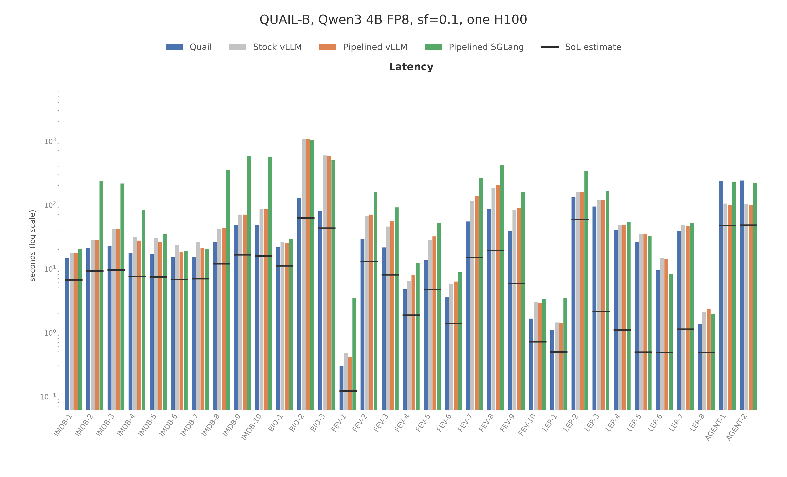
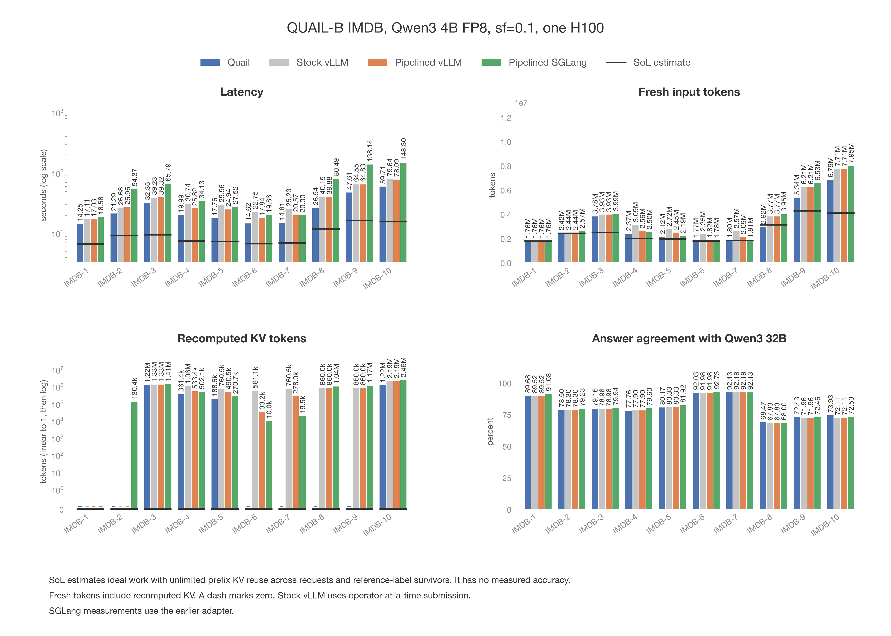
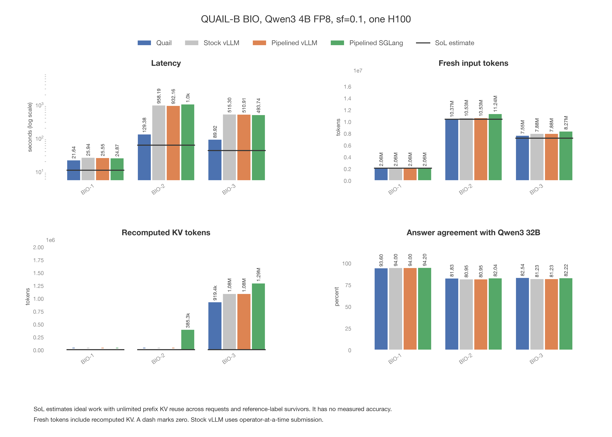
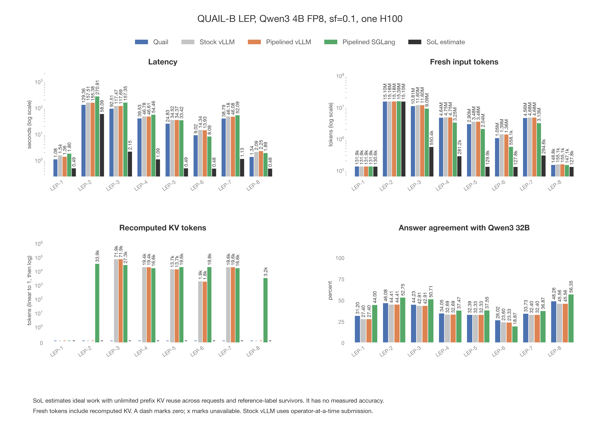
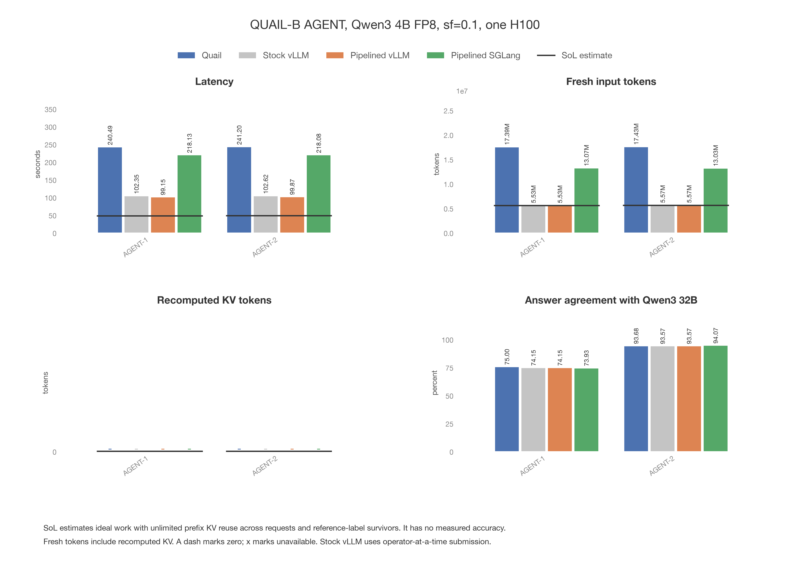

# QUAIL-B comparison from saved results

- The main PDF covers all 33 queries with grouped bars and one metric per page.
  Its final page lists input document counts. Each dataset PDF has a page
  of four bar charts and a separate input-count page. Text and marks remain
  vector content when zoomed. The PNGs below are first-page previews.
- The five dataset plots use the same
  method colors and definitions for latency, recomputed KV tokens, fresh
  input tokens, accuracy, and input document counts for every relation alias.
- 31 queries reuse the original measurements from September 5, 2026.
  FEV-9 was rerun on September 6, 2026, with all four methods. FEV-10
  joined the benchmark on September 11, 2026, and was measured that day
  with all four methods.
  FEV-9 and FEV-10 use SGLang with all anchors submitted per partner, without client tiles or request slices.
  Other queries retain historical SGLang measurements with the earlier adapter.
  The other queries are not new measurements of shared retention.
- The setup was Qwen3 4B FP8, sf=0.1, lf=1, and one H100 per configuration.
  Quail and the vLLM configurations shared a physical GPU within each family.
  SGLang used a separate GPU. Stock vLLM used operator-at-a-time submission.
- FEV-9 has four filters and three joins. All four methods now use that
  query definition in both the main plot and the FEVER plot.
  The [FEV-9 comparison](2026-09-06-sglang-baseline.md) records the new run.
  The [retention report](2026-09-05-shared-kv-retention.md) records the earlier ablation.
- The revised SGLang adapter took 135.74 seconds on FEV-9,
  compared with 138.26 seconds using its earlier submission policy.
  Fresh computation was 4,095,266 tokens, compared with 4,096,274 before.
  The intermediate run with vLLM's pair order took 304.92 seconds
  and computed 20,388,882 fresh tokens. The current SGLang order
  separates requests sharing an anchor so earlier requests can populate reusable KV.
- We predicted Quail would remain near 39 seconds and beat the baselines.
  It took 39.59 seconds in the new run. We reused all 124 saved
  configurations for the other 31 queries.
- In these saved measurements, Quail was faster than stock vLLM on 31
  of 33 comparable queries.
- A horizontal line across each query's bar group shows its SoL estimate.
  SoL models ideal computation and memory traffic with unlimited prefix KV.
  It credits matching token prefixes across requests, documents, and aliases.
  It uses exact reference-label survivors and searches supported left-deep
  join plans. Different answers can change the work done by measured runs,
  so the gap from SoL is not purely execution overhead.
- SoL uses the distinct-prefix estimate, not the per-document-only estimate.
  Its latency, fresh-token count, and zero prefix recomputation are estimates.
  No accuracy is assigned to SoL because it is not a measured model run.
  Matching document prefixes are reusable; a partner suffix after a different
  anchor context is not an identical prefix and is still computed.
- SoL was recalculated for all 33 queries on the CPU on September 11, 2026,
  from saved labels and corpus rows. The 32 earlier estimates are unchanged
  to the printed precision. Calculating SoL required no GPU inference.
- FEV-10 is FEV-5 with one ordinary equality in the join: SUPPORT is asked
  only of a claim and its own Wikipedia page. It is the only query whose
  join has an equality. Predicted before its run: 3 to 5 seconds on stock
  and pipelined vLLM and 4 to 7 on pipelined SGLang, against FEV-5's
  32.66, 31.73, and 43.43. Measured: Quail 1.69 seconds,
  stock vLLM 2.97, pipelined vLLM 2.91, and pipelined SGLang
  3.32, with 187,567, 270,220, 270,220, and
  267,414 fresh tokens. The [feature note](shipped_features/2026-09-11-streamed-edges-pair-joins-plan-edits.md)
  records the Quail run and the prediction for the baselines.
- FEV-9 SoL is 5.821 seconds with shared-prefix reuse,
  compared with 6.337 seconds with reuse only
  within each document. These estimates use reference-label survivors.
- Answer agreement measures evaluated calls against saved Qwen3 32B labels.
  Each method can evaluate different calls after its filters and joins.
  Output precision is the fraction of returned rows matching the reference.
  Output recall is the fraction of reference rows returned. High answer
  agreement can coexist with poor final output precision.
- Query time excludes startup. Throughput counts input documents for filters
  and evaluated document pairs across all stages for joins. GPU cost is query
  seconds divided by 3,600 and multiplied by $3.9492.
- Fresh input tokens are input token positions processed by a model forward
  pass instead of read from existing KV. They include document and prompt
  suffix tokens, and any repeated computation after KV becomes unavailable.
  A repeated token counts again. This is not a count of unique text or
  generated answers. Recomputed KV tokens are part of the fresh-token total.
- Recomputed KV is the saved `regret_distinct_tokens`: input tokens a
  forward pass computed although the same prefix had already been
  computed in this query, either a document's own prefix at a later
  stage or anchor use, or the prompt prefix the documents share. It is
  derived on the CPU after the run (`quail/runtime/prefixes.py`) from
  the per-document `regret_tokens`, the corpus's shared prefix tokens,
  and the cross-row cache hits the engine reported; the engine tracks
  nothing extra. The earlier SGLang adapter's cross-row count for FEV-7
  and FEV-8 equals the whole evidence set (125,851 tokens), more than
  any prefix the trie credits, so their recomputed KV is not measured.
  Token and latency plots use a log scale when positive values span more
  than one order of magnitude. Recomputed KV retains a linear region to
  include zero. A dash marks zero.
- Document counts come from the saved corpus manifest and describe inputs
  before filtering. Repeated aliases each list their full input count.
  The report tables also show throughput, GPU cost, and final output quality.
- FEV-9 agrees with the reference on 67.77% of evaluated answers. Its final
  output matches only 5 reference rows out of 149,783,486 returned rows.
  The reference has 11 rows, so output precision is approximately 0.00000334%
  and recall is 45.45%.

[Open the main vector PDF](plots/quailb_main.pdf)

Figure: plots/quailb_main.png

Source manifest on `quail-results`: `/results/benchmarks/quailb/family-runs/20260905T021527Z-quailb-sf0.1-lf1-qwen3-4b-fp8-families/manifest.json`.

FEV-9 Quail and vLLM manifest on `quail-results`: `/results/benchmarks/quailb/family-runs/20260906T211500Z-quailb-sf0.1-lf1-qwen3-4b-fp8-families/manifest.json`.

Current FEV-9 SGLang result on `quail-results`: `/results/benchmarks/quailb/families/20260906T222629Z-sglang-suffix-major/fever-sglang-process.json`.

FEV-10 run on `quail-results`: `/results/benchmarks/quailb/family-runs/20260911T201441Z-d16f87d8/` (function call `fc-01M291TJ6YBBJZJVDCVKK0VYP8` for Quail and vLLM, `fc-01M291TJ8RBPP4RP4HW9XQAQ0G` for SGLang).

SoL estimates on `quail-results`: `/results/sol/2026-09-11-quailb-prefix-reuse.json`.

The FEV-10 estimate is also saved separately at `/results/sol/2026-09-11-fev10-prefix-reuse.json`, and the FEV-9 one at `/results/sol/2026-09-06-fev9-prefix-reuse.json`.

Corpus counts on `quail-results`: `/results/ground_truth/quailb/schema_v1/corpora/c_1aa2c4f0d0b6c816fd37aa5748c33341/manifest.json`.

The manifest lists all four source suite paths. The download commands are
in `reports/make_quailb_comparison_plots.py`.

## IMDB

[Open the IMDB vector PDF](plots/quailb_imdb.pdf)

Figure: plots/quailb_imdb.png

| Query | Input documents by alias and set |
|---|---|
| IMDB-1 | r (reviews) = 5,000 |
| IMDB-2 | r (reviews) = 5,000, a (aspects) = 12 |
| IMDB-3 | r (reviews) = 5,000, a (aspects) = 12 |
| IMDB-4 | r (reviews) = 5,000, a (aspects) = 12 |
| IMDB-5 | r (reviews) = 5,000, a (aspects) = 12 |
| IMDB-6 | r (reviews) = 5,000 |
| IMDB-7 | r (reviews) = 5,000 |
| IMDB-8 | r (reviews) = 5,000, a (aspects) = 12, a2 (aspects) = 12 |
| IMDB-9 | r1 (reviews) = 5,000, a1 (aspects) = 12, r2 (reviews) = 5,000, a2 (aspects) = 12 |
| IMDB-10 | r1 (reviews) = 5,000, a1 (aspects) = 12, r2 (reviews) = 5,000, a2 (aspects) = 12 |

| Query | Method | Seconds | Recomputed KV tokens | Fresh input tokens | Throughput | Unit | $/query | Answer agreement (%) | Output precision (%) | Output recall (%) |
|---|---|---:|---:|---:|---:|---|---:|---:|---:|---:|
| IMDB-1 | Quail | 14.24 | 10,355 | 1,759,232 | 351.12 | docs/s | 0.01562 | 89.68 | 89.817 | 98.252 |
| IMDB-1 | Stock vLLM | 17.11 | 10,103 | 1,758,944 | 292.23 | docs/s | 0.01877 | 89.52 | 89.781 | 98.077 |
| IMDB-1 | Pipelined vLLM | 17.03 | 10,103 | 1,758,944 | 293.60 | docs/s | 0.01868 | 89.52 | 89.781 | 98.077 |
| IMDB-1 | Pipelined SGLang | 18.58 | 10,355 | 1,759,232 | 269.11 | docs/s | 0.02038 | 91.08 | 92.057 | 97.253 |
| IMDB-1 | SoL estimate | 6.653 | 0 (assumed) | 1,740,485 | 751.59 | docs/s | 0.00730 | Not measured | Not measured | Not measured |
| IMDB-2 | Quail | 20.92 | 10,355 | 2,419,232 | 2,868.07 | pairs/s | 0.02295 | 78.50 | 72.543 | 43.494 |
| IMDB-2 | Stock vLLM | 26.68 | 10,105 | 2,439,624 | 2,248.88 | pairs/s | 0.02927 | 78.30 | 69.563 | 46.864 |
| IMDB-2 | Pipelined vLLM | 26.96 | 10,105 | 2,439,624 | 2,225.52 | pairs/s | 0.02958 | 78.30 | 69.563 | 46.864 |
| IMDB-2 | Pipelined SGLang | 54.37 | 140,739 | 2,573,144 | 1,103.55 | pairs/s | 0.05964 | 79.23 | 70.467 | 50.857 |
| IMDB-2 | SoL estimate | 9.211 | 0 (assumed) | 2,400,485 | 6,513.89 | pairs/s | 0.01010 | Not measured | Not measured | Not measured |
| IMDB-3 | Quail | 22.20 | 10,355 | 2,560,772 | 2,367.57 | pairs/s | 0.02435 | 79.16 | 66.549 | 44.329 |
| IMDB-3 | Stock vLLM | 39.23 | 1,336,535 | 3,933,798 | 1,337.96 | pairs/s | 0.04304 | 78.96 | 63.436 | 47.125 |
| IMDB-3 | Pipelined vLLM | 39.32 | 1,336,535 | 3,933,798 | 1,334.89 | pairs/s | 0.04313 | 78.96 | 63.436 | 47.125 |
| IMDB-3 | Pipelined SGLang | 65.79 | 1,422,211 | 3,994,150 | 771.55 | pairs/s | 0.07217 | 79.94 | 65.386 | 51.218 |
| IMDB-3 | SoL estimate | 9.495 | 0 (assumed) | 2,473,217 | 5,060.17 | pairs/s | 0.01042 | Not measured | Not measured | Not measured |
| IMDB-4 | Quail | 17.34 | 10,355 | 2,004,176 | 869.90 | pairs/s | 0.01902 | 77.76 | 59.54 | 37.707 |
| IMDB-4 | Stock vLLM | 30.74 | 1,071,418 | 3,091,846 | 496.94 | pairs/s | 0.03372 | 77.90 | 57.771 | 41.655 |
| IMDB-4 | Pipelined vLLM | 25.82 | 543,013 | 2,563,494 | 591.63 | pairs/s | 0.02832 | 77.90 | 57.771 | 41.655 |
| IMDB-4 | Pipelined SGLang | 34.13 | 512,141 | 2,495,093 | 403.63 | pairs/s | 0.03744 | 79.60 | 62.222 | 44.108 |
| IMDB-4 | SoL estimate | 7.519 | 0 (assumed) | 1,960,727 | 1,640.73 | pairs/s | 0.00825 | Not measured | Not measured | Not measured |
| IMDB-5 | Quail | 16.52 | 10,355 | 1,929,643 | 528.09 | pairs/s | 0.01812 | 80.17 | 60.501 | 35.794 |
| IMDB-5 | Stock vLLM | 29.56 | 770,602 | 2,716,776 | 302.44 | pairs/s | 0.03243 | 80.33 | 58.53 | 40.382 |
| IMDB-5 | Pipelined vLLM | 24.94 | 500,133 | 2,446,376 | 358.46 | pairs/s | 0.02736 | 80.33 | 58.522 | 40.41 |
| IMDB-5 | Pipelined SGLang | 27.52 | 280,736 | 2,186,065 | 279.07 | pairs/s | 0.03019 | 81.92 | 62.467 | 40.98 |
| IMDB-5 | SoL estimate | 7.405 | 0 (assumed) | 1,930,916 | 1,082.48 | pairs/s | 0.00812 | Not measured | Not measured | Not measured |
| IMDB-6 | Quail | 14.70 | 10,355 | 1,774,145 | 340.14 | docs/s | 0.01613 | 92.03 | 73.27 | 89.591 |
| IMDB-6 | Stock vLLM | 22.75 | 571,239 | 2,346,479 | 219.78 | docs/s | 0.02496 | 91.98 | 72.506 | 89.786 |
| IMDB-6 | Pipelined vLLM | 17.84 | 42,834 | 1,818,127 | 280.27 | docs/s | 0.01957 | 91.98 | 72.506 | 89.786 |
| IMDB-6 | Pipelined SGLang | 19.86 | 19,994 | 1,781,101 | 251.76 | docs/s | 0.02179 | 92.73 | 77.787 | 86.868 |
| IMDB-6 | SoL estimate | 6.780 | 0 (assumed) | 1,772,603 | 737.51 | docs/s | 0.00744 | Not measured | Not measured | Not measured |
| IMDB-7 | Quail | 15.18 | 10,355 | 1,796,602 | 329.38 | docs/s | 0.01665 | 92.13 | 72.352 | 78.743 |
| IMDB-7 | Stock vLLM | 25.23 | 770,615 | 2,574,289 | 198.18 | docs/s | 0.02768 | 92.18 | 71.812 | 80.09 |
| IMDB-7 | Pipelined vLLM | 20.57 | 287,650 | 2,091,393 | 243.07 | docs/s | 0.02257 | 92.18 | 71.812 | 80.09 |
| IMDB-7 | Pipelined SGLang | 20.00 | 29,533 | 1,809,965 | 250.00 | docs/s | 0.02194 | 92.13 | 76.719 | 73.503 |
| IMDB-7 | SoL estimate | 6.922 | 0 (assumed) | 1,808,672 | 722.34 | docs/s | 0.00759 | Not measured | Not measured | Not measured |
| IMDB-8 | Quail | 25.63 | 10,355 | 2,918,999 | 3,581.27 | pairs/s | 0.02812 | 68.47 | 20.407 | 27.098 |
| IMDB-8 | Stock vLLM | 40.15 | 870,137 | 3,773,186 | 2,293.60 | pairs/s | 0.04404 | 67.83 | 19.224 | 28.623 |
| IMDB-8 | Pipelined vLLM | 39.88 | 870,137 | 3,773,186 | 2,309.13 | pairs/s | 0.04375 | 67.83 | 19.224 | 28.623 |
| IMDB-8 | Pipelined SGLang | 80.49 | 1,053,907 | 3,953,343 | 1,135.59 | pairs/s | 0.08830 | 68.00 | 19.894 | 31.515 |
| IMDB-8 | SoL estimate | 11.903 | 0 (assumed) | 3,092,768 | 8,772.07 | pairs/s | 0.01306 | Not measured | Not measured | Not measured |
| IMDB-9 | Quail | 46.97 | 1,504,587 | 5,338,231 | 3,231.59 | pairs/s | 0.05153 | 72.43 | 17.624 | 13.171 |
| IMDB-9 | Stock vLLM | 64.55 | 880,242 | 6,212,810 | 2,356.13 | pairs/s | 0.07081 | 71.96 | 16.224 | 14.712 |
| IMDB-9 | Pipelined vLLM | 64.83 | 880,242 | 6,212,810 | 2,345.95 | pairs/s | 0.07112 | 71.96 | 16.224 | 14.712 |
| IMDB-9 | Pipelined SGLang | 138.14 | 1,194,646 | 6,526,487 | 1,096.02 | pairs/s | 0.15154 | 72.46 | 16.636 | 17.024 |
| IMDB-9 | SoL estimate | 16.376 | 0 (assumed) | 4,250,762 | 10,700.37 | pairs/s | 0.01796 | Not measured | Not measured | Not measured |
| IMDB-10 | Quail | 47.65 | 1,504,587 | 5,479,771 | 3,029.34 | pairs/s | 0.05227 | 72.59 | 16.265 | 13.507 |
| IMDB-10 | Stock vLLM | 79.64 | 2,206,672 | 7,706,984 | 1,815.37 | pairs/s | 0.08737 | 72.11 | 14.876 | 14.885 |
| IMDB-10 | Pipelined vLLM | 78.09 | 2,206,672 | 7,706,984 | 1,851.40 | pairs/s | 0.08566 | 72.11 | 14.876 | 14.885 |
| IMDB-10 | Pipelined SGLang | 148.30 | 2,476,118 | 7,947,493 | 958.62 | pairs/s | 0.16269 | 72.53 | 15.515 | 17.219 |
| IMDB-10 | SoL estimate | 15.732 | 0 (assumed) | 4,080,500 | 9,691.37 | pairs/s | 0.01726 | Not measured | Not measured | Not measured |

## BIO

[Open the BIO vector PDF](plots/quailb_bio.pdf)

Figure: plots/quailb_bio.png

| Query | Input documents by alias and set |
|---|---|
| BIO-1 | r (reports) = 500 |
| BIO-2 | r (reports) = 500, m (terms) = 1,127 |
| BIO-3 | r (reports) = 500, m (terms) = 1,127 |

| Query | Method | Seconds | Recomputed KV tokens | Fresh input tokens | Throughput | Unit | $/query | Answer agreement (%) | Output precision (%) | Output recall (%) |
|---|---|---:|---:|---:|---:|---|---:|---:|---:|---:|
| BIO-1 | Quail | 21.36 | 1,486 | 2,057,345 | 23.41 | docs/s | 0.02343 | 93.60 | 100 | 89.542 |
| BIO-1 | Stock vLLM | 25.94 | 1,470 | 2,057,329 | 19.28 | docs/s | 0.02846 | 94.00 | 100 | 90.196 |
| BIO-1 | Pipelined vLLM | 25.55 | 1,470 | 2,057,329 | 19.57 | docs/s | 0.02803 | 94.00 | 100 | 90.196 |
| BIO-1 | Pipelined SGLang | 24.87 | 1,470 | 2,057,329 | 20.10 | docs/s | 0.02728 | 94.20 | 100 | 90.523 |
| BIO-1 | SoL estimate | 11.049 | 0 (assumed) | 2,054,868 | 45.25 | docs/s | 0.01212 | Not measured | Not measured | Not measured |
| BIO-2 | Quail | 127.18 | 1,486 | 10,374,345 | 4,430.73 | pairs/s | 0.13952 | 81.83 | 14.167 | 85.959 |
| BIO-2 | Stock vLLM | 958.19 | 1,472 | 10,526,615 | 588.09 | pairs/s | 1.05113 | 80.95 | 13.625 | 86.283 |
| BIO-2 | Pipelined vLLM | 932.16 | 1,472 | 10,526,615 | 604.51 | pairs/s | 1.02258 | 80.95 | 13.625 | 86.283 |
| BIO-2 | Pipelined SGLang | 1028.46 | 386,784 | 11,241,655 | 547.91 | pairs/s | 1.12822 | 82.04 | 14.271 | 85.578 |
| BIO-2 | SoL estimate | 62.002 | 0 (assumed) | 10,371,868 | 9,088.45 | pairs/s | 0.06802 | Not measured | Not measured | Not measured |
| BIO-3 | Quail | 79.31 | 1,486 | 6,627,939 | 3,893.56 | pairs/s | 0.08700 | 82.54 | 14.733 | 79.917 |
| BIO-3 | Stock vLLM | 515.30 | 1,081,310 | 7,875,694 | 603.63 | pairs/s | 0.56528 | 81.23 | 13.912 | 81.171 |
| BIO-3 | Pipelined vLLM | 510.91 | 1,081,310 | 7,875,694 | 608.82 | pairs/s | 0.56047 | 81.23 | 13.912 | 81.171 |
| BIO-3 | Pipelined SGLang | 493.74 | 1,286,846 | 8,273,023 | 632.27 | pairs/s | 0.54163 | 82.22 | 14.536 | 81.012 |
| BIO-3 | SoL estimate | 43.087 | 0 (assumed) | 7,159,254 | 8,003.77 | pairs/s | 0.04727 | Not measured | Not measured | Not measured |

## FEV

[Open the FEV vector PDF](plots/quailb_fev.pdf)

Figure: plots/quailb_fev.png

| Query | Input documents by alias and set |
|---|---|
| FEV-1 | c (claims) = 500 |
| FEV-2 | c (claims) = 500, e (evidence) = 287 |
| FEV-3 | c (claims) = 500, e (evidence) = 287 |
| FEV-4 | c (claims) = 500, e (evidence) = 287 |
| FEV-5 | c (claims) = 500, e (evidence) = 287 |
| FEV-6 | c (claims) = 500, e (evidence) = 287 |
| FEV-7 | c (claims) = 500, e (evidence) = 287, e2 (evidence) = 287 |
| FEV-8 | c1 (claims) = 500, e1 (evidence) = 287, c2 (claims) = 500, e2 (evidence) = 287 |
| FEV-9 | c1 (claims) = 500, e1 (evidence) = 287, c2 (claims) = 500, e2 (evidence) = 287 |
| FEV-10 | c (claims) = 500, e (evidence) = 287 |

| Query | Method | Seconds | Recomputed KV tokens | Fresh input tokens | Throughput | Unit | $/query | Answer agreement (%) | Output precision (%) | Output recall (%) |
|---|---|---:|---:|---:|---:|---|---:|---:|---:|---:|
| FEV-1 | Quail | 0.30 | 361 | 33,331 | 1,666.67 | docs/s | 0.00033 | 85.00 | 80.609 | 98.311 |
| FEV-1 | Stock vLLM | 0.45 | 361 | 33,331 | 1,111.11 | docs/s | 0.00049 | 84.00 | 78.877 | 99.662 |
| FEV-1 | Pipelined vLLM | 0.41 | 361 | 33,331 | 1,219.51 | docs/s | 0.00045 | 84.00 | 78.877 | 99.662 |
| FEV-1 | Pipelined SGLang | 0.88 | 361 | 33,331 | 568.18 | docs/s | 0.00097 | 89.20 | 85.174 | 98.986 |
| FEV-1 | SoL estimate | 0.121 | 0 (assumed) | 32,498 | 4,139.22 | docs/s | 0.00013 | Not measured | Not measured | Not measured |
| FEV-2 | Quail | 29.92 | 106 | 3,245,254 | 4,796.12 | pairs/s | 0.03282 | 82.58 | 1.1787 | 95.82 |
| FEV-2 | Stock vLLM | 71.39 | 106 | 3,350,613 | 2,010.09 | pairs/s | 0.07831 | 82.31 | 1.1645 | 96.141 |
| FEV-2 | Pipelined vLLM | 70.02 | 106 | 3,350,613 | 2,049.41 | pairs/s | 0.07681 | 82.31 | 1.1645 | 96.141 |
| FEV-2 | Pipelined SGLang | 105.30 | 18,426 | 3,438,341 | 1,362.77 | pairs/s | 0.11551 | 84.58 | 1.3339 | 96.141 |
| FEV-2 | SoL estimate | 12.845 | 0 (assumed) | 3,244,940 | 11,171.71 | pairs/s | 0.01409 | Not measured | Not measured | Not measured |
| FEV-3 | Quail | 22.30 | 467 | 2,404,957 | 4,646.05 | pairs/s | 0.02446 | 81.20 | 0.89349 | 95.135 |
| FEV-3 | Stock vLLM | 62.62 | 467 | 2,562,915 | 1,714.12 | pairs/s | 0.06869 | 80.63 | 0.85189 | 96.757 |
| FEV-3 | Pipelined vLLM | 55.74 | 467 | 2,562,915 | 1,925.69 | pairs/s | 0.06115 | 80.63 | 0.85189 | 96.757 |
| FEV-3 | Pipelined SGLang | 73.94 | 18,787 | 2,437,052 | 1,335.24 | pairs/s | 0.08111 | 82.93 | 1.0309 | 95.135 |
| FEV-3 | SoL estimate | 7.943 | 0 (assumed) | 2,010,333 | 10,694.58 | pairs/s | 0.00871 | Not measured | Not measured | Not measured |
| FEV-4 | Quail | 4.91 | 467 | 531,453 | 2,747.25 | pairs/s | 0.00539 | 89.31 | 0.73677 | 78.571 |
| FEV-4 | Stock vLLM | 8.26 | 467 | 575,830 | 1,772.03 | pairs/s | 0.00906 | 90.50 | 0.76655 | 78.571 |
| FEV-4 | Pipelined vLLM | 8.03 | 467 | 575,830 | 1,822.79 | pairs/s | 0.00881 | 90.50 | 0.76655 | 78.571 |
| FEV-4 | Pipelined SGLang | 11.02 | 18,034 | 538,441 | 1,119.87 | pairs/s | 0.01209 | 92.70 | 1.174 | 78.571 |
| FEV-4 | SoL estimate | 1.868 | 0 (assumed) | 477,123 | 5,991.95 | pairs/s | 0.00205 | Not measured | Not measured | Not measured |
| FEV-5 | Quail | 13.98 | 467 | 1,515,283 | 4,415.67 | pairs/s | 0.01534 | 79.57 | 1.0522 | 96.429 |
| FEV-5 | Stock vLLM | 32.66 | 44,467 | 1,657,580 | 1,969.63 | pairs/s | 0.03583 | 79.01 | 0.99111 | 97.143 |
| FEV-5 | Pipelined vLLM | 31.73 | 44,211 | 1,657,324 | 2,027.36 | pairs/s | 0.03481 | 79.01 | 0.99111 | 97.143 |
| FEV-5 | Pipelined SGLang | 43.43 | 19,187 | 1,519,821 | 1,338.61 | pairs/s | 0.04764 | 80.73 | 1.1812 | 96.429 |
| FEV-5 | SoL estimate | 4.743 | 0 (assumed) | 1,202,271 | 9,923.87 | pairs/s | 0.00520 | Not measured | Not measured | Not measured |
| FEV-6 | Quail | 3.65 | 467 | 398,331 | 2,201.92 | pairs/s | 0.00400 | 88.44 | 0.998 | 76.923 |
| FEV-6 | Stock vLLM | 6.62 | 467 | 426,594 | 1,325.08 | pairs/s | 0.00726 | 89.54 | 1.0215 | 76.923 |
| FEV-6 | Pipelined vLLM | 6.27 | 467 | 426,594 | 1,399.04 | pairs/s | 0.00688 | 89.54 | 1.0215 | 76.923 |
| FEV-6 | Pipelined SGLang | 8.19 | 15,538 | 407,798 | 887.30 | pairs/s | 0.00898 | 91.68 | 1.5267 | 76.923 |
| FEV-6 | SoL estimate | 1.375 | 0 (assumed) | 352,709 | 4,510.24 | pairs/s | 0.00151 | Not measured | Not measured | Not measured |
| FEV-7 | Quail | 56.45 | 125,957 | 6,103,058 | 4,763.84 | pairs/s | 0.06193 | 64.66 | 0.00029045 | 15.652 |
| FEV-7 | Stock vLLM | 141.44 | 212 | 6,255,630 | 1,899.26 | pairs/s | 0.15516 | 63.95 | 0.0003172 | 17.391 |
| FEV-7 | Pipelined vLLM | 135.77 | 212 | 6,255,630 | 1,978.58 | pairs/s | 0.14894 | 63.95 | 0.0003172 | 17.391 |
| FEV-7 | Pipelined SGLang | 205.33 | Not measured | 6,165,002 | 1,285.93 | pairs/s | 0.22525 | 68.06 | 0.00033273 | 15.652 |
| FEV-7 | SoL estimate | 15.072 | 0 (assumed) | 3,807,384 | 11,082.38 | pairs/s | 0.01653 | Not measured | Not measured | Not measured |
| FEV-8 | Quail | 87.70 | 125,957 | 9,476,743 | 4,833.51 | pairs/s | 0.09621 | 71.36 | 3.5365e-06 | 13.986 |
| FEV-8 | Stock vLLM | 206.75 | 132,596 | 9,881,067 | 2,053.07 | pairs/s | 0.22680 | 70.80 | 4.6155e-06 | 18.881 |
| FEV-8 | Pipelined vLLM | 201.38 | 132,596 | 9,881,067 | 2,107.82 | pairs/s | 0.22091 | 70.80 | 4.6155e-06 | 18.881 |
| FEV-8 | Pipelined SGLang | 344.00 | Not measured | 9,801,008 | 1,226.42 | pairs/s | 0.37737 | 74.28 | 5.0116e-06 | 15.385 |
| FEV-8 | SoL estimate | 19.139 | 0 (assumed) | 4,818,015 | 11,157.11 | pairs/s | 0.02100 | Not measured | Not measured | Not measured |
| FEV-9 | Quail | 39.59 | 132,149 | 4,306,910 | 4,600.03 | pairs/s | 0.04343 | 67.77 | 3.3382e-06 | 45.455 |
| FEV-9 | Stock vLLM | 90.07 | 192,909 | 4,593,860 | 2,108.23 | pairs/s | 0.09881 | 67.05 | 2.9055e-06 | 45.455 |
| FEV-9 | Pipelined vLLM | 89.80 | 192,205 | 4,593,156 | 2,114.57 | pairs/s | 0.09851 | 67.05 | 2.9055e-06 | 45.455 |
| FEV-9 | Pipelined SGLang | 135.74 | 31,670 | 4,095,266 | 1,261.21 | pairs/s | 0.14891 | 69.08 | 4.2171e-06 | 45.455 |
| FEV-9 | SoL estimate | 5.821 | 0 (assumed) | 1,474,838 | 9,857.99 | pairs/s | 0.00639 | Not measured | Not measured | Not measured |
| FEV-10 | Quail | 1.69 | 467 | 187,567 | 109.47 | pairs/s | 0.00185 | 89.09 | 82.759 | 96.774 |
| FEV-10 | Stock vLLM | 2.97 | 467 | 270,220 | 63.30 | pairs/s | 0.00326 | 86.67 | 73.78 | 97.581 |
| FEV-10 | Pipelined vLLM | 2.91 | 467 | 270,220 | 64.60 | pairs/s | 0.00319 | 86.67 | 73.78 | 97.581 |
| FEV-10 | Pipelined SGLang | 3.32 | 467 | 267,414 | 54.22 | pairs/s | 0.00364 | 89.56 | 75.625 | 97.581 |
| FEV-10 | SoL estimate | 0.712 | 0 (assumed) | 185,703 | 235.79 | pairs/s | 0.00078 | Not measured | Not measured | Not measured |

## LEP

[Open the LEP vector PDF](plots/quailb_lep.pdf)

Figure: plots/quailb_lep.png

| Query | Input documents by alias and set |
|---|---|
| LEP-1 | d (citation_contexts) = 500 |
| LEP-2 | d (citation_contexts) = 500, s (citation_passages) = 433 |
| LEP-3 | d (citation_contexts) = 500, s (citation_passages) = 433 |
| LEP-4 | d (citation_contexts) = 500, s (citation_passages) = 433 |
| LEP-5 | d (citation_contexts) = 500, s (citation_passages) = 433 |
| LEP-6 | d (citation_contexts) = 500, s (citation_passages) = 433 |
| LEP-7 | d (citation_contexts) = 500, s (citation_passages) = 433 |
| LEP-8 | d (citation_contexts) = 500 |

| Query | Method | Seconds | Recomputed KV tokens | Fresh input tokens | Throughput | Unit | $/query | Answer agreement (%) | Output precision (%) | Output recall (%) |
|---|---|---:|---:|---:|---:|---|---:|---:|---:|---:|
| LEP-1 | Quail | 1.10 | 704 | 131,947 | 454.55 | docs/s | 0.00121 | 31.20 | 3.6517 | 92.857 |
| LEP-1 | Stock vLLM | 1.54 | 624 | 131,867 | 324.68 | docs/s | 0.00169 | 27.40 | 3.7135 | 100 |
| LEP-1 | Pipelined vLLM | 1.36 | 624 | 131,867 | 367.65 | docs/s | 0.00149 | 27.40 | 3.7135 | 100 |
| LEP-1 | Pipelined SGLang | 1.80 | 656 | 131,899 | 277.78 | docs/s | 0.00197 | 44.00 | 4.4521 | 92.857 |
| LEP-1 | SoL estimate | 0.494 | 0 (assumed) | 130,583 | 1,012.61 | docs/s | 0.00054 | Not measured | Not measured | Not measured |
| LEP-2 | Quail | 131.43 | 704 | 15,098,947 | 1,647.26 | pairs/s | 0.14418 | 46.08 | 0.41551 | 97.4 |
| LEP-2 | Stock vLLM | 157.51 | 704 | 15,184,675 | 1,374.52 | pairs/s | 0.17279 | 44.41 | 0.40554 | 98 |
| LEP-2 | Pipelined vLLM | 155.38 | 704 | 15,184,675 | 1,393.36 | pairs/s | 0.17045 | 44.41 | 0.40554 | 98 |
| LEP-2 | Pipelined SGLang | 270.91 | 34,534 | 15,393,811 | 799.16 | pairs/s | 0.29719 | 52.75 | 0.47102 | 96.8 |
| LEP-2 | SoL estimate | 58.086 | 0 (assumed) | 15,097,583 | 3,727.22 | pairs/s | 0.06372 | Not measured | Not measured | Not measured |
| LEP-3 | Quail | 94.10 | 704 | 10,807,675 | 1,638.13 | pairs/s | 0.10323 | 44.23 | 0.015075 | 92.857 |
| LEP-3 | Stock vLLM | 117.47 | 72,560 | 11,600,657 | 1,389.64 | pairs/s | 0.12886 | 42.91 | 0.014976 | 100 |
| LEP-3 | Pipelined vLLM | 117.69 | 72,560 | 11,600,657 | 1,387.04 | pairs/s | 0.12911 | 42.91 | 0.014976 | 100 |
| LEP-3 | Pipelined SGLang | 157.35 | 27,984 | 9,087,351 | 803.53 | pairs/s | 0.17261 | 50.71 | 0.020779 | 92.857 |
| LEP-3 | SoL estimate | 2.146 | 0 (assumed) | 550,415 | 2,825.44 | pairs/s | 0.00235 | Not measured | Not measured | Not measured |
| LEP-4 | Quail | 40.23 | 704 | 4,640,471 | 1,614.47 | pairs/s | 0.04413 | 34.05 | 0.011608 | 100 |
| LEP-4 | Stock vLLM | 46.78 | 19,984 | 4,748,742 | 1,406.93 | pairs/s | 0.05132 | 32.69 | 0.011225 | 100 |
| LEP-4 | Pipelined vLLM | 46.61 | 19,984 | 4,748,742 | 1,412.06 | pairs/s | 0.05113 | 32.69 | 0.011225 | 100 |
| LEP-4 | Pipelined SGLang | 54.46 | 17,220 | 3,246,285 | 810.98 | pairs/s | 0.05974 | 37.47 | 0.017967 | 100 |
| LEP-4 | SoL estimate | 1.087 | 0 (assumed) | 281,181 | 1,992.45 | pairs/s | 0.00119 | Not measured | Not measured | Not measured |
| LEP-5 | Quail | 25.71 | 704 | 2,904,378 | 1,549.44 | pairs/s | 0.02820 | 32.39 | 0 | 0 |
| LEP-5 | Stock vLLM | 34.52 | 14,288 | 3,478,978 | 1,379.78 | pairs/s | 0.03787 | 32.33 | 0 | 0 |
| LEP-5 | Pipelined vLLM | 34.37 | 14,288 | 3,478,978 | 1,385.80 | pairs/s | 0.03770 | 32.33 | 0 | 0 |
| LEP-5 | Pipelined SGLang | 33.42 | 20,284 | 2,038,764 | 803.29 | pairs/s | 0.03666 | 37.55 | 0 | 0 |
| LEP-5 | SoL estimate | 0.491 | 0 (assumed) | 129,884 | 0.00 | pairs/s | 0.00054 | Not measured | Not measured | Not measured |
| LEP-6 | Quail | 10.06 | 704 | 1,048,442 | 1,291.25 | pairs/s | 0.01104 | 26.02 | 0 | 0 |
| LEP-6 | Stock vLLM | 14.34 | 2,512 | 1,389,283 | 1,238.01 | pairs/s | 0.01573 | 23.60 | 0 | 0 |
| LEP-6 | Pipelined vLLM | 13.93 | 2,400 | 1,356,814 | 1,243.36 | pairs/s | 0.01528 | 23.33 | 0 | 0 |
| LEP-6 | Pipelined SGLang | 8.09 | 20,429 | 558,132 | 695.80 | pairs/s | 0.00887 | 18.87 | 0 | 0 |
| LEP-6 | SoL estimate | 0.483 | 0 (assumed) | 127,849 | 0.00 | pairs/s | 0.00053 | Not measured | Not measured | Not measured |
| LEP-7 | Quail | 39.43 | 1,233 | 4,556,127 | 1,597.77 | pairs/s | 0.04325 | 33.73 | 0.0071088 | 100 |
| LEP-7 | Stock vLLM | 46.18 | 20,577 | 4,684,952 | 1,385.71 | pairs/s | 0.05066 | 32.40 | 0.0068622 | 100 |
| LEP-7 | Pipelined vLLM | 46.08 | 20,577 | 4,684,952 | 1,388.72 | pairs/s | 0.05055 | 32.40 | 0.0068622 | 100 |
| LEP-7 | Pipelined SGLang | 52.09 | 17,717 | 3,131,339 | 793.05 | pairs/s | 0.05714 | 36.87 | 0.011324 | 100 |
| LEP-7 | SoL estimate | 1.129 | 0 (assumed) | 294,562 | 1,554.45 | pairs/s | 0.00124 | Not measured | Not measured | Not measured |
| LEP-8 | Quail | 1.35 | 704 | 148,802 | 370.37 | docs/s | 0.00148 | 48.26 | 0 | 0 |
| LEP-8 | Stock vLLM | 2.09 | 624 | 155,123 | 239.23 | docs/s | 0.00229 | 45.56 | 0 | 0 |
| LEP-8 | Pipelined vLLM | 2.25 | 624 | 155,123 | 222.22 | docs/s | 0.00247 | 45.56 | 0 | 0 |
| LEP-8 | Pipelined SGLang | 1.89 | 3,869 | 147,115 | 264.55 | docs/s | 0.00207 | 56.35 | 0 | 0 |
| LEP-8 | SoL estimate | 0.483 | 0 (assumed) | 127,849 | 1,034.40 | docs/s | 0.00053 | Not measured | Not measured | Not measured |

## AGENT

[Open the AGENT vector PDF](plots/quailb_agent.pdf)

Figure: plots/quailb_agent.png

| Query | Input documents by alias and set |
|---|---|
| AGENT-1 | t (agent_traces) = 1,772 |
| AGENT-2 | t (agent_traces) = 1,772 |

| Query | Method | Seconds | Recomputed KV tokens | Fresh input tokens | Throughput | Unit | $/query | Answer agreement (%) | Output precision (%) | Output recall (%) |
|---|---|---:|---:|---:|---:|---|---:|---:|---:|---:|
| AGENT-1 | Quail | 234.86 | 11,882,610 | 17,389,113 | 7.54 | docs/s | 0.25764 | 75.00 | 68.605 | 41.331 |
| AGENT-1 | Stock vLLM | 102.35 | 20,386 | 5,526,889 | 17.31 | docs/s | 0.11228 | 74.15 | 65.915 | 40.981 |
| AGENT-1 | Pipelined vLLM | 99.15 | 20,386 | 5,526,889 | 17.87 | docs/s | 0.10877 | 74.15 | 65.915 | 40.981 |
| AGENT-1 | Pipelined SGLang | 218.13 | 7,561,938 | 13,068,441 | 8.12 | docs/s | 0.23929 | 73.93 | 67.085 | 37.478 |
| AGENT-1 | SoL estimate | 47.465 | 0 (assumed) | 5,502,961 | 37.33 | docs/s | 0.05207 | Not measured | Not measured | Not measured |
| AGENT-2 | Quail | 235.79 | 11,882,610 | 17,431,641 | 7.52 | docs/s | 0.25866 | 93.68 | 83.465 | 98.696 |
| AGENT-2 | Stock vLLM | 102.62 | 20,386 | 5,569,417 | 17.27 | docs/s | 0.11257 | 93.57 | 83.099 | 98.883 |
| AGENT-2 | Pipelined vLLM | 99.87 | 20,386 | 5,569,417 | 17.74 | docs/s | 0.10956 | 93.57 | 83.099 | 98.883 |
| AGENT-2 | Pipelined SGLang | 218.08 | 7,483,538 | 13,032,569 | 8.13 | docs/s | 0.23923 | 94.07 | 84.951 | 97.765 |
| AGENT-2 | SoL estimate | 47.870 | 0 (assumed) | 5,545,489 | 37.02 | docs/s | 0.05251 | Not measured | Not measured | Not measured |

## Quail rerun against the saved Quail rows

Quail only, 33 queries, from `/results/benchmarks/quailb/family-runs/20260912T023323Z-e689d27e/` (function calls `fc-01M29QCYQ5JZWW0DBM2330Z2CB`, `fc-01M29QF6N38ZTPKESAJSA53EP4`, `fc-01M29QF6Q0WM29JPQHA1XY98T4`, `fc-01M29QF6S4WVJV5Y3K53F4XF87`, `fc-01M29QF6VJ1SW7YAMM1SHQ93FN`, `fc-01M29QF6XNTEG0ZBTYWVRXPBD9`); `/results/benchmarks/quailb/family-runs/20260912T032335Z-609d6410/` (function calls `fc-01M29T8YFV2DACQ0TANP901Z6W`, `fc-01M29TCRAG0JW20ME880WJXXTS`). The Quail bars and the Quail rows above come from these runs; the baseline rows are the saved runs. The saved recomputed KV is restated under the current
credit rule, where a set scanned under two aliases counts its second
copy in full: each saved row's per-document `regret_tokens` plus the
shared prefix credit of its rerun, which scanned the same aliases. The
saved suite's build had credited each alias only its within-set
prefix, which understated IMDB-9, IMDB-10, FEV-7, and FEV-8.

| Query | Saved seconds | Rerun seconds | Change | Saved recomputed KV | Rerun recomputed KV | Saved fresh tokens | Rerun fresh tokens | Agreement saved / rerun, % | Rows saved / rerun |
|---|---:|---:|---:|---:|---:|---:|---:|---:|---:|
| IMDB-1 | 14.25 | 14.24 | -0.1% | 10,355 | 10,355 | 1,759,232 | 1,759,232 | 89.68 / 89.68 | 4,380 / 4,380 |
| IMDB-2 | 21.29 | 20.92 | -1.7% | 10,355 | 10,355 | 2,419,232 | 2,419,232 | 78.50 / 78.50 | 10,602 / 10,602 |
| IMDB-3 | 32.35 | 22.20 | -31.4% | 1,228,087 | 10,355 | 3,778,504 | 2,560,772 | 79.16 / 79.16 | 9,650 / 9,650 |
| IMDB-4 | 19.99 | 17.34 | -13.3% | 371,795 | 10,355 | 2,365,616 | 2,004,176 | 77.76 / 77.76 | 3,176 / 3,176 |
| IMDB-5 | 17.76 | 16.52 | -7.0% | 198,942 | 10,355 | 2,118,230 | 1,929,643 | 80.17 / 80.17 | 2,076 / 2,076 |
| IMDB-6 | 14.62 | 14.70 | +0.5% | 10,355 | 10,355 | 1,774,145 | 1,774,145 | 92.03 / 92.03 | 1,257 / 1,257 |
| IMDB-7 | 14.81 | 15.18 | +2.5% | 10,355 | 10,355 | 1,796,602 | 1,796,602 | 92.13 / 92.13 | 727 / 727 |
| IMDB-8 | 26.54 | 25.63 | -3.4% | 10,355 | 10,355 | 2,918,999 | 2,918,999 | 68.47 / 68.47 | 62,777 / 62,777 |
| IMDB-9 | 47.61 | 46.97 | -1.3% | 1,504,587 | 1,504,587 | 5,338,231 | 5,338,231 | 72.43 / 72.43 | 71,374,780 / 71,374,780 |
| IMDB-10 | 59.71 | 47.65 | -20.2% | 2,722,319 | 1,504,587 | 6,787,356 | 5,479,771 | 73.93 / 72.59 | 64,840,220 / 64,840,220 |
| BIO-1 | 21.64 | 21.36 | -1.3% | 1,486 | 1,486 | 2,057,345 | 2,057,345 | 93.60 / 93.60 | 274 / 274 |
| BIO-2 | 129.38 | 127.18 | -1.7% | 1,486 | 1,486 | 10,374,345 | 10,374,345 | 81.83 / 81.83 | 116,156 / 116,156 |
| BIO-3 | 89.92 | 79.31 | -11.8% | 920,895 | 1,486 | 7,547,348 | 6,627,939 | 82.54 / 82.54 | 61,447 / 61,447 |
| FEV-1 | 0.28 | 0.30 | +7.1% | 361 | 361 | 33,331 | 33,331 | 85.00 / 85.00 | 361 / 361 |
| FEV-2 | 28.46 | 29.92 | +5.1% | 106 | 106 | 3,245,254 | 3,245,254 | 82.58 / 82.58 | 25,283 / 25,283 |
| FEV-3 | 21.06 | 22.30 | +5.9% | 467 | 467 | 2,404,957 | 2,404,957 | 81.20 / 81.20 | 19,698 / 19,698 |
| FEV-4 | 4.66 | 4.91 | +5.4% | 467 | 467 | 531,453 | 531,453 | 89.31 / 89.31 | 1,493 / 1,493 |
| FEV-5 | 13.35 | 13.98 | +4.7% | 467 | 467 | 1,515,283 | 1,515,283 | 79.57 / 79.57 | 12,830 / 12,830 |
| FEV-6 | 3.56 | 3.65 | +2.5% | 467 | 467 | 398,331 | 398,331 | 88.44 / 88.44 | 1,002 / 1,002 |
| FEV-7 | 53.46 | 56.45 | +5.6% | 125,957 | 125,957 | 6,103,058 | 6,103,058 | 64.66 / 64.66 | 6,197,246 / 6,197,246 |
| FEV-8 | 83.11 | 87.70 | +5.5% | 125,957 | 125,957 | 9,476,743 | 9,476,743 | 71.36 / 71.36 | 565,523,363 / 565,523,363 |
| FEV-9 | 41.14 | 39.59 | -3.8% | 139,458 | 132,149 | 4,314,219 | 4,306,910 | 67.77 / 67.77 | 149,783,486 / 149,783,486 |
| FEV-10 | 1.68 | 1.69 | +0.6% | 467 | 467 | 187,567 | 187,567 | 89.09 / 89.09 | 145 / 145 |
| LEP-1 | 1.08 | 1.10 | +1.9% | 704 | 704 | 131,947 | 131,947 | 31.20 / 31.20 | 356 / 356 |
| LEP-2 | 129.36 | 131.43 | +1.6% | 704 | 704 | 15,098,947 | 15,098,947 | 46.08 / 46.08 | 117,205 / 117,205 |
| LEP-3 | 92.51 | 94.10 | +1.7% | 704 | 704 | 10,807,675 | 10,807,675 | 44.23 / 44.23 | 86,234 / 86,234 |
| LEP-4 | 39.53 | 40.23 | +1.8% | 704 | 704 | 4,640,471 | 4,640,471 | 34.05 / 34.05 | 43,073 / 43,073 |
| LEP-5 | 24.83 | 25.71 | +3.5% | 704 | 704 | 2,904,378 | 2,904,378 | 32.39 / 32.39 | 27,161 / 27,161 |
| LEP-6 | 9.02 | 10.06 | +11.5% | 704 | 704 | 1,048,442 | 1,048,442 | 26.02 / 26.02 | 9,877 / 9,877 |
| LEP-7 | 38.79 | 39.43 | +1.6% | 1,233 | 1,233 | 4,556,127 | 4,556,127 | 33.73 / 33.73 | 42,201 / 42,201 |
| LEP-8 | 1.34 | 1.35 | +0.7% | 704 | 704 | 148,802 | 148,802 | 48.26 / 48.26 | 30 / 30 |
| AGENT-1 | 240.49 | 234.86 | -2.3% | 11,882,610 | 11,882,610 | 17,389,113 | 17,389,113 | 75.00 / 75.00 | 344 / 344 |
| AGENT-2 | 241.20 | 235.79 | -2.2% | 11,882,610 | 11,882,610 | 17,431,641 | 17,431,641 | 93.68 / 93.68 | 635 / 635 |
