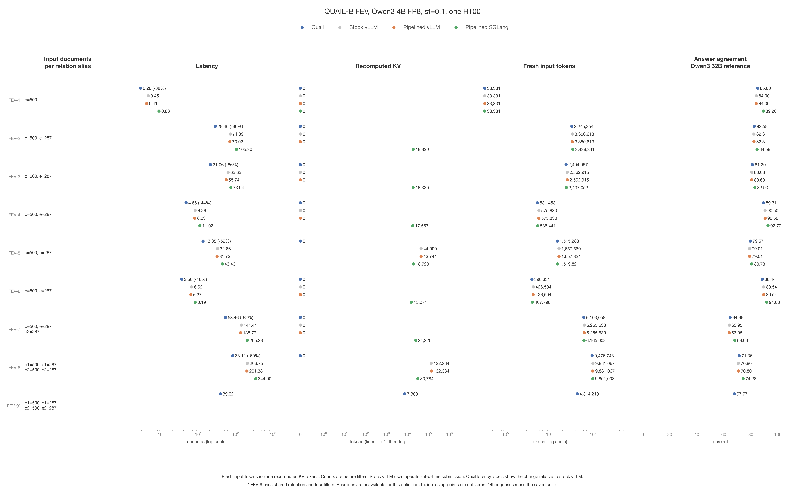

# Shared KV retention on FEV-9

- Quail now shares retained KV capacity across document sets with planned anchor
  uses. The previous version discarded every set except the first anchor.
- Retention prefers expected prefix computation saved per occupied KV page.
  The score uses document length and the predicted probability of reaching the
  next planned anchor use. Selectivity determines expected memory demand before
  filtering. It is not applied again to a document that has already passed.
- Join order remains fixed before execution. The first anchor's filters still
  run last. Per-set memory estimates are not fixed partitions.

Figure: plots/quailb_fev.png

- FEV-9 appears with the other FEVER queries in the standard dataset plot.
  The first-anchor-only comparison remains in the tables below.

| Configuration | Query time, seconds | Document pairs/second | $/query |
|---|---:|---:|---:|
| First anchor only | 39.51 | 4,609.34 | 0.04334 |
| Shared retention | 39.02 | 4,667.22 | 0.04280 |

- Both configurations evaluated 182,115 document pairs and returned 149,783,486
  rows. All four filter answer tables and all three join answer tables match
  exactly, including false answers.
- Query time uses the worker's `wall_s`, excluding model startup and result
  collection. Throughput is evaluated pairs summed across join stages divided
  by query time. Cost is query time in hours times $3.9492, from
  `quail.bench.evaluate.H100_USD_PER_HOUR`. The result was counted without
  collecting its full text columns.

| KV measurement | First anchor only | Shared retention |
|---|---:|---:|
| Retained documents after filters | 171 | 287 |
| Retained pages after filters | 4,668 | 8,842 |
| Retained prefix tokens after filters | 73,336 | 139,363 |
| Join anchor KV hits | 171 | 287 |
| Join anchor KV misses | 171 | 55 |
| Document prefix tokens recomputed | 73,336 | 7,309 |
| Total fresh tokens | 4,380,246 | 4,314,219 |

- Shared retention kept 144 of 171 passing `e1` prefixes and 143 of 171 passing
  `e2` prefixes. The first join group recomputed 3,533 prefix tokens, and the
  second group recomputed 3,776. The first group released its completed anchors
  while useful `e2` KV remained available for the second group.
- Prefix recomputation fell by 66,027 tokens, or 90.0%. Total fresh tokens fell
  by 1.5%. Query time fell by 0.49 seconds, or 1.2%. Most query work remained
  unchanged, so the runtime difference was much smaller than the reduction in
  prefix recomputation. One measured run per configuration does not establish
  a stable 1.2% performance improvement.

- Accuracy was calculated afterward from the saved answer tables. No inference
  was rerun. The reference is the saved Qwen3 32B FP8 collection
  `gt_77bb8b128743a79aedddaa24c808c3f8`. The scorer verifies ordered corpus hashes
  and uses the existing benchmark evaluator.
- Both configurations agree with the reference on 124,481 of 183,689 evaluated
  answers, or 67.77%. Agreement includes the four filters and three joins.
  Every accuracy count is identical before and after the retention change.

| Predicate | Answer agreement |
|---|---:|
| Claim filter on c1 and c2, each | 85.00% |
| Evidence filter on e1 and e2, each | 95.12% |
| SUPPORT on c1-e1 | 79.45% |
| REFUTE on c2-e1 | 45.47% |
| SUPPORT on c2-e2 | 78.38% |

- Final output precision is much worse than overall answer agreement. The
  reference query returns 11 rows. Both configurations return 149,783,486 rows,
  of which only 5 match the reference. Precision is approximately 0.00000334%,
  and recall is 45.45%. False positive join answers produce the large output.
  The retention change preserves answers but does not improve model accuracy.
- The saved evaluator rounds output precision and F1 to zero at six decimal
  places. The precision above is calculated from the saved integer counts.
- [The full comparison plots](2026-09-05-quailb-saved-results.md) reuse all 124
  saved configurations for the other 31 queries. The old suite's FEV-9 had one
  filter, so its times and accuracy are not compared with the four-filter query.

- The setup was FEV-9 at `sf=0.1`, `lf=1`, Qwen3 4B FP8, and one Modal H100.
  Each configuration ran in a fresh subprocess on the same physical GPU. Each
  received one unmeasured FEV-9 warmup and then one measured run. The baseline
  ran first and used commit `02bd7a2`.
- Both used the same selectivity estimates, 110,376-token execution chunks,
  and a 362,250-token arena. Reserving two chunks left 8,843 whole pages for
  retention. Every page holds 16 tokens. No setting was tuned from the result.
- Both planned and executed predicates 0 and 1 anchored on `e1`, followed by
  predicate 2 anchored on `e2`. Both filtered in the order `c1, c2, e2, e1`.
  The shared policy retained useful prefixes from both evidence aliases.
- Before inference, the new planner estimated 4,422.58 retained pages for `e1`
  and 4,420.42 for `e2`. The prediction was approximately 7,309 recomputed prefix
  tokens with identical predicate answers, based on a replay of previously saved
  filter answers. The GPU run matched that token prediction exactly.
- The planner's total cost estimate was 8.26 seconds, compared with 8.53 seconds
  for the baseline. Both substantially underestimate query time. Supplied join
  selectivities remain much lower than the observed selectivities.
- Selinger search prices a shared allocation across legal anchor aliases and
  tracks which anchors have already used their initial filter KV. The selected
  order then refines expected allocation using its actual future anchor uses.
  Allocation and join ordering together are heuristic, not a global optimum.
  Whole-document replacement is also a heuristic. Actual capacity and actual
  survivors determine which prefixes remain during execution.

- The Modal function call was `fc-01M1TM7E7FSB6ZDKAR0SJP64JT`.
  Data is on `quail-results` at
  `/results/ablations/shared-kv-retention-20260906T054932Z/`.
  `setup.json` records the prediction, execution order, and GPU identity.
  Each configuration has `summary.json` with source hashes, settings, and
  measurements, plus seven Parquet answer tables. `accuracy.json` contains the
  subsequent scoring of both configurations against saved reference labels.
- `reports/score_shared_kv_retention.py` reproduces accuracy from the saved
  answers and writes the derived result to the volume. Its docstring contains
  the download and scoring commands. It never runs inference.
- `reports/make_quailb_comparison_plots.py` contains the exact volume download
  commands and regenerates the main QUAIL-B plot and every dataset plot.
  `reports/score_shared_kv_retention.py` checks all seven answer tables for equality.
- All 231 CPU tests pass. Coverage includes replacement across filter inputs,
  returned admission pages, protected active KV, expired and dead prefixes,
  incorrect estimates, zero capacity, both Quail execution paths, and execution
  without join optimizer calls. Ruff, Vulture, and the documentation build pass.
- This report replaces the first-anchor-only comparison and its plot. The older
  per-filter retention and uniform allocation feature descriptions were removed
  because they described the replaced policy.
