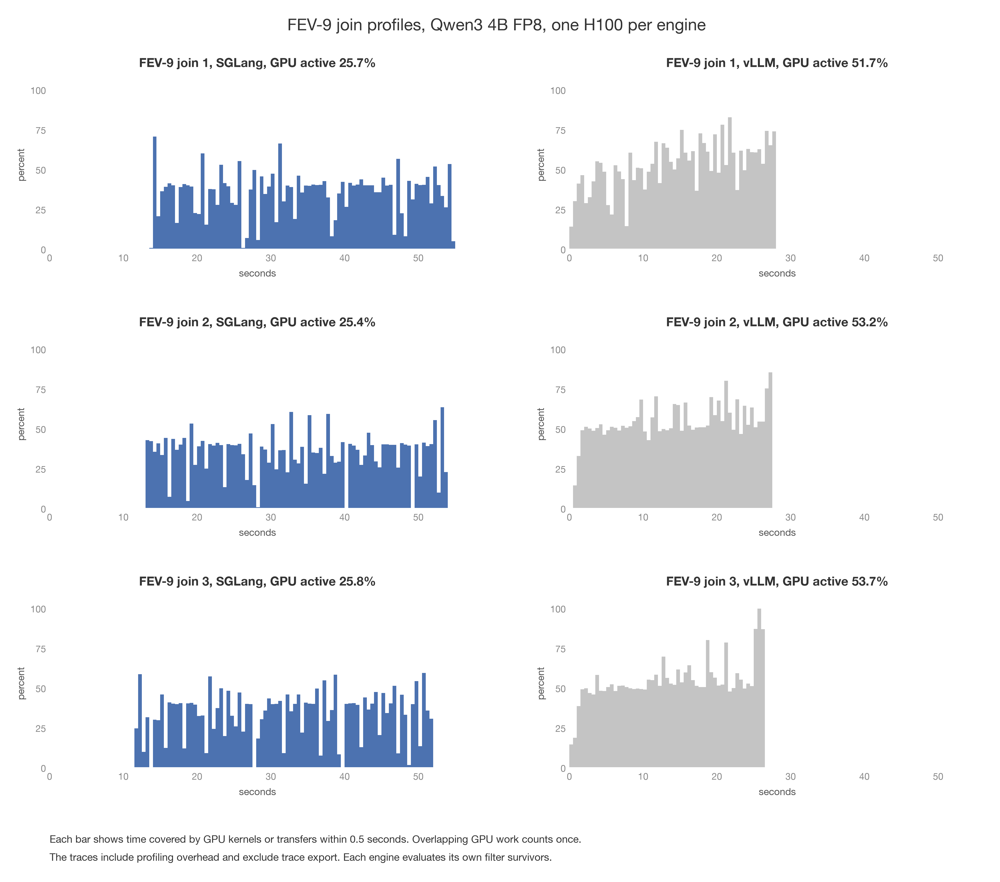
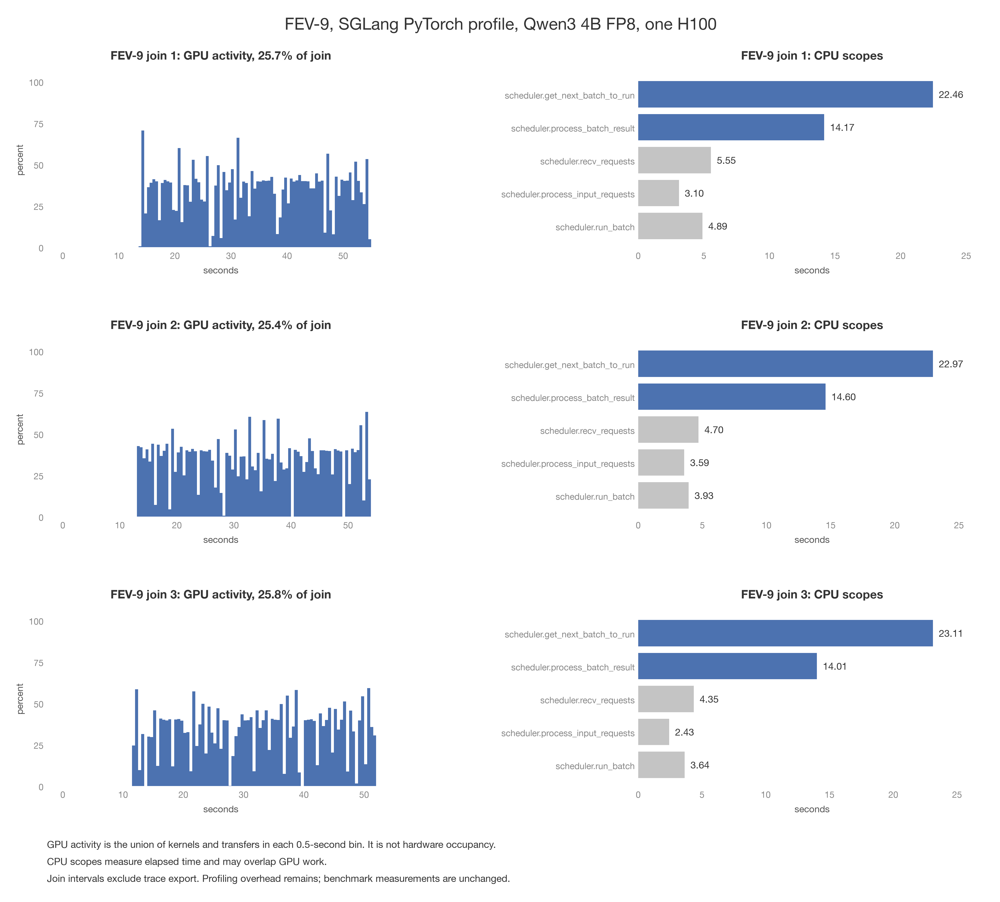

# FEV-9 SGLang and vLLM join profiles

- All three joins' PyTorch traces point to CPU scheduling and result handling
  as the first places to investigate. GPU kernels and transfers covered
  42.11 of their combined 164.26 seconds, or 25.6%.
- Both SGLang and vLLM continuously add queued requests to GPU batches.
  Both reuse prefix KV. Our adapters submit every pair for one join in a
  single call, with no client batch barrier between subsets of that join.
- Matching vLLM traces contain 43.70 seconds of GPU activity across 82.67
  seconds of join time, or 52.9%. SGLang's longer profiled execution comes
  mainly from time outside GPU execution. Profiling overhead and run
  variation mean the ratio of trace durations is not a benchmark speedup.

## Matching vLLM traces



Figure: plots/join_profile_comparison.png

| Join | SGLang interval seconds | vLLM interval seconds | SGLang GPU seconds | vLLM GPU seconds | SGLang first GPU operation, seconds | vLLM first GPU operation, seconds |
|---|---:|---:|---:|---:|---:|---:|
| 1 | 56.38 | 28.31 | 14.48 | 14.64 | 13.90 | 0.42 |
| 2 | 55.41 | 27.62 | 14.09 | 14.70 | 13.03 | 0.83 |
| 3 | 52.46 | 26.75 | 13.54 | 14.36 | 11.68 | 0.33 |

- The prediction for vLLM was a larger fraction of GPU activity and less
  time in request preparation and scheduling. Its GPU activity share was
  51.7%, 53.2%, and 53.7%, compared with SGLang's 25.7%, 25.4%, and 25.8%.
- While the GPU was idle, SGLang spent 59.72 seconds choosing batches
  and 20.50 seconds processing results across the three joins. The
  corresponding vLLM scheduler intervals were 10.08 and 0.57 seconds.
  These functions have different implementations; SGLang's batch selection
  interval also includes checks when no work is ready.
- The input path differs even though both adapters submit a full join in
  one public API call. vLLM processes and sends each request as it iterates
  over the prompts. SGLang prepares the complete list of tokenized requests
  and then sends that list as one batch. The vLLM worker can begin GPU work
  while the driver continues preparing later requests.
  See [vLLM's request submission code](https://github.com/vllm-project/vllm/blob/v0.26.0/vllm/entrypoints/offline_utils.py)
  and [SGLang's batch request handling](https://github.com/sgl-project/sglang/blob/v0.5.18/python/sglang/srt/managers/tokenizer_manager.py).

## Setup and prediction

- FEV-9 has four filters followed by three joins. Input relations are
  `c1 = 500`, `c2 = 500`, `e1 = 287`, and `e2 = 287` document rows.
  The repeated aliases refer to 787 distinct documents.
- One Modal H100 runs `Qwen/Qwen3-4B-FP8`, with FP8 weights and BF16 KV.
  SGLang is pinned to 0.5.18. The model identifier matches the saved
  vLLM 0.26.0 baseline. The profile result records the loaded model revision
  and quantization configuration.
  The loaded revision was `96b30dc13593a244a5e59e84687309f53c375cfa`,
  with dynamic FP8 E4M3 quantization and 128 by 128 weight blocks.
  SGLang used PyTorch `2.13.0+cu130`; vLLM used `2.11.0+cu130`.
- SGLang settings match the saved unprofiled run. Static memory fraction
  is 0.76, measured KV capacity is 403,744 tokens, page size is 16 tokens,
  and at most 4,096 requests run at once. Prefill limits are 25,296 tokens.
  Prefix reuse is enabled and prefill CUDA graphs are disabled.
- SGLang submits every anchor for one partner before advancing to the next
  partner. Sampling uses temperature zero, one output token, and a +1,000
  logit bias for the TRUE/FALSE token IDs. vLLM uses its allowed-token list.
  These are the existing baseline settings.
- vLLM's saved configuration allowed 25,305 batched tokens and 4,096
  active requests, with 479,616 tokens of measured KV capacity. Its GPU
  memory utilization setting was 0.91. SGLang's lower KV capacity did not
  produce more fresh tokens in this comparison.
- Before the original SGLang run, we predicted that CPU request handling and scheduling
  would leave the GPU inactive for more than half of each join. We also
  predicted that answers and token counts would match the saved run.
- PyTorch Profiler records CPU and CUDA events in the scheduler and a CPU
  interval around each join in the driver. Model startup and all filters
  run outside the profiler. Each trace is exported before the next join.
  The analysis aligns process clocks and restricts events to the driver's
  join interval, excluding trace export.
- GPU activity means elapsed time covered by at least one kernel or memory
  transfer. Overlapping GPU operations count once. It does not measure how
  many GPU cores were occupied. CPU intervals can overlap GPU activity.

## What SGLang does before its first GPU operation

- The driver normalizes the batch arguments and creates response state for
  every request. It then prepares every tokenized request before sending
  the complete list to the scheduler. The scheduler receives that batch
  and initializes its requests before the first GPU operation.
- Tokenization was already finished. `_create_tokenized_object` copies the
  supplied token IDs into an array, creates sampling parameters, validates
  those parameters, and builds a request object. In the first join,
  SGLang repeated this work for 58,136 requests.
- The detailed run records CPU intervals for argument normalization,
  `_batch_tokenize_and_process`, and `_send_batch_request`, alongside GPU
  events. A Python function profile covers only request preparation in
  join 1. Joins 2 and 3 use elapsed-time counters without that Python
  function profile. The scheduler trace records CUDA events only in this
  run, so its timing is not interchangeable with the original CPU/CUDA trace.
- In detailed join 1, argument normalization took 0.80 seconds, request
  preparation took 4.55 seconds, and batch sending took 3.33 seconds.
  The request-object creation function accounted for 2.45 seconds of the
  preparation profile, including functions it called.
- Another 5.93 seconds elapsed between normalization and request preparation.
  Response-state creation runs in that interval, but this instrumentation
  does not time that function separately. After batch sending returned,
  another 7.89 seconds elapsed before the first GPU operation.
- Detailed join 1 reached its first GPU operation at 23.17 seconds,
  compared with 13.90 seconds in the original trace. The three directly
  timed stages account for 8.67 seconds, or 37.4%, of the detailed interval.
  The prediction that those stages would explain most of the initial gap
  did not hold. State setup and scheduler-side handling are also substantial.
  Do not substitute these timings into the original 13.90-second interval.
- The original trace independently shows 3.01 seconds in
  `scheduler.process_input_requests` before its first GPU operation.
  Another 5.06 seconds fell within `scheduler.recv_requests`, which includes
  polling for input as well as receiving it. These scheduler intervals can
  overlap the driver's CPU work, so they cannot be added to driver timings.

| Detailed join | Normalize seconds | Prepare requests seconds | Send batch seconds | Remaining initial delay seconds | First GPU operation, seconds |
|---|---:|---:|---:|---:|---:|
| 1, with Python function profiling | 0.80 | 4.55 | 3.33 | 14.50 | 23.17 |
| 2, elapsed counters only | 0.77 | 3.26 | 1.70 | 12.61 | 18.35 |
| 3, elapsed counters only | 0.71 | 3.03 | 1.42 | 11.06 | 16.23 |

- The first change to test is incremental SGLang request submission while
  earlier requests execute, preserving the current pair order. The trace
  supports that experiment, but does not predict its eventual speedup.

## Where the time went



Figure: plots/sglang_join_profile.png

| Join | Driver interval seconds | GPU active seconds | GPU active share | Seconds before first GPU operation |
|---|---:|---:|---:|---:|
| 1 | 56.38 | 14.48 | 25.7% | 13.90 |
| 2 | 55.41 | 14.09 | 25.4% | 13.03 |
| 3 | 52.46 | 13.54 | 25.8% | 11.68 |

The following CPU durations count only the portions with no concurrent GPU
kernel or transfer. The figure shows the full CPU intervals instead.

| Join | Batch selection while GPU idle, seconds | Result processing while GPU idle, seconds |
|---|---:|---:|
| 1 | 19.45 | 7.13 |
| 2 | 20.07 | 6.80 |
| 3 | 20.20 | 6.56 |
| Total | 59.72 | 20.50 |

- The prediction held for all three joins. The GPU had no recorded work
  during roughly three quarters of the captured join time. The long initial
  delays and repeated later gaps make CPU work a stronger immediate target
  than changing model matrix multiplication kernels.
- The scheduler's batch selection interval includes checking for work when
  the queue is empty. For example, join 1 recorded 85,977 calls to
  `scheduler.get_next_batch_to_run`, but only 92 calls to `scheduler.run_batch`.
  The selection time cannot all be attributed to finding reusable prefixes.
- Join 1 recorded 692,655 `aten::copy_` calls, 572,783 `cudaMemcpyAsync`
  calls, and 465,352 `cudaStreamSynchronize` calls. Their inclusive CPU
  durations were 9.77, 3.81, and 2.83 seconds respectively. These nested
  calls overlap other measured intervals and must not be added to them.
- The longest single GPU kernel category in join 1 was a DeepGEMM FP8
  matrix multiplication implementation, with 7.28 seconds summed over
  10,692 launches. The 14.48 seconds of total GPU activity includes those
  launches. Kernel sums and elapsed GPU activity have different definitions.
- Every join began with 11.68 to 13.90 seconds without a GPU operation.
  The driver used 18.06 to 19.80 CPU seconds across each full join.
  Request preparation and delivery are candidates for this initial delay;
  the driver's single interval does not separate those functions.
- The matching vLLM trace supports investigating SGLang's request handling
  and scheduler CPU work. The current measurements do not isolate prefix
  matching from other work inside batch selection, so they do not establish
  that a particular prefix data structure causes the difference.

## Profiling overhead and correctness

| Join | Pairs | Unprofiled generation seconds | Profiled generation seconds |
|---|---:|---:|---:|
| 1, e1 with c1 | 58,136 | 43.22 | 55.32 |
| 2, e1 with c2 | 58,136 | 45.76 | 55.10 |
| 3, e2 with c2 | 54,925 | 42.10 | 52.18 |
| Total | 171,197 | 131.08 | 162.60 |

- Profiled SGLang generation time was 24.1% longer than the saved run.
  vLLM's profiled generation took 80.85 seconds, compared with 85.17 seconds
  in its saved run. Both comparisons include run variation as well as
  profiler overhead. The driver intervals
  plotted below also include prompt construction and result conversion
  around `generate()`, so they are slightly longer than this table.
- All four filter answer tables and all three join answer tables match
  the saved unprofiled run after sorting. Accuracy counters, returned row
  count, fresh tokens, cached tokens, and recomputed prefix tokens also match.
  This statement applies to the original SGLang profile.
- vLLM's prediction of identical answers did not hold. Its profiled repeat
  changed 21 of 191,462 predicate answers, all in join 1. Its other six
  answer tables match exactly. Filter survivors and all three evaluated
  pair counts match. Fresh and recomputed tokens increased by 1,232 each,
  or 0.027% of the baseline's total fresh tokens. The run does not isolate
  the cause of those answer changes.
- Profiled vLLM predicate agreement was 67.0551% against Qwen3 32B FP8.
  It returned 172,050,500 rows with 5 reference matches, giving final output
  precision of 0.00000291% and recall of 45.45%.
- The vLLM query clock including trace exports was 126.13 seconds, or
  1,505.49 evaluated pairs per second and $0.13836 excluding startup.
  Model startup took 51.51 seconds. The saved 89.80-second benchmark remains
  the performance comparison.
- The detailed SGLang run preserved every answer in all seven answer tables,
  along with the baseline's accuracy counters, row
  count, and fresh, cached, and recomputed token totals. Its clock including
  trace exports was 937.97 seconds, or 182.52 pairs per second and $1.02895
  excluding 386.38 seconds of startup. Those timings are diagnostic costs.
- The recorded query clock was 942.86 seconds because it includes trace
  export between joins. With export included, throughput was 181.57 pairs
  per second and GPU cost was $1.03432, excluding 311.57 seconds of startup.
  Those are diagnostic run costs, not replacement benchmark measurements.
- The Modal function completed and committed the traces to the volume.
  The existing process cleanup helper left 4 MiB allocated on the GPU.

## Saved benchmark comparison

The QUAIL-B comparison figures continue to use the saved unprofiled results.
The new traces are diagnostic measurements.

| Method | Query seconds | Evaluated pairs | Document pairs/second | $/query |
|---|---:|---:|---:|---:|
| Pipelined vLLM | 89.80 | 189,888 | 2,114.57 | 0.09851 |
| Pipelined SGLang | 135.74 | 171,197 | 1,261.21 | 0.14891 |

- SGLang's three joins took 131.08 seconds, compared with 85.17 seconds
  for vLLM. SGLang evaluated 9.8% fewer pairs and computed 11.3% fewer
  fresh join tokens, so more input computation does not explain the gap.
- Across the full query, SGLang computed 4,095,266 fresh input tokens,
  including 33,904 recomputed prefix tokens. vLLM computed 4,593,156 fresh
  input tokens, including 193,312 recomputed prefix tokens.
- A fresh token is an input token position processed by a model forward
  pass rather than read from existing KV. Repeated computation counts again.
  Recomputed prefix tokens are included in fresh tokens.
- SGLang agrees with the saved Qwen3 32B FP8 predicate labels on 69.08%
  of evaluated answers, compared with 67.05% for vLLM. Different filter
  answers account for the different pair counts.
- SGLang returned 118,565,289 rows, of which 5 matched the 11 reference
  output rows. Final output precision is 0.00000422% and recall is 45.45%.
  vLLM returned 172,090,043 rows, also with 5 reference matches, giving
  0.00000291% precision and 45.45% recall.
  Predicate agreement should not be read as final join output accuracy.
- GPU costs exclude startup and use `H100_USD_PER_HOUR = 3.9492` from
  `quail.bench.evaluate`. Throughput is evaluated join pairs divided by
  the full query runtime.

## Reproduction and sources

```bash
uv run modal run --detach experiments/profile_sglang_join.py \
  2>&1 | tee /tmp/quail-sglang-join-profile.log
```

- Original SGLang function call `fc-01M1WET35ZK2NX49RZ634J1SKA`.
- vLLM function call `fc-01M1WH28RCJ515Z6YXD5YBFFJK`. Its summary is at
  `/results/ablations/vllm-join-profile-20260906T233246Z/result.json`.
  Each `join-0`, `join-1`, and `join-2` subdirectory contains
  `worker.trace.json.gz` and `driver.trace.json.gz`.
- SGLang input preparation function call `fc-01M1WGYVSWETBS7NB7A5M3SHW7`.
  Its summary is at
  `/results/ablations/sglang-input-profile-20260906T233056Z/result.json`.
  Its three join directories contain scheduler CUDA traces and driver CPU
  traces. `join-0/input-preparation.pstats` contains the Python function
  profile. The summary also contains per-function timing totals and the
  largest Python function costs.
- Reproduce the new runs with
  `uv run modal run --detach experiments/profile_vllm_join.py 2>&1 | tee /tmp/quail-vllm-join-profile.log`
  and
  `uv run modal run --detach experiments/profile_sglang_input.py 2>&1 | tee /tmp/quail-sglang-input-profile.log`.
- The first vLLM setup attempt failed before the joins because it attempted
  to send a Python callback through an RPC interface that does not accept
  it. The completed run uses a named method in a worker extension.
- Profile summary on `quail-results` at
  `/results/ablations/sglang-join-profile-20260906T225320Z/result.json`.
- Scheduler traces under the same directory at
  `join-0/join-0-TP-0.trace.json.gz`, `join-1/join-1-TP-0.trace.json.gz`,
  and `join-2/join-2-TP-0.trace.json.gz`. Each join directory also contains
  `driver.trace.json.gz`.
- Unprofiled SGLang summary at
  `/results/benchmarks/quailb/families/20260906T222629Z-sglang-suffix-major/fever-sglang-process.json`.
- Saved vLLM results are listed in
  `/results/benchmarks/quailb/family-runs/20260906T211500Z-quailb-sf0.1-lf1-qwen3-4b-fp8-families/manifest.json`.
- [Baseline report](2026-09-06-sglang-baseline.md) has the complete comparison
  and dataset figures. [Plot script](make_join_profile_plots.py)
  includes the volume download commands and rebuilds this diagnostic figure.
- SGLang's [profiling documentation](https://docs.sglang.io/docs/developer_guide/benchmark_and_profiling)
  describes CPU and GPU traces. Its
  [scheduler source](https://github.com/sgl-project/sglang/blob/v0.5.18/python/sglang/srt/managers/scheduler.py)
  defines the measured batch selection and result processing intervals.
