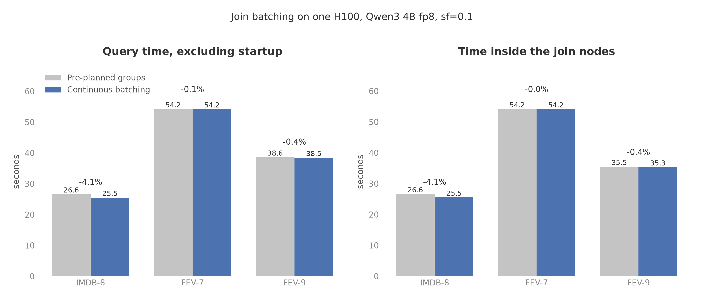

# Continuous batching for joins

- `run_join` now admits anchors continuously, the way `run_filter` admits
  documents. Before, it packed one stage for an arena-sized group of
  anchors, waited for every answer, and only then packed the next stage.
  Stages now mix in one chunk, and each anchor is gated on its own as its
  answers return.
- IMDB-8 fell from 26.63 seconds to 25.53 seconds, a 4.1% reduction. FEV-7
  and FEV-9 changed by less than 0.4%. All answer tables are identical
  between the two implementations, and so are fresh tokens, recomputed KV
  tokens, evaluated pairs, and returned rows.
- The prediction was IMDB-8 near 25.2 seconds and the other two within
  noise. The measured saving on IMDB-8 was 1.10 seconds, compared with the
  1.1 to 1.6 seconds predicted from 11 stalls of about 0.1 seconds each.

Figure: plots/join_continuous_batching.png

## Setup

- One Modal H100 (GPU `GPU-3072ece1-00d0-0bd9-2842-70576b1b48d3`) running
  `Qwen/Qwen3-4B-FP8` with bf16 KV, sf=0.1, lf=1. Both implementations ran
  in the same container on the same GPU, each in its own process, with one
  unmeasured warmup run per query before the measured run.
- The baseline is main at commit `d7a96e0`, the pre-planned `pack_stream`
  join. The comparison is this branch with `JoinAdmission`. Nothing else
  differs between the two checkouts.
- Chunk budget 110,376 tokens and KV budget 362,250 tokens for both, as the
  planner derives them. There is no baseline-only setting: the change is in
  how the same chunks are ordered, not in any budget.
- Queries, chosen for their join shape:
  - IMDB-8: 5,000 review anchors, two stages on the same anchor (12
    aspect partners each), one join node. Reviews average 299 tokens, so
    the anchors need about six arena groups under the old code, giving 6
    gates and 5 group boundaries.
  - FEV-7: two single-stage join nodes, each 287 evidence anchors against
    500 claims. One group per node, so no gate.
  - FEV-9: four filters, then a two-stage node and a single-stage node on
    171 filtered evidence anchors, with 287 of 342 anchor prefixes served
    from retained filter KV. One group per node, one gate.
- Cell: `experiments/cells/join_continuous_batching.py`. Modal function
  call `fc-01M1Y8JS68JN8NW1TJ0QVFET8C`. Results, answer tables, and the
  prediction as stated before the run are on `quail-results` at
  `/results/ablations/join-continuous-batching-20260907T154300Z/`.

## Prediction

- The saved IMDB-3 profile (`/results/ablations/ringfix_imdb3.json`)
  shows a 110,376-token chunk takes about 0.88 seconds on the GPU and about
  0.04 seconds to pack on the CPU. In the old join, the GPU idled from the
  last chunk of a stage finishing until the next stage's first chunk was
  packed and launched: about 0.1 seconds per gate or group boundary (that
  profile's single-stage join lost 0.54 seconds of GPU time over 5 groups).
- IMDB-8 has about 11 such boundaries, so it should lose 1.1 to 1.6
  seconds, landing near 25.2 seconds from 26.54 in the saved suite run.
- FEV-7 and FEV-9 fit each join node in one arena group, so they have at
  most one gate and should stay within run-to-run noise of 53.46 and 41.14
  seconds.
- Answers, fresh tokens, and recomputed KV tokens should not change: the
  same prefixes and suffixes are computed, only their chunk placement moves.

## Results

| Query | Configuration | Query time, seconds | Document pairs/second | $/query |
|---|---|---:|---:|---:|
| IMDB-8 | Pre-planned groups | 26.63 | 3,446.8 | 0.02921 |
| IMDB-8 | Continuous batching | 25.53 | 3,595.3 | 0.02801 |
| FEV-7 | Pre-planned groups | 54.25 | 4,957.0 | 0.05951 |
| FEV-7 | Continuous batching | 54.22 | 4,959.8 | 0.05948 |
| FEV-9 | Pre-planned groups | 38.60 | 4,718.0 | 0.04234 |
| FEV-9 | Continuous batching | 38.45 | 4,736.4 | 0.04218 |

- Query time is the worker's `wall_s`, excluding model startup and result
  collection. Document pairs/second divides evaluated pairs summed over
  all join stages by query time. $/query is query time in hours times
  $3.9492 from `quail.bench.evaluate.H100_USD_PER_HOUR`.

| Query | Evaluated pairs | Fresh tokens | Recomputed KV tokens | Rows | Answer tables |
|---|---:|---:|---:|---:|---|
| IMDB-8 | 91,788 | 2,918,999 | 0 | 62,777 | 2 of 2 identical |
| FEV-7 | 268,919 | 6,103,058 | 0 | 6,197,246 | 2 of 2 identical |
| FEV-9 | 182,115 | 4,314,219 | 7,309 | 149,783,486 | 7 of 7 identical |

- Every count in this table is the same for both implementations.
  Identical answer tables were checked row by row after sorting.
- Time inside the join nodes: IMDB-8 26.63 to 25.53 seconds; FEV-7 54.18
  to 54.17 (two nodes, 28.81 and 25.37 to 28.78 and 25.38); FEV-9 35.49 to
  35.34 (24.03 and 11.46 to 23.87 and 11.47). The FEV-9 filters took 3.06
  seconds in both runs.
- FEV-9's two-stage node saved 0.16 seconds, about one gate's worth. Its
  single-stage node and both FEV-7 nodes did not move.

## What the numbers mean

- The gain is exactly where the old code left the GPU idle: a stage or
  group boundary cost about 0.1 seconds, and IMDB-8 had 11 of them. A join
  with one group and one stage had nothing to gain, and gained nothing.
- The saving grows with anchor count. A join whose anchors need many
  arena groups (long anchors, or many of them) pays two stalls per group
  under the old code. At 5,000 review anchors that was 4% of the query.
  On queries where the join has one group, this change is neutral.
- Correctness did not move: answers, fresh tokens, and recomputed KV
  tokens are bit-for-bit the same. The scheduler changes the order of
  chunks, not their content, and the KV rewind rules held (no anchor
  started a stage before its previous stage's chunks were all launched).
- One measured run per configuration. The IMDB-8 difference of 1.10
  seconds is about ten times the 0.09-second difference between the saved
  suite run (26.54) and this run's baseline (26.63), so it is not noise.
  The FEV-7 and FEV-9 differences are within that noise and should be
  read as no change.
