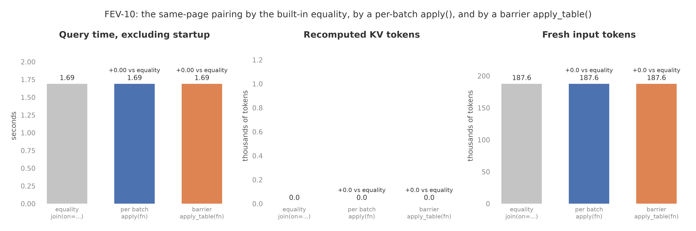

# A user function between two GPU operators: FEV-10 paired by apply()

- A Python function pairing claims with their own Wikipedia page,
  passed to `apply()`, gives exactly the built-in equality's result:
  the same 185 pairs, the same answer tables (all four identical row
  for row), the same 145 rows, 1.69 seconds against 1.69, 187,567 fresh
  tokens against 187,567, zero recomputed KV tokens on both.
- Run per batch, the function was called twice, once per batch of
  survivors the evidence chain handed over (893 input rows over the
  two calls, 185 pairs out), and the chain kept streaming with its KV
  pinned: 171 anchor KV hits, nothing retained, nothing recomputed.
- Run as a barrier with `apply_table()`, the function was called once
  (532 input rows, 185 pairs out, 1.9 milliseconds), after the evidence
  chain had finished (1.27 seconds) and put its 171 survivors in the
  retention pool. The join then took 0.13 seconds. The total was the
  same 1.69 seconds: at this size the join is too small for the lost
  overlap to show, and the pool held every survivor, so nothing was
  recomputed.

Figure: plots/foreign_operator.png

## Setup

- One Modal H100 running `Qwen/Qwen3-4B-FP8` with bf16 KV, sf=0.1,
  lf=1, three variants of FEV-10 in one process on one GPU, one
  unmeasured warmup run per variant after a FEV-1 run that absorbs the
  cold boot. Query time excludes model startup and result collection.
- The three variants ask SUPPORT of a claim and its own Wikipedia
  page after F11 on claims and F13 on evidence:
  - equality: FEV-10 as in QUAIL-B, `join(evidence, on=col("c.evidence_wiki_url")
    == col("e.id"))`. The session builds the pair table and the join
    streams each anchor's pairs ([the pair join report](2026-09-11-pair-join.md)).
  - per_batch: `join(evidence).apply(same_page, columns=[...])`. The
    same pairing done by a Python function (an Arrow hash join of the
    claim's page column against the evidence id). The planner keeps the
    anchor's chain streaming; the join calls the function on each batch
    of survivors the chain hands over, with the KV still pinned.
  - barrier: `join(evidence).apply_table(same_page, columns=[...])`.
    The same function, run once over every survivor. The planner does
    not pin the anchor's chain: it finishes first, its survivors go
    through the retention pool, and the join starts after the function.
- The anchor is evidence (the longer side, 287 rows of about 440
  tokens; 500 claims of about 12 tokens are the partners). Every
  variant plans the same filter order and anchor; only the pairing and
  the streaming edge differ. The planner prices the equality variant by
  its pair fraction (500 of 143,500 pairs) and the apply variants as a
  cross join, since it does not run the function at plan time.
- Cell: `experiments/cells/foreign_pairs.py`. Modal function call
  `fc-01M28NDEB2GN84ZJKNTTKM1Y3R`. Results and answer tables are on
  `quail-results` at `/results/ablations/foreign-pairs-20260911T163940Z/`
  (one directory per variant with `summary.json`, `rows.parquet`, and
  the answer tables). A first attempt (`fc-01M28MSCPZR6Y3ZGWXJTXKEF9V`)
  failed inside the function: Arrow's default join is a left outer join
  and returned null ids for claims whose page did not survive. The
  runtime now refuses a null id with a message that names the fix, and
  the function uses an inner join.

## Prediction

- Stated before the run: per_batch gives the same 185 pairs, the same
  answer table and 145 rows as the equality run, zero recomputed KV
  tokens, the same 187,567 fresh tokens, and a query time within noise
  of the equality run's 1.66 seconds, because the function runs on
  batches of at most a few hundred ids and each call is an Arrow hash
  join well under a millisecond.
- barrier: the anchor's chain (evidence, 171 survivors) finishes
  before the function runs, so the join cannot overlap it. At sf=0.1
  those survivors fit the retention pool (about 75,000 tokens against
  a 141,488-token cap), so no KV is recomputed and the cost is the lost
  overlap only: about 0.1 to 0.4 seconds over the equality run, with the
  same answers and rows.

## Results

| Variant | Query time, seconds | Document pairs/second | $/query | Fresh input tokens | Recomputed KV tokens | Evaluated pairs | Result rows |
|---|---:|---:|---:|---:|---:|---:|---:|
| equality (`on=`) | 1.69 | 109.5 | 0.00185 | 187,567 | 0 | 185 | 145 |
| per_batch (`apply`) | 1.69 | 109.5 | 0.00185 | 187,567 | 0 | 185 | 145 |
| barrier (`apply_table`) | 1.69 | 109.5 | 0.00185 | 187,567 | 0 | 185 | 145 |

| Variant | Evidence chain pinned | Function calls | Function input rows | Function seconds | Evidence chain seconds | Join seconds | Retained after filters | Anchor KV hits and misses |
|---|---|---:|---:|---:|---:|---:|---:|---|
| equality | yes | 0 | 0 | 0 | streamed inside the join | 1.40 | 0 | 171 and 0 |
| per_batch | yes | 2 | 893 | not timed on a stream | streamed inside the join | 1.40 | 0 | 171 and 0 |
| barrier | no | 1 | 532 | 0.0019 | 1.27 | 0.13 | 171 | 171 and 0 |

- Query time is the worker's `wall_s`, excluding model startup and
  result collection. Document pairs/second divides evaluated pairs by
  query time. $/query is query time in hours times $3.9492 from
  `quail.specs.H100_USD_PER_HOUR`. The claims chain took 0.29 seconds
  in every variant.
- Function input rows count every row the function saw: per batch,
  each call gets the batch of evidence anchors plus all 361 surviving
  claims (171 + 2 x 361 = 893 over two calls); as a barrier, one call
  gets 171 evidence rows plus 361 claims (532).
- On a streamed edge the join's wall time covers the evidence chain it
  drives, so the chain and the per-batch function report no time of
  their own; the barrier variant times all three separately.
- Answer tables: `filters-c-0`, `filters-e-0`, `joins-0`, and `rows`
  are identical row for row between the equality run and each apply
  variant, after sorting. Peak GPU memory was 68.15 GiB on every
  variant. GPU `GPU-0f787594-3246-1579-edf8-c04316c2ae08`.

## What the numbers mean

- The per-batch function changed nothing about execution, as
  predicted: the join drove the evidence chain as before, called the
  function on each batch before admitting it, and packed the same
  10,017 join tokens over the same 185 pairs. The function's own cost
  is below what the timer resolves; two Arrow hash joins over a few
  hundred rows are milliseconds.
- The barrier prediction held on every count except the time: 0.1 to
  0.4 seconds of lost overlap were predicted and none showed. The
  reason is in the barrier row: the evidence chain took 1.27 seconds
  and the join 0.13, and their sum equals the streamed join's 1.40.
  The join over 185 pairs is 0.13 seconds of work, so there was
  nothing to overlap. The prediction assumed a join large enough to
  fill the chain's gaps; FEV-10's is not.
- The retention pool made the barrier free of recompute, also as
  predicted: 171 evidence survivors of about 440 tokens are about
  75,000 tokens against the pool's 141,488, so every anchor was a KV
  hit. A corpus whose survivors overflow the pool would pay the
  recomputed prefixes the [streamed filter-join
  report](2026-09-11-streamed-filter-join.md) measured before
  streaming existed; that is the case `per_batch` exists for.
- What the run did not show: the cost of a barrier when the join is
  large and the pool is short. IMDB-3 with an `apply_table` on its
  reviews chain would show both (the join is 22 seconds and the pool
  held 124 of 4,380 survivors); it has no natural pairing function, so
  it was not run here.
