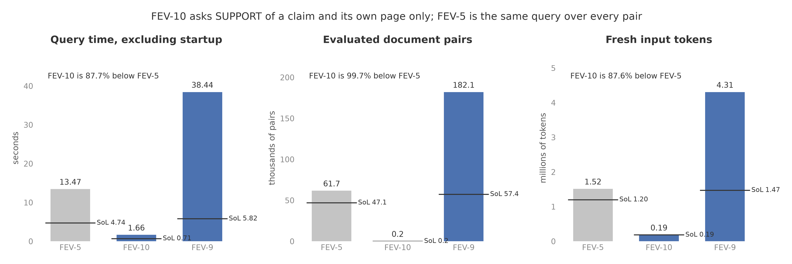

# A join over pairs: FEV-10 against FEV-5

- FEV-10 asks SUPPORT of 185 claim and evidence pairs instead of the
  61,731 FEV-5 asks over every pair of survivors, and runs in 1.66
  seconds against FEV-5's 13.47, an 87.7% reduction. Fresh input tokens
  fell from 1,515,283 to 187,567; the difference, 1,327,716, is the
  join's own tokens (1,337,733 down to 10,017). Recomputed KV tokens
  are zero on both.
- The 185 pairs are exactly FEV-5's pairs on the claim's own page, all
  185 answers agree bit for bit with FEV-5's, and FEV-10's 145 result
  rows are exactly FEV-5's 12,830 rows restricted to the same page.
- Against the reference labels, FEV-10's output precision is 82.8%
  where FEV-5's is 1.05%, at the same recall (96.8% against 96.4%):
  the off-page pairs the cross join asked about were almost all false
  positives. FEV-9, which has no equality, is unchanged at 38.44
  seconds, 4,306,910 fresh tokens, and 67.77% answer agreement.
- The speed of light estimate for FEV-10 is 0.712 seconds against
  FEV-5's 4.743, so FEV-10 runs at 2.3 times its estimate where FEV-5
  runs at 2.8 times.

Figure: plots/pair_join.png

## Setup

- One Modal H100 running `Qwen/Qwen3-4B-FP8` with bf16 KV, sf=0.1,
  lf=1, through the standard QUAIL-B family runner
  (`quail.bench.quailb_parallel.run_query_family`), Quail only, in one
  container on one GPU. Model startup is excluded from query time as
  in every saved suite run; there is no separate warmup run per query.
- FEV-10 is FEV-5 with one ordinary equality in the join. Both filter
  claims with F11 (about a person) and evidence with F13, then ask
  SUPPORT of claim and evidence pairs. FEV-5 asks it of every pair of
  survivors. FEV-10 asks it only where `c.evidence_wiki_url = e.id`: a
  claim's own Wikipedia page, since evidence ids are FEVER page names.
  Inputs before filters: 500 claims and 287 evidence rows, the same
  corpus and labels as the saved suite (`c_1aa2c4f0...`,
  collection `gt_77bb8b128743a79aedddaa24c808c3f8`).
- FEV-9 (four filters, three joins, no equality) is the check that a
  join without conditions is unchanged.
- The planner prices FEV-10's join by its pair count: 500 pairs out of
  143,500 (every claim names exactly one page), so `pair_fraction` is
  0.00348. The chunk budget and KV budget are the planner's usual
  110,376 and 362,250 tokens. Nothing is set by hand for either query.
- Cell: `experiments/cells/pair_join.py`. Modal function call
  `fc-01M28KRVDWC1PN2J7WRAS0F2YN`. The run directory on `quail-results`
  is `/results/benchmarks/quailb/20260911T160843Z-pair-join/`;
  per-query answers and rows are under `quail/fever/<query>/`, and the
  scored record is `quail/fever/run.json`. FEV-1 ran first so that
  the first query after the cold boot is not one being compared.
- A first attempt (`fc-01M28JYT36H7N9E21KJNE1ME3N`,
  `/results/benchmarks/quailb/20260911T155433Z-pair-join/`) ran FEV-5
  first: its claims filter took 8.8 seconds instead of 0.3 and FEV-5
  measured 24.0 seconds. Its FEV-10 (1.68 seconds) and FEV-9 (38.52)
  agree with the second run, and its answer tables are identical to
  the second run's.
- SoL estimates were recalculated on the CPU from the saved labels
  and corpus with `reports/make_sol_quailb.py --queries FEV-5,FEV-10,FEV-9`
  and saved at `/results/sol/2026-09-11-fev10-prefix-reuse.json`. They
  assume unlimited KV with every distinct prefix computed once, exact
  survivors from the labels, and no runtime overhead; they are
  estimates, not measured runs.

## Prediction

- Stated before the run: FEV-5 evaluated about 61,700 pairs in 13.35
  seconds with 1,515,283 fresh tokens in the saved suite run. FEV-10
  asks the same question of at most one pair per surviving claim,
  about 200 to 300 pairs, so its join work nearly disappears: about
  160,000 fresh tokens, and 1 to 2.5 seconds against FEV-5's 13.35.
- FEV-10's answers on the shared pairs match FEV-5's bit for bit (the
  same prefix, frame, and suffix tokens are packed), its rows are
  FEV-5's rows restricted to the same page, and its output precision
  rises far above FEV-5's 1.05% while recall stays near 96%.
- FEV-9 is unchanged: about 39 seconds, 4,306,910 fresh tokens, zero
  recomputed KV tokens.

## Results

| Query | Configuration | Query time, seconds | Document pairs/second | $/query | Fresh input tokens | Recomputed KV tokens | Evaluated pairs |
|---|---|---:|---:|---:|---:|---:|---:|
| FEV-5 | Every pair (cross join) | 13.47 | 4,582.9 | 0.01478 | 1,515,283 | 0 | 61,731 |
| FEV-10 | Pairs on the claim's page | 1.66 | 111.4 | 0.00182 | 187,567 | 0 | 185 |
| FEV-9 | Three cross joins, no equality | 38.44 | 4,737.6 | 0.04217 | 4,306,910 | 0 | 182,115 |
| FEV-5 | SoL estimate | 4.743 | 9,923 | 0.00520 | 1,202,271 | 0 (assumed) | 47,064 |
| FEV-10 | SoL estimate | 0.712 | 236 | 0.00078 | 185,703 | 0 (assumed) | 168 |
| FEV-9 | SoL estimate | 5.821 | 9,859 | 0.00639 | 1,474,838 | 0 (assumed) | 57,387 |

| Query | Answer agreement, % | Join predicate agreement, % | Output precision, % | Output recall, % | Result rows | Expected rows |
|---|---:|---:|---:|---:|---:|---:|
| FEV-5 | 79.57 | 79.45 on 61,731 pairs | 1.05 | 96.43 | 12,830 | 140 |
| FEV-10 | 89.09 | 90.81 on 185 pairs | 82.76 | 96.77 | 145 | 124 |
| FEV-9 | 67.77 | 79.45, 45.47, 78.38 | 0.00 | 45.45 | 149,783,486 | 11 |

- Query time is the bench runner's `runtime_s`, the worker's wall
  time excluding model startup and result collection. Document
  pairs/second divides evaluated pairs summed over all join stages by
  query time. $/query is query time in hours times $3.9492 from
  `quail.specs.H100_USD_PER_HOUR`. Agreement is with the saved Qwen3
  32B fp8 labels (collection `gt_77bb8b128743a79aedddaa24c808c3f8`);
  expected rows apply FEV-10's equality to the labels, so FEV-10 and
  FEV-5 have different expected row counts (124 and 140).
- FEV-10's pairs per second is low because the query is almost all
  filter work: the two filters are 177,550 of its 187,567 fresh
  tokens, and its 185 pairs stream while the evidence filter is still
  running. The number describes that, not a slow join.
- Inputs before filters: 500 claims and 287 evidence rows for FEV-5
  and FEV-10; FEV-9 reads both twice (c1, c2, e1, e2). Peak GPU memory
  was 68.15 GiB on every query.
- The SoL rows use the labels' survivors (296 claims, 159 evidence
  rows) rather than the model's (296 and 171, since the 4B model
  passes 13 more evidence rows through F13), which is why the estimate
  counts 168 FEV-10 pairs and 47,064 FEV-5 pairs against the measured
  185 and 61,731.
- FEV-5 reproduced the saved suite run (13.47 against 13.35 seconds,
  the same 1,515,283 fresh tokens and 61,731 pairs). FEV-9 reproduced
  the September 11 streamed run (38.44 against 39.21 seconds, the same
  4,306,910 fresh tokens, 342 anchor KV hits and no misses).

## Baselines for FEV-10

FEV-10 joined the benchmark on September 11, 2026, so it got the same
four measurements as every other query: the standard family runner
(`quail.bench.quailb_parallel`, `--query FEV-10`), all four methods,
sf=0.1, one H100, model startup excluded. Run directory
`/results/benchmarks/quailb/family-runs/20260911T201441Z-d16f87d8/`
(function call `fc-01M291QA9AAV9JSMYN5KCRJSM4`; `fc-01M291TJ6YBBJZJVDCVKK0VYP8`
for Quail and vLLM, `fc-01M291TJ8RBPP4RP4HW9XQAQ0G` for SGLang). Two
earlier attempts failed before measuring anything and are recorded in
the shipped feature note for this run: the first on a run directory
guard in the runner, the second on a CUDA probe that broke vLLM's
forked engine process. Both are fixed on this branch.

- Prediction, stated before the run: stock and pipelined vLLM in 3 to 5
  seconds and pipelined SGLang in 4 to 7, against FEV-5's 32.66, 31.73,
  and 43.43; about 190,000 fresh tokens on every method.

| Query | Configuration | Query time, seconds | Document pairs/second | $/query | Fresh input tokens | Recomputed KV tokens | Evaluated pairs |
|---|---|---:|---:|---:|---:|---:|---:|
| FEV-10 | Quail | 1.68 | 110.1 | 0.00184 | 187,567 | 0 | 185 |
| FEV-10 | Stock vLLM (operator-at-a-time) | 2.97 | 63.3 | 0.00326 | 270,220 | 0 | 188 |
| FEV-10 | Pipelined vLLM | 2.91 | 64.6 | 0.00319 | 270,220 | 0 | 188 |
| FEV-10 | Pipelined SGLang | 3.32 | 54.2 | 0.00364 | 267,414 | 0 | 180 |

| Query | Configuration | Answer agreement, % | Join predicate agreement, % | Output precision, % | Output recall, % | Result rows | Expected rows |
|---|---|---:|---:|---:|---:|---:|---:|
| FEV-10 | Quail | 89.09 | 90.81 on 185 pairs | 82.76 | 96.77 | 145 | 124 |
| FEV-10 | Stock vLLM (operator-at-a-time) | 86.67 | 81.38 on 188 pairs | 73.78 | 97.58 | 164 | 124 |
| FEV-10 | Pipelined vLLM | 86.67 | 81.38 on 188 pairs | 73.78 | 97.58 | 164 | 124 |
| FEV-10 | Pipelined SGLang | 89.56 | 80.56 on 180 pairs | 75.62 | 97.58 | 160 | 124 |

- The baselines came in just under the predicted ranges: 2.97 and 2.91
  seconds for the two vLLM configurations against 3 to 5 predicted, and
  3.32 for SGLang against 4 to 7. Quail's 1.68 reproduces the 1.66 of
  the pair-join run. The equality does for every engine what it did
  for Quail: FEV-5's baselines took 32.66, 31.73, and 43.43 seconds.
- Fresh tokens were higher than the 190,000 predicted for the baselines:
  270,220 on vLLM and 267,414 on SGLang, against Quail's 187,567. The
  request backends compute the shared prompt preamble again for every
  document, as they do on every other query (FEV-5: 1,657,580 against
  Quail's 1,515,283).
- Every method evaluated 180 to 188 pairs, the number of claims whose
  page survived each engine's own filter answers, and returned 145 to
  164 rows against 124 expected. Precision stays between 73.8% and
  82.8% on every engine, where FEV-5's was near 1% on every engine.
- The SGLang join ran with all anchors submitted per partner, the
  revised adapter FEV-9 uses; the other SGLang rows in the suite keep
  the earlier adapter.
- The 33-query benchmark plots and the saved-results report now
  include FEV-10 for all four methods
  (`reports/2026-09-05-quailb-saved-results.md`, regenerated by
  `reports/make_quailb_comparison_plots.py`).

## What the numbers mean

- The saving is the join's stream, and nothing else moved. FEV-10
  packed 1,327,716 fewer fresh tokens than FEV-5, within 0.8% of the
  join's 1,337,733 tokens in FEV-5, and saved 11.81 seconds. The
  prediction of 1 to 2.5 seconds held; the predicted 160,000 fresh
  tokens was low because it underestimated the evidence filter, which
  alone is 144,219 tokens over 287 pages of about 440 tokens.
- The planner priced the query right: its pair fraction is 500 of
  143,500 (every claim names one page), and the executor built exactly
  the 185 pairs whose claim and page both survived their filters. An
  anchor whose page did not survive packed nothing and settled without
  a chunk, which is why the join finished 171 anchors in 1.4 seconds
  under the evidence filter it was streaming from.
- The same 185 pairs answered bit for bit the same in both queries,
  as they must: a pair's prefix, frame, and suffix tokens do not depend
  on which other pairs share its chunk. The equality changed what was
  asked, not how.
- The quality change is the point of the query, not of the mechanism.
  FEV-5's 12,830 rows are 99% pairs of a person claim with some other
  person's page that the 4B model called supporting; the labels agree
  with only 140 of them. Restricting the question to the claim's own
  page removes 12,685 of those rows and keeps 135 of the 140. The
  benchmark scores FEV-10 against expected rows that apply the same
  equality to the labels, so its precision and recall describe the
  query as written.
- What the run did not show: whether a join with a low-selectivity
  equality (many pairs per anchor) keeps the cross join's packing
  efficiency. FEV-10 has one pair per anchor, so every chunk of its
  join is dominated by the filter it overlaps. A query whose equality
  keeps tens of partners per anchor would measure the per-anchor list
  path under load; none of the QUAIL-B corpora has such a key today.
