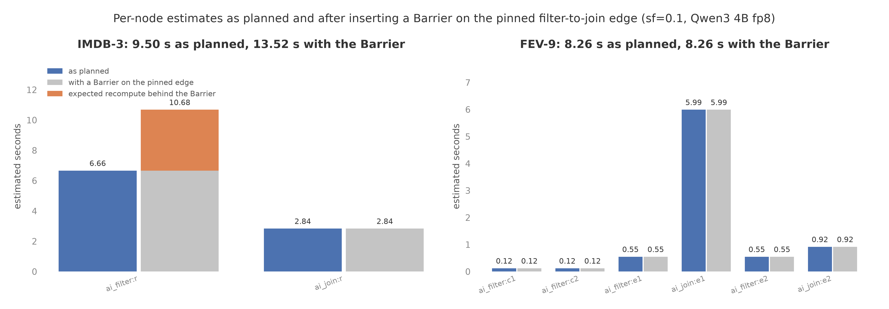

# Per-node estimates and plan edits, on the CPU

- Every node of a plan now carries its own estimated seconds, and a
  filter chain a join anchors on carries the recompute it would pay if
  its KV were released instead of pinned. On IMDB-3 the reviews chain
  is 6.665 seconds and the join 2.839 against a plan estimate of 9.503;
  the chain's release recompute is 1,087,633 tokens, 4.092 seconds,
  against the 1,217,171 tokens (10.11 seconds) measured before
  streaming existed.
- Inserting a `Barrier` on that pinned edge with `plan.insert()`
  turned the pin off, moved the recompute from "if released" to
  "expected", and raised the plan's estimate from 9.503 to 13.523
  seconds. Removing the `Barrier` gave the original plan back. On
  FEV-9 the same edit turned one pin off and moved nothing: its
  survivors fit the retention pool, so the expected recompute is zero.
- An edited FEV-9 plan executes under the test fakes and returns the
  same rows as the planner's plan (`tests/test_plan_edits.py`).

Figure: plots/plan_edits.png

## Setup

- No GPU run. The planner prices every node from the corpus token
  counts alone, so the numbers here are the plan's own estimates for
  Qwen3 4B fp8 on one H100 at sf=0.1, computed on the CPU from the
  corpus on `quail-results` (`/quailb_data/sf0.1`) with the Qwen3
  tokenizer. Script: `reports/make_plan_edits_plots.py`; its docstring
  has the `modal volume get` commands.
- Two queries: IMDB-3 (F1 on 5,000 reviews of about 299 tokens, then
  a join with 12 aspects anchored on the reviews) and FEV-9 (F11 on
  two claim aliases, F13 on two evidence aliases, three joins). For
  each, the plan as the planner made it, and the same plan after
  `plan.insert(Barrier(...), between=("ai_filter:<anchor>",
  "ai_join:<anchor>"))` on the first pinned edge.
- The per-node seconds price each node's own work through the speed
  of light model; the plan estimate prices the packed whole. The
  recompute column is the expected survivors past the retention pool
  cap (8,843 pages of 16 tokens) times their prefix cost.

## Prediction

- Stated before the script ran: for IMDB-3 the recompute column on the
  pinned reviews chain is close to the 1,217,171 recomputed tokens the
  streamed filter-join report measured before streaming existed
  (about 10 seconds there, measured), and inserting the Barrier turns
  the pin off, moves that figure from "if released" to "expected", and
  raises the plan's estimate by its seconds. For FEV-9 every anchored
  chain's survivors fit the pool (171 evidence rows of about 440
  tokens), so the recompute column is zero and the estimate does not
  move; the Barrier only turns one pin off.
- The per-node seconds add up to at least the plan estimate and to no
  more than three times it.

## Results

| Query | Node | Estimated seconds, as planned | Pinned, as planned | Release recompute, tokens | Release recompute, seconds |
|---|---|---:|---|---:|---:|
| IMDB-3 | ai_filter:r | 6.665 | yes | 1,087,633 | 4.092 |
| IMDB-3 | ai_join:r | 2.839 | | | |
| FEV-9 | ai_filter:c1 | 0.124 | no (partner) | | |
| FEV-9 | ai_filter:c2 | 0.124 | no (partner) | | |
| FEV-9 | ai_filter:e1 | 0.551 | yes | 0 | 0.000 |
| FEV-9 | ai_join:e1 | 5.992 | | | |
| FEV-9 | ai_filter:e2 | 0.551 | yes | 0 | 0.000 |
| FEV-9 | ai_join:e2 | 0.919 | | | |

| Query | Plan estimate, seconds | Sum of node seconds | With a Barrier on the first pinned edge: estimate, seconds | Pinned after the edit | Expected recompute after the edit, tokens |
|---|---:|---:|---:|---|---:|
| IMDB-3 | 9.503 | 9.504 | 13.523 | none | 1,068,313 |
| FEV-9 | 8.260 | 8.261 | 8.260 | ai_filter:e2 | 0 |

- Seconds are the speed of light price of each node's own work on
  Qwen3 4B fp8 and one H100; the plan estimate prices the packed
  whole. On these two plans the parts add up to within 0.001 seconds
  of the whole: each node's work is large enough to fill its own
  chunks, so packing across nodes saves almost nothing in the model.
- The release recompute is the expected survivors past the retention
  pool cap times the prefix tokens. On IMDB-3, 3,000 expected
  survivors (5,000 reviews at F1's 0.6 selectivity) of 301 tokens plus
  the join's frame need 21 pages each; the 8,843-page pool holds 421,
  so 2,579 are expected to be recomputed. Unpinned by the edit, a
  survivor holds no frame room, 20 pages fit 442, and the figure
  drops 1.8% to 1,068,313 tokens.
- The edited plan's estimate is the planner's search estimate plus
  the expected recompute of every chain the edit unpinned; the
  planner's own estimate stays the unlimited-KV number the join search
  optimizes.
- FEV-9's join node ids are `ai_join:e1` and `ai_join:e2`: the plan
  has two groups on two anchors, so no `:2` suffix appears. The
  claims chains are partners before they could anchor, so the planner
  leaves them unpinned and they carry no recompute column.

## What the numbers mean

- The recompute column is a fair warning, not an exact bill. On
  IMDB-3 it says 1.09 million tokens where the run without streaming
  recomputed 1.22 million: the planner expects 3,000 survivors from
  F1's selectivity estimate and the model passed 4,380. Its seconds
  (4.09) are below the 10.11 measured because the price is the ideal
  scan cost, with no overhead, of work that in a real run also
  evicts and re-admits.
- The two plans have different shapes for the same edit. IMDB-3's
  pinned chain holds more survivor KV than the pool can keep, so a
  barrier there costs real recompute and the estimate says so. FEV-9's
  pinned chains hold 171 evidence rows, well within the pool, so a
  barrier there costs only the lost overlap of the chain and the
  join, which the model does not price; the [Foreign operator
  report](2026-09-11-foreign-operator.md) measured that overlap on
  FEV-10 at nothing detectable.
- The edits keep the planner's invariants without trusting the
  caller: the pin follows from the shape after every edit, the
  stream rule is checked before the plan exists, and a refused edit
  leaves no half-edited plan behind. What is not re-derived is the
  join order and anchor choice; an edit cannot move a join, and a
  `Barrier` inserted where the planner would not have put one keeps
  the planner's retention schedule for the other aliases.
- What the numbers do not show: an edited plan on a GPU. The rows
  from the edited FEV-9 plan under the test fakes are the same as the
  planner's, and the estimate's movement on IMDB-3 has the measured
  before-streaming run as its reference, but no edited plan was
  timed on a GPU in this step.
