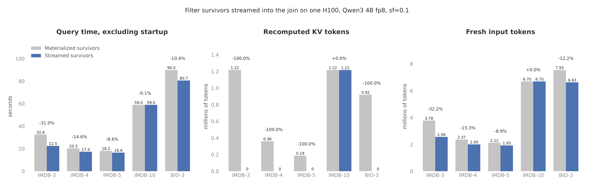

# Filter survivors streamed into the join

- The first join group's anchor filter now streams each passing document
  into the join with its KV pinned, instead of finishing over the whole
  corpus first and leaving the join to find survivors in the retention
  pool or recompute them. This removes every recomputed anchor prefix on
  the queries that had them.
- IMDB-3 fell from 32.58 to 22.47 seconds, a 31.0% reduction. IMDB-4 fell
  14.6%, IMDB-5 8.6%, and BIO-3 10.4%. On each, recomputed KV tokens went
  to zero and fresh tokens fell by exactly the recomputed count.
- In the first run IMDB-10 did not change (59.00 to 58.97 seconds). Its
  first join group anchors on the unfiltered `r2`; the filtered `r1`
  anchored the second group, behind an anchor switch, so the streamed
  edge never applied and its 1,217,171 recomputed tokens stayed. The
  prediction for IMDB-10 was wrong for that reason, not because of the
  mechanism. A planner change then placed `r1`'s chain right before its
  group and streamed it; the second run below measures that.
- All 15 answer tables are identical between the two implementations,
  and so are evaluated pairs and returned rows.

Figure: plots/streamed_filter_join.png

## Setup

- One Modal H100 running `Qwen/Qwen3-4B-FP8` with bf16 KV, sf=0.1,
  lf=1. Both implementations ran in the same container on the same GPU,
  each in its own process, with one unmeasured warmup run per query
  before the measured run.
- The baseline is main at commit `8338d92`: operator-at-a-time
  execution, where a filter chain finishes for all documents before its
  join starts and survivors reach the join through the retention pool
  (the arena minus two chunk budgets, 8,843 pages) or are recomputed.
  The comparison is this branch with the streamed edge. Nothing else
  differs between the two checkouts.
- Chunk budget 110,376 tokens and KV budget 362,250 tokens for both, as
  the planner derives them. There is no baseline-only setting: the change
  is in when the join reads a survivor's KV, not in any budget.
- Queries, chosen because they are the five with nonzero recomputed KV in
  the saved suite run ([saved results](2026-09-05-quailb-saved-results.md)):
  - IMDB-3: one filter on reviews, then a join with 12 aspects. 5,000
    reviews of about 299 tokens; the join needs about 150 anchors to fill
    a chunk, so the join runs about two chunks per filter chunk.
  - IMDB-4 and IMDB-5: two and three filters on reviews, then the same
    join.
  - IMDB-10: one filter on reviews, then a three-join chain whose first
    group anchors on the filtered reviews.
  - BIO-3: one filter, then a join with longer documents.
- Cell: `experiments/cells/streamed_filter_join.py`. Modal function call
  `fc-01M27GHD7K71XA6RNX9XEY6XP8`. Results, answer tables, and the prediction as stated
  before the run are on `quail-results` at `/results/ablations/streamed-filter-join-20260911T055517Z/`.

## Prediction

- Stated before the run: recomputed KV tokens go from 1,217,732 (IMDB-3),
  361,440 (IMDB-4), 188,587 (IMDB-5), 1,217,732 (IMDB-10), and 919,409
  (BIO-3) to 0, and fresh tokens fall by exactly those counts, because a
  streamed anchor packs the frame and partner suffixes only, the same as
  a resident one.
- At the saved runs' 8.4 to 11.9 microseconds per fresh token that is
  about 10.4, 3.1, 1.6, 10.7, and 11.0 seconds: IMDB-3 near 22 seconds
  from 32.35, IMDB-4 near 17 from 19.99, IMDB-5 near 16.2 from 17.76,
  IMDB-10 near 49 from 59.71, BIO-3 near 79 from 89.92.
- Answer tables, evaluated pairs, and returned rows should be identical
  between the two implementations: the same prefixes, frames, and
  suffixes are computed, only their chunk placement moves. The baseline
  should reproduce the saved suite numbers within run-to-run noise.

## Results

| Query | Configuration | Query time, seconds | Document pairs/second | $/query |
|---|---|---:|---:|---:|
| IMDB-3 | Materialized survivors | 32.58 | 1,613.3 | 0.03574 |
| IMDB-3 | Streamed survivors | 22.47 | 2,339.1 | 0.02465 |
| IMDB-4 | Materialized survivors | 20.32 | 742.3 | 0.02229 |
| IMDB-4 | Streamed survivors | 17.35 | 869.4 | 0.01903 |
| IMDB-5 | Materialized survivors | 18.16 | 480.4 | 0.01992 |
| IMDB-5 | Streamed survivors | 16.60 | 525.5 | 0.01821 |
| IMDB-10 | Materialized survivors | 59.00 | 2,446.6 | 0.06472 |
| IMDB-10 | Streamed survivors | 58.97 | 2,447.8 | 0.06469 |
| BIO-3 | Materialized survivors | 89.97 | 3,432.2 | 0.09870 |
| BIO-3 | Streamed survivors | 80.65 | 3,828.9 | 0.08847 |

| Query | Recomputed KV tokens, before | Recomputed KV tokens, after | Fresh tokens, before | Fresh tokens, after | Anchor KV hits and misses, before | Anchor KV hits and misses, after | Time saved, seconds | Predicted, seconds |
|---|---:|---:|---:|---:|---:|---:|---:|---:|
| IMDB-3 | 1,217,171 | 0 | 3,777,943 | 2,560,772 | 124 and 4,256 | 4,380 and 0 | 10.11 (-31.0%) | 10.4 |
| IMDB-4 | 361,389 | 0 | 2,365,565 | 2,004,176 | 138 and 1,119 | 1,257 and 0 | 2.97 (-14.6%) | 3.1 |
| IMDB-5 | 188,395 | 0 | 2,118,038 | 1,929,643 | 152 and 575 | 727 and 0 | 1.56 (-8.6%) | 1.6 |
| IMDB-10 | 1,217,171 | 1,217,171 | 6,696,942 | 6,696,942 | 124 and 9,256 | 124 and 9,256 | 0.03 (-0.1%) | 10.7 |
| BIO-3 | 919,912 | 0 | 7,547,851 | 6,627,939 | 14 and 260 | 274 and 0 | 9.32 (-10.4%) | 11.0 |

- Query time is the worker's `wall_s`, excluding model startup and result
  collection. Document pairs/second divides evaluated pairs summed over
  all join stages by query time. $/query is query time in hours times
  $3.9492 from `quail.specs.H100_USD_PER_HOUR`. "Before" is the
  materialized baseline and "after" the streamed edge.
- The baseline reproduced the saved suite run within noise: 32.58 against
  32.35 seconds on IMDB-3, 20.32 against 19.99, 18.16 against 17.76, 59.00
  against 59.71, 89.97 against 89.92. Its recomputed counts differ from
  the saved run by under 0.1% (1,217,171 against 1,217,732 on IMDB-3),
  the retention pool's replacement order being sensitive to answer
  arrival order.
- Evaluated pairs and returned rows: IMDB-3 52,560 pairs and 9,650 rows;
  IMDB-4 15,084 and 3,176; IMDB-5 8,724 and 2,076; IMDB-10 144,348 and
  64,840,220; BIO-3 308,798 and 61,447. Every count is the same for both
  implementations, and every answer table matched row by row after
  sorting (2, 3, 4, 4, and 2 tables).
- Peak GPU memory was 68.16 GiB before and 68.20 GiB after on every
  query: the arena is preallocated, so pinning survivors moves nothing.
- On a streamed edge the filter node reports its own answers and fresh
  tokens but no wall time of its own; the join node's wall time covers
  both operators. On IMDB-3 the join node went from 17.82 seconds
  (after a 14.76-second filter) to 22.47 seconds for both.

## What the numbers mean

- The saving is the recomputed prefix work, and nothing else moved. On
  IMDB-3 the streamed run computed 1,217,171 fewer fresh tokens, exactly
  the baseline's recomputed count, and saved 10.11 seconds against the
  10.4 predicted from the saved run's 8.56 microseconds per fresh token.
  IMDB-4 and IMDB-5 landed within 0.15 seconds of their predictions.
  BIO-3 saved 9.32 seconds against 11.0 predicted: its longer documents
  make the average cost per fresh token (11.9 microseconds) a rougher
  guide to the cost of a prefix token than on IMDB.
- The baseline's anchor KV hits show the size of the problem it had: the
  retention pool held 124 of 4,380 IMDB-3 survivors, 138 of 1,257 on
  IMDB-4, 152 of 727 on IMDB-5, and 14 of 274 on BIO-3. Every other
  survivor was evicted and recomputed. Under streaming every survivor
  is a hit, and nothing is evicted, because the pinned set is only what
  the join has not answered yet.
- IMDB-10 is the limit of this change. The join search puts the group
  anchored on the unfiltered `r2` first, and `r1`'s filter survivors
  wait through that whole group in the retention pool. A streamed edge
  only helps the group that runs right after the filter. The natural
  next step is to let the planner defer a filter to the group that
  anchors on it, after the `Exchange`, so the chain runs on the pruned
  live set and streams into that group the same way. Nothing in the
  executor needs to change for that; it is a planner and runner
  ordering decision.
- The join chunks stayed full. IMDB-3's join needs about 150 resident
  anchors to fill a chunk, and each filter chunk hands over about 300
  survivors, so the join ran about two chunks per filter chunk and never
  waited on a partial one. The filter never had to stop for pages: the
  join freed answered anchors faster than the chain produced new ones.
- One measured run per configuration. The smallest saving, IMDB-5's 1.56
  seconds, is about four times the largest baseline drift from the saved
  suite (0.40 seconds on IMDB-5), so it is not noise. IMDB-10's 0.03
  seconds is noise.
- Recomputed KV tokens remain nonzero on this benchmark only where a
  filtered alias anchors a later group (IMDB-10). The agent queries'
  gap to the request backends is a different problem, prefixes shared
  across documents, and this change does not touch it.

## Second run: the planner defers the chain to the group it anchors

- After the first run the planner changed in two ways
  ([feature note](shipped_features/2026-09-11-unlimited-kv-planning.md)):
  the join search prices KV reuse as unlimited, the speed-of-light
  assumption, instead of crediting only what the retention pool could
  hold; and a filtered alias whose first use is as an anchor has its
  chain placed right before that group, after any barrier, streaming into
  it. On IMDB-10 the search keeps the `r2` group first (16.64 estimated
  seconds against 16.82 for `r1` first) and `r1`'s chain now runs after
  the barrier. On FEV-9, `e2`'s chain moves after the first group's
  barrier and streams into the `e2` group; `c1` and `c2` are partners
  first, so their chains still run up front.
- Same setup as the first run: one H100, Qwen3 4B fp8, sf=0.1, the same
  `8338d92` baseline in the same container, one warmup and one measured
  run per query. Modal function call `fc-01M27NHND7E2RVB4VKD4XZ1JQ0`, data at
  `/results/ablations/DIR2_PLACEHOLDER/`.
- Prediction, stated before the run: IMDB-10 loses all 1,217,171
  recomputed tokens, fresh tokens fall by exactly that count, and query
  time drops about 10.7 seconds to near 48 from 59.0, with the same
  144,348 pairs and 64,840,220 rows. FEV-9's 7,309 recomputed tokens go
  to 0 and its time stays within noise of 41 seconds. Answer tables
  identical on both.

RESULTS2_PLACEHOLDER
