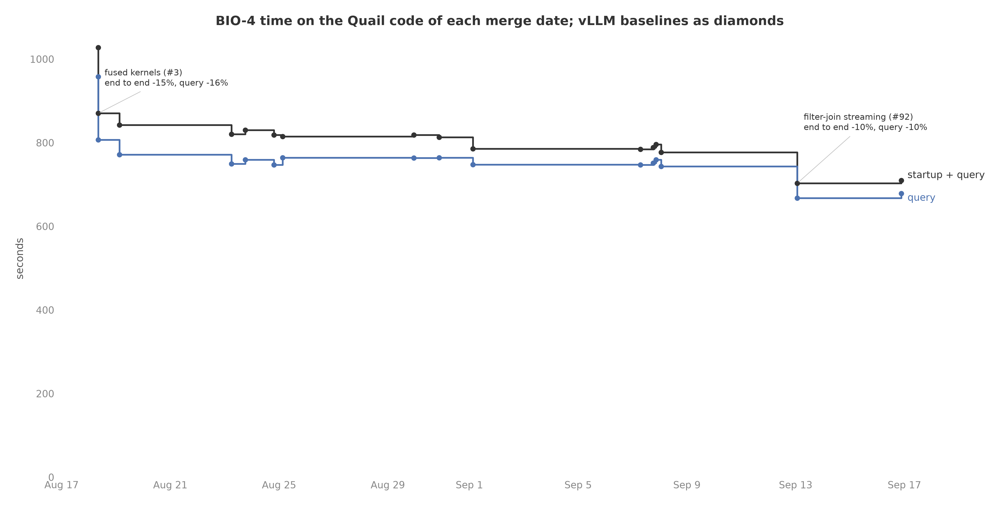
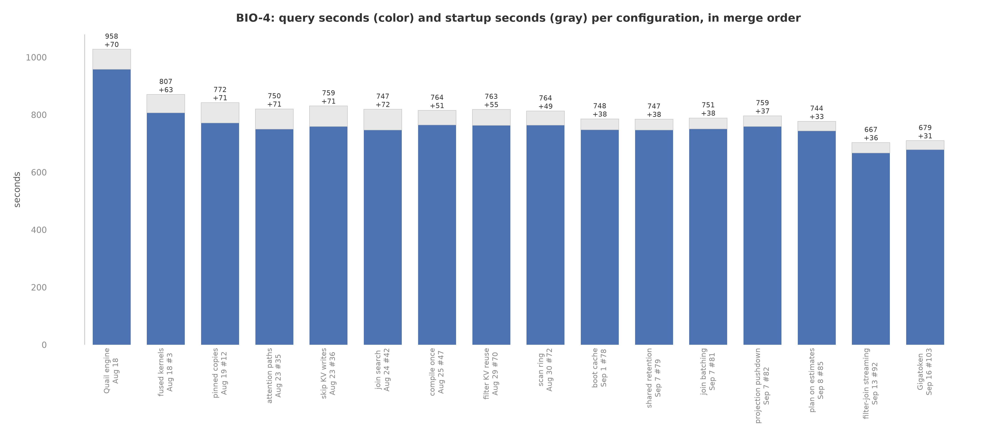
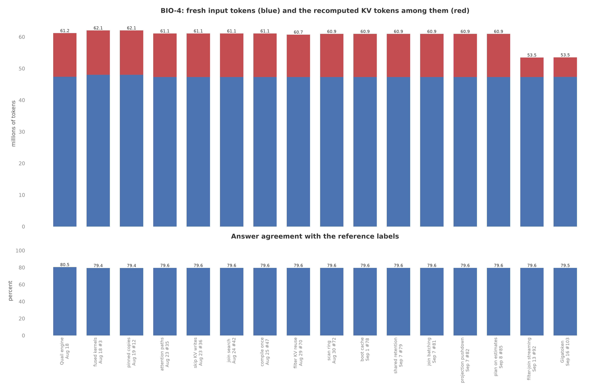

# BIO-4 across Quail's history

{{SUMMARY}}

Figure: plots/bio4_history_progress.png

Figure: plots/bio4_history_time.png

Figure: plots/bio4_history_tokens.png

## What was run

- One query, BIO-4 at sf=0.5: a filter on 2,500 adverse event reports,
  filters on two aliases of the 2,934-term table (neurological and
  cardiovascular reactions), and two joins of the surviving reports
  against each term list. Qwen3 4B FP8, bf16 KV, one H100 per
  configuration.
- Every configuration ran the current code on
  `claude/compassionate-maxwell-ux26bx` with the features merged after
  its date switched off. Each switch in `quail/ablation.py` recreates
  what the engine did before one pull request. Checking out old
  commits instead was not possible: BIO-4 was added on Sep 20, `main`
  was squashed on Sep 7, and the latency definition changed on Sep 22.
- Every configuration answers the same prompts, with the join question
  written before the term, so answers match across configurations up to
  kernel rounding. #52 (Aug 26) moved the question to that position; the
  saving it brought comes from the prompt, and the engine already
  computed text in that position once per report, so it is not a step.
- The vLLM configurations are the baselines as they stood on their
  dates.
- Each configuration ran in its own fresh container, all at once.
  Cell: `experiments/bio4_history.py`. Run directories on
  `quail-results`: the configurations dated before Aug 26 in
  `/results/ablations/bio4-history-sf0.5-20260926T223002Z` (commit
  `6537700`), the rest in
  `/results/ablations/bio4-history-sf0.5-20260926T213610Z` (commit
  `e38bfeb`). The logs with every Modal function call id are
  `results/benchmark/20260926T222959Z-bio4-history-sf0.5-early.log` and
  `results/benchmark/20260926T213606Z-bio4-history-sf0.5.log`.
- Reference labels: collection `gt_68f9ce9439bd7615de92b33d576dff9e`
  (Qwen3 32B FP8 and the benchmark's annotations).

### Timing

- Query time is QUAIL-B's submission-to-answer time: planning,
  tokenization, execution, and answer preparation. Model startup is
  excluded, as in every QUAIL-B report.
- Startup time is the seconds from starting a fresh process until the
  engine is ready: imports and tokenizer load until the session is
  ready, then the engine boot (model load, KV arena, kernel compile or
  touch pass for Quail; `LLM()` construction for vLLM). It excludes
  Modal's container provisioning and QUAIL-B's data and label loading.
- Startup varies from machine to machine: the model load took 9 to 33
  seconds for the same configuration on different containers. Each
  configuration was therefore booted three times, once in its query run
  and twice in startup-only containers, and the figures use the median.
- Throughput is requested input tokens per second, as QUAIL-B reports
  it. $/query is query seconds times $3.9492 per H100 hour.

### The switches

| Switch | Merged | PR | Affects | With the feature | Without it |
|---|---|---|---|---|---|
| `triton_kernels` | Aug 16 | #3 | query | fused Triton kernels for norm and quantize, q and k norm with rotary, and SiLU with quantize | vLLM's unfused kernels for those three steps |
| `pinned_staging` | Aug 19 | #12 | query | chunk inputs copied to the GPU through pinned memory without blocking | pageable, blocking copies |
| `attention_paths` | Aug 23 | #35 | query | filters use the unified attention path and joins use merge_quant | filters use the join's two-call attention path |
| `skip_arena_writes` | Aug 23 | #36 | query | a one-stage filter whose KV nothing reads skips the KV arena | every filter writes its KV into the arena |
| `join_search` | Aug 24 | #42 | query | one search over join order and anchor choice | joins in written order; each join anchors on the input with the most tokens |
| `compile_once` | Aug 25 | #47 | startup | the kernel compile pass runs once; later boots only touch kernels | every boot runs the compile pass |
| `filter_kv_reuse` | Aug 29 | #70 | query | filter survivors keep their KV for the joins; filters ordered by cost | joins recompute every anchor prefix; filters in written order |
| `scan_ring` | Aug 30 | #72 | query | retained KV is capped to leave two chunks of pages for admission | retained KV may fill the arena |
| `boot_cache` | Sep 1 | #78 | startup | vLLM's cache on the kernel volume and pinned model revisions | a fresh vLLM cache per boot and the model's main branch |
| `shared_retention` | Sep 7 | #79 | query | one KV retention pool shared by every planned anchor input | only the first join anchor's filter survivors are retained |
| `join_continuous_batching` | Sep 7 | #81 | query | join anchors admitted continuously, stages mixed in one chunk | each arena-sized group of anchors runs one stage at a time and waits for every answer |
| `projection_pushdown` | Sep 7 | #82 | query | scans keep only the columns the query reads | scans keep every source column |
| `plan_on_estimates` | Sep 8 | #85 | query | planning uses estimated token counts while tokenization runs | planning waits for exact token counts |
| `filter_join_streaming` | Sep 13 | #92 | query | filter survivors stream into the join with their KV pinned | the join starts after its filter finishes |
| `gigatoken` | Sep 16 | #103 | both | Gigatoken tokenizes documents and prompts | bpe-qwen tokenizes documents and prompts |
| `vllm_gigatoken` | Sep 22 | #167 | query | vLLM receives prompt text and tokenizes it with Gigatoken | vLLM receives prompt token ids built from each document's tokens |

The two Quail configurations dated Aug 18 are the first engine commit
(`44eaf81`, no pull request) with vLLM's kernels and with the fused
kernels from #3.

### What the history could not recreate

- BIO-4 has two joins. The engine could first run two joins on Aug 24
  (#42). The configurations dated earlier run them the way the Aug 24
  code does: one join node, one anchor, its KV shared by both stages.
- fp8 KV (removed in #17, Aug 20) is not a switch; every configuration
  uses bf16 KV.
- The memory-mapped token store (in #79) and the Sep 18 engine
  refactors have no switch.
- The Aug 2 to Aug 12 prototype, which added KV rewind inside a patched
  vLLM, is not runnable; KV rewind and token-based admission are part
  of the Aug 18 base engine.
- Changes that do not touch BIO-4 are not steps: LIMIT early stop
  (#29), filter-chain queries, equality joins, AI.SCORE, and the
  DiffusionGemma work.

## Prediction

Stated in the run logs before launch, from the sf=0.1 check:

- 2,500 reports and 2,934 terms give about 3.2 million evaluated pairs,
  13 times sf=0.1. Measured: 2.9 million.
- Quail today about 700 seconds of query time. Measured: 678.5 and
  667.0 seconds.
- Configurations before filter-join streaming about 900 seconds, the
  Aug 18 engine with vLLM's kernels up to a quarter more. Measured: 744
  to 807 seconds, and 958.1 seconds for the Aug 18 engine.
- Pipelined vLLM today 5,000 to 10,000 seconds.
- Startup does not depend on the scale factor.

## What each step did

Changes smaller than 1.7% are within noise: Quail today ran twice, in
two containers, at 678.5 and 667.0 seconds.

- **Quail engine with vLLM's kernels, Aug 18.** 958.1 seconds of query
  time and 69.7 seconds of startup.
- **Fused kernels, #3.** Query time fell 15.8%, to 806.9 seconds. The
  new kernels round differently, so a few answers changed: answer
  agreement moved from 80.5% to 79.4%, and 2.96 million pairs were
  evaluated instead of 2.91 million.
- **Pinned copies, #12.** 4.4% less query time, same answers.
- **Attention paths (#35), skip KV writes (#36), join search (#42).**
  Between 747 and 760 seconds, within noise of each other. The join
  search runs the cardiovascular join first; both orders evaluate about
  2.9 million pairs, because every surviving report matches at least
  one cardiovascular term.
- **Compile once, #47.** Startup fell from 71.6 to 50.7 seconds (median
  of three). The compile pass took about 25 seconds; the touch pass that
  replaced it takes about 5.
- **Filter KV reuse, #70.** No change in query time. The reports average
  about 4,100 tokens, so the retention pool holds only a few dozen of
  the 1,894 reports that pass the filter: 26 joins found their report's
  KV, 1,868 recomputed it.
- **Scan ring, #72.** No change. The ring fixed filters that stalled
  on tiny chunks of short documents (IMDB-3); a chunk of 4,100-token
  reports stays large.
- **Boot cache, #78.** Startup fell from 48.9 to 37.6 seconds.
- **Shared retention (#79), join batching (#81), projection pushdown
  (#82), planning on estimates (#85).** Each within noise on BIO-4.
- **Filter-join streaming, #92.** Query time fell 10.3%, from 743.7 to
  667.4 seconds. Each passing report now keeps its KV pinned until its
  pairs are answered: all 1,894 joins found their report's KV, and
  recomputed KV tokens fell from 13.6 million to 6.1 million.
- **Gigatoken, #103.** Session startup fell from 12 to 17 seconds to
  1.5 seconds, and document tokenization inside the query from about 4
  seconds to 1.3 seconds. Query time moved within noise.

Over the whole history, startup fell from 69.7 to 31.3 seconds and
query time from 958.1 to 678.5 seconds.

## Side result: where the question sits changes the answers

This is not part of the comparison above. An earlier run of this
history moved the join question after the term for the configurations
dated before Aug 26, as the prompt read before #52. At sf=0.5, on the
Aug 25 engine (`/results/ablations/bio4-history-sf0.5-20260926T213610Z`,
configurations `compile_once` and `shared_join_prompts`):

| | Question after term | Question before term |
|---|---:|---:|
| Join pairs answered TRUE (reference 4.4%) | 4.8% | 23% |
| Join answer precision | 38% | 14.5% |
| Join answer recall | 42% | 77% |
| Answer agreement, all predicates | 94.5% | 79.6% |
| Rows returned (reference 6.46 million) | 6.2 million | 86.3 million |
| Fresh tokens | 150.0 million | 61.1 million |
| Query seconds | 1,823.5 | 764.1 |

- The filters' answers are the same in both layouts; only the join
  answers move.
- The reference labels were made by Qwen3 32B with the question-before-term
  layout. The 4B model answers TRUE five times as often as the
  reference with that layout. Pipelined vLLM uses the same prompts and
  gets the same answers, so this is a property of the prompt, not of
  the engine.
- To settle which layout to keep, read a sample of the pairs the two
  layouts answer differently, and repeat the swap on BIO-2 and BIO-3.

{{TABLES}}

## Reproduce

- Rerun: `uv run modal run --detach
  experiments/bio4_history.py::history --sf 0.5 --startup-samples 2`
  on `claude/compassionate-maxwell-ux26bx`.
- Figures and tables:
  `uv run --with matplotlib python reports/make_bio4_history_plots.py
  "$W"` and the same with `--table`, after pulling
  `/results/ablations/bio4-history-sf0.5-20260926T213610Z/configurations` and `/results/ablations/bio4-history-sf0.5-20260926T213610Z/startup` into `$W`.
