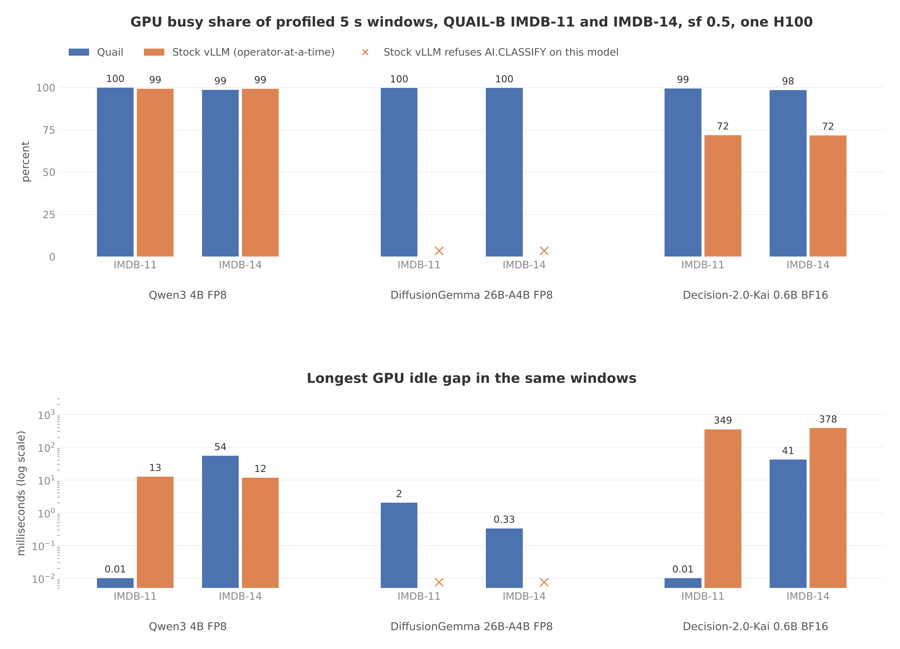

# GPU profiles of IMDB-11 and IMDB-14, Quail and stock vLLM

Date: 2026-10-08.

In every profiled 5 s window of the two classification queries, Quail
keeps the GPU busy 98 to 100% of the time. Stock vLLM leaves it idle
28% of the time on Decision-2.0-Kai 0.6B. On Qwen3 4B, stock vLLM is
also busy 99%, and its extra time comes from more tokens and slower
kernels, not from an idle GPU.

[](plots/classify_profiles_gpu_busy_and_gap.png)

## Setup

- Queries: IMDB-11, one classification with 4 labels, and IMDB-14, a
  filter, then classifications with 4 and 8 labels. They are the
  classification queries farthest from the SoL estimate in the sf 0.5
  runs of 2026-10-01, among those that run long enough to sample a
  steady state.
- Models: Qwen3 4B FP8, DiffusionGemma 26B-A4B FP8, and
  Decision-2.0-Kai 0.6B BF16. Stock vLLM's planner refuses AI.CLASSIFY
  on DiffusionGemma, whose engine returns no text, so it has no vLLM
  runs.
- Engines: Quail, and stock vLLM with operator-at-a-time submission.
  Scale factor 0.5, one H100 per run on Modal, each query in a fresh
  process.
- Capture: `experiments/cells/classify_profiles.py`, torch.profiler
  with CPU and CUDA activity. A window starts and stops at a forward
  pass boundary: a Quail chunk or a vLLM engine step. Model loading and
  planning run unprofiled.
- Stock vLLM ran with its engine core in the client process
  (`VLLM_ENABLE_V1_MULTIPROCESSING=0`) so the profiler sees its
  kernels. The benchmark runs keep the engine core in its own process
  for Qwen3 and Kai.
- No prediction was written down before these runs.

Runs, on the `quail-results` volume:

| Directory | Runs | Code | Function call ids |
|---|---|---|---|
| `/results/ablations/classify-profiles/20261008T042520Z/` | IMDB-11 on every model and engine; stock vLLM IMDB-14 | `9611eae` (Quail), `2189e98` (vLLM) on `claude/elegant-turing-ucd81t` | `fc-01M4CW4XNDNF7TTFZZN5N2QZP5`, `fc-01M4CW4XRRJW6PEB0S6TVS8KYT`, `fc-01M4CW4XVGKS88JDYP179EBXWM`, `fc-01M4CWHXXV0JMMKQC5KNS7ZGYQ`, `fc-01M4CWHY3QKR72AEZVKQN5G3QH` |
| `/results/ablations/classify-profiles/20261008T052000Z/` | Quail IMDB-14 | `d2c6a60` | `fc-01M4CY97D7CAR1V06VX3SWRWMK`, `fc-01M4CY97GCBF2T2K1SHFMQHEDP`, `fc-01M4CY97JZA6RQHWPNWWJVHYMV` |

In the first directory, Quail's IMDB-14 window armed on a stage the
fused pipeline never enters, so the later directory replaces it. Both
directories also hold BIO-6 runs, which this report leaves out.

## Result

GPU busy share is GPU-active seconds over the seconds from the
window's first device event to its last. Overlapping kernels count
once.

| Model | Engine | Query | GPU busy | Longest idle gap | Fresh tokens | Profiled query time |
|---|---|---|---:|---:|---:|---:|
| Qwen3 4B | Quail | IMDB-11 | 99.9% | 0.01 ms | 8.6M | 76.2 s |
| Qwen3 4B | stock vLLM | IMDB-11 | 99.2% | 12.5 ms | 8.7M | 93.1 s |
| Qwen3 4B | Quail | IMDB-14 | 98.6% | 54.1 ms | 9.7M | 96.8 s |
| Qwen3 4B | stock vLLM | IMDB-14 | 99.2% | 11.6 ms | 14.1M | 150.8 s |
| DiffusionGemma | Quail | IMDB-11 | 99.7% | 2.0 ms | 9.7M | 104.0 s |
| DiffusionGemma | Quail | IMDB-14 | 99.7% | 0.3 ms | 11.3M | 132.0 s |
| Kai | Quail | IMDB-11 | 99.4% | 0.01 ms | 10.0M | 24.3 s |
| Kai | stock vLLM | IMDB-11 | 71.9% | 348.6 ms | 10.0M | 34.9 s |
| Kai | Quail | IMDB-14 | 98.4% | 41.3 ms | 12.6M | 53.7 s |
| Kai | stock vLLM | IMDB-14 | 71.7% | 377.5 ms | 17.2M | 57.5 s |

### Kai on stock vLLM: per-request copies and host gaps

On IMDB-11, each engine step runs about 160 ms on the GPU for about
165 requests. The step opens with about 165 small host-to-device
copies and closes with about 165 device-to-host copies of the pooled
decision rows, 2 to 3 KB in total, one per request. Then the GPU waits
about 21 ms while the host processes outputs and schedules the next
step. Qwen3 4B text generation makes 2 device-to-host copies per step.

The window's 1.42 s of idle time splits into:

- 0.51 s in 24 gaps of about 21 ms between steps.
- 0.39 s in about 30,000 gaps under 50 µs between kernels. The 0.6B
  model's kernels are short enough that launch spacing shows.
- 0.35 s in one stall near the end of the window.
- 0.18 s in the rest.

The torch operators recorded in the step gaps (`aten::any`,
`aten::isnan`, `aten::item`) add up to under 1 ms. The rest is Python
without a torch operator: vLLM's output processing and scheduler, and
the baseline's request handling. The traces carry no Python stacks, so
they do not split it further. IMDB-14's classification stage shows
the same pattern.

### Qwen3 4B on stock vLLM: busy, but more work

On IMDB-11, both engines process the same tokens and keep the GPU 99%
busy, yet stock vLLM takes 93.1 s against Quail's 76.2 s. Its kernel
time splits differently: 25% in quantize and activation kernels, with
a standalone `per_token_group_quant_8bit_kernel` at 18%, against 12 to
14% for Quail's fused SiLU and quantize. On IMDB-14, stock vLLM
computes 14.1M fresh tokens against Quail's 9.7M, because it computes
each review once for the filter and again for the classifications.
Its time is 1.56 times Quail's, close to the 1.45 times token ratio.

### Where Quail's time goes

Quail computes within 2% (Qwen3 4B) and 13% (DiffusionGemma) of the
SoL estimate's tokens, with the GPU busy. Its time over SoL, 2.3 and
2.6 times on Qwen3 4B and 3.6 and 4.0 times on DiffusionGemma, is
per-token kernel time. Kernel time in the windows:

- Qwen3 4B: GEMM 61 to 65%, attention 15 to 18%, fused quantize and
  activation 14%.
- DiffusionGemma: MoE 39%, GEMM 24 to 25%, quantize and activation
  14%, norm and RoPE 12%.
- Kai: GEMM 56 to 57%, attention 15 to 17%, norm and RoPE 12%.

On IMDB-14, Quail's window opened 3 to 13 s after it was due. All of
Quail's forward passes go through the hooked function, so Quail ran
no forward pass in those seconds, between the filter stages and the
first chunk of the fused pipeline. The stage records do not show what
it did instead.

## Screenshots

Each pair shows the same model and query, stock vLLM first. In every
screenshot, `stream N N` is the GPU and `thread N (python)` is the
engine's main thread. Time runs left to right across the window.

| Model, query | Stock vLLM | Quail |
|---|---|---|
| Kai, IMDB-11 | [72% busy](plots/classify_profiles_kai_imdb-11_stock_vllm.png) | [99% busy](plots/classify_profiles_kai_imdb-11_quail.png) |
| Kai, IMDB-14 | [72% busy](plots/classify_profiles_kai_imdb-14_stock_vllm.png) | [98% busy](plots/classify_profiles_kai_imdb-14_quail.png) |
| Qwen3 4B, IMDB-11 | [99% busy](plots/classify_profiles_qwen3_4b_imdb-11_stock_vllm.png) | [100% busy](plots/classify_profiles_qwen3_4b_imdb-11_quail.png) |
| Qwen3 4B, IMDB-14 | [99% busy](plots/classify_profiles_qwen3_4b_imdb-14_stock_vllm.png) | [99% busy](plots/classify_profiles_qwen3_4b_imdb-14_quail.png) |
| DiffusionGemma, IMDB-11 | not run | [100% busy](plots/classify_profiles_dgemma_imdb-11_quail.png) |
| DiffusionGemma, IMDB-14 | not run | [100% busy](plots/classify_profiles_dgemma_imdb-14_quail.png) |

On the Qwen3 4B IMDB-11 Quail screenshot, the GPU track starts 0.9 s
into the window. Quail had about 0.9 s of kernels queued when the
profiler started, and the profiler records only kernels launched after
it starts. The stop synchronize at the end waited for that queue.

## What is not settled

- With the engine core in its own process, as benchmarked, part of
  vLLM's host work overlaps the GPU, so the idle share on Kai may be
  lower there. The profiled vLLM runs took within 8% of the 2026-10-01
  benchmark times on Qwen3 4B. A profile with the engine core in its
  own process, using vLLM's own profiler hooks, would settle it.
- Each run has one 5 s window. Recording the start of every forward
  pass, which is cheap, would give each run's full timeline and its
  total time with no pass.
- Each configuration ran once. Quail's profiled times differ from the
  2026-10-01 runs by 2 to 15% in both directions, on different
  physical GPUs and a newer engine.
- Kai has no sf 0.5 benchmark run and no SoL estimate at that scale.

## Reproduce

```
W=/tmp/classify-profiles; mkdir -p "$W"
P=ablations/classify-profiles
uv run modal volume get quail-results "$P/20261008T042520Z" "$W/"
uv run modal volume get quail-results "$P/20261008T052000Z" "$W/"
uv run --with matplotlib --with playwright==1.55.0 \
  python reports/make_classify_profiles_plots.py "$W" --screenshots
```
