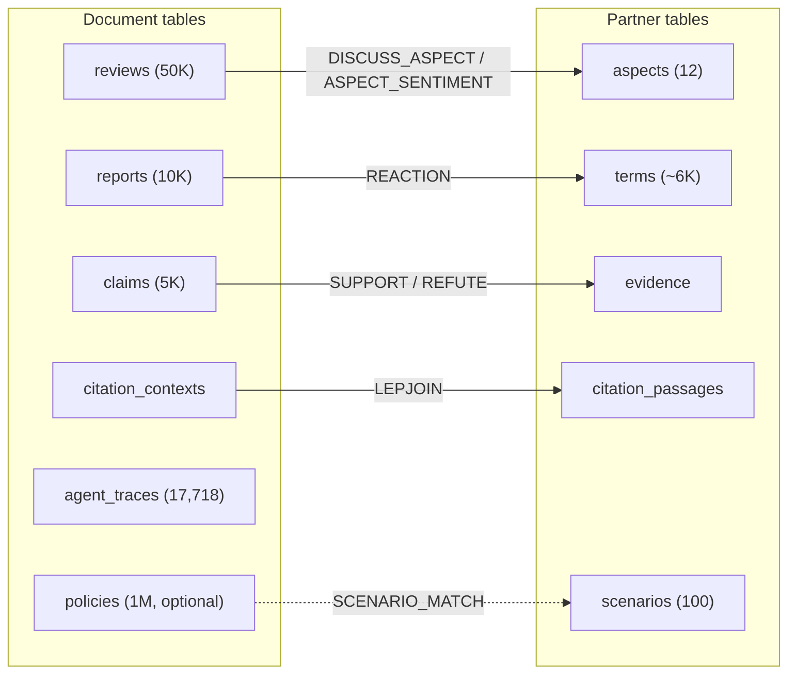

# Quail engine wiki

This document describes every algorithm and technique in the Quail
engine, for use as a reference when writing the paper. It covers the
full path from a user's query to GPU execution and back.

All file references are relative to `quail/` unless otherwise
noted.

## Module map

The table below lists every module, what it does, and what it
depends on. The data flow is top to bottom: the user calls the
session, which calls the front end, then the planner, then ships a
payload to the worker, which calls the executor.

| Module | What it does | Depends on |
|---|---|---|
| `__init__.py` | Public API surface | builder, catalog, planner, runtime |
| `catalog.py` | Table provider interface and Arrow, Parquet, Hugging Face, and memory providers | logical |
| `logical.py` | Logical node interface, built in nodes, and the shared plan builder | nothing |
| `logical_optimizer.py` | Generic logical rule runner | logical |
| `builder.py` | Builder API entry point | catalog, logical |
| `sqlfront/compile.py` | AI SQL entry point (sqlglot parser and binder) | catalog, logical |
| `extensions.py` | Per session backend, codec, runtime, rule, and provider registration | physical, runtime |
| `planning.py` | Backend planning inputs and physical candidates | physical, specs |
| `physical/` | Typed physical nodes, graph validation, and JSON codecs | nothing |
| `backends/` | Model backend interface and the Quail backend | planning, physical |
| `specs/base.py` | ModelSpec and DeviceSpec structs | nothing |
| `specs/qwen3_4b.py`, `specs/h100_sxm.py` | Concrete spec instances | specs/base |
| `planner/budgets.py` | Derived quantities (chunk budget, arena budget, roofline) | specs |
| `planner/work.py` | Hardware independent token, attention pair, and KV counts | nothing |
| `planner/qwen3_cost.py` | Qwen3 attention projection, MLP, and attention components | specs, work, roofline |
| `planner/roofline.py` | Generic component compute and memory limits | specs |
| `planner/sol.py` | Ideal query packing and total component time | work, qwen3_cost, roofline |
| `planner/plan.py` | PhysicalPlan, Refusal, and EngineConfig | physical, specs |
| `planner/decide.py` | All planner decisions (order, anchor, dtype, sharding) | logical, budgets, plan |
| `executor/arena.py` | Paged KV arena (PageArena accounting + KVArena tensors) | nothing (torch lazy) |
| `executor/attention.py` | Pipeline: forward pass, attention, Triton kernels | arena (torch, vLLM, triton lazy) |
| `executor/pack.py` | Chunk packing (pack_stream, FilterAdmission) | nothing |
| `executor/loop.py` | Execution loops (run_filter, run_join, warm_kernels) | arena, attention, pack |
| `executor/model.py` | Weight loading through vLLM | nothing (vLLM lazy) |
| `runtime/session.py` | Session, Query, tokenization, payload assembly | catalog, logical, planner, sqlfront, builder |
| `runtime/compute.py` | Compute provider interface and Modal implementation | runtime worker |
| `runtime/coordinator.py` | Multi-GPU payload splitting and answer merging | nothing |
| `runtime/runner.py` | Generic typed graph runner and standard node metrics | physical |
| `runtime/quail_graph.py` | One GPU Quail node preparation and adaptive join runtime | runner, planner, executor |
| `runtime/quail_distributed.py` | Several GPU Quail node dispatch and result merging | runner, coordinator |
| `runtime/worker.py` | Modal worker (boot, execute, multi-GPU dispatch) | executor, planner, coordinator |
| `bench/quailb.py` | QUAIL-B benchmark (data, queries, driver) | runtime |

### Data flow

```
User
  |
  v
Session (runtime/session.py)
  |--- sql() ---> sqlfront/compile.py ---|
  |--- docs() --> builder.py ------------|--> LogicalPlanBuilder
  |
  v
logical optimizer rules
  |
  v
selected ModelBackend
  reads: logical plan, model and device specs, token counts
  produces: typed PhysicalPlan
  |
  v
selected ModelBackend.prepare
  encodes the backend request and versioned physical plan
  |
  v
selected ComputeProvider
  installs extension code and sends the request
  |
  v
worker.execute (runtime/worker.py, with Modal as the default provider)
  validates the plan version, backend, codecs, model, and GPU count
  imports the extension modules named by the plan
  boots: model.py -> attention.Pipeline -> arena.KVArena
  runs: GenericRunner -> registered node runtimes
        -> QuailModelExecution -> loop.run_filter / loop.run_join
  returns: raw answer rows
  |
  v
selected ModelBackend.assemble
  converts answers to Arrow tables
  |
  v
Arrow Acero
  hash joins, projects, counts, streams -> QueryResult
```

## 1. System overview

Quail (QUery-Aware Inference Layer) is a query engine for two
operators over document collections: `AI_FILTER` (does this document
satisfy a true/false predicate?) and `AI_JOIN` (does this tuple of
documents - two or more, all in one prompt - satisfy a true/false
predicate?). The model answers each predicate in a single token
(TRUE or FALSE), constrained at decode time so no autoregressive
generation ever runs.

The current scope is filter queries and joins with Qwen3 4B fp8 or
Qwen3 32B fp8 weights. KV uses bf16. Each H100 has one model copy,
and one Modal container can use 1, 2, 4, or 8 H100s.

### End-to-end flow

1. The user registers document providers (parquet files or HF
   datasets) with a `Session`.
2. The user writes a query, either as AI SQL or through the builder
   API.
3. Both front ends use `LogicalPlanBuilder` to create a tree of
   `Scan`, `SemanticFilter`, `SemanticJoin`, and logical `Project`
   nodes. Every logical node implements the same traversal, rewrite,
   validation, schema, and explain interface.
4. The session runs registered logical optimizer rules. It then asks
   each table provider for the required columns in bounded Arrow
   batches and tokenizes those columns.
5. The selected model backend produces physical candidates. The
   planner selects one typed `PhysicalGraph`. Quail uses
   `DocumentScan`, `PackedFilter`, `AdaptiveJoinPlan`, `AnchoredJoin`,
   `Exchange`, `HashJoin`, physical `Project`, and `Limit`.
6. `AdaptiveJoinPlan` contains the join steps predicted from planning
   estimates. At runtime, Quail searches again with the actual filter
   survivors and current KV state. An anchor change is represented as
   `Exchange`. There is no physical barrier node.
7. The selected backend prepares a request with a versioned JSON plan
   envelope and document token columns as Arrow IPC bytes. The selected
   compute provider sends it to a remote process. Modal is the default
   provider. It adds registered local extension sources and pip packages to
   the existing `quail-engine` image. The worker imports the extension modules
   listed in the plan and checks the rebuilt registry before the first model
   call. The generic runner then executes the typed model graph.
   `AdaptiveJoinPlan` creates typed `AnchoredJoin` and `Exchange` child
   graphs. The same `QuailModelExecution` handles every model node on
   one GPU executor, so the nodes use the same KV.
8. The worker returns raw answers. The session stores filter and join
   answers in Arrow tables. Arrow Acero equi-joins the TRUE pairs on
   shared SQL alias columns and applies the final survivor sets. Each
   alias column contains the source table row number for one document.
   A `QueryResult` returns projected rows through a
   `RecordBatchReader`.
   `collect()` explicitly reads those batches into memory. `count()`
   runs an Acero aggregate without creating Python row tuples. LIMIT
   stops the result stream after the requested number of rows.

## 2. Query compilation

Both entry points use `LogicalPlanBuilder`. The builder creates the
same registered logical node types for SQL and Python queries. There
is no separate query description type or second plan assembly path.

Each logical node has a stable type name. It reports its children,
expressions, output schema, validation rules, and explain fields. A
node can also return a copy with different children or expressions.
The generic logical rule runner uses those methods, so a registered
logical node does not require another tree traversal function.

### The logical operators

There are four operators, defined in `logical.py`:

- **Scan**: reads one column of one registered provider (e.g.,
  `reviews.body`).
- **SemanticFilter**: a conjunction of true/false predicates over a
  single scanned column. Each predicate has a prompt template, column
  references, and an optional selectivity (the fraction of documents
  expected to pass).
- **SemanticJoin**: one true/false predicate over a whole tuple of
  documents, one per table - the cross product of its tables
  filtered by a single prompt that holds every document at once
  (the BigQuery/Snowflake AI-join shape). A query may hold several
  `full` joins - each its own predicate and stage, composed by id
  matching at assembly (issue #38); stages may anchor on different
  tables and run as separate anchored joins - plus any number of gates:
  - `full`: produce every matching tuple.
  - `exists`: keep outer documents that match at least one inner
    document (a semi-join; two tables).
  - `anti`: keep outer documents that match no inner document (an
    anti-join; two tables).
- **Project**: column selection at the root. No computed columns.

### Prompt layout

Every operator's prompt starts from the same anchor block. A filter
runs as:

```
[SHARED_PRE] [document] [frame] [question suffix]
```

and a join writes the static question into the anchor's kept KV before
the labeled partner blocks:

```
[SHARED_PRE] [anchor document]
[(The document above is DOCUMENT {0}.)] [instruction + question]
[DOCUMENT {1}:] [partner document] ... [ANSWER:]
```

`SHARED_PRE` is `"DOCUMENT:\n"`, defined once in `logical.py`. It is
engine-owned and identical for every operator, every query, and
every document. Because it is one fixed string, the KV of
`[SHARED_PRE + document]` is the same wherever that document
appears - a filter scan and a join anchor build identical document
KV.

The wording is a formatting label, not an instruction. Measured on
B1 (short reviews): "Evaluate whether the following is true or
false." dropped observed selectivity from 0.398 to 0.074, and "You
will read a document and answer a yes-or-no question about it."
dropped it to 0.0014. `"DOCUMENT:\n"` left it at 0.397. Long
documents (B4) were immune to all three. Task text therefore lives
after the document. For a join, the task text is in the anchor frame.

A filter's `PROMPT('template {0} ...', col)` is canonicalized at
bind time (`split_frame` in `logical.py`). Any user text before the
first placeholder is stripped out and becomes the frame. The
canonical template is `SHARED_PRE`, then `{0}` (the document the
engine owns), then the frame, then the rest. The document's KV
prefix is `[SHARED_PRE + document]`; the frame rides in the
question suffix.

A filter carries the frame at the head of each stage's question
suffix. A join prompt is bound differently (`bind_join_prompt`). The
template stays unchanged, and its `{0}`, `{1}`, ... markers refer to
labeled document blocks. The engine writes the anchor note and the
complete static question into kept KV once per anchor. Each partner
block uses its own label, such as `DOCUMENT {1}:`. The per tuple tail
contains the partner blocks and `ANSWER:`.

The planner prices the preamble and complete frame once per join
anchor. It prices partner labels, partner documents, and the answer
cue once per tuple. See
`logical.py` (`SHARED_PRE`, `split_frame`, `bind_prompt`,
`bind_join_prompt`).

### AI SQL front end

The SQL front end (`sqlfront/compile.py`) parses AI SQL using sqlglot
in the Snowflake dialect. `AI_FILTER(PROMPT(...))` appears in WHERE
conjuncts; join predicates appear in `JOIN ... ON` clauses; `EXISTS`
and `NOT EXISTS` subqueries map to exists and anti semantics.

Each multi-table `AI_FILTER(PROMPT(...))` - on a JOIN's ON or as a
WHERE term - is one join predicate; a query may have several.
Coverage rule: every JOINed table must appear in at least one join
predicate, and the predicates' tables must form one connected graph
with the FROM table.

The front end rejects every relational operator except projection
and LIMIT: GROUP BY, ORDER BY, DISTINCT, HAVING, UNION, INTERSECT,
EXCEPT, window functions, OR between AI predicates, and subqueries
other than the EXISTS form. LIMIT N caps the output rows. For a
filter-only query that means the filter loop stops once N survivors
are found (early termination); for a join query the filter round
gets no limit - one document can appear in zero or many output rows
(#39) - and the Arrow result stream applies the final limit instead.
The typed filter runtime receives no early limit when the graph contains
`AdaptiveJoinPlan`. The
builder equivalent is `.limit(n)` before `.select()`. The rejection
list is explicit (`compile.py:22-33`), so new SQL surface cannot
enter silently.

### Builder API

The builder (`builder.py`) mirrors the SQL constructs: `docs()`,
`.alias()`, `.ai_filter()`, `.ai_join()`, `.limit()`, `.select()`. Its default
is `as_written`, so the chain order is the execution order. A caller can pass
`.select(..., order="by_cost")` to use the planner's cost order. Both entry
points finish through the same `LogicalPlanBuilder`, so the plans are
structurally identical.

### Key functions: query compilation

| Function | File | What it does |
|---|---|---|
| `compile_sql` | `sqlfront/compile.py` | AI SQL text to LogicalPlan |
| `LogicalPlanBuilder` | `logical.py` | Build registered logical nodes for both front ends |
| `apply_logical_rules` | `logical_optimizer.py` | Rewrite a logical plan through registered rules |
| `bind_prompt` | `logical.py:207` | Canonicalize, bind column refs, count tokens |
| `split_template` | `logical.py:168` | Split at the first placeholder into preamble and tail |
| `split_frame` | `logical.py:177` | Relocate user pre-document text; emit canonical template |
| `canonicalize_template` | `logical.py:203` | `split_frame` without returning the frame |
| `DocumentProvider.from_parquet` | `catalog.py` | Create an Arrow dataset provider from Parquet metadata |
| `TableProvider.scan` | `catalog.py` | Return bounded Arrow batches for requested columns |

### Key functions: session and runtime

| Function | File | What it does |
|---|---|---|
| `Session.sql` | `session.py:170` | Compile AI SQL and return a runnable Query |
| `Session.docs` | `session.py:175` | Start the builder API |
| `Session.scan` | `session.py:210` | Tokenize a column (cached per session) |
| `Query.plan` | `session.py:310` | Run the planner (cached per Query) |
| `Query.run` | `session.py:335` | Plan, call the compute provider, assemble the result |
| `Query.explain` | `session.py:330` | Print the logical tree and physical plan |

### Engine and compute extensions

Every session owns an `ExtensionRegistry`. The registry starts with Quail's
built in backend, codecs, and runtimes. An extension module defines
`register_quail_extension(registry)`. That function can register logical
rules, physical planners, physical rules, model backends, physical node
codecs, and physical node runtimes.

`ExtensionRegistry.load_extension` imports the module on the client. It also
records local Python sources and pip packages needed by a remote process. The
physical plan envelope carries the module names. The worker imports the same
modules and rebuilds the registry before decoding the graph. A missing backend,
codec, or runtime fails before model execution.

The selected model backend controls three steps. `prepare` builds its remote
request. `execute_remote` runs inside the compute process. `assemble` builds
the public result on the client. Quail's backend uses the existing scheduler,
KV, and Arrow result code. Another backend can use different request and
execution code.

`ComputeProvider` only controls where the prepared request runs. The default
`ModalComputeProvider` selects the 1, 2, 4, or 8 GPU function in the existing
`quail-engine` app. A different provider can be passed as
`Session(compute=provider)`. It does not need changes to the planner or a model
backend.

### Pushdown

Pushdown is unconditional, not a decision. Filters attach directly
above their scans in the logical tree, so a filter always runs before
the joins its provider feeds. There is no cost-based pushdown
decision and no runtime re-ordering of filters vs joins.

## 3. Physical planning

The planner (`planner/decide.py`) takes a logical plan and per-alias
token counts and produces a `PhysicalPlan` or a `Refusal`. A refusal
is a named constraint violation (e.g., "this document is too long for
the chunk budget") rather than a degraded execution.

### Decisions from counted model and device constants

These decisions use token counts, selectivities, and the model and
device specifications. They do not use measured serving rates.

**Filter order** (`decide.py`): when every filter carries a
selectivity, `by_cost` uses the same component limits as SoL. For filters
after the first one, the score is the time
for `ask(mean prefix, question)` divided by the fraction of documents
the filter rejects. A selectivity of 1 goes last.

The first filter uses `scan`. The planner sorts all predicates by ask score
once. Prefix survivor products and expected costs then let it price each
predicate as the first scan in constant time. The search takes `O(n log n)`
work for `n` filters. It does not check every filter permutation.

**Join order and anchors, one search, repeated calls** (`search_joins`
in `planner/joins.py`): stage order and per-stage anchors are
decided together, because they interact - anchors set what an order
is worth, and order sets which stages can reuse an anchor's KV
(issue #38). The search is a left deep subset DP. DP means that the
search saves the best partial plans for each state instead of
repeating the same work. The state records the joined alias set, the
completed join predicates, and the current anchor group. The
resident document prefixes are a read only input for the next group.
Each step applies one ready predicate with every feasible anchor. A
ready predicate is either within the joined alias set or adds exactly
one connected alias. Under `order=as_written`
the written stage order is kept and only anchors are searched. A
gate's anchor is fixed to its outer table; a forced anchor is
honored, with a remark at plan time when a free choice prices lower.

The same function runs whenever new answers can change the decision:

- **Plan time** (`plan_query`): expected live counts from
  selectivities, summary length statistics, the keep credit as the
  resident set. The output is the predicted plan - explain(), the
  refusal checks, and sharding run off it.
- **At runtime** (the worker; the parent process on several GPUs):
  the actual survivor counts and summary length statistics, including
  the count and total length of documents whose KV is resident. The
  worker executes one join group, applies its answers, and searches
  the remaining joins again. The next search starts with the aliases
  joined by every completed group. For example, after joining B and C,
  both A-B and C-D are legal next predicates. It does not search
  between chunks inside one group.

Each stage is costed as a `Work` record (`planner/sol.py`: tokens,
attention pairs, KV written, KV read). Each alias is summarized once.
The summary has the document count, total length, squared length,
maximum length, and the same values for resident documents. Those
sums give the exact stage cost used by the previous per-document
calculation. A DP candidate therefore takes constant time, regardless
of the document count. A resident anchor prefix pays only its question
frame (`ask`). Consecutive stages in one open anchor group also reuse
the prefix. Other later groups are priced without predicted reuse.
The worker searches again after the current group, so its next call
sees the actual finite KV state. A stage can price some current anchor
documents as KV hits and the rest as recomputations.
Every tuple then carries partner labels, partner documents, and the
answer cue over the resident anchor context. After each stage the
live counts thin by `n * (1 - (1-s)^partner_tuples)`. Per state,
records survive unless another is no larger in all four work
categories, and the final candidates rank by predicted seconds -
`speed_of_light` from counted model constants and the device
datasheet. No calibration constant is read anywhere. Stage outputs
carry written_pos, semantics, and selectivity, so a runtime-chosen
order assembles into results correctly.

**KV residency across operators** (`plan_keeps`, `keep_split` in
`decide.py`; `RetainedPool` in `executor/retention.py`; the arena
heap in `executor/arena.py`): document KV outlives its operator
wherever a later one will read it.

- Every filtered alias the runtime search could anchor writes KV
  (`arena_writes`) and keeps its survivors (`keep_kv` on the
  `PackedFilter` node). At each survivor's final TRUE the runtime
  offers its prefix to the retained pool; a kept prefix is rewound
  to preamble + document (the question tail's pages return to the
  free list) and marked with its exact prefix token count. The join
  then anchors on KV that is already there.
- **The scan ring.** Before a filter with retention starts, the
  loop reserves pages for two chunk budgets of document KV - one
  chunk executing while the next is packed - and the retained pool
  gets a fixed capacity of what is left. If an earlier operator's
  retained KV crowds the ring, the prefixes with the fewest tokens
  per page are evicted once, in bulk, up front. Admission never waits
  on retention, and the filter runs full chunks for the whole scan.
- **The retained pool** (`RetainedPool.offer`). While the pool has
  room, every offered survivor is kept. Once full, the residents
  with the fewest prefix tokens per page are candidates to make room.
  The newcomer replaces them only when its prefix contains more tokens
  than the victims contain together. Total retained prefix tokens only
  rise, and equal token counts never swap. A replacement is heap
  bookkeeping in the answer path, never a stalled forward pass.
- A join group whose anchor a later group re-uses retains its gate
  survivors the same way, so a gate between two same-anchor stages
  no longer forces a recompute. Thinned-out documents and retained
  KV with no future consumer are freed the moment that is known,
  and the arena is empty when the query ends.
- The runtime never evicts to admit a cache entry. Every admission
  is a computation the query requires; only retention is optional.
  During joins, activating a missing anchor under pressure evicts
  retained prefixes in increasing prefix tokens per page;
  the arena stores that order in a heap. The same path survives in
  filter admission only as a safety valve that the ring makes
  unreachable in normal operation. Pinned keys in use by the running
  operator are not eviction candidates.
- The plan-time half is the *credit*: `keep_split` prices in the
  expected resident fraction the keep budget can hold - the arena
  minus the same two-chunk working reservation the ring makes -
  using the corpus length distribution. The runtime can favor any
  prefix whose last page is fuller, so the plan does not assume a
  length threshold. The `_keep_timeline` function
  trims the credit until the peak expected resident tokens fit
  beside the working headroom. The runtime is not bound by the
  threshold; the credit keeps the prediction and the SoL comparison
  honest.

Every stage records the residency its cost assumed
(`anchor_resident`: none / filter / kept), so `explain()` shows
which stages the planner priced as KV reuse.

### Pseudocode: filter order decision

```
for each filter predicate p:
    killed = 1 - p.selectivity
    if killed <= 0:
        cost = infinity
    else:
        work = ask(mean_prefix_tokens, p.question_tokens)
        cost = unrounded_seconds(work, model, device, chunk) / killed
sort all asks by cost once
use prefix survivor products and expected costs to price each first scan
keep the order with the lowest expected time
```

### Pseudocode: anchor selection

```
for each table of the join (a gate only offers its outer table):
    anchor_cost(table) =
        0 if the table's prefix KV is resident          (kept by a filter
        else n_docs * (mean_tokens + pre)                or earlier anchor)
      + n_docs * frame_tokens                           (the frame, always)
    stream_cost =
        product of every table's n_docs                 (number of tuples)
        * (sum over partners of
             (label_tokens + mean_partner_tokens)
           + answer_cue_tokens)                         (suffix, once each)
score = seconds(anchor_cost tokens and pairs + stream_cost ...)
pick the anchor that makes the whole plan's predicted seconds smallest
```

### Settings from the spec structs

The spec structs (`specs/base.py`) hold model and device parameters.
All derived quantities are in `planner/budgets.py`:

**Chunk budget** (`budgets.py:62`): the number of tokens per forward
pass (the batch size). It is the minimum of two bounds:
- Memory bound: `(M * fraction - weights) / act_bytes_per_token`,
  divided by a slack factor of 2.
- Kernel index cap: `INT32_MAX / ffn_width`, because the fused
  kernels compute element offsets in 32-bit integers.
At Qwen3 4B on one H100!, the index cap binds at 110,376 tokens.

**Admission budget** (`budgets.py:69`): the number of document tokens
that can be resident in the KV arena at once. Quail claims 95% of the
device memory. It subtracts resident weights and memory for two full
activation chunks, then divides the remaining bytes by the KV bytes
per cached token. At Qwen3 4B with bf16 KV on one H100!, the KV budget
is 362,250 tokens, or 53.4 GB. At 32B, the KV budget is 112,312 tokens.
The admission budget is a token count because documents have different
lengths.

The current QUAIL-B runner configures stock vLLM and pipelined vLLM with
`gpu_memory_utilization=0.91`. vLLM measures the memory used by one
forward pass with 25,305 tokens and gives the remaining configured
memory to KV. Quail instead reserves memory for two activation chunks
with as many as 110,376 tokens each. Therefore, the two memory
fractions do not produce equal KV capacities. Based on the capacity
measured at 0.92, vLLM should have about 479,000 KV tokens at 0.91,
compared with Quail's 362,250 KV tokens at 0.95. The first 0.91 startup
will give the exact vLLM capacity. Every baseline report records the KV
capacity that vLLM returns after startup.

**Compute knee** (`budgets.py:95`): the chunk size where the dense
projections cross the roofline ridge and become compute-bound rather
than memory-bound. About 416 tokens at 4B/H100. Chunks below this
size waste hardware; the chunk budget is floored at the knee.

**Attention crossover** (`budgets.py:138`): the document length where
attention pair work overtakes the dense projections at the same chunk
size. About 12,200 tokens at 4B/H100. Below this, the chunk is a
GEMM problem (we say "prefill dominated"); above it, the quadratic
attention term dominates.

KV is always bf16. The planner does not choose a KV dtype and does
not model a conversion tax.

## 4. The packed executor

The packed executor is Quail's core contribution. Instead of sending
one request per document or per pair through a serving engine (the
way stock vLLM works), Quail packs multiple documents or pairs into a
single forward pass, sharing KV across them through a paged arena.

### Key functions: planner

| Function | File | What it does |
|---|---|---|
| `plan_query` | `decide.py` | Top-level: logical plan + token counts -> physical plan or refusal |
| `order_filters_indexed` | `decide.py` | Price each possible first scan and sort later asks by time per rejected document |
| `unrounded_seconds` | `sol.py` | Component limits without forward pass rounding |
| `search_joins` | `joins.py` | The join search: order and anchors from live counts, length summaries, document KV summaries, and aliases joined by completed groups; called at plan time and after every completed runtime group |
| `plan_keeps` / `keep_split` | `decide.py` | The plan-time keep credit: the fraction of expected survivors that fits beside the scan reserve |
| `RetainedPool` | `executor/retention.py` | Fixed-capacity retained pool: keep while room, then replace residents with fewer prefix tokens per page only when total retained prefix tokens rise |
| `PageArena.pop_retained_victim` | `executor/arena.py` | Pops the retained document with the fewest prefix tokens per page |
| `balanced_shards` | `decide.py` | Greedy-balance documents across workers by token count |
| `optimize_left_deep` | `leftdeep.py` | Subset DP over joined aliases and a caller supplied physical property, with a nondominated Work frontier |
| `scan` / `ask` / `stream` | `work.py` | The three KV operations as Work records |
| `qwen3_components` | `qwen3_cost.py` | Build attention projection, MLP, and attention work |
| `component_latency` | `roofline.py` | Take the larger of compute time and memory time for one component |
| `speed_of_light` | `sol.py` | Pack aggregate work into ideal passes and add component times |
| `chunk_budget` | `budgets.py` | Tokens per forward pass (min of memory and kernel bounds) |
| `arena_tokens` | `budgets.py` | KV residency budget (device memory minus weights and activations) |

### 4.1 Chunk packing

There are two packing strategies, one for each query shape:

**For joins: `pack_stream`** (`pack.py:57`). Given a list of anchors
with their suffix lists (one suffix per partner document), brim-pack
them into chunks. Each chunk is a list of groups; each group is one
anchor with a contiguous slice of its partner suffixes. An anchor's
prefix is packed at most once: if the budget cuts an anchor's stream
mid-chunk, the anchor continues in the next chunk reading its prefix
KV from the arena instead of recomputing it. The function returns the
chunks and the set of anchors whose KV must be written to the arena
(because their stream was cut or a later stage needs them).

**For filters: `FilterAdmission`** (`pack.py:184`). Continuous
admission with two bins: tokens (the chunk budget) and pages (the
arena). Each chunk fills from two sources in priority order:
1. Survivor suffixes (documents that passed the previous stage and
   need their next question). Survivors pack first so that residency
   drains monotonically.
2. Fresh admissions, in queue order, whenever their page-rounded
   tokens fit the free list.

Pages are claimed at admission and returned immediately when a
document fails a stage or answers its last one. A document that
cannot fit even an empty arena or an empty chunk is refused at plan
time, so there is no deadlock.

### Pseudocode: FilterAdmission scheduling

```
while not done:
    room = chunk_budget
    groups = []

    # priority 1: survivors from the previous stage
    for each (doc, next_stage) in the ready queue (oldest first):
        cost = stage_question_tokens[next_stage]
        if cost > room: break
        remove from ready queue
        add (doc, next_stage, fresh=false) to groups
        room -= cost

    # priority 2: fresh admissions
    for each doc in the pending queue (FIFO):
        pages_needed = ceil(doc_tokens / page_size)
        if pages_needed > free_pages:
            stop claiming pages (queue-order guarantee)
            break
        cost = doc_tokens + stage_question_tokens[0]
        if cost > room:
            skip this doc (try next, chunk-room only)
            continue
        claim pages, add (doc, 0, fresh=true) to groups
        room -= cost

    return groups
```

When answers arrive:
```
for each (doc, stage, answer):
    if answer = FALSE or stage is the last stage:
        free the document's pages
    else:
        add (doc, stage+1) to the ready queue
```

### Pseudocode: pack_stream (join packing)

```
for each anchor a in order:
    placed = (a's KV is already in the arena)
    for each group of suffixes that fits the chunk budget:
        if not placed:
            include a's prefix tokens in the group
            placed = true
        else:
            group reads a's KV from arena (no prefix tokens)
        add the group to the current chunk
        if chunk is full:
            emit chunk, start a new one
    if a's stream was cut (suffixes remain):
        mark a's KV for arena write
    if a later stage needs a:
        mark a's KV for arena write
```

### 4.2 The paged KV arena

The KV arena (`executor/arena.py`) is a preallocated buffer on the
GPU, sized to the admission budget, divided into fixed 16-token pages
with a free list.

**PageArena** (CPU, `arena.py:16`): the accounting. A free list
(a stack of page ids) and per-document page ownership. Allocation
pops pages from the free list; freeing pushes them back. Because the
admission scheduler never lets page-rounded resident tokens exceed
the arena, allocation cannot fail at runtime.

**KVArena** (GPU, `arena.py:71`): the tensor backing. Per-layer K
and V pools of shape `(n_pages * page_tokens, n_kv, d_head)`. A
document's tokens are scattered across its pages (non-contiguous in
the pool), and the paged attention kernels read them through a block
table (a 2D int32 tensor mapping `(document, page_index)` to
physical page id).

Key operations:
- `alloc(key, tokens)`: claim pages for a document.
- `free_key(key)`: return pages instantly.
- `block_table(keys)`: build the block table for a set of
  documents, used by the paged cross-attention kernel.
- `paged_kv(layer)`: reshape the flat pool into `(n_pages,
  page_tokens, n_kv, d_head)` for FlashAttention's block-table
  input.

### Key functions: arena

| Function | File | What it does |
|---|---|---|
| `PageArena.alloc` | `arena.py:29` | Claim pages for a document from the free list |
| `PageArena.free_key` | `arena.py:42` | Return a document's pages to the free list |
| `PageArena.row_indices` | `arena.py:49` | Flat row positions of a document's tokens in the pool |
| `KVArena.alloc` | `arena.py:97` | Claim pages and record the row indices (host-side; the device copy is built lazily) |
| `KVArena.rows_gpu` | `arena.py:110` | The document's row indices on device, cached per residency |
| `KVArena.block_table` | `arena.py:125` | Build the block table for paged attention (flat on the host, one staged copy) |
| `KVArena.paged_kv` | `arena.py:118` | Reshape the flat pool for FlashAttention's block input |

### 4.3 The attention paths and the workload assignment

Each chunk is a sequence of groups: `[group_1 | group_2 | ...]`,
where each group is `[prefix? | suffix_1 ... suffix_k]`. The prefix
is the anchor document's tokens (present only if this is the first
time the anchor is packed). The suffixes are the partner documents
(for joins) or the question texts (for filters).

The Pipeline has two attention implementations, selected per
workload by `attention_mode` (issue #24):

- **`unified`** - one causal FlashAttention-3 paged call per layer.
  Current KV (prefix and suffix) is scattered into the document's
  arena pages first (the arena reserves capacity pages for the
  suffix beyond the document's logical length), then a single
  `causal=True` call with a block table covers retained plus current
  KV. No second call, no merge. A filter has one suffix per paged
  group. A join can put several suffixes from the same anchor in one
  batch. Each suffix is a separate causal sequence. Complete anchor
  pages are shared. Each suffix gets temporary pages for the anchor's
  last partial page and its own K and V. A chunk whose groups own no
  pages at all (the single-stage fast path,
  section 4.6) runs one plain varlen causal call instead - same
  math, no scatter, no paged read; a chunk cannot mix paged and
  unpaged groups.
- **`merge_quant`** - the two-call pattern below, with the LSE merge
  and the FP8 quantization for o_proj fused into one Triton kernel
  (`merge_attn_quant`), skipping the intermediate BF16 tensor.

These two are the only attention modes. The parity cells validate the
paged read path against a contiguous causal call on every edge case.

The assignment, fixed in `attention.py` as `FILTER_ATTENTION =
"unified"` and `JOIN_ATTENTION = "merge_quant"` and read by the
worker:

- **Filters run `unified`.** Fastest measured on the 10k-document
  five-filter workload (8.45 us/token vs 8.68 merge_quant on the
  TRUE/FALSE corpus; `results/attention_paths.json` - where both paths
  return identical, 100%-correct answers on
  all 40,052 planted-flag questions), and bit-identical to a
  contiguous causal FlashAttention call
  (`results/attention_parity.json`, max_abs 0.0), so filter answers
  match full-prompt recompute exactly
  (`results/attention_end_to_end_parity.json`).
- **Joins run `merge_quant`.** Packed unified joins are correct and
  can put every partner in the same forward pass. Each partner has a
  separate page-table row made from shared anchor pages and private
  suffix pages. On the 10 x 256 confirming run, packed unified took
  11.88 microseconds per fresh token. `merge_quant` took 11.04
  microseconds per fresh token, so packed unified was 7.6% slower
  (measurement cells and data removed in the 2026-08-29 ablation cleanup; git history).
- **Both paths are validated against stock vLLM on real queries**
  (measurement cells and data removed in the 2026-08-29 ablation cleanup; git history): identical token streams
  answered by standard vLLM serving and by the packed executor.
  Planted-flag accuracy is 100% for every path; disagreements with
  stock are 0.22% on filters and confined to near-zero
  TRUE/FALSE-logprob margins (unified has none above 0.875, against
  a corpus median margin of 3.25); on joins, zero disagreements at
  decisive margins. The residual is the kernel stack (fp8 GEMMs,
  fused norms), not the attention path.
- **The existing assignment also holds on Qwen3 32B fp8.** The
  earlier battery (measurement cells and data removed in the 2026-08-29 ablation cleanup; git history):
  unified 59.94 us/token vs merge_quant 60.35 on the 10k filter
  workload with identical answers; kernel parity is bit-identical at
  64 query heads; both paths are exact against full
  recompute; ~99% planted-key join accuracy for stock and Quail
  alike. Packed unified joins have not yet been measured on 32B.
- **FlashInfer (0.6.14, in the image) was evaluated and not
  adopted**: its paged causal kernel is 27% slower than the FA3
  unified call on the fresh filter chunk (2.4x on the cached
  shape), its two-call-plus-merge stack is ~35% slower than
  merge_quant on joins, and its cascade wrapper (the shared-prefix
  decomposition, single-anchor shapes only) is 21% slower. Nothing
  came within the 5% adoption threshold
  (measurement cells and data removed in the 2026-08-29 ablation cleanup; git history).

The `merge_quant` two-call pattern runs per layer as follows
(`attention.py`):

**Call A** (self-attention): causal attention over the segment
boundaries. Each prefix attends to itself; each suffix attends to
itself. This is a standard FlashAttention-3 varlen call with
cumulative sequence lengths (`cu_seqlens`).

**Call B** (cross-attention): every suffix token attends to its
group's kept context in the arena. The kept context is the anchor's
KV, stored in the arena's pages. Call B uses FlashAttention-3's paged
attention variant, reading KV through the block table. Call B is
non-causal (the suffix needs to see the full prefix, not just
earlier tokens).

**Merge**: the two calls produce partial outputs and log-sum-exp
(LSE) values. The merge combines them using the identity:

    (wa * A + wb * B) / (wa + wb) = A + (B - A) * sigmoid(lse_B - lse_A)

This avoids materializing fp32 copies of the full output tensors.
See `attention.py:339-342`.

### Pseudocode: two-call attention with LSE merge

```
for each layer:
    # Step 1: scatter fresh KV into arena pages
    gather source rows from the chunk's K, V tensors (all fresh groups)
    scatter into destination rows in the arena's K, V pools
    (one gather + one scatter per K and V pool = 4 kernel launches)

    # Step 2: call A (self-attention, causal)
    out_a, lse_a = flash_attn_varlen(
        q, k, v,
        cu_seqlens = segment boundaries (each prefix, each suffix),
        causal = true)

    # Step 3: call B (cross-attention against arena pages, non-causal)
    # only for suffix tokens that have kept context
    q_suffix = q[suffix_rows]
    k_paged, v_paged = arena.paged_kv(layer)
    out_b, lse_b = flash_attn_varlen(
        q_suffix, k_paged, v_paged,
        block_table = arena.block_table(group_keys),
        seqused_k = kept_context_lengths,
        causal = false)

    # Step 4: merge by softmax state
    weight = sigmoid(lse_b - lse_a[suffix_rows])
    merged = lerp(out_a[suffix_rows], out_b, weight)
    out_a[suffix_rows] = merged
```

**KV scatter**: fresh prefix KV is written into the arena's pages
during call A's layer pass, so call B can read it in the same layer.
After the batched KV-write fix, all of a chunk's writes are
concatenated into one gather and one scatter per layer (4 kernel
launches per layer instead of the previous ~20,000).

### 4.4 The forward pass

`Pipeline.forward_chunk` (`attention.py:348`) runs the full
transformer forward pass for one chunk:

Per layer:
1. Fused RMSNorm + residual add + fp8 quantization (custom Triton
   kernel `add_rms_norm_quant`, `attention.py:135`).
2. QKV projection: DeepGEMM fp8 GEMM.
3. Fused QK-norm + RoPE (custom Triton kernel `qk_norm_rope`,
   `attention.py:170`).
4. Two-call attention (call A + call B + merge).
5. Output projection: DeepGEMM fp8 GEMM.
6. Fused RMSNorm + residual add + fp8 quantization.
7. Gate-up projection: DeepGEMM fp8 GEMM.
8. Fused SiLU + mul + fp8 quantization (custom Triton kernel
   `silu_mul_quant`, `attention.py:112`).
9. Down projection: DeepGEMM fp8 GEMM.

After the last layer, only the final-position hidden states (one per
suffix, at the last token of each suffix) are extracted and
RMS-normalized. These are the inputs to the answer readout.

### 4.5 Answer readout

The `Answerer` (`loop.py:60`) scores the final hidden states against
only the TRUE and FALSE token embeddings (not the full vocabulary). It
projects the normed hidden state through a sub-selected `lm_head`
weight matrix (only the rows for TRUE/FALSE token ids), takes the argmax
within the TRUE set and within the FALSE set, and compares. The
comparison and the margin are exact: TRUE and FALSE scores shift by
the same softmax normalizer, so dropping the other vocabulary rows
changes neither.

The full head weight has no other reader, so `load_model` moves an
untied head to CPU memory right after load
(`move_untied_head_to_host`). At Qwen3 32B that is 151,936 x 5,120
bf16 rows, 1.56 GB of freed device memory, counted into the admission
budget as `ModelSpec.head_mem_bytes`. The 4B head is tied to the
input embedding tensor and stays. The answerer slices its dozen rows
from wherever the weight lives and keeps only the slice on the GPU.

`AsyncAnswers` (`loop.py:92`) makes the readout non-blocking: it
computes the answer bits on GPU, copies them to pinned host memory
with a non-blocking copy, and records a CUDA event. The next chunk's
forward pass can begin while the CPU waits on the event to read the
answers. This overlaps GPU compute with answer readback.

### Key functions: executor

| Function | File | What it does |
|---|---|---|
| `Pipeline.forward_chunk` | `attention.py:348` | Full transformer forward pass for one chunk |
| `Pipeline.attention_merge_quant` | `attention.py` | Two calls + fused merge/FP8-quant Triton kernel (`merge_quant`, the join path) |
| `Pipeline.attention_unified` | `attention.py` | Scatter current KV, one causal paged call (`unified`, the filter path) |
| `Pipeline.gemm` | `attention.py:68` | DeepGEMM fp8 matrix multiply |
| `Pipeline.quant` | `attention.py:78` | Per-token-group fp8 quantization |
| `Pipeline.custom_silu_quant` | `attention.py:223` | Fused SiLU + multiply + fp8 quant (Triton) |
| `Pipeline.custom_norm_quant` | `attention.py:235` | Fused residual-add + RMSNorm + fp8 quant (Triton) |
| `Pipeline.custom_qk_norm_rope` | `attention.py:248` | Fused QK-norm + RoPE (Triton) |
| `pack_chunk` | `loop.py:125` | Build GPU tensors for one chunk from group specs. Document tokens stay as Arrow slices until the selected parts are copied once into a pinned CPU tensor, then uploaded to the GPU in one transfer. |
| `pack_stream` | `pack.py:57` | Brim-pack the join's tuple list into chunks (join path) |
| `FilterAdmission` | `pack.py:184` | Continuous admission scheduler (filter path) |
| `run_filter` | `loop.py:462` | The filter chain execution loop |
| `run_join` | `loop.py:241` | The join execution loop (one cross-product stage per join; multi-stage gating stays available to GPU cells) |
| `warm_kernels` | `loop.py` | Boot warmup policy: compile pass once ever (marker on the kernel-cache volume), touch pass per container |
| `Answerer` | `loop.py:60` | TRUE/FALSE scoring from final hidden states |
| `AsyncAnswers` | `loop.py:92` | Non-blocking answer readout with pinned-memory copy |

### 4.6 The overlapped execution loop

There are two loop drivers, one for each query shape:

**`run_filter`** (`loop.py:437`): the filter chain. A while loop
that runs until `FilterAdmission.done()`:
1. Build a chunk from the scheduler's `next_chunk()`.
2. Allocate arena pages for fresh documents.
3. Pack the chunk (`pack_chunk`), run the forward pass, submit the
   answers asynchronously.
4. While the GPU runs the current chunk, read the previous chunk's
   answers and gate: documents that answered NO have their pages
   freed immediately; survivors advance to their next stage.
   Documents leaving their last stage free their pages too - unless
   the plan marks the chain `keep_kv`, where each survivor is
   offered to the `RetainedPool`. A kept prefix is rewound to
   preamble + document (`arena.retain`), held under its stable
   `(alias, doc)` key with its exact prefix token count. The pool's
   capacity is the arena minus the scan ring - pages for two chunk
   budgets reserved before the loop starts - so retention can never
   starve admission. Once full, a survivor displaces residents with
   fewer prefix tokens per page only when it contains more tokens than
   they contain together. The join recomputes any document that was never
   kept, or was displaced, if it anchors on it later.

Single-stage queries (one question) skip the arena entirely: no
later stage reads any document's KV, so the alloc, the per-layer KV
scatter, and the paged attention read serve no one. The planner
makes the call. The `PackedFilter` node carries an `arena_writes`
field, which is false exactly when one stage runs. The field appears
in `explain()`, and the payload forwards it to
`run_filter`. `run_filter` requires the argument and never derives
it; direct callers (warmups, the GPU cells, the ablation
scripts) state their intent explicitly, and False against
a later reader raises. Each [document | question] packs as ONE
causal segment and admission runs on the token budget alone
(`FilterAdmission` with `arena_pages=None`).

This is strictly less work than stock vLLM does for the same
prompt. Stock vLLM also writes every prompt token's KV into its
paged cache, and its FA3 prefill reads K and V back through the
block table - it has to, because the decode steps that generate the
answer read that KV afterward. Quail's filter answers come off the
final-position hidden states of the same forward pass (the
`Answerer` readout), so no decode step exists and the KV write has
no reader at all. Same attention arithmetic, minus the cache write
and the block-table indirection.

The two quail paths answer identically: the kernel-parity cells
measured the unified paged causal call bit-identical to the
contiguous causal call the fast path runs, with 0 answer flips at
scale (measurement cells and data removed in the 2026-08-29
ablation cleanup; git history).

**`run_join`** (`loop.py:216`): the join driver. The pair list is
pre-planned by `pack_stream`, then chunks are launched in order.
Between stages, answers are gated: anchors with no surviving pairs
are dropped, and their pages are freed. The driver also prefetches
the next group's stage-0 chunk while waiting on the current group's
gate (which cannot be planned past until answers arrive), keeping the
GPU fed across gate boundaries. A per-stage frame, if present, is
written into the anchor's kept KV once after the document rows.

An anchor whose arena key is already resident - a kept filter
survivor, or a kept anchor of an earlier group - packs no prefix
tokens at all: the frame scatters into the kept pages and the tuple
suffixes read the document KV that is already there. Kept pages
without row room for this run's frame are freed and recomputed (a
runtime anchor re-pick can land on an alias whose filter reserved a
smaller frame). With `keep_semantics` set, the group's gate
survivors keep their pages at the end for a later group on the same
table. Under allocation pressure the arena frees retained prefixes
in increasing prefix tokens per page. The
worker frees every kept key the moment its last consumer group is
behind, and sweeps kept keys at query start and end - the arena
outlives a query, kept KV must not.

### 4.7 KV rewind (chain mode)

In a multi-stage filter chain, each stage asks a different question
about the same document. KV rewind means the document's KV is
computed once (at stage 1) and stays in the arena for all subsequent
stages. Later stages add only the question suffix's tokens to the
chunk; the document's KV is read from the arena through
cross-attention (call B).

The implementation detail: the shared question preamble (the longest
common token prefix across all stage questions) is written into the
arena alongside the document's KV after stage 1. Later stages'
question suffixes start after the preamble, so their position
embeddings are correct. See `loop.py:425` (`_shared_preamble_tokens`)
and the `write_suffix_tokens` field in `pack_chunk`.

### Pseudocode: the filter execution loop

```
build scheduler with document lengths, stage question lengths,
    chunk budget, arena page count

while scheduler is not done:
    groups = scheduler.next_chunk()
    if no groups:
        wait for the oldest in-flight chunk's answers
        gate those answers (free pages for FALSE, enqueue next stage for TRUE)
        continue

    for each fresh document in groups:
        allocate arena pages

    pack the chunk (build GPU tensors from group specs)
    record start event
    run forward pass (pipeline.forward_chunk)
    record end event
    submit answer readout (async, non-blocking)

    # overlap: read the PREVIOUS chunk's answers while GPU runs
    while more than one chunk is in flight:
        wait for the oldest chunk's answer event
        gate those answers
        free pages for documents leaving (NO or last stage)

drain remaining in-flight chunks
```

### Pseudocode: KV rewind across filter stages

```
compute shared_preamble = longest common token prefix across all
    stage questions

at stage 1 (fresh admission):
    pack: [document_tokens | full_question_1_tokens]
    arena pages hold: document tokens + shared_preamble tokens
    (the shared_preamble portion of the question KV is written
     into the arena alongside the document's KV)

at stage j > 1 (survivor suffix):
    pack: [question_j_suffix_tokens]   (just the new part)
    suffix positions start at (document_length + preamble_length)
    call B reads the full kept context from arena:
        document KV + shared_preamble KV
    no document tokens are recomputed
```

## 5. Joins

### Packed joins

In a packed join, the anchor side's KV is computed once and shared
across all pairs in the same chunk. Multiple partner suffixes attend
to one anchor's KV pages through the paged cross-attention call.
Compare this with stock vLLM, where each pair is a separate request:
even with prefix caching, the engine re-reads the anchor's KV for
every pair, and pays per-request scheduling overhead.

The packing works through `pack_stream` (`pack.py:57`): given
anchors and their suffix lists, brim-pack into chunks. An anchor
whose stream is cut mid-chunk has its KV written to the arena; the
continuation chunk reads the KV from the arena instead of
recomputing it.

### Anchor KV sharing

The anchor is the side chosen (by token-count comparison) to have
its KV stay resident. In a chunk, one anchor's prefix appears once,
and all of its partner suffixes attend to that same set of arena
pages. The number of partners per chunk is limited by the chunk
budget and the arena; at 4B/H100, about 30 to 50 suffixes can share
one anchor's KV in a single forward pass.

### Gating

Between join stages, gating drops anchors that had no surviving
pairs. `gate()` (`pack.py:132`) returns anchor indices where any
answer was TRUE. Dropped anchors' pages are freed immediately.

The runtime gates a group of anchors at once. It adds anchors to a
group until their page-rounded document and frame KV would fill the
arena. It packs stage 1 for that group into full token-budget chunks,
waits for the answers, and then packs the survivors for stage 2. It
does not force one anchor per group. The page limit keeps every anchor
needed by the group resident while unrelated retained KV can be
evicted.

### Dedup

In a chain join (e.g., A-B-C with B as anchor), an anchor B that
matched multiple A partners in stage 1 still appears only once in
stage 2's pair list with each C partner. The dedup is structural:
the `run_join` driver gates on anchors, not on individual pairs, so
the unique anchor set is what enters the next stage.

### Replay

In a chain or star join, the anchor's KV from stage 1 is reused in
stage 2. The `pack_stream` `keep` parameter tells the packer which
anchors a later stage needs; their KV stays in the arena across the
stage boundary. The `already_kept` parameter tells the packer which
anchors' KV is already resident, so their groups do not pack fresh
prefix tokens.

The same mechanism crosses operator boundaries through retention.
A filter chain with `keep_kv` keeps survivors' KV up to the
retained pool's capacity (the arena minus the scan ring); the join
group anchored on that table finds the kept keys resident,
`activate` grows their pages for the frame, and no kept document's
prefix is packed. A group whose anchor a later group re-uses retains its gate
survivors the same way (the worker's `anchor_done` callback). On
several GPUs the KV is already on the right card: join anchors
follow the shards their KV sits on - the shards of the group that
retained them, else their filter shards (`join_group_payloads`).

### Pseudocode: the n-way join as one cross-product stage

```
# the join: anchor B, partners A and C, one prompt per tuple
tuples = cross product of surviving A indices x surviving C indices
suffixes = for each tuple:
    label_A + doc_A + label_C + doc_C + answer_cue
plan = pack_stream(anchors, suffixes, budget)
for each chunk in plan:
    # each stage writes its complete question frame into the anchor's
    # kept KV, then its tuples stream
    build, launch, collect answers

# an exists/anti gate is the two-table case of the same stage,
# with the keep rule applied to the anchor's answers

# convert each stage's answers to an Arrow table
# Acero hash-joins the TRUE rows on shared document-id columns
# QueryResult.execute_stream() returns projected Arrow record batches
# QueryResult.count() places an Acero count aggregate above the joins
```

## 6. Multi-GPU dispatch

The coordinator (`runtime/coordinator.py`) splits work across GPU
workers and merges answers. Each worker is a child process with its
own CUDA context and arena. The parent process (inside the same
Modal container) sends payloads over pipes, so there is no network
hop between rounds.

### Rounds follow `AdaptiveJoinPlan`

**The filter round**: every worker filters its shard of every alias.
Sharding is by token count (the planner's `balanced_shards`). After
this round, the parent merges survivors.

**One join round per selected `AnchoredJoin`**: anchors follow the
alias's filter shard when one exists. An anchor that was a partner in
an earlier round gets new balanced shards over its live documents.
The parent sends token ids, and each GPU computes KV for its new
anchor slice. Every GPU receives every surviving partner, so every
GPU uses the same partner index space.

**An `Exchange` between different anchors**: the parent thins each
table to documents that still occur in a passing pair. It then
changes the anchor partitioning. `AdaptiveJoinPlan` runs the join
search again before each round, using current survivor counts and KV
residency. The typed physical plan has no barrier node. Each selected
step is a typed child graph. A child graph contains `AnchoredJoin` and,
when the anchor changes, `Exchange`.

### Sharding contract

Filters split documents. Joins split anchors. Every pair belongs to
exactly one anchor, so gating and each anchor's tuple stream stay
local to the GPU holding the anchor within a group; groups anchored
on different tables run as separate rounds with an exchange between
them.

### Pseudocode: multi-GPU coordinator

```
# the filter round
for each worker w:
    build sub-payload with worker w's shard of each filtered alias
    send to child process w
collect all filter answers
merge: union the per-alias answer dicts and survivor lists

# then execute AdaptiveJoinPlan
while join predicates remain:
    search with current survivors and current KV residency
    select the next AnchoredJoin
    if its anchor differs from the prior anchor:
        execute Exchange and repartition the new anchor
    for each worker w:
        anchors = live anchor docs in w's shard (filter shard when
                  one exists; fresh balanced shards otherwise)
        partners = ALL live partner documents (replicated)
        send (anchors, partners, the group's stages) to child w
    collect, merge (anchors disjoint, partner indices identical)
    gate: the anchor's survivors from the group's last stage
    thin survivors using all finished full join answers
```

### Key functions: coordinator and worker

| Function | File | What it does |
|---|---|---|
| `begin_query_payloads` | `coordinator.py` | Start a query on every GPU executor when no filter runs first |
| `filter_node_payloads` | `coordinator.py` | Split one typed `PackedFilter` across GPU executors |
| `merge_filter_round` | `coordinator.py` | Merge workers' filter answers |
| `join_group_payloads` | `coordinator.py` | Build per-worker sub-payloads for one anchor group's round (re-shards an anchor with no filter shard) |
| `merge_join_round` | `coordinator.py` | Concatenate workers' join answer rows |
| `stage_for_anchor` | `coordinator.py` | Materialize a stage spec for the round's chosen anchor |
| `thin_survivors` | `coordinator.py` | Remove documents that no longer occur in finished full-join answers |
| `gate_group` | `coordinator.py` | Anchor survivors after one group (full/exists/anti keep rules) |
| `runtime_join_steps` | `coordinator.py` | Group a runtime join search into anchored joins and exchanges |
| `execute` | `worker.py:237` | Single-GPU Modal worker entry point |
| `execute_2/4/8` | `worker.py:670-688` | Multi-GPU Modal worker entry points |
| `_execute_single` | `worker.py:241` | Single-GPU typed graph entry point |
| `_execute_multi` | `worker.py:633` | Multi-GPU typed graph entry point |

### Scaling

The measured scaling on two GPUs: filter 1.99x, join 2.02x
(`dispatch_gate.json`). Modal functions are defined for 2, 4, and 8
GPUs (`worker.py:495-519`).

## 7. The benchmark (QUAIL-B)

QUAIL-B (`bench/quailb.py`) has 32 queries over five document sets
(IMDB, BioDEX, FEVER, LePaRD, and SWE-Next), plus 2 optional PrivacyPolicies
queries. Qwen3 32B answers the filter predicates during the judge pass.
The FEVER annotations and sampled LePaRD citation edges provide source labels
for known join pairs. The current queries use 21 predicates.

### Document tables

| Table | Source | SF=1 rows | Content |
|---|---|---|---|
| reviews | `stanfordnlp/imdb` | 50,000 | Movie reviews |
| reports | `BioDEX/BioDEX-Reactions` | 5,000 | Medical case reports |
| claims | `fever/fever` | 5,000 | Factual claims (train + labelled_dev) |
| citation_contexts | `rmahari/LePaRD` | deduplicated from 5,000 pairs | Legal citation excerpts |
| citation_passages | `rmahari/LePaRD` | deduplicated from 5,000 pairs | Cited legal passages |
| agent_traces | `TIGER-Lab/SWE-Next-SFT-Trajectories` | 17,718 | Cumulative software agent trace snapshots |
| policies | `mukund/PrivacyPolicies` | 1,000,000 | Privacy policies (optional) |

LePaRD first samples known citation pairs with a stable hash. At scale factor
0.1, it samples 500 pairs. It then deduplicates the context text and passage
text into separate tables, which produce 500 context rows and 433 passage rows.
The source join label is true when a context's cited passage IDs intersect a
passage row's passage IDs.

Each SWE-Next document contains the full trace after every fifth assistant
turn, including the following tool output when one exists. Documents from the
same trajectory stay together in time order. The builder keeps documents with
at most 24,000 Qwen3 tokens and excludes trajectories without a user issue.
Scale factor 0.1 uses 1,772 documents from 376 trajectories. The documents
contain 17,252,669 tokens. Scale factor 1.0 uses 17,718 documents.

Partner tables (fixed vocabulary, not scaled by SF):
- **aspects** (12 rows): film aspects ("the acting", "the plot", ...)
- **terms** (~6,000 rows): merged BioDEX reaction terms
- **evidence** (bounded by sampled claims): Wikipedia passages from FEVER
- **scenarios** (100 rows): user-outcome descriptions across 10 categories

### Table and join structure



### The 32 queries

**IMDB** (10 queries): reviews x aspects

| Query | Shape | Description |
|---|---|---|
| IMDB-1 | 1F | F1 alone |
| IMDB-2 | 1J | reviews x aspects (DISCUSS_ASPECT) |
| IMDB-3 | 1F + 1J | F1 then join |
| IMDB-4 | 2F + 1J | F1 + F4 then join |
| IMDB-5 | 3F + 1J | F1 + F4 + F5 then join |
| IMDB-6 | 2F | F1 + F4, no join |
| IMDB-7 | 3F | F1 + F4 + F5, no join |
| IMDB-8 | 2J star | DISCUSS_ASPECT + ASPECT_SENTIMENT, same anchor |
| IMDB-9 | 3J chain | r1-a1-r2-a2 |
| IMDB-10 | F1 + 3J chain | F1 then r1-a1-r2-a2 |

**BioDEX** (3 queries): reports x terms

| Query | Shape | Description |
|---|---|---|
| BIO-1 | 1F | F7 (female patient) |
| BIO-2 | 1J | reports x terms (REACTION) |
| BIO-3 | 1F + 1J | F7 then join |

**FEVER** (9 queries): claims x evidence

| Query | Shape | Description |
|---|---|---|
| FEV-1 | 1F | F11 (about a person) |
| FEV-2 | 1J | claims x evidence (SUPPORT) |
| FEV-3 | 1F + 1J | F11 then join |
| FEV-4 | 2F + 1J | F11 + F12 then join |
| FEV-5 | 2F + 1J two-sided | F11 on claims, F13 on evidence |
| FEV-6 | 3F + 1J two-sided | F11 + F12 on claims, F13 on evidence |
| FEV-7 | 2J star | SUPPORT + REFUTE, same anchor |
| FEV-8 | 3J chain | c1-e1-c2-e2 |
| FEV-9 | F11 + 3J chain | F11 then c1-e1-c2-e2 |

**LePaRD** (8 queries): citation contexts joined with citation passages

| Query | Shape | Description |
|---|---|---|
| LEP-1 | 1F | LEP1 (reasoning does not apply) |
| LEP-2 | 1J | citation contexts joined with citation passages |
| LEP-3 | 1F + 1J | LEP1 then join |
| LEP-4 | 2F + 1J | LEP1 + LEP2 then join |
| LEP-5 | 3F + 1J | LEP1..LEP3 then join |
| LEP-6 | 5F + 1J | LEP1..LEP5 then join |
| LEP-7 | 2F + 1J two-sided | LEP1 + LEP2 on excerpts, LEPS1 on passages |
| LEP-8 | 5F | LEP1..LEP5, no join |

**SWE-Next** (2 queries): cumulative agent trace snapshots

| Query | Shape | Description |
|---|---|---|
| AGENT-1 | 1F | Agent recovered after an unsuccessful approach |
| AGENT-2 | 1F | Agent implemented a plausible fix for the reported issue |

**PrivacyPolicies** (2 optional queries): policies x scenarios

| Query | Shape | Description |
|---|---|---|
| PRIV-1 | 2F | P_MSG + P_LOC |
| PRIV-2 | 2F + 1J | P_MSG + P_LOC then SCENARIO_MATCH |

PRIV-1 and PRIV-2 run only when `register_privacy_sets()` has been
called. They have no ground truth and are not part of the default
benchmark runner or judge pass.

### Selectivity estimates

Every filter and join carries a fixed selectivity estimate. The estimates
come from the active sf0.1 Qwen3 32B fp8 collection
`gt_77bb8b128743a79aedddaa24c808c3f8` for corpus
`c_1aa2c4f0d0b6c816fd37aa5748c33341`. Planning does not read the ground
truth labels.

The source collection is
`/results/ground_truth/quailb/schema_v1/collections/gt_77bb8b128743a79aedddaa24c808c3f8/manifest.json`
on the `quail-results` volume. Each builder query ends with
`.select(..., order="by_cost")`, so the benchmark exercises the planner's
filter and join ordering. The collection contains 21 predicates. It reuses
the 19 IMDB, BioDEX, FEVER, and LePaRD label sets whose tables did not change.
The two SWE-Next label sets belong directly to the current corpus. The
collection manifest records the original corpus and table manifest for every
reused label set. The loader checks those table manifests before it accepts
the collection.

### Protocol and reported values

Every engine run uses Modal. A benchmark query reports query time,
throughput, GPU cost, provided selectivity, observed selectivity, answer
accuracy, and final row accuracy. Filter throughput is input documents per
second. Join throughput is evaluated document pairs per second, summed over
all join stages.

## 8. Weight loading and kernel infrastructure

**Model loading** (`executor/model.py`): Quail loads the model
checkpoint through vLLM's `get_model` function, which gives the
merged QKV and gate-up projections, fp8 weights, and block scales
laid out for DeepGEMM. No vLLM engine, scheduler, or KV pool is
created. vLLM is used as a library for its loader and kernels.

**DeepGEMM**: all linear projections run as fp8 GEMMs through
DeepGEMM (`attention.py:68`), which JIT-compiles a kernel
configuration per token count. Compiled artifacts persist on a Modal
volume, so each configuration compiles once per software stack.

**Triton kernels**: three custom fused kernels
(`attention.py:103-221`):
- `silu_mul_quant`: fused SiLU activation, element-wise multiply,
  and fp8 quantization for the MLP.
- `add_rms_norm_quant`: fused residual add, RMSNorm, and fp8
  quantization.
- `qk_norm_rope`: fused QK-norm and rotary position embedding.

**Kernel warmup** (`loop.py`, warmup section): boot warmup is
tiered by cost, and nothing in it depends on the query - every
kernel keys on token counts and model constants, never token
values, so both passes run on synthetic ids.

- **Compile pass** (`compile_kernels`), once per (software stack,
  GPU, model, budget): sweeps DeepGEMM over the full list of token
  counts from vLLM's config-boundary generator up to the budget
  (guessed grid only as an import fallback), for each of the four
  linear projections, then builds every attention-path shape as
  real forward passes: a budget-sized chunk and the tiny-chunk
  ladder (`TINY_WARM_TOKENS`) under both attention modes, one join
  chunk, and the fast path's unpaged causal shape. A marker file
  next to the kernel caches records the identity
  (`WARMUP_VERSION`, model, budget, vLLM/torch/CUDA versions, GPU
  name); one volume commit persists compiled kernels and marker
  together.
- **Touch pass** (`touch_kernels`), every container whose marker
  matches: the same forward passes without the GEMM sweep and
  without the join chunk. Each hot kernel runs once so cached
  binaries load into the process (milliseconds each) at boot
  instead of inside the first measured query.

`warm_kernels(torch, arena, pipeline, async_ans, budget,
model_name=...)` is the policy wrapper: marker match runs the
touch pass, mismatch or `force_compile=True` runs the compile pass
and writes the marker. This keeps JIT compilation out of measured
walls once ever, and keeps per-container boot at touch-pass cost.
