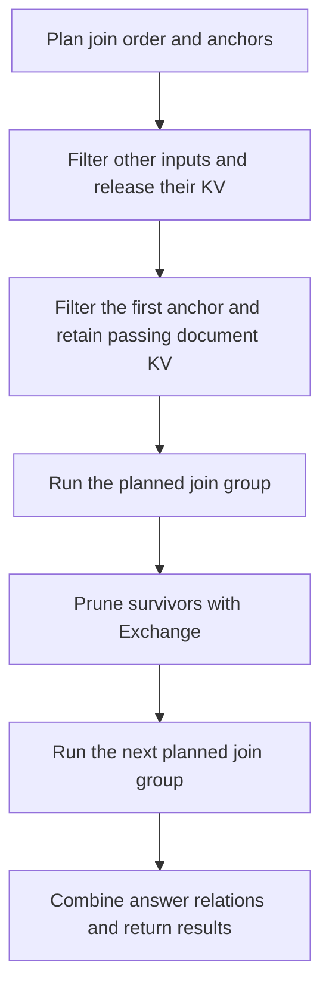

# Join order and anchors are fixed before execution

- The existing Selinger-style search chooses the complete join order and
  anchors from selectivity estimates. Execution follows the saved graph.
- Other inputs' filter chains run first and release KV when they finish.
  The first anchor's filters run last and retain surviving document KV within
  capacity. Reuse within each filter chain is preserved.
- Bound join stages and `Exchange` nodes replace the adaptive coordinator.
  Exchanges prune actual survivor IDs using completed join answers.
- Later anchor changes are priced as document recomputation. Actual retention
  can differ from the estimate, and missing KV is recomputed without changing
  the plan. Consecutive groups can retain the same anchor within capacity.
- Both existing Quail execution paths follow the saved nodes. The request
  backends also filter their planned first anchors last.
- The public query API is unchanged. Serialized plans containing the removed
  `quail.adaptive_join_plan` type must be regenerated from their logical queries.
- CPU checks cover FEV-9 results, wrong estimates, empty inputs, partial KV
  retention, worker coordination, and planning across all four backends.
  Execution tests fail if the join optimizer is called after inference starts.
- The [FEV-9 comparison](../2026-09-05-fixed-join-plans.md) returned identical
  answers. Query time was 39.57 seconds, compared with 39.22 seconds before the
  change. Keeping only the first anchor increased later document recomputation.

