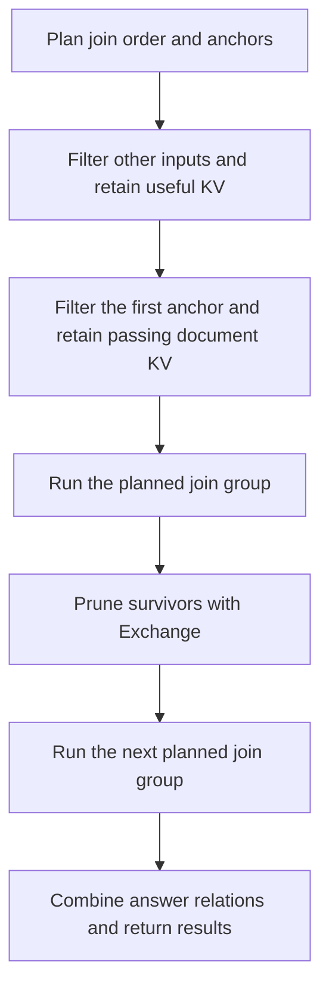

# Join order and anchors are fixed before execution

- The existing Selinger-style search chooses the complete join order and
  anchors from selectivity estimates. Execution follows the saved graph.
- The first anchor's filters run last. Retention was subsequently extended to
  all planned anchor inputs by the shared KV retention change.
- Bound join stages and `Exchange` nodes replace the adaptive coordinator.
  Exchanges prune actual survivor IDs using completed join answers.
- Actual retention can differ from the estimate. Missing KV is recomputed
  without changing the join order. Shared retention now allows reuse at later
  anchor changes as well as between consecutive groups.
- Both existing Quail execution paths follow the saved nodes. The request
  backends also filter their planned first anchors last.
- The public query API is unchanged. Serialized plans containing the removed
  `quail.adaptive_join_plan` type must be regenerated from their logical queries.
- CPU checks cover FEV-9 results, wrong estimates, empty inputs, partial KV
  retention, worker coordination, and planning across all four backends.
  Execution tests fail if the join optimizer is called after inference starts.
- The current [FEV-9 comparison](../2026-09-05-shared-kv-retention.md)
  evaluates shared retention with the same fixed join execution.

