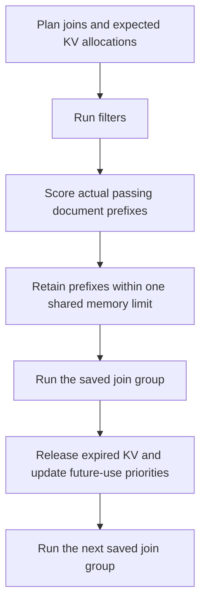

# Shared KV retention across document sets

- The first-anchor-only policy discarded useful KV for later joins. All filtered
  inputs with planned anchor uses now share one retained KV pool per GPU.
- The planner estimates allocations from selectivity and document lengths.
  Selinger search tracks prior anchor uses so later anchors can receive filter
  KV credit. Execution follows saved join order and future-use probabilities.
- Replacement prefers expected prefix computation saved per KV page. Earlier
  reuse breaks equal scores. Actual survivors share available memory rather
  than being restricted to per-set partitions.
- The pool reserves two execution chunks and protects active KV. Completed
  anchors are retained only when a later group needs them. Expired prefixes are
  released, and filter admission receives pages freed by replacement.
- Both Quail execution paths use the policy. Worker reports describe all retained
  aliases after every round so later joins preserve useful KV placement.
- The [FEV-9 comparison](../2026-09-05-shared-kv-retention.md) returned identical
  answers. Prefix recomputation was 7,309 tokens, compared with 73,336 before the
  change. Query time was 39.02 seconds, compared with 39.51 seconds in one measured
  run per configuration.

