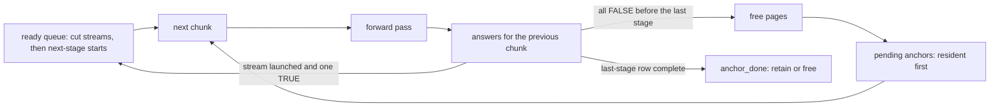

# Continuous batching for joins

- `run_join` now admits anchors continuously with `JoinAdmission`, the
  way `run_filter` admits documents with `FilterAdmission`. Before, the
  join packed one stage for an arena-sized group of anchors with
  `pack_stream`, waited for every answer, and only then packed the next
  stage. That wait left the GPU idle once per stage boundary and once
  per group boundary.
- Each chunk fills in priority order: partner streams the previous
  chunk cut, then anchors starting their next stage, then fresh anchors
  whose pages fit the free list. Resident anchors go first and pack no
  prefix. Stages mix in one chunk.
- An anchor advances as soon as its whole stream at the current stage
  is launched and one partner answered TRUE. Its remaining answers fill
  in while the next stage runs. An anchor whose partners all answered
  FALSE frees its pages at once. The next stage's frame overwrites the
  previous one in the anchor's KV, so an anchor never starts a stage
  while a chunk of its previous stage is still unlaunched.
- Anchor groups, `pack_stream`, `plan_groups`, and
  `partition_anchor_groups` are gone. The `run_join` signature lost
  `group_size`. Every resident anchor is pinned for the whole join, so
  fresh admissions evict only KV the join does not read.
- The [comparison report](../2026-09-07-join-continuous-batching.md)
  has the measured before and after numbers.

